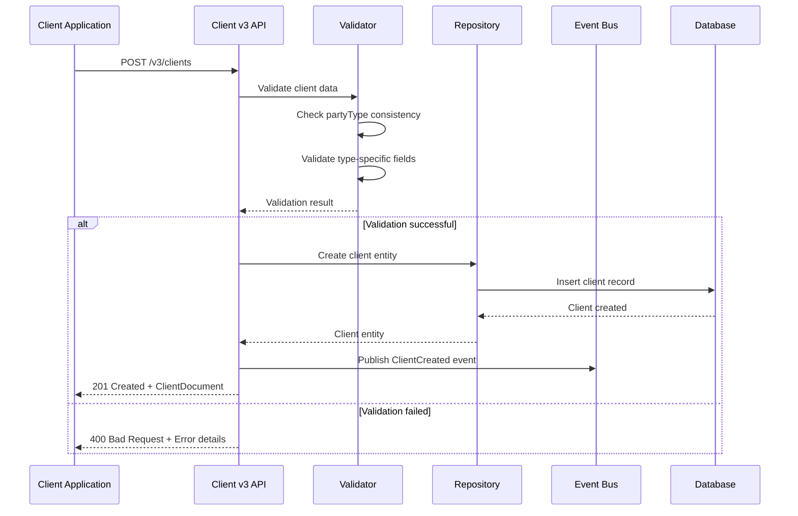
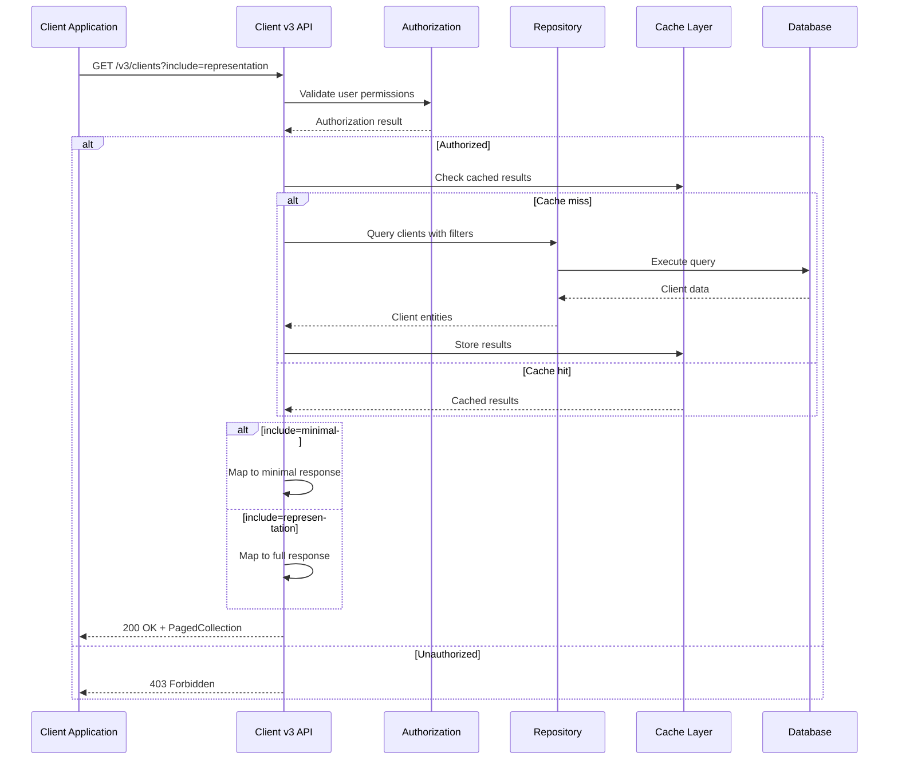

# FactFind: v3 Client API

## Document Metadata

| Field | Value |
|-------|-------|
| Activity Ticket | |
| Epic/Feature | |
| Document status | **DRAFT** |
| Designer | |
| Reviewers | |
| API version | v3 |

## Table of Contents

1. [Work Items](#work-items)
2. [Objective](#objective)
3. [Resource Model](#resource-model)
4. [Resource Summary](#resource-summary)
5. [Resource Examples](#resource-examples)
6. [Operation Summary](#operation-summary)
7. [Implementation](#implementation)
   - [Sequence Diagrams](#sequence-diagrams)
   - [Schema](#schema)
   - [Caching](#caching)
8. [Event Subscriptions](#event-subscriptions)
9. [Full Swagger Definitions](#full-swagger-definitions)

## Work Items

*Work items will be populated when linked to project management system*

## Objective

### Purpose of the document

The purpose of this document is to provide the API design for the Client v3 API that supports unified client management for Person, Trust, and Corporate client types using a composition approach. The API provides comprehensive client management capabilities with a single client endpoint and separate profile endpoints for health, territorial, and identification data management.

Key objectives:
- **Unified Client Management**: Single endpoint supporting all client types (Person, Trust, Corporate)
- **Composition Approach**: Type-specific sections within a unified client contract
- **Enhanced Data Model**: Support for additional data points identified from Fact Find analysis
- **Performance Optimization**: Include header for conditional response details on client lists
- **Profile Management**: Single resource endpoints for health, territorial, and identification profiles
- **Child Resource Management**: Separate endpoints for contacts and addresses

## Resource Model

```mermaid
classDiagram
    class Client {
        +int Id
        +string Name
        +PartyTypeValue PartyType
        +ClientCategoryValue Category
        +DateTime CreatedAt
        +PersonValue Person
        +TrustValue Trust
        +CorporateValue Corporate
        +AdviserReference CurrentAdviser
        +AdviserReference OriginalAdviser
        +bool IsArchived
        +long Checksum
    }
    
    class PersonValue {
        +string FirstName
        +string LastName
        +DateTime DateOfBirth
        +GenderValue Gender
        +string NiNumber
        +MaritalStatusValue MaritalStatus
        +string Nationality
        +bool IsDeceased
        +bool HasWill
    }
    
    class TrustValue {
        +string Name
        +string Type
        +DateTime EstablishedOrIncorporatedOn
        +string RegistrationNumber
        +string NatureOfTrust
        +CountryReference ResidenceCountry
    }
    
    class CorporateValue {
        +string Name
        +string Type
        +string BusinessType
        +string CompanyRegistrationNumber
        +bool IsVatRegistered
        +string VatRegistrationNumber
    }
    
    class ClientContact {
        +int Id
        +int ClientId
        +ContactTypeValue Type
        +string Value
        +bool IsPrimary
        +bool IsActive
        +DateTime CreatedAt
    }
    
    class ClientAddress {
        +int Id
        +int ClientId
        +AddressTypeValue Type
        +string AddressLine1
        +string AddressLine2
        +string City
        +string PostalCode
        +CountryReference Country
        +DateTime ValidFrom
        +DateTime ValidTo
        +bool IsActive
    }
    
    class ClientHealthProfile {
        +int ClientId
        +string Comment
        +bool IsActive
        +DateTime CreatedAt
        +DateTime UpdatedAt
        +long Checksum
    }
    
    class ClientTerritorialProfile {
        +int ClientId
        +int PersonId
        +CountryReference Country
        +string CitizenshipType
        +bool IsActive
        +DateTime CreatedAt
        +DateTime UpdatedAt
        +long Checksum
    }
    
    class ClientIdentificationProfile {
        +int ClientId
        +string Type
        +string Number
        +DateTime IssuedOn
        +DateTime ExpiresOn
        +CountryReference IssuingCountry
        +RegionReference IssuingRegion
        +DateTime LastSeenOn
        +string DocumentHref
        +bool IsDeleted
        +DateTime CreatedAt
        +DateTime UpdatedAt
        +long Checksum
    }
    
    Client ||--o{ ClientContact : "has contacts"
    Client ||--o{ ClientAddress : "has addresses"
    Client ||--|| ClientHealthProfile : "has health profile"
    Client ||--|| ClientTerritorialProfile : "has territorial profile"
    Client ||--|| ClientIdentificationProfile : "has identification profile"
    Client ||--|| PersonValue : "person details"
    Client ||--|| TrustValue : "trust details"
    Client ||--|| CorporateValue : "corporate details"
```

*Note: New resources are shown in green, modified resources in orange, removed resources in red*

## Resource Summary

| Resource | Data Classification | Contains PII | Change |
|----------|-------------------|--------------|---------|
| Client | Confidential | Yes | New |
| ClientContact | Confidential | Yes | New |
| ClientAddress | Confidential | Yes | New |
| ClientHealthProfile | Confidential | Yes | New |
| ClientTerritorialProfile | Confidential | Yes | New |
| ClientIdentificationProfile | Confidential | Yes | New |
| PersonValue | Confidential | Yes | New |
| TrustValue | Confidential | No | New |
| CorporateValue | Confidential | No | New |

## Resource Examples

### Client (Person)

```json
{
  "id": 12345,
  "name": "John Smith",
  "partyType": "Person",
  "category": "Individual",
  "createdAt": "2024-01-15T10:30:00Z",
  "person": {
    "salutation": "Mr",
    "firstName": "John",
    "lastName": "Smith",
    "dateOfBirth": "1985-06-15T00:00:00Z",
    "gender": "Male",
    "niNumber": "AB123456C",
    "maritalStatus": "Married",
    "nationality": "British",
    "isDeceased": false,
    "hasWill": true,
    "isWillUpToDate": true
  },
  "currentAdviser": {
    "id": 789,
    "href": "/v3/advisers/789",
    "name": "Jane Advisor"
  },
  "isArchived": false,
  "checksum": 1234567890,
  "_links": {
    "self": {"href": "/v3/clients/12345"},
    "contacts": {"href": "/v3/clients/12345/contacts"},
    "addresses": {"href": "/v3/clients/12345/addresses"}
  }
}
```

### Client (Trust)

```json
{
  "id": 12346,
  "name": "Smith Family Trust",
  "partyType": "Trust",
  "category": "Trust",
  "createdAt": "2024-01-15T10:30:00Z",
  "trust": {
    "name": "Smith Family Trust",
    "type": "Discretionary Trust",
    "establishedOrIncorporatedOn": "2020-03-01T00:00:00Z",
    "registrationNumber": "TR123456",
    "natureOfTrust": "Family Wealth Management",
    "residenceCountry": {
      "id": "GB",
      "name": "United Kingdom"
    }
  },
  "currentAdviser": {
    "id": 789,
    "href": "/v3/advisers/789",
    "name": "Jane Advisor"
  },
  "isArchived": false,
  "checksum": 1234567891,
  "_links": {
    "self": {"href": "/v3/clients/12346"},
    "contacts": {"href": "/v3/clients/12346/contacts"},
    "addresses": {"href": "/v3/clients/12346/addresses"}
  }
}
```

### Client (Corporate)

```json
{
  "id": 12347,
  "name": "Smith Enterprises Ltd",
  "partyType": "Corporate",
  "category": "Company",
  "createdAt": "2024-01-15T10:30:00Z",
  "corporate": {
    "name": "Smith Enterprises Ltd",
    "type": "Private Limited Company",
    "businessType": "Technology Services",
    "companyRegistrationNumber": "12345678",
    "establishedOrIncorporatedOn": "2018-05-01T00:00:00Z",
    "isVatRegistered": true,
    "vatRegistrationNumber": "GB123456789"
  },
  "currentAdviser": {
    "id": 789,
    "href": "/v3/advisers/789",
    "name": "Jane Advisor"
  },
  "isArchived": false,
  "checksum": 1234567892,
  "_links": {
    "self": {"href": "/v3/clients/12347"},
    "contacts": {"href": "/v3/clients/12347/contacts"},
    "addresses": {"href": "/v3/clients/12347/addresses"}
  }
}
```

### ClientContact

```json
{
  "id": 5001,
  "clientId": 12345,
  "type": "Email",
  "value": "john.smith@email.com",
  "isPrimary": true,
  "isActive": true,
  "createdAt": "2024-01-15T10:30:00Z",
  "checksum": 9876543210,
  "_links": {
    "self": {"href": "/v3/clients/12345/contacts/5001"},
    "client": {"href": "/v3/clients/12345"}
  }
}
```

### ClientAddress

```json
{
  "id": 6001,
  "clientId": 12345,
  "type": "Home",
  "addressLine1": "123 Main Street",
  "addressLine2": "Apartment 4B",
  "city": "London",
  "postalCode": "SW1A 1AA",
  "country": {
    "id": "GB",
    "name": "United Kingdom"
  },
  "validFrom": "2024-01-01T00:00:00Z",
  "validTo": null,
  "isActive": true,
  "createdAt": "2024-01-15T10:30:00Z",
  "checksum": 5432167890,
  "_links": {
    "self": {"href": "/v3/clients/12345/addresses/6001"},
    "client": {"href": "/v3/clients/12345"}
  }
}
```

### ClientHealthProfile

```json
{
  "clientId": 12345,
  "comment": "Client has diabetes and requires regular monitoring",
  "isActive": true,
  "createdAt": "2024-01-15T10:30:00Z",
  "updatedAt": "2024-01-15T10:30:00Z",
  "checksum": 3456789012,
  "_links": {
    "self": {"href": "/v3/clients/12345/profiles/health"},
    "client": {"href": "/v3/clients/12345"}
  }
}
```

### ClientTerritorialProfile

```json
{
  "clientId": 12345,
  "personId": 54321,
  "country": {
    "id": "US",
    "name": "United States"
  },
  "citizenshipType": "Dual",
  "isActive": true,
  "createdAt": "2024-01-15T10:30:00Z",
  "updatedAt": "2024-01-15T10:30:00Z",
  "checksum": 4567890123,
  "_links": {
    "self": {"href": "/v3/clients/12345/profiles/territorial"},
    "client": {"href": "/v3/clients/12345"}
  }
}
```

### ClientIdentificationProfile

```json
{
  "clientId": 12345,
  "type": "Passport",
  "number": "123456789",
  "issuedOn": "2020-01-15T00:00:00Z",
  "expiresOn": "2030-01-15T00:00:00Z",
  "issuingCountry": {
    "id": "GB",
    "name": "United Kingdom"
  },
  "issuingRegion": {
    "id": "LDN",
    "name": "London"
  },
  "lastSeenOn": "2024-01-15T10:30:00Z",
  "documentHref": "https://documents.example.com/passport/9001",
  "isDeleted": false,
  "createdAt": "2024-01-15T10:30:00Z",
  "updatedAt": "2024-01-15T10:30:00Z",
  "checksum": 5678901234,
  "_links": {
    "self": {"href": "/v3/clients/12345/profiles/identification"},
    "client": {"href": "/v3/clients/12345"}
  }
}
```

## Operation Summary

| Operation | Verb | Path | Change | Details |
|-----------|------|------|---------|---------|
| ListClients | GET | `/v3/clients` | New | **Description**<br/>Allows an API consumer to retrieve a list of clients with conditional detail levels.<br/><br/>**Implementation**<br/>- Default response includes minimal client information<br/>- `include=representation` header returns complete client details<br/>- Supports filtering, sorting, and pagination<br/>- Validates user permissions and tenant isolation<br/><br/>**Response**<br/>- Status Codes: 200 OK, 400 Bad Request, 401 Unauthorized, 403 Forbidden<br/>- Content-type: application/json<br/>- Response Object: PagedCollection of ClientDocument<br/><br/>**Scopes**<br/>- client_data |
| CreateClient | POST | `/v3/clients` | New | **Description**<br/>Allows an API consumer to create a new client of any type (Person, Trust, Corporate).<br/><br/>**Implementation**<br/>- Validates partyType and corresponding section consistency<br/>- Enforces type-specific required fields<br/>- Publishes ClientCreated event<br/>- Returns 201 Created with Location header<br/><br/>**Response**<br/>- Status Codes: 201 Created, 400 Bad Request, 401 Unauthorized, 403 Forbidden, 422 Unprocessable Entity<br/>- Content-type: application/json<br/>- Response Object: ClientDocument<br/><br/>**Scopes**<br/>- client_data |
| GetClient | GET | `/v3/clients/{id}` | New | **Description**<br/>Allows an API consumer to retrieve a single client with complete details.<br/><br/>**Implementation**<br/>- Returns full client contract with type-specific details<br/>- Includes HATEOAS links to child resources<br/>- Validates user permissions for client access<br/><br/>**Response**<br/>- Status Codes: 200 OK, 401 Unauthorized, 403 Forbidden, 404 Not Found<br/>- Content-type: application/json<br/>- Response Object: ClientDocument<br/><br/>**Scopes**<br/>- client_data |
| UpdateClient | PATCH | `/v3/clients/{id}` | New | **Description**<br/>Allows an API consumer to partially update a client using JSONPatch operations.<br/><br/>**Implementation**<br/>- Supports RFC 6902 JSONPatch operations<br/>- Validates partyType consistency after updates<br/>- Publishes ClientChanged event<br/>- Uses optimistic concurrency with checksum<br/><br/>**Response**<br/>- Status Codes: 200 OK, 400 Bad Request, 401 Unauthorized, 403 Forbidden, 404 Not Found, 409 Conflict<br/>- Content-type: application/json<br/>- Response Object: ClientDocument<br/><br/>**Scopes**<br/>- client_data |
| DeleteClient | DELETE | `/v3/clients/{id}` | New | **Description**<br/>Allows an API consumer to soft delete a client.<br/><br/>**Implementation**<br/>- Performs soft delete by marking client as deleted<br/>- Publishes ClientDeleted event<br/>- Maintains audit trail<br/><br/>**Response**<br/>- Status Codes: 204 No Content, 401 Unauthorized, 403 Forbidden, 404 Not Found<br/><br/>**Scopes**<br/>- client_data |
| ListClientContacts | GET | `/v3/clients/{clientId}/contacts` | New | **Description**<br/>Allows an API consumer to retrieve all contacts for a specific client.<br/><br/>**Implementation**<br/>- Returns all active contacts for the client<br/>- Supports filtering by contact type<br/>- Validates client exists and user has access<br/><br/>**Response**<br/>- Status Codes: 200 OK, 401 Unauthorized, 403 Forbidden, 404 Not Found<br/>- Content-type: application/json<br/>- Response Object: Array of ClientContact<br/><br/>**Scopes**<br/>- client_data |
| CreateClientContact | POST | `/v3/clients/{clientId}/contacts` | New | **Description**<br/>Allows an API consumer to create a new contact for a client.<br/><br/>**Implementation**<br/>- Validates contact type and value format<br/>- Ensures client exists<br/>- Publishes ContactCreated event<br/><br/>**Response**<br/>- Status Codes: 201 Created, 400 Bad Request, 401 Unauthorized, 403 Forbidden, 404 Not Found<br/>- Content-type: application/json<br/>- Response Object: ClientContact<br/><br/>**Scopes**<br/>- client_data |
| GetClientContact | GET | `/v3/clients/{clientId}/contacts/{contactId}` | New | **Description**<br/>Allows an API consumer to retrieve a specific client contact.<br/><br/>**Implementation**<br/>- Returns contact details with HATEOAS links<br/>- Validates client and contact exist<br/>- Enforces user permissions<br/><br/>**Response**<br/>- Status Codes: 200 OK, 401 Unauthorized, 403 Forbidden, 404 Not Found<br/>- Content-type: application/json<br/>- Response Object: ClientContact<br/><br/>**Scopes**<br/>- client_data |
| UpdateClientContact | PATCH | `/v3/clients/{clientId}/contacts/{contactId}` | New | **Description**<br/>Allows an API consumer to partially update a client contact.<br/><br/>**Implementation**<br/>- Supports JSONPatch operations<br/>- Validates contact value format<br/>- Publishes ContactChanged event<br/><br/>**Response**<br/>- Status Codes: 200 OK, 400 Bad Request, 401 Unauthorized, 403 Forbidden, 404 Not Found<br/>- Content-type: application/json<br/>- Response Object: ClientContact<br/><br/>**Scopes**<br/>- client_data |
| DeleteClientContact | DELETE | `/v3/clients/{clientId}/contacts/{contactId}` | New | **Description**<br/>Allows an API consumer to soft delete a client contact.<br/><br/>**Implementation**<br/>- Performs soft delete by marking contact as inactive<br/>- Publishes ContactDeleted event<br/>- Maintains audit trail<br/><br/>**Response**<br/>- Status Codes: 204 No Content, 401 Unauthorized, 403 Forbidden, 404 Not Found<br/><br/>**Scopes**<br/>- client_data |
| ListClientAddresses | GET | `/v3/clients/{clientId}/addresses` | New | **Description**<br/>Allows an API consumer to retrieve all addresses for a specific client.<br/><br/>**Implementation**<br/>- Returns all active addresses for the client<br/>- Supports filtering by address type and date ranges<br/>- Validates client exists and user has access<br/><br/>**Response**<br/>- Status Codes: 200 OK, 401 Unauthorized, 403 Forbidden, 404 Not Found<br/>- Content-type: application/json<br/>- Response Object: Array of ClientAddress<br/><br/>**Scopes**<br/>- client_data |
| CreateClientAddress | POST | `/v3/clients/{clientId}/addresses` | New | **Description**<br/>Allows an API consumer to create a new address for a client.<br/><br/>**Implementation**<br/>- Validates address format and country codes<br/>- Ensures client exists<br/>- Publishes AddressCreated event<br/><br/>**Response**<br/>- Status Codes: 201 Created, 400 Bad Request, 401 Unauthorized, 403 Forbidden, 404 Not Found<br/>- Content-type: application/json<br/>- Response Object: ClientAddress<br/><br/>**Scopes**<br/>- client_data |
| GetClientAddress | GET | `/v3/clients/{clientId}/addresses/{addressId}` | New | **Description**<br/>Allows an API consumer to retrieve a specific client address.<br/><br/>**Implementation**<br/>- Returns address details with HATEOAS links<br/>- Validates client and address exist<br/>- Enforces user permissions<br/><br/>**Response**<br/>- Status Codes: 200 OK, 401 Unauthorized, 403 Forbidden, 404 Not Found<br/>- Content-type: application/json<br/>- Response Object: ClientAddress<br/><br/>**Scopes**<br/>- client_data |
| UpdateClientAddress | PATCH | `/v3/clients/{clientId}/addresses/{addressId}` | New | **Description**<br/>Allows an API consumer to partially update a client address.<br/><br/>**Implementation**<br/>- Supports JSONPatch operations<br/>- Validates address format and country codes<br/>- Publishes AddressChanged event<br/><br/>**Response**<br/>- Status Codes: 200 OK, 400 Bad Request, 401 Unauthorized, 403 Forbidden, 404 Not Found<br/>- Content-type: application/json<br/>- Response Object: ClientAddress<br/><br/>**Scopes**<br/>- client_data |
| DeleteClientAddress | DELETE | `/v3/clients/{clientId}/addresses/{addressId}` | New | **Description**<br/>Allows an API consumer to soft delete a client address.<br/><br/>**Implementation**<br/>- Performs soft delete by marking address as inactive<br/>- Publishes AddressDeleted event<br/>- Maintains audit trail<br/><br/>**Response**<br/>- Status Codes: 204 No Content, 401 Unauthorized, 403 Forbidden, 404 Not Found<br/><br/>**Scopes**<br/>- client_data |
| GetClientHealthProfile | GET | `/v3/clients/{clientId}/profiles/health` | New | **Description**<br/>Allows an API consumer to retrieve the health profile for a specific client.<br/><br/>**Implementation**<br/>- Returns the client's health profile if it exists<br/>- Validates client exists and user has access<br/>- Returns 404 if no health profile exists<br/><br/>**Response**<br/>- Status Codes: 200 OK, 401 Unauthorized, 403 Forbidden, 404 Not Found<br/>- Content-type: application/json<br/>- Response Object: ClientHealthProfile<br/><br/>**Scopes**<br/>- client_data |
| CreateClientHealthProfile | POST | `/v3/clients/{clientId}/profiles/health` | New | **Description**<br/>Allows an API consumer to create a health profile for a client.<br/><br/>**Implementation**<br/>- Creates a new health profile for the client<br/>- Validates health profile data<br/>- Ensures client exists and no existing health profile<br/>- Publishes HealthProfileCreated event<br/><br/>**Response**<br/>- Status Codes: 201 Created, 400 Bad Request, 401 Unauthorized, 403 Forbidden, 404 Not Found, 409 Conflict<br/>- Content-type: application/json<br/>- Response Object: ClientHealthProfile<br/><br/>**Scopes**<br/>- client_data |
| UpdateClientHealthProfile | PUT | `/v3/clients/{clientId}/profiles/health` | New | **Description**<br/>Allows an API consumer to update or create a client health profile.<br/><br/>**Implementation**<br/>- Updates existing health profile or creates new one if none exists<br/>- Validates health profile data<br/>- Publishes HealthProfileChanged event<br/>- Uses optimistic concurrency with checksum<br/><br/>**Response**<br/>- Status Codes: 200 OK, 201 Created, 400 Bad Request, 401 Unauthorized, 403 Forbidden, 404 Not Found, 409 Conflict<br/>- Content-type: application/json<br/>- Response Object: ClientHealthProfile<br/><br/>**Scopes**<br/>- client_data |
| DeleteClientHealthProfile | DELETE | `/v3/clients/{clientId}/profiles/health` | New | **Description**<br/>Allows an API consumer to delete a client health profile.<br/><br/>**Implementation**<br/>- Performs soft delete by marking health profile as inactive<br/>- Publishes HealthProfileDeleted event<br/>- Maintains audit trail<br/><br/>**Response**<br/>- Status Codes: 204 No Content, 401 Unauthorized, 403 Forbidden, 404 Not Found<br/><br/>**Scopes**<br/>- client_data |
| GetClientTerritorialProfile | GET | `/v3/clients/{clientId}/profiles/territorial` | New | **Description**<br/>Allows an API consumer to retrieve the territorial profile for a specific client.<br/><br/>**Implementation**<br/>- Returns the client's territorial profile if it exists<br/>- Only available for Person client types<br/>- Validates client exists and user has access<br/>- Returns 404 if no territorial profile exists<br/><br/>**Response**<br/>- Status Codes: 200 OK, 401 Unauthorized, 403 Forbidden, 404 Not Found<br/>- Content-type: application/json<br/>- Response Object: ClientTerritorialProfile<br/><br/>**Scopes**<br/>- client_data |
| CreateClientTerritorialProfile | POST | `/v3/clients/{clientId}/profiles/territorial` | New | **Description**<br/>Allows an API consumer to create a territorial profile for a client.<br/><br/>**Implementation**<br/>- Creates a new territorial profile for the client<br/>- Validates territorial profile data and country codes<br/>- Ensures client exists, is a Person type, and no existing territorial profile<br/>- Publishes TerritorialProfileCreated event<br/><br/>**Response**<br/>- Status Codes: 201 Created, 400 Bad Request, 401 Unauthorized, 403 Forbidden, 404 Not Found, 409 Conflict<br/>- Content-type: application/json<br/>- Response Object: ClientTerritorialProfile<br/><br/>**Scopes**<br/>- client_data |
| UpdateClientTerritorialProfile | PUT | `/v3/clients/{clientId}/profiles/territorial` | New | **Description**<br/>Allows an API consumer to update or create a client territorial profile.<br/><br/>**Implementation**<br/>- Updates existing territorial profile or creates new one if none exists<br/>- Validates territorial profile data and country codes<br/>- Only available for Person client types<br/>- Publishes TerritorialProfileChanged event<br/>- Uses optimistic concurrency with checksum<br/><br/>**Response**<br/>- Status Codes: 200 OK, 201 Created, 400 Bad Request, 401 Unauthorized, 403 Forbidden, 404 Not Found, 409 Conflict<br/>- Content-type: application/json<br/>- Response Object: ClientTerritorialProfile<br/><br/>**Scopes**<br/>- client_data |
| DeleteClientTerritorialProfile | DELETE | `/v3/clients/{clientId}/profiles/territorial` | New | **Description**<br/>Allows an API consumer to delete a client territorial profile.<br/><br/>**Implementation**<br/>- Performs soft delete by marking territorial profile as inactive<br/>- Publishes TerritorialProfileDeleted event<br/>- Maintains audit trail<br/><br/>**Response**<br/>- Status Codes: 204 No Content, 401 Unauthorized, 403 Forbidden, 404 Not Found<br/><br/>**Scopes**<br/>- client_data |
| GetClientIdentificationProfile | GET | `/v3/clients/{clientId}/profiles/identification` | New | **Description**<br/>Allows an API consumer to retrieve the identification profile for a specific client.<br/><br/>**Implementation**<br/>- Returns the client's identification profile if it exists<br/>- Validates client exists and user has access<br/>- Returns 404 if no identification profile exists<br/><br/>**Response**<br/>- Status Codes: 200 OK, 401 Unauthorized, 403 Forbidden, 404 Not Found<br/>- Content-type: application/json<br/>- Response Object: ClientIdentificationProfile<br/><br/>**Scopes**<br/>- client_data |
| CreateClientIdentificationProfile | POST | `/v3/clients/{clientId}/profiles/identification` | New | **Description**<br/>Allows an API consumer to create an identification profile for a client.<br/><br/>**Implementation**<br/>- Creates a new identification profile for the client<br/>- Validates identification profile data and country codes<br/>- Ensures client exists and no existing identification profile<br/>- Publishes IdentificationProfileCreated event<br/><br/>**Response**<br/>- Status Codes: 201 Created, 400 Bad Request, 401 Unauthorized, 403 Forbidden, 404 Not Found, 409 Conflict<br/>- Content-type: application/json<br/>- Response Object: ClientIdentificationProfile<br/><br/>**Scopes**<br/>- client_data |
| UpdateClientIdentificationProfile | PUT | `/v3/clients/{clientId}/profiles/identification` | New | **Description**<br/>Allows an API consumer to update or create a client identification profile.<br/><br/>**Implementation**<br/>- Updates existing identification profile or creates new one if none exists<br/>- Validates identification profile data and country codes<br/>- Publishes IdentificationProfileChanged event<br/>- Uses optimistic concurrency with checksum<br/><br/>**Response**<br/>- Status Codes: 200 OK, 201 Created, 400 Bad Request, 401 Unauthorized, 403 Forbidden, 404 Not Found, 409 Conflict<br/>- Content-type: application/json<br/>- Response Object: ClientIdentificationProfile<br/><br/>**Scopes**<br/>- client_data |
| DeleteClientIdentificationProfile | DELETE | `/v3/clients/{clientId}/profiles/identification` | New | **Description**<br/>Allows an API consumer to delete a client identification profile.<br/><br/>**Implementation**<br/>- Performs soft delete by marking identification profile as inactive<br/>- Publishes IdentificationProfileDeleted event<br/>- Maintains audit trail<br/><br/>**Response**<br/>- Status Codes: 204 No Content, 401 Unauthorized, 403 Forbidden, 404 Not Found<br/><br/>**Scopes**<br/>- client_data |

## Implementation

### Sequence Diagrams

#### Client Creation Flow



#### Client List with Include Header



### Schema

The Client v3 API uses the existing database schema with joined-subclass inheritance pattern:

#### Core Tables
- **TCRMContact**: Main client table with common properties and type discrimination via PersonId, CorporateId, TrustId foreign keys
- **TPerson**: Person-specific attributes (joined via PersonId foreign key)
- **TCorporate**: Corporate-specific attributes (joined via CorporateId foreign key)  
- **TTrust**: Trust-specific attributes (joined via TrustId foreign key)
- **TContact**: Contact information with type and preference settings
- **TAddress**: Address information with type classification and date ranges
- **TAddressStore**: Physical address details (lines, city, country, coordinates)
- **THealth**: Health information linked to clients via CrmContactId foreign key
- **TPersonCitizenship**: Territorial/citizenship information for persons (PersonId, CountryId composite key)
- **TClientProofOfIdentity**: Identification documents linked to clients via CRMContactId foreign key

#### Database Design Principles
- **Joined-Subclass Inheritance**: Client types stored in TCRMContact with foreign keys to type-specific tables
- **Existing NHibernate Mappings**: Leverage existing VCustomer, VPerson, VCorporate, VTrust views
- **Soft Deletes**: IsDeleted flag for logical deletion in TCRMContact
- **Audit Trails**: CreatedOn, UpdatedOn, and ConcurrencyId fields for all entities
- **Optimistic Concurrency**: ConcurrencyId-based conflict detection

### Caching

To minimize database load and improve response times, implement the following caching strategy:

#### Client List Caching
- **Strategy**: ASP.NET Core response caching with vary-by-user and vary-by-include-header
- **Duration**: 5 minutes for minimal responses, 2 minutes for full responses
- **Invalidation**: Cache invalidated on client creation, update, or deletion

#### Individual Client Caching
- **Strategy**: In-memory caching with Redis for distributed scenarios
- **Duration**: 15 minutes
- **Key Pattern**: `client:v3:{clientId}:{checksum}`
- **Invalidation**: Automatic on client updates using checksum changes

#### Reference Data Caching
- **Strategy**: Long-term caching for countries, advisers, and other reference data
- **Duration**: 24 hours
- **Refresh**: Background refresh every 12 hours

## Event Subscriptions

### ClientCreated

```json
{
  "event": "ClientCreated",
  "payload": {
    "client": {
      "id": 12345,
      "name": "John Smith",
      "partyType": "Person",
      "category": "Individual",
      "createdAt": "2024-01-15T10:30:00Z"
    },
    "adviser": {
      "id": 789,
      "name": "Jane Advisor"
    },
    "tenant": {
      "id": "tenant-123",
      "name": "Example Firm"
    }
  }
}
```

### ClientChanged

```json
{
  "event": "ClientChanged",
  "payload": {
    "client": {
      "id": 12345,
      "name": "John Smith",
      "partyType": "Person",
      "category": "Individual",
      "updatedAt": "2024-01-15T11:30:00Z"
    },
    "changes": [
      {
        "field": "person.maritalStatus",
        "oldValue": "Single",
        "newValue": "Married"
      }
    ],
    "adviser": {
      "id": 789,
      "name": "Jane Advisor"
    }
  }
}
```

### ClientDeleted

```json
{
  "event": "ClientDeleted",
  "payload": {
    "client": {
      "id": 12345,
      "name": "John Smith",
      "partyType": "Person",
      "deletedAt": "2024-01-15T12:30:00Z"
    },
    "adviser": {
      "id": 789,
      "name": "Jane Advisor"
    }
  }
}
```

### ContactCreated

```json
{
  "event": "ContactCreated",
  "payload": {
    "contact": {
      "id": 5001,
      "clientId": 12345,
      "type": "Email",
      "value": "john.smith@email.com",
      "isPrimary": true,
      "createdAt": "2024-01-15T10:30:00Z"
    },
    "client": {
      "id": 12345,
      "name": "John Smith"
    }
  }
}
```

### AddressCreated

```json
{
  "event": "AddressCreated",
  "payload": {
    "address": {
      "id": 6001,
      "clientId": 12345,
      "type": "Home",
      "addressLine1": "123 Main Street",
      "city": "London",
      "postalCode": "SW1A 1AA",
      "country": "GB",
      "createdAt": "2024-01-15T10:30:00Z"
    },
    "client": {
      "id": 12345,
      "name": "John Smith"
    }
  }
}
```

### ClientHealthProfileCreated

```json
{
  "event": "ClientHealthProfileCreated",
  "payload": {
    "healthProfile": {
      "clientId": 12345,
      "comment": "Client has diabetes and requires regular monitoring",
      "isActive": true,
      "createdAt": "2024-01-15T10:30:00Z"
    },
    "client": {
      "id": 12345,
      "name": "John Smith"
    }
  }
}
```

### ClientTerritorialProfileCreated

```json
{
  "event": "ClientTerritorialProfileCreated",
  "payload": {
    "territorialProfile": {
      "clientId": 12345,
      "personId": 54321,
      "country": "US",
      "citizenshipType": "Dual",
      "isActive": true,
      "createdAt": "2024-01-15T10:30:00Z"
    },
    "client": {
      "id": 12345,
      "name": "John Smith"
    }
  }
}
```

### ClientIdentificationProfileCreated

```json
{
  "event": "ClientIdentificationProfileCreated",
  "payload": {
    "identificationProfile": {
      "clientId": 12345,
      "type": "Passport",
      "number": "123456789",
      "issuedOn": "2020-01-15T00:00:00Z",
      "expiresOn": "2030-01-15T00:00:00Z",
      "issuingCountry": "GB",
      "createdAt": "2024-01-15T10:30:00Z"
    },
    "client": {
      "id": 12345,
      "name": "John Smith"
    }
  }
}
```

## Full Swagger Definitions

*Full OpenAPI/Swagger documentation will be generated from the implementation and attached as a separate JSON file. The documentation will include:*

- Complete schema definitions for all request/response models
- Detailed parameter descriptions with examples
- Authentication and authorization requirements
- Error response schemas
- Example requests and responses for all operations
- Security scheme definitions

*The Swagger definition will be available at `/swagger/v3/swagger.json` when the API is deployed.*

---

**Document Status**: DRAFT  
**Last Updated**: February 3, 2026  
**Next Review**: TBD