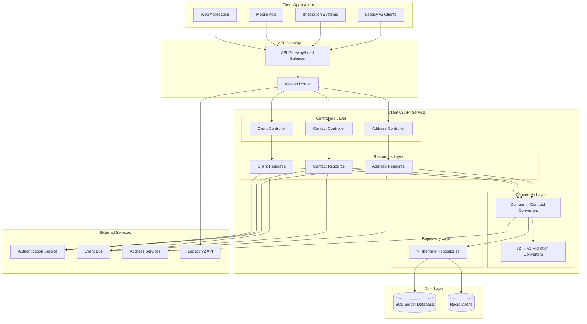

# Client v3 API Design Document

## Overview

This document outlines the design for a comprehensive Client v3 API that supports Person, Trust, and Corporate client types using a composition approach. The design uses a single unified client endpoint with person, trust, and corporate sections, along with separate child resource endpoints for contacts and addresses. The API incorporates enhanced data models addressing additional data points identified from the Fact Find Data Analysis v6.1 and follows Intelliflo's API Design Guidelines 2.0.

The design follows the established Monolith.FactFind architectural patterns with a 4-layer architecture: Controller → Resource → Converter → Repository, ensuring consistency with existing Intelliflo API implementations.

## Architecture

### System Architecture

The Client v3 API system follows a microservice architecture pattern built on .NET 8, integrating with the existing IntelligentOffice ecosystem while providing modern RESTful interfaces for unified client management.



### API Architecture Pattern

Following the established Monolith.FactFind pattern, each API resource follows a consistent 4-layer architecture:

1. **Controller Layer**: Thin HTTP layer handling routing, status codes, and Swagger documentation
2. **Resource Layer**: Business logic, transactions, and event publishing
3. **Converter Layer**: Bidirectional mapping between domain entities and API contracts
4. **Repository Layer**: NHibernate-based data access

### Resource Hierarchy

The Client v3 API is organized around the following resource hierarchy:

```
/v3/clients
├── GET    /v3/clients                           # List all clients (supports include header)
├── POST   /v3/clients                           # Create client (any type)
├── GET    /v3/clients/{id}                      # Get client
├── PATCH  /v3/clients/{id}                      # Update client
├── DELETE /v3/clients/{id}                      # Delete client
├── GET    /v3/clients/{id}/contacts             # List client contacts
├── POST   /v3/clients/{id}/contacts             # Create client contact
├── GET    /v3/clients/{id}/contacts/{contactId} # Get specific contact
├── PATCH  /v3/clients/{id}/contacts/{contactId} # Update contact
├── DELETE /v3/clients/{id}/contacts/{contactId} # Delete contact
├── GET    /v3/clients/{id}/addresses            # List client addresses
├── POST   /v3/clients/{id}/addresses            # Create client address
├── GET    /v3/clients/{id}/addresses/{addressId}# Get specific address
├── PATCH  /v3/clients/{id}/addresses/{addressId}# Update address
├── DELETE /v3/clients/{id}/addresses/{addressId}# Delete address
├── GET    /v3/clients/{id}/profiles/health      # Get client health profile
├── POST   /v3/clients/{id}/profiles/health      # Create client health profile
├── PUT    /v3/clients/{id}/profiles/health      # Update/create client health profile
├── DELETE /v3/clients/{id}/profiles/health      # Delete client health profile
├── GET    /v3/clients/{id}/profiles/territorial # Get client territorial profile
├── POST   /v3/clients/{id}/profiles/territorial # Create client territorial profile
├── PUT    /v3/clients/{id}/profiles/territorial # Update/create client territorial profile
├── DELETE /v3/clients/{id}/profiles/territorial # Delete client territorial profile
├── GET    /v3/clients/{id}/profiles/identification # Get client identification profile
├── POST   /v3/clients/{id}/profiles/identification # Create client identification profile
├── PUT    /v3/clients/{id}/profiles/identification # Update/create client identification profile
└── DELETE /v3/clients/{id}/profiles/identification # Delete client identification profile
```

## Components and Interfaces

### Core Domain Entities

#### Unified Client Entity (Based on TCRMContact)
```csharp
public class Client : EqualityAndHashCodeProvider<Client, int>
{
    public virtual int Id { get; set; } // CRMContactId
    public virtual string FirstName { get; set; }
    public virtual string LastName { get; set; }
    public virtual string CorporateName { get; set; }
    public virtual DateTime? DateOfBirth { get; set; }
    public virtual string Postcode { get; set; }
    public virtual DateTime CreatedDate { get; set; }
    public virtual string ExternalReference { get; set; }
    public virtual string AdditionalRef { get; set; }
    public virtual string MigrationRef { get; set; }
    public virtual bool IsHeadOfFamilyGroup { get; set; }
    public virtual bool IsDeleted { get; set; }
    public virtual int ConcurrencyId { get; set; }
    
    // Navigation properties
    public virtual int OriginalAdviserCRMId { get; set; }
    public virtual int CurrentAdviserCRMId { get; set; }
    public virtual string CurrentAdviserName { get; set; }
    public virtual int? RefServiceStatusId { get; set; }
    public virtual DateTime? ServiceStatusStartDate { get; set; }
    public virtual int? RefClientSegmentId { get; set; }
    public virtual DateTime? ClientSegmentStartDate { get; set; }
    public virtual int? GroupId { get; set; }
    public virtual int? CampaignDataId { get; set; }
    public virtual int IndClientId { get; set; } // Tenant ID
    
    // Type-specific foreign keys (only one will be populated)
    public virtual int? PersonId { get; set; }
    public virtual int? CorporateId { get; set; }
    public virtual int? TrustId { get; set; }
    
    // Navigation properties to type-specific details
    public virtual PersonDetails Person { get; set; }
    public virtual CorporateDetails Corporate { get; set; }
    public virtual TrustDetails Trust { get; set; }
    
    public virtual ISet<ClientContact> Contacts { get; set; }
    public virtual ISet<ClientAddress> Addresses { get; set; }
}
```

#### Person Details Entity (Based on TPerson)
```csharp
public class PersonDetails
{
    public virtual int PersonId { get; set; }
    public virtual string Title { get; set; }
    public virtual string FirstName { get; set; }
    public virtual string MiddleName { get; set; }
    public virtual string LastName { get; set; }
    public virtual string MaidenName { get; set; }
    public virtual DateTime? DOB { get; set; }
    public virtual string GenderType { get; set; }
    public virtual string NINumber { get; set; }
    public virtual string IsSmoker { get; set; }
    public virtual bool? UKResident { get; set; }
    public virtual string ResidentIn { get; set; }
    public virtual string Salutation { get; set; }
    public virtual string MaritalStatus { get; set; }
    public virtual DateTime? MarriedOn { get; set; }
    public virtual string Residency { get; set; }
    public virtual bool? UKDomicile { get; set; }
    public virtual string Domicile { get; set; }
    public virtual string TaxCode { get; set; }
    public virtual string Nationality { get; set; }
    public virtual decimal? Salary { get; set; }
    public virtual bool? Expatriate { get; set; }
    public virtual int? RefNationalityId { get; set; }
    public virtual bool? HasSmokedInLast12Months { get; set; }
    public virtual bool? IsInGoodHealth { get; set; }
    public virtual bool? IsPowerOfAttorneyGranted { get; set; }
    public virtual string AttorneyName { get; set; }
    public virtual bool? IsDisplayTitle { get; set; }
    public virtual DateTime? MaritalStatusSince { get; set; }
    public virtual string NationalClientIdentifier { get; set; }
    public virtual string CountryCodeOfResidence { get; set; }
    public virtual string CountryCodeOfDomicile { get; set; }
    public virtual DateTime? InvitationSendDate { get; set; }
    public virtual bool? EverSmoked { get; set; }
    public virtual bool? HasVapedorUsedEcigarettesLast1Year { get; set; }
    public virtual bool? HaveUsedNicotineReplacementProductsLast1Year { get; set; }
    public virtual int IndClientId { get; set; }
    public virtual int ConcurrencyId { get; set; }
    public virtual DateTime? CreatedOn { get; set; }
    public virtual int? CreatedByUserId { get; set; }
    public virtual DateTime? UpdatedOn { get; set; }
    public virtual int? UpdatedByUserId { get; set; }
}
```

#### Trust Details Entity (Based on TTrust)
```csharp
public class TrustDetails
{
    public virtual int TrustId { get; set; }
    public virtual int RefTrustTypeId { get; set; }
    public virtual int IndClientId { get; set; }
    public virtual string TrustName { get; set; }
    public virtual DateTime? EstDate { get; set; }
    public virtual bool ArchiveFG { get; set; }
    public virtual int ConcurrencyId { get; set; }
    public virtual string MigrationRef { get; set; }
    public virtual DateTime? CreatedOn { get; set; }
    public virtual int? CreatedByUserId { get; set; }
    public virtual DateTime? UpdatedOn { get; set; }
    public virtual int? UpdatedByUserId { get; set; }
    public virtual string LEI { get; set; }
    public virtual DateTime? LEIExpiryDate { get; set; }
    public virtual string RegistrationNumber { get; set; }
    public virtual DateTime? RegistrationDate { get; set; }
    public virtual string Instrument { get; set; }
    public virtual string BusinessRegistrationNumber { get; set; }
    public virtual string NatureOfTrust { get; set; }
    public virtual string VatRegNo { get; set; }
    public virtual int? EstablishmentCountryId { get; set; }
    public virtual int? ResidenceCountryId { get; set; }
}
```

#### Corporate Details Entity (Based on TCorporate)
```csharp
public class CorporateDetails
{
    public virtual int CorporateId { get; set; }
    public virtual int? IndClientId { get; set; }
    public virtual string CorporateName { get; set; }
    public virtual bool? ArchiveFg { get; set; }
    public virtual string BusinessType { get; set; }
    public virtual int? RefCorporateTypeId { get; set; }
    public virtual string CompanyRegNo { get; set; }
    public virtual DateTime? EstIncorpDate { get; set; }
    public virtual DateTime? YearEnd { get; set; }
    public virtual bool? VatRegFg { get; set; }
    public virtual string VatRegNo { get; set; }
    public virtual int ConcurrencyId { get; set; }
    public virtual string MigrationRef { get; set; }
    public virtual DateTime? CreatedOn { get; set; }
    public virtual int? CreatedByUserId { get; set; }
    public virtual DateTime? UpdatedOn { get; set; }
    public virtual int? UpdatedByUserId { get; set; }
    public virtual string LEI { get; set; }
    public virtual DateTime? LEIExpiryDate { get; set; }
    public virtual string BusinessRegistrationNumber { get; set; }
    public virtual string NINumber { get; set; }
}
```

#### Client Contact Entity (Based on TContact)
```csharp
public class ClientContact
{
    public virtual int ContactId { get; set; }
    public virtual int IndClientId { get; set; }
    public virtual int CRMContactId { get; set; }
    public virtual string RefContactType { get; set; }
    public virtual string Description { get; set; }
    public virtual string Value { get; set; }
    public virtual bool DefaultFg { get; set; }
    public virtual int ConcurrencyId { get; set; }
    public virtual string MigrationRef { get; set; }
    public virtual string FormattedPhoneNumber { get; set; }
    public virtual DateTime? CreatedOn { get; set; }
    public virtual int? CreatedByUserId { get; set; }
    public virtual DateTime? UpdatedOn { get; set; }
    public virtual int? UpdatedByUserId { get; set; }
}
```

#### Client Address Entity (Based on TAddress)
```csharp
public class ClientAddress
{
    public virtual int AddressId { get; set; }
    public virtual int IndClientId { get; set; }
    public virtual int? CRMContactId { get; set; }
    public virtual int? AddressStoreId { get; set; }
    public virtual int RefAddressTypeId { get; set; }
    public virtual string AddressTypeName { get; set; }
    public virtual bool DefaultFg { get; set; }
    public virtual int? RefAddressStatusId { get; set; }
    public virtual DateTime? ResidentFromDate { get; set; }
    public virtual DateTime? ResidentToDate { get; set; }
    public virtual int ConcurrencyId { get; set; }
    public virtual bool? IsRegisteredOnElectoralRoll { get; set; }
    public virtual string MigrationRef { get; set; }
    public virtual int? ResidencyStatus { get; set; }
    public virtual DateTime? CreatedOn { get; set; }
    public virtual int? CreatedByUserId { get; set; }
    public virtual DateTime? UpdatedOn { get; set; }
    public virtual int? UpdatedByUserId { get; set; }
    public virtual string TenureType { get; set; }
    public virtual string PropertyStatus { get; set; }
    public virtual bool? IsPotentialMortgage { get; set; }
    
    // Navigation to address details
    public virtual AddressStore AddressStore { get; set; }
}
```

#### Address Store Entity (Based on TAddressStore)
```csharp
public class AddressStore
{
    public virtual int AddressStoreId { get; set; }
    public virtual int IndClientId { get; set; }
    public virtual string AddressLine1 { get; set; }
    public virtual string AddressLine2 { get; set; }
    public virtual string AddressLine3 { get; set; }
    public virtual string AddressLine4 { get; set; }
    public virtual string CityTown { get; set; }
    public virtual int? RefCountyId { get; set; }
    public virtual string Postcode { get; set; }
    public virtual int? RefCountryId { get; set; }
    public virtual int? PostCodeX { get; set; }
    public virtual int? PostCodeY { get; set; }
    public virtual int ConcurrencyId { get; set; }
    public virtual decimal? PostCodeLatitudeX { get; set; }
    public virtual decimal? PostCodeLongitudeY { get; set; }
    public virtual string MigrationRef { get; set; }
}
```

#### Client Health Profile Entity (Based on THealth)
```csharp
public class ClientHealthProfile
{
    public virtual int ClientId { get; set; } // CrmContactId
    public virtual string Comment { get; set; }
    public virtual bool IsActive { get; set; }
    public virtual DateTime CreatedAt { get; set; }
    public virtual DateTime UpdatedAt { get; set; }
    public virtual int ConcurrencyId { get; set; }
    public virtual long Checksum { get; set; }
}
```

#### Client Territorial Profile Entity (Based on TPersonCitizenship)
```csharp
public class ClientTerritorialProfile
{
    public virtual int ClientId { get; set; }
    public virtual int PersonId { get; set; }
    public virtual int CountryId { get; set; }
    public virtual string CitizenshipType { get; set; }
    public virtual bool IsActive { get; set; }
    public virtual DateTime CreatedAt { get; set; }
    public virtual DateTime UpdatedAt { get; set; }
    public virtual long Checksum { get; set; }
    
    // Navigation properties
    public virtual CountryReference Country { get; set; }
}
```

#### Client Identification Profile Entity (Based on TClientProofOfIdentity)
```csharp
public class ClientIdentificationProfile
{
    public virtual int ClientId { get; set; } // CRMContactId
    public virtual string Type { get; set; }
    public virtual string Number { get; set; }
    public virtual DateTime? IssuedOn { get; set; }
    public virtual DateTime? ExpiresOn { get; set; }
    public virtual int RefCountryId { get; set; }
    public virtual int? RefCountyId { get; set; }
    public virtual DateTime? LastSeenOn { get; set; }
    public virtual string DocumentHref { get; set; }
    public virtual bool IsDeleted { get; set; }
    public virtual DateTime CreatedAt { get; set; }
    public virtual DateTime UpdatedAt { get; set; }
    public virtual int ConcurrencyId { get; set; }
    public virtual long Checksum { get; set; }
    public virtual int TenantId { get; set; }
    
    // Navigation properties
    public virtual CountryReference IssuingCountry { get; set; }
    public virtual RegionReference IssuingRegion { get; set; }
}
```

#### Unified Client Document (Composition Approach)
```csharp
public class ClientDocument
{
    // System-generated fields (read-only for requests, populated in responses)
    [ReadOnly(true)]
    public int? Id { get; set; }
    
    [ReadOnly(true)]
    public DateTime? CreatedAt { get; set; }
    
    [ReadOnly(true)]
    public long? Checksum { get; set; }
    
    // Common client properties
    [Required]
    [StringLength(200)]
    public string Name { get; set; }
    
    [Required]
    public PartyTypeValue PartyType { get; set; }
    
    [Required]
    public ClientCategoryValue Category { get; set; }
    
    public CampaignValue Campaign { get; set; }
    
    [StringLength(50)]
    public string MigrationReference { get; set; }
    
    [StringLength(50)]
    public string ExternalReference { get; set; }
    
    [StringLength(50)]
    public string SecondaryReference { get; set; }
    
    public AdviserReference OriginalAdviser { get; set; }
    public AdviserReference CurrentAdviser { get; set; }
    
    [DefaultValue(false)]
    public bool IsHeadOfFamilyGroup { get; set; }
    
    public AdviserReference ServicingAdministrator { get; set; }
    public AdviserReference Paraplanner { get; set; }
    
    public string[] Tags { get; set; }
    
    [StringLength(20)]
    public string TaxReferenceNumber { get; set; }
    
    public UserReference User { get; set; }
    public ServiceStatusValue ServiceStatus { get; set; }
    public ClientSegmentValue ClientSegment { get; set; }
    public GroupReference Group { get; set; }
    public HouseholdValue Household { get; set; }
    
    [DefaultValue(false)]
    public bool IsArchived { get; set; }
    
    // Type-specific sections (only one should be populated based on PartyType)
    public PersonValue Person { get; set; }
    public TrustValue Trust { get; set; }
    public CorporateValue Corporate { get; set; }
    
    // HATEOAS links
    public IDictionary<string, object> _links { get; set; }
}
```

#### Person Value Object
```csharp
public class PersonValue
{
    [StringLength(20)]
    public string Salutation { get; set; }
    
    [StringLength(50)]
    public string Title { get; set; }
    
    [Required]
    [StringLength(100)]
    public string FirstName { get; set; }
    
    [StringLength(100)]
    public string MiddleName { get; set; }
    
    [Required]
    [StringLength(100)]
    public string LastName { get; set; }
    
    [Required]
    public DateTime DateOfBirth { get; set; }
    
    [Required]
    public GenderValue Gender { get; set; }
    
    [StringLength(100)]
    public string MaidenName { get; set; }
    
    [StringLength(15)]
    public string NiNumber { get; set; }
    
    public MaritalStatusValue MaritalStatus { get; set; }
    public DateTime? MaritalStatusSince { get; set; }
    
    [StringLength(100)]
    public string Nationality { get; set; }
    
    public CountryReference NationalityCountry { get; set; }
    
    [DefaultValue(false)]
    public bool IsDeceased { get; set; }
    
    public DateTime? DeceasedOn { get; set; }
    
    [DefaultValue(false)]
    public bool HasWill { get; set; }
    
    [DefaultValue(false)]
    public bool IsWillUpToDate { get; set; }
    
    [DefaultValue(false)]
    public bool IsPowerOfAttorneyGranted { get; set; }
    
    [StringLength(50)]
    public string NationalClientIdentifier { get; set; }
    
    // Enhanced fields from analysis
    [StringLength(100)]
    public string MothersMaidenName { get; set; }
    
    [StringLength(100)]
    public string PreferredName { get; set; }
    
    [DefaultValue(false)]
    public bool HasPreferredName { get; set; }
    
    [DefaultValue(false)]
    public bool HasPreviousName { get; set; }
    
    [Range(50, 75)]
    public int? StatePensionRetirementAge { get; set; }
    
    [Range(55, 65)]
    public int? MinimumPensionRetirementAge { get; set; }
    
    [StringLength(20)]
    public string TaxCode { get; set; }
    
    [DefaultValue(false)]
    public bool IsWillAdvised { get; set; }
}
```

#### Trust Value Object
```csharp
public class TrustValue
{
    [Required]
    [StringLength(200)]
    public string Name { get; set; }
    
    [Required]
    [StringLength(100)]
    public string Type { get; set; }
    
    public DateTime? EstablishedOrIncorporatedOn { get; set; }
    
    [StringLength(50)]
    public string RegistrationNumber { get; set; }
    
    public DateTime? RegisteredOn { get; set; }
    
    public LegalEntityValue LegalEntity { get; set; }
    
    [StringLength(200)]
    public string Instrument { get; set; }
    
    [StringLength(50)]
    public string BusinessRegistrationNumber { get; set; }
    
    [StringLength(100)]
    public string NatureOfTrust { get; set; }
    
    [StringLength(20)]
    public string VatRegistrationNumber { get; set; }
    
    public CountryReference ResidenceCountry { get; set; }
    public CountryReference EstablishmentCountry { get; set; }
}
```

#### Corporate Value Object
```csharp
public class CorporateValue
{
    [Required]
    [StringLength(200)]
    public string Name { get; set; }
    
    [Required]
    [StringLength(100)]
    public string Type { get; set; }
    
    [Required]
    [StringLength(100)]
    public string BusinessType { get; set; }
    
    [StringLength(50)]
    public string CompanyRegistrationNumber { get; set; }
    
    public DateTime? EstablishedOrIncorporatedOn { get; set; }
    
    [DefaultValue(false)]
    public bool IsVatRegistered { get; set; }
    
    [StringLength(20)]
    public string VatRegistrationNumber { get; set; }
    
    public LegalEntityValue LegalEntity { get; set; }
    
    [StringLength(50)]
    public string BusinessRegistrationNumber { get; set; }
}
```

### Converter Interfaces

#### IClientConverter
```csharp
public interface IClientConverter
{
    ClientDocument ToContract(Client entity, string includeHeader = null);
    Client ToDomain(ClientDocument document);
    Client ToDomain(Client entity, ClientDocument document);
    ClientSummaryDocument ToSummaryContract(Client entity);
}
```

#### IClientHealthProfileConverter
```csharp
public interface IClientHealthProfileConverter
{
    ClientHealthProfile ToContract(ClientHealthProfile entity);
    ClientHealthProfile ToDomain(ClientHealthProfile document);
    ClientHealthProfile ToDomain(ClientHealthProfile entity, ClientHealthProfile document);
}
```

#### IClientTerritorialProfileConverter
```csharp
public interface IClientTerritorialProfileConverter
{
    ClientTerritorialProfile ToContract(ClientTerritorialProfile entity);
    ClientTerritorialProfile ToDomain(ClientTerritorialProfile document);
    ClientTerritorialProfile ToDomain(ClientTerritorialProfile entity, ClientTerritorialProfile document);
}
```

#### IClientIdentificationProfileConverter
```csharp
public interface IClientIdentificationProfileConverter
{
    ClientIdentificationProfile ToContract(ClientIdentificationProfile entity);
    ClientIdentificationProfile ToDomain(ClientIdentificationProfile document);
    ClientIdentificationProfile ToDomain(ClientIdentificationProfile entity, ClientIdentificationProfile document);
}
```

### Validator Interfaces

#### IClientValidator
```csharp
public interface IClientValidator
{
    void Validate(ClientDocument client);
    void ValidateForCreation(ClientDocument client);
    void ValidateForUpdate(ClientDocument client);
    void ValidatePartyTypeConsistency(ClientDocument client);
    void ValidatePersonSection(PersonValue person);
    void ValidateTrustSection(TrustValue trust);
    void ValidateCorporateSection(CorporateValue corporate);
}
```

#### IClientHealthProfileValidator
```csharp
public interface IClientHealthProfileValidator
{
    void Validate(ClientHealthProfile healthProfile);
    void ValidateForCreation(ClientHealthProfile healthProfile);
    void ValidateForUpdate(ClientHealthProfile healthProfile);
}
```

#### IClientTerritorialProfileValidator
```csharp
public interface IClientTerritorialProfileValidator
{
    void Validate(ClientTerritorialProfile territorialProfile);
    void ValidateForCreation(ClientTerritorialProfile territorialProfile);
    void ValidateForUpdate(ClientTerritorialProfile territorialProfile);
    void ValidatePersonClientType(int clientId);
}
```

#### IClientIdentificationProfileValidator
```csharp
public interface IClientIdentificationProfileValidator
{
    void Validate(ClientIdentificationProfile identificationProfile);
    void ValidateForCreation(ClientIdentificationProfile identificationProfile);
    void ValidateForUpdate(ClientIdentificationProfile identificationProfile);
    void ValidateDocumentExpiry(ClientIdentificationProfile identificationProfile);
}
```

## Data Models

### Database Schema Design

The Client v3 API uses the existing database schema with joined-subclass inheritance pattern:

#### Core Tables
- **TCRMContact**: Main client table with common properties and type discrimination
- **TPerson**: Person-specific attributes (joined via PersonId foreign key)
- **TCorporate**: Corporate-specific attributes (joined via CorporateId foreign key)
- **TTrust**: Trust-specific attributes (joined via TrustId foreign key)
- **TContact**: Contact information with type and preference settings
- **TAddress**: Address information with type classification and date ranges
- **TAddressStore**: Physical address details (lines, city, country, coordinates)

### Enum Definitions

#### Party Type
```csharp
public enum PartyTypeValue
{
    [StringValue("Person")]
    Person = 1,
    
    [StringValue("Trust")]
    Trust = 2,
    
    [StringValue("Corporate")]
    Corporate = 3
}
```

## Correctness Properties

*A property is a characteristic or behavior that should hold true across all valid executions of a system—essentially, a formal statement about what the system should do. Properties serve as the bridge between human-readable specifications and machine-verifiable correctness guarantees.*
### Converting EARS to Properties

Based on the prework analysis, the following properties have been identified from the testable acceptance criteria:

Property 1: Unified client endpoint functionality
*For any* client type (Person, Trust, Corporate), the system should support creation, retrieval, update, and deletion through a single endpoint with proper HTTP responses and location headers
**Validates: Requirements 1.3, 1.4, 1.5**

Property 2: Conditional response formatting for client lists
*For any* client list request with include headers, the system should return minimal response by default, complete details with include=representation, and maintain consistent response formats
**Validates: Requirements 1.1, 1.2, 10.1, 10.2, 10.3, 10.4, 10.5**

Property 3: Client lifecycle management integrity
*For any* client lifecycle operation (create, update, delete), the system should perform soft deletes, support JSONPatch operations, and maintain comprehensive audit trails
**Validates: Requirements 2.2, 2.3, 2.4, 2.5**

Property 4: Client type composition validation
*For any* client creation or update, the system should validate partyType consistency with populated sections, ensure only matching sections are populated, and validate type-specific required fields
**Validates: Requirements 2.1, 3.1, 3.2, 3.3, 3.4**

Property 5: Enhanced data model support
*For any* client with enhanced attributes, the system should support additional data points from the Fact Find analysis, accommodate complex nested data, and maintain backward compatibility with v2 data
**Validates: Requirements 3.5, 6.1, 6.2, 6.3, 6.4, 6.5**

Property 6: Contact management integrity
*For any* client contact operation (create, retrieve, update, delete), the system should handle multiple contact types with preferences, support PATCH operations, and perform soft deletes
Property 6: Profile management integrity
*For any* client profile operation (health, territorial, identification), the system should support single profile per client, handle POST/GET/PUT/DELETE operations correctly, and maintain proper client-profile relationships
**Validates: Requirements 6.1, 6.2, 6.3, 6.4, 6.5**

Property 7: Address management integrity
*For any* client address operation (create, retrieve, update, delete), the system should handle multiple address types with date ranges, support PATCH operations, and perform soft deletes
**Validates: Requirements 5.1, 5.2, 5.3, 5.4, 5.5**

Property 8: API response consistency
*For any* API request, the system should return appropriate HTTP status codes, validate input data according to client type rules, and support JSONPatch operations according to RFC 6902
**Validates: Requirements 11.4, 11.5, 12.1**

Property 9: Authorization and security enforcement
*For any* client access request, the system should enforce authorization rules based on user permissions and maintain multi-tenant data isolation
**Validates: Requirements 12.3, 12.5**

Property 10: Comprehensive audit trail maintenance
*For any* client operation, the system should record detailed audit information including who made changes and when, provide audit trail exports, support data retention policies, and maintain immutable audit logs
**Validates: Requirements 12.4, 10.1, 10.2, 10.3, 10.4, 10.5**

Property 11: Migration utility functionality
*For any* v2 to v3 migration operation, the system should provide data mapping utilities, maintain data integrity, and support both API versions during transition periods
**Validates: Requirements 7.1, 7.2, 7.3**

Property 12: Feature flag control
*For any* feature flag configuration, the system should correctly control functionality availability for gradual rollout scenarios
**Validates: Requirements 7.5**

Property 13: Performance requirements compliance
*For any* client API request, the system should respond within acceptable time limits, handle concurrent access safely, and support efficient pagination and filtering
**Validates: Requirements 8.1, 8.2, 8.3**

Property 14: Caching effectiveness
*For any* frequently accessed client data, the system should implement caching to improve performance without compromising data accuracy
**Validates: Requirements 8.4**

Property 15: Advanced search and filtering capabilities
*For any* client search or filter operation, the system should support fuzzy matching, complex filtering expressions, multi-field sorting, and status-based filtering
**Validates: Requirements 9.1, 9.2, 9.3, 9.4, 9.5**

## Error Handling

### Error Response Strategy

Following Intelliflo API Design Guidelines 2.0, all error responses follow a consistent structure:

```json
{
  "code": "ERROR_CODE",
  "message": "Human-readable error description"
}
```

### Error Categories

#### Validation Errors (HTTP 400)
- **VALIDATION_ERROR**: General validation failures
- **PARTY_TYPE_MISMATCH**: PartyType doesn't match populated section
- **REQUIRED_SECTION_MISSING**: Required section not populated for client type
- **MULTIPLE_SECTIONS_POPULATED**: Multiple type sections populated
- **INVALID_FIELD_VALUE**: Field value doesn't meet validation criteria
- **JSONPATCH_INVALID**: JSONPatch operation validation failures

#### Business Logic Errors (HTTP 422)
- **CLIENT_TYPE_INCONSISTENCY**: Client type and section mismatch
- **PROFILE_DEPENDENCY_ERROR**: Profile operation on non-existent client
- **DUPLICATE_CLIENT**: Duplicate client creation attempts
- **DUPLICATE_PROFILE**: Attempt to create duplicate profile for client
- **INVALID_CLIENT_STATE**: Client state transition errors
- **TERRITORIAL_PROFILE_PERSON_ONLY**: Territorial profile only allowed for Person clients

#### Authorization Errors (HTTP 403)
- **INSUFFICIENT_PERMISSIONS**: User lacks required permissions
- **TENANT_ACCESS_DENIED**: Cross-tenant access attempts
- **CLIENT_ACCESS_DENIED**: Specific client access denied
- **HEALTH_PROFILE_ACCESS_DENIED**: Health profile access denied
- **TERRITORIAL_PROFILE_ACCESS_DENIED**: Territorial profile access denied
- **IDENTIFICATION_PROFILE_ACCESS_DENIED**: Identification profile access denied

#### Not Found Errors (HTTP 404)
- **CLIENT_NOT_FOUND**: Client resource not found
- **CONTACT_NOT_FOUND**: Contact resource not found
- **ADDRESS_NOT_FOUND**: Address resource not found
- **HEALTH_PROFILE_NOT_FOUND**: Health profile not found for client
- **TERRITORIAL_PROFILE_NOT_FOUND**: Territorial profile not found for client
- **IDENTIFICATION_PROFILE_NOT_FOUND**: Identification profile not found for client

#### Conflict Errors (HTTP 409)
- **CLIENT_CONFLICT**: Client state conflicts
- **CONCURRENT_MODIFICATION**: Optimistic concurrency failures
- **SOFT_DELETE_CONFLICT**: Attempt to modify deleted resource

### Include Header Support

The API supports conditional response formatting through the include header for client list operations:

```http
include=minimal (default)
include=representation
```

This header is only supported on the `GET /v3/clients` endpoint for list operations.

## Testing Strategy

### Dual Testing Approach

The Client v3 API implementation uses a comprehensive dual testing approach combining unit tests and property-based tests to ensure reliability and correctness:

#### Unit Tests
Unit tests focus on specific examples, edge cases, and error conditions:
- **Converter Tests**: Verify bidirectional mapping between domain entities and unified API contracts
- **Validator Tests**: Test business rule enforcement and client type-specific validation logic
- **Controller Tests**: Verify HTTP status codes, routing, and response formatting
- **Resource Tests**: Test business logic orchestration and transaction handling
- **JSONPatch Tests**: Test RFC 6902 compliance and operation handling
- **Include Header Tests**: Test conditional response formatting for client lists

#### Property-Based Tests
Property-based tests verify universal properties across all inputs using randomized test data:
- **Minimum 100 iterations** per property test to ensure comprehensive coverage
- **Randomized input generation** for all client types and their specific attributes
- **Universal property validation** ensuring correctness across all possible inputs
- **Cross-client-type testing** ensuring consistent behavior across Person, Trust, and Corporate clients
- **Profile management testing** ensuring single profile per client constraints are maintained
- **Child resource integration testing** ensuring contacts and addresses work correctly with parent clients

### Property Test Configuration

Each property-based test is configured with:
- **Test Framework**: NUnit with custom property test attributes
- **Iteration Count**: Minimum 100 iterations per test
- **Input Generators**: Smart generators that create valid client objects for each type
- **Property Validation**: Assertions that verify universal properties hold
- **Tagging Format**: `**Feature: client-v3-api, Property {number}: {property_text}**`

### Test Organization

```
test/
├── Monolith.Client.Tests/                      # Unit tests
│   ├── Converters/                             # Converter unit tests
│   │   ├── ClientConverterTests.cs             # Unified client converter tests
│   │   ├── ContactConverterTests.cs            # Contact converter tests
│   │   ├── AddressConverterTests.cs            # Address converter tests
│   │   ├── HealthProfileConverterTests.cs      # Health profile converter tests
│   │   ├── TerritorialProfileConverterTests.cs # Territorial profile converter tests
│   │   └── IdentificationProfileConverterTests.cs # Identification profile converter tests
│   ├── Validators/                             # Validator unit tests
│   │   ├── ClientValidatorTests.cs             # Unified client validation tests
│   │   ├── ContactValidatorTests.cs            # Contact validation tests
│   │   ├── AddressValidatorTests.cs            # Address validation tests
│   │   ├── HealthProfileValidatorTests.cs      # Health profile validation tests
│   │   ├── TerritorialProfileValidatorTests.cs # Territorial profile validation tests
│   │   └── IdentificationProfileValidatorTests.cs # Identification profile validation tests
│   ├── Resources/                              # Resource unit tests
│   └── Controllers/                            # Controller unit tests
└── Monolith.Client.SubSystemTests/             # Integration tests
    ├── ClientApiTests.cs                       # Unified client endpoint tests
    ├── ContactApiTests.cs                      # Contact CRUD tests
    ├── AddressApiTests.cs                      # Address CRUD tests
    ├── HealthProfileApiTests.cs                # Health profile CRUD tests
    ├── TerritorialProfileApiTests.cs           # Territorial profile CRUD tests
    ├── IdentificationProfileApiTests.cs        # Identification profile CRUD tests
    ├── JSONPatchApiTests.cs                    # JSONPatch operation tests
    ├── IncludeHeaderTests.cs                   # Conditional response tests
    ├── SearchAndFilteringTests.cs              # Search and filtering tests
    ├── MigrationTests.cs                       # v2 to v3 migration tests
    └── PerformanceTests.cs                     # Performance and load tests
```

### Testing Best Practices

#### Unit Testing Guidelines
- Use `FluentAssertions` for readable test assertions
- Mock external dependencies with `Mock.Of<T>()`
- Test both success and failure scenarios for each client type
- Include edge cases and boundary conditions
- Verify error messages and status codes
- Test JSONPatch operations with various patch documents
- Test Prefer header functionality with different header values

#### Property Testing Guidelines
- Generate realistic test data that respects business constraints for each client type
- Test universal properties that should hold for all valid inputs
- Include negative test cases with invalid data for each client type
- Verify round-trip consistency for converters across all client types
- Test invariants that should be preserved across operations
- Test cross-client-type operations (e.g., searching across all types)
- Test composition validation (partyType consistency)

#### Integration Testing Guidelines
- Test complete API workflows end-to-end for unified client management
- Verify child resource functionality (contacts, addresses)
- Test profile management functionality (single profile per client for health, territorial, identification)
- Test authentication and authorization scenarios
- Include performance testing for response times
- Validate API contract compliance
- Test v2 to v3 migration scenarios
- Test JSONPatch operations end-to-end
- Test include header functionality for client lists

### Composition Testing

#### Client Type Validation Testing
- **PartyType Consistency**: Test that partyType matches populated section
- **Section Exclusivity**: Test that only one type section is populated
- **Required Field Validation**: Test type-specific required field validation
- **Cross-Type Operations**: Test operations that work across all client types

### Profile Management Testing

#### Single Profile Per Client Testing
- **Profile Uniqueness**: Test that each client can have at most one profile of each type
- **Profile CRUD Operations**: Test POST, GET, PUT, DELETE operations for each profile type
- **Profile Dependencies**: Test that profiles can only be created for existing clients
- **Profile Authorization**: Test that profile access follows client authorization rules
- **Upsert Behavior**: Test that PUT operations create or update profiles appropriately

### Child Resource Testing

#### Contact and Address Testing
- **Resource Dependencies**: Test that child resources can only be created for existing clients
- **Resource Lifecycle**: Test complete CRUD operations for contacts and addresses
- **Resource Authorization**: Test that child resource access follows client authorization

### Migration Testing

#### v2 to v3 Migration Testing
- **Data Integrity Tests**: Verify no data loss during migration
- **Contract Mapping Tests**: Verify v2 contracts map correctly to unified v3 contract
- **Backward Compatibility Tests**: Verify v2 endpoints continue to work
- **Performance Tests**: Verify migration performance is acceptable
- **Rollback Tests**: Verify migration can be safely rolled back

### Include Header Testing

#### Conditional Response Testing
- **Minimal Response Tests**: Test default minimal response provides only basic information
- **Full Response Tests**: Test include=representation provides complete details
- **Format Consistency Tests**: Test response format consistency across detail levels
- **Performance Tests**: Test performance optimization for minimal responses

This comprehensive testing strategy ensures the Client v3 API meets all requirements for reliability, performance, and correctness while supporting the unified composition approach with additional data points identified from the Fact Find analysis.