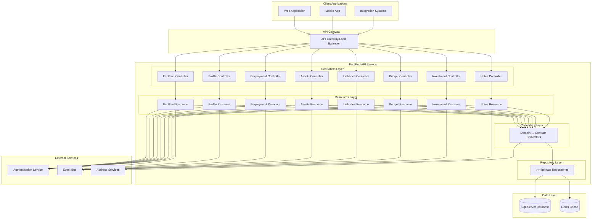

# FactFind API Design Document

## Overview

This document outlines the design for modern, resource-centric REST APIs for the FactFind system. The design transforms the existing screen-based legacy controllers into RESTful endpoints that follow Intelliflo's API Design Guidelines 2.0, providing a comprehensive API for managing client financial data collection processes.

The design follows the established Monolith.FactFind architectural patterns with a 4-layer architecture: Controller → Resource → Converter → Repository, ensuring consistency with existing Intelliflo API implementations.

## Architecture

### System Architecture

The FactFind API system follows a microservice architecture pattern built on .NET 8, integrating with the existing IntelligentOffice ecosystem while providing modern RESTful interfaces.



### API Architecture Pattern

Following the established Monolith.FactFind pattern, each API resource follows a consistent 4-layer architecture:

1. **Controller Layer**: Thin HTTP layer handling routing, status codes, and Swagger documentation
2. **Resource Layer**: Business logic, transactions, and event publishing
3. **Converter Layer**: Bidirectional mapping between domain entities and API contracts
4. **Repository Layer**: NHibernate-based data access

### Resource Hierarchy

The FactFind API is organized around the following resource hierarchy:

```
/v2/factfinds/{factfindId}
├── /profile
│   ├── /personal-details
│   ├── /contact-details
│   ├── /addresses
│   ├── /dependants
│   └── /id-verification
├── /employment
│   └── /employments
├── /assets
│   └── /assets
├── /liabilities
│   └── /liabilities
├── /budget
│   ├── /income
│   ├── /expenditure
│   └── /affordability
├── /investment
│   ├── /investment-needs
│   └── /risk-profile
└── /notes
    └── /notes
```

## Components and Interfaces

### Core Domain Entities

#### FactFind Entity
```csharp
public class FactFind : EqualityAndHashCodeProvider<FactFind, int>
{
    public virtual int Id { get; set; }
    public virtual int PrimaryClientId { get; set; }
    public virtual int? SecondaryClientId { get; set; }
    public virtual string Status { get; set; }
    public virtual DateTime CreatedDate { get; set; }
    public virtual DateTime? CompletedDate { get; set; }
    public virtual bool IsJoint { get; set; }
    public virtual bool IsArchived { get; set; }
    public virtual long Checksum { get; set; }
    
    // Navigation properties
    public virtual Client PrimaryClient { get; set; }
    public virtual Client SecondaryClient { get; set; }
    public virtual ISet<Note> Notes { get; set; }
}
```

#### Employment Entity
```csharp
public class Employment : EqualityAndHashCodeProvider<Employment, int>
{
    public virtual int Id { get; set; }
    public virtual int ClientId { get; set; }
    public virtual int FactFindId { get; set; }
    public virtual string Status { get; set; }
    public virtual string BusinessType { get; set; }
    public virtual string Employer { get; set; }
    public virtual string Occupation { get; set; }
    public virtual DateTime? StartDate { get; set; }
    public virtual DateTime? EndDate { get; set; }
    public virtual decimal? Salary { get; set; }
    public virtual string Currency { get; set; }
    public virtual bool? InProbation { get; set; }
    public virtual EmployerAddress Address { get; set; }
    public virtual SelfEmployedAccounts SelfEmployedAccounts { get; set; }
    public virtual long Checksum { get; set; }
}
```

#### Asset Entity
```csharp
public class Asset : EqualityAndHashCodeProvider<Asset, int>
{
    public virtual int Id { get; set; }
    public virtual int ClientId { get; set; }
    public virtual int FactFindId { get; set; }
    public virtual string AssetType { get; set; }
    public virtual string Description { get; set; }
    public virtual decimal CurrentValue { get; set; }
    public virtual string Currency { get; set; }
    public virtual DateTime ValuationDate { get; set; }
    public virtual decimal? OwnershipPercentage { get; set; }
    public virtual bool IsJointOwnership { get; set; }
    public virtual decimal? AnnualIncome { get; set; }
    public virtual AssetAddress Address { get; set; }
    public virtual long Checksum { get; set; }
}
```

#### Liability Entity
```csharp
public class Liability : EqualityAndHashCodeProvider<Liability, int>
{
    public virtual int Id { get; set; }
    public virtual int ClientId { get; set; }
    public virtual int FactFindId { get; set; }
    public virtual string LiabilityType { get; set; }
    public virtual string Description { get; set; }
    public virtual decimal OutstandingBalance { get; set; }
    public virtual string Currency { get; set; }
    public virtual decimal? InterestRate { get; set; }
    public virtual decimal? MonthlyPayment { get; set; }
    public virtual DateTime? MaturityDate { get; set; }
    public virtual bool IsJointLiability { get; set; }
    public virtual bool IsSecured { get; set; }
    public virtual long Checksum { get; set; }
}
```

### API Contract Models

#### Base Contract Pattern
Following Intelliflo guidelines, each resource uses a three-contract pattern:

1. **BaseDocument**: Shared properties for Create/Update operations
2. **CreateDocument**: Specific to POST operations
3. **Document**: Full entity representation for GET/PUT responses

#### FactFind Contracts
```csharp
public class BaseFactFindDocument
{
    [Required]
    public FactFindStatusValue Status { get; set; }
    
    public DateTime? CompletedDate { get; set; }
    
    [DefaultValue(false)]
    public bool IsArchived { get; set; }
}

public class CreateFactFindDocument : BaseFactFindDocument
{
    [Required]
    public ClientReference PrimaryClient { get; set; }
    
    public ClientReference SecondaryClient { get; set; }
}

public class FactFindDocument : BaseFactFindDocument
{
    [ReadOnly(true)]
    public int Id { get; set; }
    
    [ReadOnly(true)]
    public DateTime CreatedDate { get; set; }
    
    [ReadOnly(true)]
    public bool IsJoint { get; set; }
    
    public ClientReference PrimaryClient { get; set; }
    public ClientReference SecondaryClient { get; set; }
    
    [ReadOnly(true)]
    public long Checksum { get; set; }
    
    public IDictionary<string, object> _links { get; set; }
}
```

#### Employment Contracts
```csharp
public class BaseEmploymentDocument
{
    [Required]
    public EmploymentStatusValue EmploymentStatus { get; set; }
    
    public EmploymentBusinessTypeValue? EmploymentBusinessType { get; set; }
    
    [StringLength(100)]
    public string Employer { get; set; }
    
    [StringLength(100)]
    public string Occupation { get; set; }
    
    public DateTime? StartsOn { get; set; }
    public DateTime? EndsOn { get; set; }
    
    [Range(0, double.MaxValue)]
    public decimal? Salary { get; set; }
    
    [StringLength(3)]
    public string Currency { get; set; }
    
    public bool? InProbation { get; set; }
    
    public EmploymentAddressValue Address { get; set; }
    public SelfEmployedAccountsValue SelfEmployedAccounts { get; set; }
}

public class CreateEmploymentDocument : BaseEmploymentDocument
{
    // Inherits all properties from base
}

public class EmploymentDocument : BaseEmploymentDocument
{
    [ReadOnly(true)]
    public int Id { get; set; }
    
    public ClientReference Client { get; set; }
    
    [ReadOnly(true)]
    public long Checksum { get; set; }
    
    public IDictionary<string, object> _links { get; set; }
}
```

### Converter Interfaces

#### IFactFindConverter
```csharp
public interface IFactFindConverter
{
    FactFindDocument ToContract(FactFind entity);
    FactFind ToDomain(CreateFactFindDocument document);
    FactFind ToDomain(FactFind entity, BaseFactFindDocument document);
}
```

#### IEmploymentConverter
```csharp
public interface IEmploymentConverter
{
    EmploymentDocument ToContract(Employment entity);
    Employment ToDomain(ClientId clientId, CreateEmploymentDocument document);
    Employment ToDomain(Employment entity, BaseEmploymentDocument document);
}
```

### Validator Interfaces

#### IFactFindValidator
```csharp
public interface IFactFindValidator
{
    void Validate(CreateFactFindDocument factFind);
    void Validate(BaseFactFindDocument factFind, FactFindStatusValue status);
    void ValidatePartnerAddition(FactFind factFind, ClientId partnerId);
    void ValidatePartnerRemoval(FactFind factFind);
}
```

#### IEmploymentValidator
```csharp
public interface IEmploymentValidator
{
    void Validate(CreateEmploymentDocument employment);
    void Validate(BaseEmploymentDocument employment, EmploymentStatusValue employmentStatus);
    void ValidateEmploymentHistory(IEnumerable<Employment> employments);
}
```

## Data Models

### Database Schema Design

The FactFind API leverages the existing database schema with enhancements for modern API requirements:

#### Core Tables
- **TFactFind**: Main FactFind records with client relationships
- **TEmploymentDetail**: Employment information with comprehensive fields
- **TAsset**: Asset records with valuation and ownership data
- **TLiability**: Liability records with repayment information
- **TIncome**: Income records with detailed breakdown
- **TExpenditure**: Expenditure records with categorization
- **TInvestmentObjective**: Investment needs and objectives
- **TRiskProfile**: Risk assessment and profiling data
- **TNote**: Notes and documentation for all sections

#### NHibernate Mapping Strategy

Following the established pattern, each entity uses XML-based NHibernate mappings:

```xml
<hibernate-mapping xmlns="urn:nhibernate-mapping-2.2"
                   assembly="Monolith.FactFind"
                   namespace="Monolith.FactFind.Domain"
                   schema="FactFind.dbo">
  <class name="FactFind" table="TFactFind">
    <id name="Id" column="FactFindId">
      <generator class="identity"/>
    </id>
    <property name="PrimaryClientId" column="PrimaryClientId"/>
    <property name="SecondaryClientId" column="SecondaryClientId"/>
    <property name="Status" column="Status"/>
    <property name="CreatedDate" column="CreatedDate"/>
    <property name="CompletedDate" column="CompletedDate"/>
    <property name="IsJoint" column="IsJoint"/>
    <property name="IsArchived" column="IsArchived"/>
    <property name="Checksum" type="Int64" formula="binary_checksum(*)" access="readonly"/>
  </class>
</hibernate-mapping>
```

### Value Objects

#### Address Value Objects
```csharp
public class EmploymentAddressValue
{
    public string AddressLine1 { get; set; }
    public string AddressLine2 { get; set; }
    public string AddressLine3 { get; set; }
    public string Town { get; set; }
    public string County { get; set; }
    public string PostCode { get; set; }
    public string Country { get; set; }
}

public class AssetAddressValue
{
    public string AddressLine1 { get; set; }
    public string AddressLine2 { get; set; }
    public string AddressLine3 { get; set; }
    public string Town { get; set; }
    public string County { get; set; }
    public string PostCode { get; set; }
    public string Country { get; set; }
}
```

#### Self-Employed Accounts Value Object
```csharp
public class SelfEmployedAccountsValue
{
    public DateTime? AccountsDate { get; set; }
    public decimal? TurnOver { get; set; }
    public decimal? NetProfit { get; set; }
    public decimal? Drawings { get; set; }
    public string Currency { get; set; }
}
```

### Enum Definitions

#### FactFind Status
```csharp
public enum FactFindStatusValue
{
    [StringValue("In Progress")]
    InProgress = 1,
    
    [StringValue("Completed")]
    Completed = 2,
    
    [StringValue("Archived")]
    Archived = 3
}
```

#### Employment Status
```csharp
public enum EmploymentStatusValue
{
    [StringValue("Employed")]
    Employed = 1,
    
    [StringValue("Self-Employed")]
    SelfEmployed = 2,
    
    [StringValue("Retired")]
    Retired = 3,
    
    [StringValue("Unemployed")]
    Unemployed = 4,
    
    [StringValue("Student")]
    Student = 5
}
```

#### Asset Types
```csharp
public enum AssetTypeValue
{
    [StringValue("Property")]
    Property = 1,
    
    [StringValue("Investment")]
    Investment = 2,
    
    [StringValue("Pension")]
    Pension = 3,
    
    [StringValue("Savings")]
    Savings = 4,
    
    [StringValue("Other")]
    Other = 5
}
```

## Correctness Properties

*A property is a characteristic or behavior that should hold true across all valid executions of a system—essentially, a formal statement about what the system should do. Properties serve as the bridge between human-readable specifications and machine-verifiable correctness guarantees.*

### Converting EARS to Properties

Based on the prework analysis, the following properties have been identified from the testable acceptance criteria:

Property 1: FactFind client relationship integrity
*For any* FactFind operation (create, update, partner addition/removal), all client relationships should be properly maintained with correct primary/secondary client linkages and joint status flags
**Validates: Requirements 1.1, 1.2, 1.3, 1.4**

Property 2: Data validation and storage consistency  
*For any* API request with valid data, the system should validate the data according to business rules and store it correctly with all required fields populated
**Validates: Requirements 2.1, 3.1, 4.1, 5.1, 6.1, 7.1, 10.1**

Property 3: Historical data preservation
*For any* data update operation (asset values, income changes, risk assessments), the system should preserve historical data while updating current values
**Validates: Requirements 4.2, 6.4, 7.4**

Property 4: Affordability calculation accuracy
*For any* client with employment, liability, and budget data, affordability calculations should correctly include all income sources and payment obligations to compute accurate surplus/deficit
**Validates: Requirements 3.4, 5.4, 6.3**

Property 5: Employment status validation
*For any* employment record, when the employment status changes, the system should validate that all status-specific required fields are present and maintain chronological consistency
**Validates: Requirements 3.2, 3.3**

Property 6: Asset ownership calculations
*For any* asset with ownership information, the system should correctly handle individual, joint, and percentage ownership calculations, ensuring ownership percentages are valid
**Validates: Requirements 4.3, 4.5**

Property 7: Liability payment calculations
*For any* liability with repayment terms, the system should correctly calculate payment obligations and handle property-secured debt information
**Validates: Requirements 5.2, 5.3**

Property 8: Budget categorization consistency
*For any* expenditure record, the system should properly categorize expenses by type and priority, maintaining consistent categorization rules
**Validates: Requirements 6.2**

Property 9: Investment objective linkage
*For any* investment assessment, the system should properly capture objectives and goals, maintaining correct linkages between requirements and client goals
**Validates: Requirements 7.2, 7.3**

Property 10: ATR template management
*For any* ATR template operation, the system should properly store, retrieve, and manage attitude to risk templates with correct versioning
**Validates: Requirements 7.5**

Property 11: Note management integrity
*For any* note operation across FactFind sections, the system should store, retrieve, and maintain audit trails for notes with proper rich text formatting preservation
**Validates: Requirements 8.1, 8.2, 8.3, 8.4, 8.5**

Property 12: API response consistency
*For any* API request, the system should return appropriate HTTP status codes, consistent error response formats, and include HATEOAS links where applicable
**Validates: Requirements 9.4, 9.5, 9.7**

Property 13: Query functionality completeness
*For any* collection endpoint, the system should support filtering, sorting, and pagination with consistent behavior across all resource types
**Validates: Requirements 9.6**

Property 14: Authorization enforcement
*For any* API request, the system should enforce authorization rules and maintain audit trails for all activities
**Validates: Requirements 10.3, 10.4**

Property 15: Multi-tenant data isolation
*For any* data operation, the system should maintain proper data isolation between tenants, ensuring no cross-tenant data access
**Validates: Requirements 10.5**

Property 16: Migration data integrity
*For any* migration operation from legacy systems, the system should maintain data integrity and provide backward compatibility for existing API versions
**Validates: Requirements 11.1, 11.3**

Property 17: Deprecation notice provision
*For any* deprecated endpoint access, the system should provide clear deprecation notices while maintaining functionality
**Validates: Requirements 11.5**

Property 18: Performance requirements compliance
*For any* API request, the system should respond within acceptable time limits and implement efficient pagination for large datasets
**Validates: Requirements 12.1, 12.2**

Property 19: Concurrent access safety
*For any* concurrent access scenario, the system should handle multiple users safely while maintaining data consistency
**Validates: Requirements 12.3**

Property 20: Caching effectiveness
*For any* frequently accessed reference data, the system should implement caching to improve performance without compromising data accuracy
**Validates: Requirements 12.4**

## Error Handling

### Error Response Strategy

Following Intelliflo API Design Guidelines 2.0, all error responses follow a consistent structure:

```json
{
  "code": "ERROR_CODE",
  "message": "Human-readable error description"
}
```

### Error Categories

#### Validation Errors (HTTP 400)
- **VALIDATION_ERROR**: General validation failures
- **REQUIRED_FIELD_MISSING**: Required field not provided
- **INVALID_FIELD_VALUE**: Field value doesn't meet validation criteria
- **INVALID_DATE_RANGE**: Date range validation failures
- **INVALID_CURRENCY**: Currency validation failures

#### Business Logic Errors (HTTP 422)
- **EMPLOYMENT_STATUS_CONFLICT**: Employment status validation failures
- **OWNERSHIP_PERCENTAGE_INVALID**: Asset ownership calculation errors
- **AFFORDABILITY_CALCULATION_ERROR**: Budget calculation failures
- **PARTNER_ADDITION_CONFLICT**: Joint FactFind creation conflicts

#### Authorization Errors (HTTP 403)
- **INSUFFICIENT_PERMISSIONS**: User lacks required permissions
- **TENANT_ACCESS_DENIED**: Cross-tenant access attempts
- **RESOURCE_ACCESS_DENIED**: Specific resource access denied

#### Not Found Errors (HTTP 404)
- **FACTFIND_NOT_FOUND**: FactFind resource not found
- **CLIENT_NOT_FOUND**: Client resource not found
- **EMPLOYMENT_NOT_FOUND**: Employment resource not found

#### Conflict Errors (HTTP 409)
- **RESOURCE_CONFLICT**: Resource state conflicts
- **CONCURRENT_MODIFICATION**: Optimistic concurrency failures
- **DUPLICATE_RESOURCE**: Duplicate resource creation attempts

### Error Headers

All error responses include:
- `x-IoErrorType`: Error type for internationalization (≤40 characters, alphanumeric)
- `x-IoRequestId`: Correlation ID for request tracing
- `Content-Type`: application/json

### Validation Error Details

For validation errors, additional detail is provided:

```json
{
  "code": "VALIDATION_ERROR",
  "message": "Employment status is required and cannot be empty",
  "details": {
    "field": "EmploymentStatus",
    "value": null,
    "constraint": "required"
  }
}
```

## Testing Strategy

### Dual Testing Approach

The FactFind API implementation uses a comprehensive dual testing approach combining unit tests and property-based tests to ensure reliability and correctness:

#### Unit Tests
Unit tests focus on specific examples, edge cases, and error conditions:
- **Converter Tests**: Verify bidirectional mapping between domain entities and API contracts
- **Validator Tests**: Test business rule enforcement and validation logic
- **Controller Tests**: Verify HTTP status codes, routing, and response formatting
- **Resource Tests**: Test business logic orchestration and transaction handling

#### Property-Based Tests
Property-based tests verify universal properties across all inputs using randomized test data:
- **Minimum 100 iterations** per property test to ensure comprehensive coverage
- **Randomized input generation** for domain entities, API contracts, and edge cases
- **Universal property validation** ensuring correctness across all possible inputs
- **Correlation with design properties** using structured tagging

### Property Test Configuration

Each property-based test is configured with:
- **Test Framework**: NUnit with custom property test attributes
- **Iteration Count**: Minimum 100 iterations per test
- **Input Generators**: Smart generators that create valid domain objects
- **Property Validation**: Assertions that verify universal properties hold
- **Tagging Format**: `**Feature: factfind-api-design, Property {number}: {property_text}**`

### Test Organization

```
test/
├── Monolith.FactFind.Tests/                    # Unit tests
│   ├── Converters/                             # Converter unit tests
│   ├── Validators/                             # Validator unit tests
│   ├── Resources/                              # Resource unit tests
│   └── Controllers/                            # Controller unit tests
└── Monolith.FactFind.SubSystemTests/           # Integration tests
    ├── FactFindApiTests.cs                     # End-to-end API tests
    ├── ProfileApiTests.cs                      # Profile management tests
    ├── EmploymentApiTests.cs                   # Employment API tests
    ├── AssetsApiTests.cs                       # Assets API tests
    ├── LiabilitiesApiTests.cs                  # Liabilities API tests
    ├── BudgetApiTests.cs                       # Budget API tests
    ├── InvestmentApiTests.cs                   # Investment API tests
    └── NotesApiTests.cs                        # Notes API tests
```

### Testing Best Practices

#### Unit Testing Guidelines
- Use `FluentAssertions` for readable test assertions
- Mock external dependencies with `Mock.Of<T>()`
- Test both success and failure scenarios
- Include edge cases and boundary conditions
- Verify error messages and status codes

#### Property Testing Guidelines
- Generate realistic test data that respects business constraints
- Test universal properties that should hold for all valid inputs
- Include negative test cases with invalid data
- Verify round-trip consistency for converters
- Test invariants that should be preserved across operations

#### Integration Testing Guidelines
- Test complete API workflows end-to-end
- Verify cross-resource relationships and dependencies
- Test authentication and authorization scenarios
- Include performance testing for response times
- Validate API contract compliance

### Test Data Management

#### Test Data Strategies
- **Embedded JSON files** for complex test scenarios
- **Builder patterns** for creating test domain objects
- **Randomized generators** for property-based testing
- **Test databases** with isolated test data
- **Mock services** for external dependencies

#### Data Isolation
- Each test runs in isolation with clean test data
- Database transactions are rolled back after each test
- Mock services reset state between tests
- Test tenants are isolated from production data

### Continuous Testing

#### Automated Test Execution
- Unit tests run on every code change
- Integration tests run on pull request creation
- Property tests run with extended iteration counts in CI/CD
- Performance tests run on release candidates
- Security tests validate authorization and data protection

#### Test Reporting
- Comprehensive test coverage reporting
- Property test failure analysis with counterexamples
- Performance test results with response time metrics
- Security test results with vulnerability assessments
- Integration test results with API contract validation

This comprehensive testing strategy ensures the FactFind API meets all requirements for reliability, performance, and correctness while maintaining compatibility with Intelliflo's quality standards.