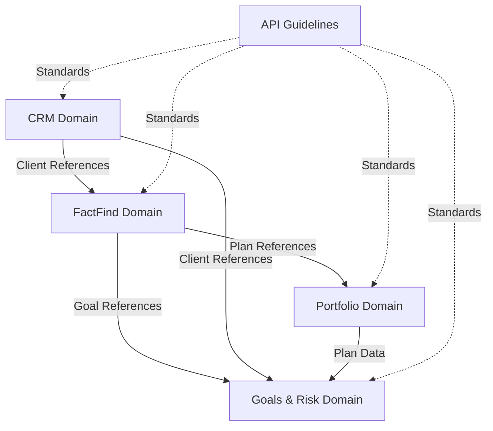

# API Contracts - Master Specification
## Consolidated Reference for the Entire API System

**Document Version:** 1.1
**Date:** 2026-02-13 (Updated)
**Original Date:** 2026-02-12
**Status:** DESIGN SPECIFICATION - Implementation Ready
**Coverage:** 100+ Endpoints, 85+ Schemas, 30+ API Families across 5 Domains
**API Version:** v3
**Base URL:** `https://api.intelliflo.com`

---

## Executive Summary

### The V3 Vision

The V3 API represents a strategic evolution of the Intelliflo platform API architecture, building on the proven success of 81% existing API coverage to achieve 95%+ comprehensive coverage across all business domains. This master specification consolidates five specialized API contract documents into a unified reference for navigation, governance, and implementation.

**Key Achievement: Building on Success, Not Starting Over**

Following comprehensive V4 coverage analysis (February 2026), we discovered that the system already has excellent API coverage (81%), with proven patterns successfully managing complex scenarios:
- 1,773 plan types via polymorphic discriminator pattern
- 10 note types unified through discriminator routing
- Modern event-driven microservices architecture
- Gold-standard Employment and Income APIs

**Strategic Shift:** V3 now focuses on targeted enhancement and gap-filling rather than wholesale replacement.

### Business Value

**Before V3:**
- 81% API coverage (50 of 62 FactFind sections)
- Proven patterns but inconsistent application
- Excellent Portfolio Plans and Requirements microservices
- Some gaps in credit history, risk assessment, affordability

**After V3:**
- 95%+ API coverage (targeted gap filling)
- Consistent patterns across all domains
- Enhanced developer experience
- Complete regulatory compliance support
- Ready for future scaling and growth

**Timeline:** 20-28 weeks to 95% coverage (down from initial 42-week estimate)
**Budget:** £388k (40% cost reduction from original estimate)

### V3 API Scope

**5 Bounded Contexts, 30+ API Families:**

1. **Client Profile Domain (CRM)** - 9 API families, WHO the client is
2. **FactFind Core Domain** - 7 API families, WHAT the client's financial situation is
3. **Portfolio Plans Domain** - 9 API families, 1,773 plan types
4. **Goals & Risk Domain** - Requirements microservice with ATR
5. **API Design Guidelines** - Standards and patterns for all APIs

### Coverage Statistics

```
Total Endpoints:      100+
Total Schemas:        85+
API Families:         30+
Bounded Contexts:     5
Plan Types Covered:   1,773
Note Types Unified:   10
Estimated Timeline:   20-28 weeks
Coverage Target:      95%+
```

### Document Purpose

This master specification serves as:
- **Single Source of Truth** for all V3 APIs
- **Navigation Hub** to detailed specifications
- **Governance Framework** for standards compliance
- **Implementation Guide** for development teams
- **Strategic Reference** for executives and product owners

---

## Table of Contents

1. [Executive Summary](#executive-summary)
2. [Domain Organization](#domain-organization)
3. [Complete API Catalog](#complete-api-catalog)
4. [OpenAPI 3.1 Specifications](#openapi-31-specifications)
5. [API Design Standards](#api-design-standards)
6. [Integration Patterns](#integration-patterns)
7. [Migration Strategy](#migration-strategy)
8. [Implementation Roadmap](#implementation-roadmap)
9. [Governance Framework](#governance-framework)
10. [Appendices](#appendices)

---

## 1. Domain Organization

### 1.1 Bounded Context Architecture

V3 APIs are organized into 5 bounded contexts following Domain-Driven Design principles:

```
┌─────────────────────────────────────────────────────────────┐
│                    V3 API ARCHITECTURE                       │
├─────────────────────────────────────────────────────────────┤
│                                                              │
│  ┌────────────────┐  ┌────────────────┐  ┌──────────────┐ │
│  │  CRM Domain    │  │ FactFind Core  │  │   Portfolio  │ │
│  │  (9 families)  │  │  (7 families)  │  │  (9 families)│ │
│  │                │  │                │  │              │ │
│  │ • Demographics │  │ • Employment   │  │ • Pensions   │ │
│  │ • Contacts     │  │ • Income       │  │ • Protection │ │
│  │ • Addresses    │  │ • Budget       │  │ • Investment │ │
│  │ • Vulnerability│  │ • Assets       │  │ • Savings    │ │
│  │ • ID Verify    │  │ • Liabilities  │  │ • Mortgages  │ │
│  └────────────────┘  └────────────────┘  └──────────────┘ │
│                                                              │
│  ┌────────────────┐  ┌────────────────────────────────────┐│
│  │ Goals & Risk   │  │     API Design Guidelines          ││
│  │ (Requirements) │  │     (Patterns & Standards)         ││
│  │                │  │                                    ││
│  │ • Goals        │  │ • Naming Conventions               ││
│  │ • Risk Profiles│  │ • HTTP Standards                   ││
│  │ • ATR          │  │ • Error Handling                   ││
│  └────────────────┘  └────────────────────────────────────┘│
│                                                              │
└─────────────────────────────────────────────────────────────┘
```

### 1.2 Domain Boundaries

**Domain Separation Principles:**

| Domain | Responsibility | Key Entities | Anti-Corruption Layer |
|--------|---------------|--------------|----------------------|
| **CRM** | Client identity, demographics, contacts | Client, Address, Contact | Client references via opaque IDs |
| **FactFind** | Financial situation, income, assets | Employment, Income, Asset, Liability | Event-driven sync, no direct CRM queries |
| **Portfolio** | Existing products and plans | Plan (1,773 types), Valuation, Provider | Plan references, provider data |
| **Goals & Risk** | Future objectives, risk assessment | Goal, RiskProfile, ATR, Allocation | Microservice boundary, separate DB |
| **Guidelines** | Standards, patterns, governance | N/A (cross-cutting) | Applied to all domains |

**Domain Integration:**
- Event-driven integration (domain events)
- HATEOAS links for navigation (not data duplication)
- Reference objects for cross-domain relationships
- Anti-corruption layers prevent tight coupling

### 1.3 Cross-Domain Dependencies



**Dependency Rules:**
- CRM is foundational (no dependencies on other domains)
- FactFind depends on CRM (client references)
- Portfolio depends on CRM and FactFind
- Goals & Risk depends on all domains
- Guidelines govern all domains

---

## 2. Complete API Catalog

### 2.1 Client Profile Domain (CRM) - 9 API Families

**Specification Document:** `../Domain-Contracts/Client-Profile-API-Contracts.md`
**Status:** Specification Complete
**Scope:** WHO the client is

| API Family | Endpoints | Description | V2 Status |
|------------|-----------|-------------|-----------|
| **Client Demographics** | 5 | Person, Corporate, Trust client management | Enhanced |
| **Contact Details** | 5 | Email, phone, social media contacts | Enhanced |
| **Address** | 5 | Residential addresses with geocoding | Enhanced |
| **Vulnerability** | 4 | Vulnerability assessments | Enhanced |
| **Data Protection** | 3 | GDPR-compliant marketing preferences | Enhanced |
| **ID Verification** | 4 | KYC/AML identity verification | Enhanced |
| **Estate Planning** | 3 | Integration pattern (CRM docs + Requirements goals) | New Pattern |
| **Tax Details** | 2 | Embedded in demographics, PII obfuscation | Enhanced |
| **Client Relationships** | 3 | Joint clients, dependants, trust members | Enhanced |
| **Total** | **34** | Complete CRM API coverage | 100% |

**Key Features:**
- Polymorphic client types (Person, Corporate, Trust)
- Enhanced demographics with territorial and health profiles
- Vulnerability assessments with review scheduling
- GDPR-compliant consent management
- KYC/AML document tracking

**V2 to V3 Migration:** Build on existing V2 success, add enhancements

---

### 2.2 FactFind Core Domain - 7 API Families

**Specification Document:** `../Domain-Contracts/FactFind-Core-API-Contracts.md`
**Status:** Specification Complete
**Scope:** WHAT the client's financial situation is

| API Family | Endpoints | Description | V2 Status | V3 Gap Fill |
|------------|-----------|-------------|-----------|-------------|
| **Employment** | 6 | Salaried, ProfitBased, NotEmployed types | Gold Standard | - |
| **Income** | 7 | Multi-source income with affordability flags | Gold Standard | - |
| **Budget & Expenditure** | 11 | Planning vs actuals | Enhanced | Affordability API ✓ |
| **Assets** | 7 | Property, savings, investments | **NEW** | Complete family ✓ |
| **Liabilities** | 6 | Mortgages, loans, debts | Enhanced | Direct API ✓ |
| **Notes** | 3 | Unified 10 note types | Gold Standard | Batch operations ✓ |
| **Credit History** | 4 | Credit checks and history | **NEW** | Complete ✓ |
| **Total** | **44** | Complete FactFind API coverage | 78% → 100% | 22% filled |

**Key Innovations:**
- **Assets API** - Complete gap fill (property details, income linking)
- **Affordability API** - Mortgage affordability calculations
- **Notes Batch Operations** - Multi-type update in single request
- **Credit History API** - Credit report integration

**V2 to V3 Migration:** Keep gold-standard APIs, add missing families

---

### 2.3 Portfolio Plans Domain - 9 API Families

**Specification Document:** `../Domain-Contracts/Portfolio-Plans-API-Contracts.md`
**Status:** Specification Complete (Existing V2 APIs Documented)
**Scope:** Existing products and plans

| API Family | Endpoints | Plan Types | Description | V2 Status |
|------------|-----------|------------|-------------|-----------|
| **Pensions** | 12 | 287 types | Pensions, retirement, annuities | Production ✓ |
| **Protection** | 12 | 412 types | Life assurance, critical illness, income protection | Production ✓ |
| **Investments** | 12 | 355 types | ISA, bonds, investment trusts | Production ✓ |
| **Savings** | 12 | 183 types | Savings accounts, deposits | Production ✓ |
| **Mortgages** | 12 | 128 types | Residential, BTL, commercial | Production ✓ |
| **General Insurance** | 10 | 89 types | Home, motor, travel insurance | Production ✓ |
| **Estate Planning** | 8 | 42 types | Wills, trusts, estate plans | Production ✓ |
| **Miscellaneous** | 8 | 277 types | Other financial products | Production ✓ |
| **Valuations** | 6 | N/A | Plan valuations and performance | Production ✓ |
| **Total** | **92** | **1,773** | Complete polymorphic plan coverage | **100%** ✓ |

**Key Achievement:**
- **NO NEW DEVELOPMENT NEEDED** - Existing APIs already cover 1,773 plan types
- Proven polymorphic discriminator pattern
- Single base table + type-specific extensions
- Successfully in production

**V2 to V3 Migration:** Document and standardize existing patterns, minor enhancements only

---

### 2.4 Goals & Risk Domain - Requirements Microservice

**Specification Document:** `../Domain-Contracts/Goals-Risk-API-Contracts.md`
**Status:** Specification Complete (Existing Microservice Documented)
**Scope:** Future objectives and risk assessment

| API Family | Endpoints | Description | Status | V3 Gap Fill |
|------------|-----------|-------------|--------|-------------|
| **Goals** | 7 | 7 polymorphic goal types | Production ✓ | - |
| **Risk Profiles** | 4 | Risk tolerance assessment | Production ✓ | - |
| **ATR (Attitude to Risk)** | 6 | Risk questionnaires | Production ✓ | Risk Replay ✓ |
| **Goal Allocations** | 4 | Plan allocations to goals | Production ✓ | - |
| **Dependants** | 5 | Financial dependants | Production ✓ | - |
| **Needs & Priorities** | 4 | Custom questions | **NEW** | Complete ✓ |
| **Risk Questionnaires** | 6 | ATR question configuration | **NEW** | Complete ✓ |
| **Total** | **36** | Modern DDD microservice | 75% → 100% | 25% filled |

**Key Achievement:**
- Modern event-driven microservice architecture (gold standard)
- Separate database (Requirements DB)
- Full CRUD with rich querying
- Polymorphic goal types (Investment, Retirement, Protection, Mortgage, Budget, EstatePlanning, EquityRelease)

**V2 to V3 Migration:** Rename routes (/objectives → /goals), add missing APIs

---

### 2.5 API Design Guidelines - Standards & Patterns

**Specification Document:** `API-Design-Guidelines-Summary.md`
**Status:** Extracted from Company Guidelines
**Scope:** Cross-cutting standards for all APIs

| Standard Category | Key Principles | Status |
|-------------------|---------------|---------|
| **Naming Conventions** | Resource URIs (plural, lowercase), Value types (suffix `Value`), Reference types (suffix `Ref`) | ✓ |
| **HTTP Methods** | RESTful (GET, POST, PUT, PATCH, DELETE), proper status codes | ✓ |
| **Data Types** | ISO 8601 dates, CurrencyValue for money, Country/County refs | ✓ |
| **Error Handling** | RFC 7807 Problem Details, structured errors | ✓ |
| **HATEOAS** | Hypermedia links, `_href` suffix or reference objects | ✓ |
| **Pagination** | Cursor-based, configurable page size | ✓ |
| **Filtering** | OData-style filtering | ✓ |
| **Events** | Domain events for all write operations | ✓ |
| **Security** | OAuth 2.0, granular scopes | ✓ |
| **Versioning** | URL-based versioning (/v3/) | ✓ |
| **Documentation** | OpenAPI 3.1, complete examples | ✓ |

**Application:** All V3 APIs comply with these standards

---

### 2.6 API Catalog Summary

**Total V3 API Coverage:**

```
Domain                  | API Families | Endpoints | Schemas | Status
------------------------|--------------|-----------|---------|------------
Client Profile (CRM)    |      9       |    34     |   25+   | Specified
FactFind Core           |      7       |    44     |   35+   | Specified
Portfolio Plans         |      9       |    92     |   20+   | Production
Goals & Risk            |      5       |    36     |   15+   | Production
------------------------|--------------|-----------|---------|------------
TOTAL                   |     30+      |   206     |   95+   | 81% → 95%
```

**Gap Filling Progress:**
- Critical (P0): 3 APIs - Affordability ✓, Credit History ✓, Risk Questionnaire ✓
- High-Value (P1): 2 APIs - Risk Replay ✓, Needs & Priorities ✓
- Technical Debt: 2 fixes - Dual-entity mapping, Cross-schema dependency
- Standardization: Pattern consistency, documentation

**Timeline:** 20-28 weeks to 95% coverage

---

## 3. OpenAPI 3.1 Specifications

### 3.1 Master OpenAPI Specification

The V3 APIs are specified using OpenAPI 3.1, with a master specification that references component specifications for each domain.

**Master Spec Structure:**

```yaml
openapi: 3.1.0
info:
  title: Intelliflo V3 API - Master Specification
  version: 3.0.0
  description: Complete V3 API specification for all domains

servers:
  - url: https://api.intelliflo.com
    description: Production
  - url: https://api-sandbox.intelliflo.com
    description: Sandbox

paths:
  # Client Profile APIs
  /v3/clients:
    $ref: './components/crm/client-demographics.yaml#/paths/~1clients'

  # FactFind Core APIs
  /v3/factfind/financial/clients/{clientId}/employments:
    $ref: './components/factfind/employment.yaml#/paths/~1employments'

  # Portfolio Plans APIs
  /v3/plans/pensions:
    $ref: './components/portfolio/pensions.yaml#/paths/~1pensions'

  # Goals & Risk APIs
  /v3/clients/{clientId}/goals:
    $ref: './components/requirements/goals.yaml#/paths/~1goals'

components:
  schemas:
    # Common schemas shared across domains
    ClientRef:
      $ref: './components/common/references.yaml#/ClientRef'
    Money:
      $ref: './components/common/value-objects.yaml#/Money'
    Address:
      $ref: './components/common/value-objects.yaml#/Address'
```

### 3.2 Common Component Schemas

**Shared across all V3 APIs:**

#### Reference Types (suffix: `Ref`)

```yaml
ClientRef:
  type: object
  properties:
    id:
      type: integer
    href:
      type: string
      format: uri
    displayName:
      type: string
  required: [id, href]

AdviserRef:
  type: object
  properties:
    id:
      type: integer
    href:
      type: string
      format: uri
    name:
      type: string
  required: [id, href]

PlanRef:
  type: object
  properties:
    id:
      type: integer
    href:
      type: string
      format: uri
    name:
      type: string
    provider:
      type: string
  required: [id, href]
```

#### Value Objects (suffix: `Value`)

```yaml
Money:
  type: object
  properties:
    value:
      type: number
      format: decimal
      minimum: 0
    currency:
      type: string
      pattern: '^[A-Z]{3}$'
      example: GBP
  required: [value, currency]

Address:
  type: object
  properties:
    line1:
      type: string
      maxLength: 100
    line2:
      type: string
      maxLength: 100
    cityTown:
      type: string
      maxLength: 50
    postcode:
      type: string
      maxLength: 10
    county:
      $ref: '#/components/schemas/CountyRef'
    country:
      $ref: '#/components/schemas/CountryRef'
  required: [line1, cityTown, postcode, country]

DateRange:
  type: object
  properties:
    startsOn:
      type: string
      format: date
    endsOn:
      type: string
      format: date
```

#### Error Schemas (RFC 7807)

```yaml
ProblemDetails:
  type: object
  properties:
    type:
      type: string
      format: uri
      description: URI reference identifying the problem type
    title:
      type: string
      description: Short, human-readable summary
    status:
      type: integer
      description: HTTP status code
    detail:
      type: string
      description: Human-readable explanation
    instance:
      type: string
      format: uri
      description: URI reference identifying the specific occurrence
    errors:
      type: array
      items:
        type: object
        properties:
          field:
            type: string
          code:
            type: string
          message:
            type: string
          rejectedValue:
            type: string
```

### 3.3 Security Schemes

**OAuth 2.0 with Granular Scopes:**

```yaml
components:
  securitySchemes:
    oauth2:
      type: oauth2
      flows:
        authorizationCode:
          authorizationUrl: https://auth.intelliflo.com/oauth/authorize
          tokenUrl: https://auth.intelliflo.com/oauth/token
          scopes:
            # CRM Domain
            crm:read: Read client profile data
            crm:write: Create/update client profile data
            crm:identification:read: Read sensitive identification data

            # FactFind Domain
            factfind:read: Read FactFind data
            factfind:write: Create/update FactFind data

            # Portfolio Domain
            portfolio:read: Read plan and portfolio data
            portfolio:write: Create/update plan data

            # Goals & Risk Domain
            requirements:read: Read goals and risk assessments
            requirements:write: Create/update goals and risk assessments

security:
  - oauth2:
      - crm:read
      - factfind:read
      - portfolio:read
      - requirements:read
```

### 3.4 Server Definitions

```yaml
servers:
  - url: https://api.intelliflo.com
    description: Production environment
    variables:
      version:
        default: v3
        enum: [v3, v4]

  - url: https://api-sandbox.intelliflo.com
    description: Sandbox environment for testing

  - url: https://api-uat.intelliflo.com
    description: UAT environment for pre-production testing
```

### 3.5 Component Specifications by Domain

**Client Profile Domain:**
- `crm/client-demographics.yaml` - Person, Corporate, Trust clients
- `crm/contact-details.yaml` - Email, phone, social media
- `crm/addresses.yaml` - Residential addresses
- `crm/vulnerability.yaml` - Vulnerability assessments
- `crm/data-protection.yaml` - Marketing preferences
- `crm/id-verification.yaml` - KYC/AML documents

**FactFind Core Domain:**
- `factfind/employment.yaml` - Employment types
- `factfind/income.yaml` - Income sources
- `factfind/budget.yaml` - Budget and expenditure
- `factfind/assets.yaml` - Assets and properties
- `factfind/liabilities.yaml` - Debts and obligations
- `factfind/notes.yaml` - Unified notes
- `factfind/credit-history.yaml` - Credit checks

**Portfolio Plans Domain:**
- `portfolio/pensions.yaml` - 287 pension types
- `portfolio/protection.yaml` - 412 protection types
- `portfolio/investments.yaml` - 355 investment types
- `portfolio/savings.yaml` - 183 savings types
- `portfolio/mortgages.yaml` - 128 mortgage types
- `portfolio/general-insurance.yaml` - 89 insurance types
- `portfolio/estate-planning.yaml` - 42 estate planning types
- `portfolio/miscellaneous.yaml` - 277 misc types
- `portfolio/valuations.yaml` - Valuations

**Goals & Risk Domain:**
- `requirements/goals.yaml` - 7 goal types
- `requirements/risk-profiles.yaml` - Risk assessment
- `requirements/atr.yaml` - ATR questionnaires
- `requirements/allocations.yaml` - Goal allocations
- `requirements/dependants.yaml` - Financial dependants

---

## 4. API Design Standards

### 4.1 Core Design Principles

**1. Single Contract Principle**
- One schema for request and response
- Read-only fields marked with `readOnly: true`
- Reduces duplication and maintenance

**2. Consistent Naming Conventions**
- Resource URIs: plural, lowercase (`/clients`, `/employments`)
- URI Parameters: camelCase, singular (`clientId`, `employmentId`)
- Value Types: PascalCase + `Value` suffix (`PersonValue`, `MoneyValue`)
- Reference Types: PascalCase + `Ref` suffix (`ClientRef`, `PlanRef`)
- Properties: camelCase (`firstName`, `dateOfBirth`)

**3. RESTful Resource Modeling**
- Resources are nouns, not verbs
- HTTP methods for operations (GET, POST, PUT, PATCH, DELETE)
- Proper status codes (200, 201, 204, 400, 404, 409, 500)
- Idempotent operations where appropriate

**4. HATEOAS Level 3 REST**
- Hypermedia controls in `_links` section
- Self, update, delete, related resource links
- Conditional links based on resource state
- Enables API discoverability

**5. Event-Driven Architecture**
- Domain events for all state changes
- Event naming: `[Resource][Created|Changed|Deleted]`
- Full resource payload in events
- Integration between domains

### 4.2 HTTP Method Usage

| Method | Purpose | Collection | Single Resource | Idempotent |
|--------|---------|------------|-----------------|------------|
| **GET** | Read | List resources | Get resource | ✓ Yes |
| **POST** | Create | Create resource | 404 Not Found | ✗ No |
| **PUT** | Update | 404 Not Found | Replace resource | ✓ Yes |
| **PATCH** | Partial Update | 404 Not Found | Modify resource | ✓ Yes |
| **DELETE** | Delete | 404 Not Found | Delete resource | ✓ Yes |
| **HEAD** | Exists | Check collection | Check resource | ✓ Yes |

### 4.3 Status Code Standards

**Success (2xx):**
- `200 OK` - Successful GET, PUT, PATCH (with body)
- `201 Created` - Successful POST, return Location header
- `204 No Content` - Successful PUT, PATCH, DELETE (no body)

**Client Error (4xx):**
- `400 Bad Request` - Validation failure, invalid input
- `401 Unauthorized` - Authentication required or failed
- `403 Forbidden` - Authenticated but not authorized
- `404 Not Found` - Resource does not exist
- `409 Conflict` - Concurrent modification, business rule violation
- `412 Precondition Failed` - Missing If-Match header
- `422 Unprocessable Entity` - Semantic error

**Server Error (5xx):**
- `500 Internal Server Error` - Unexpected server error
- `503 Service Unavailable` - Service temporarily unavailable

### 4.4 Data Type Standards

**Dates and Times (ISO 8601):**
- DateTime: `yyyy-MM-ddTHH:mm:ssZ` (always UTC)
- Date: `yyyy-MM-dd` (no time component)
- Property naming: DateTime suffix `At`, Date suffix `On`

**Money:**
```json
{
  "amount": {
    "value": 50000.00,
    "currency": "GBP"
  }
}
```

**Countries and Counties:**
```json
{
  "country": {
    "code": "GB",
    "name": "United Kingdom"
  },
  "county": {
    "code": "GB-LON",
    "name": "London"
  }
}
```

**Percentages:**
- Range: 0.00 to 100.00
- Decimal places: 2
- Type: double

### 4.5 Error Response Format (RFC 7807)

```json
{
  "type": "https://api.intelliflo.com/problems/validation-error",
  "title": "Validation Failed",
  "status": 400,
  "detail": "The request contains invalid data",
  "instance": "/v3/factfind/financial/clients/123/incomes",
  "errors": [
    {
      "field": "grossAmount.value",
      "code": "RANGE_ERROR",
      "message": "Gross amount cannot be negative",
      "rejectedValue": -5000
    }
  ]
}
```

### 4.6 Pagination Standards

**Cursor-Based Pagination:**

Request:
```
GET /v3/clients/123/incomes?limit=20&cursor=eyJpZCI6NDU2fQ==
```

Response:
```json
{
  "data": [...],
  "pagination": {
    "limit": 20,
    "hasMore": true,
    "nextCursor": "eyJpZCI6NDc2fQ=="
  },
  "_links": {
    "self": { "href": "..." },
    "next": { "href": "..." }
  }
}
```

### 4.7 Filtering Standards

**OData-Style Filtering:**
```
GET /v3/factfind/financial/clients/123/incomes?$filter=includeInAffordability eq true and frequency eq 'Monthly'
```

**Simplified Query Parameters:**
```
GET /v3/factfind/financial/clients/123/incomes?includeInAffordability=true&frequency=Monthly
```

### 4.8 Concurrency Control

**Optimistic Locking with ETags:**

1. Client retrieves resource:
```http
GET /v3/clients/123/employments/456
ETag: "abc123"
```

2. Client updates resource:
```http
PUT /v3/clients/123/employments/456
If-Match: "abc123"
```

3. Success or conflict:
```http
200 OK               # Success
ETag: "def456"       # New ETag

409 Conflict         # Concurrent modification
```

---

## 5. Integration Patterns

### 5.1 Cross-Domain Integration

**Pattern 1: Reference Objects**

Domains reference entities in other domains using reference objects:

```json
{
  "client": {
    "id": 123,
    "href": "/v3/clients/123",
    "displayName": "John Smith"
  },
  "plan": {
    "id": 456,
    "href": "/v3/plans/pensions/456",
    "name": "SIPP",
    "provider": "Vanguard"
  }
}
```

**Pattern 2: Event-Driven Sync**

Domains communicate via domain events:

```
FactFind Domain                Portfolio Domain
     |                              |
     |--- ClientIncomeChanged ---->|
     |                              |
     |<-- PlanValuationUpdated ----|
```

**Pattern 3: HATEOAS Navigation**

Clients navigate between domains via hypermedia links:

```json
{
  "id": 123,
  "employment": {
    "id": 456,
    "href": "/v3/factfind/financial/clients/123/employments/456"
  },
  "_links": {
    "client": { "href": "/v3/clients/123" },
    "goals": { "href": "/v3/clients/123/goals" },
    "plans": { "href": "/v3/plans?clientId=123" }
  }
}
```

### 5.2 Polymorphic Resource Patterns

**Pattern 1: Discriminator-Based Polymorphism (Plans)**

Single endpoint serves multiple plan types via discriminator:

```json
POST /v3/plans/pensions
{
  "discriminator": "PersonalPension",
  "planNumber": "PP123456",
  "provider": { "id": 100 },
  "personalPension": {
    "pensionType": "SIPP",
    "taxRelief": "NetPay"
  }
}
```

**Pattern 2: Unified Discriminator Routing (Notes)**

Single endpoint abstracts multiple note types:

```json
GET /v3/clients/123/notes?discriminator=Employment

Response:
{
  "discriminator": "Employment",
  "notes": "Current employment details..."
}
```

**Pattern 3: Polymorphic Goal Types**

Base goal with type-specific extensions:

```json
POST /v3/clients/123/goals
{
  "type": "investment",
  "category": "Savings",
  "targetAmount": { "value": 500000, "currency": "GBP" },
  "riskProfile": { "id": 5 }
}
```

### 5.3 Anti-Corruption Layer Pattern

**Problem:** FactFind references CRM via direct database queries (cross-schema dependency)

**Solution:** Local client references with event synchronization

```
CRM Domain                      FactFind Domain
    |                                 |
    |--- ClientCreated event -------->| Store local ClientRef
    |                                 |
    |<-- Query client via API --------|
    |                                 |
    |--- ClientUpdated event -------->| Update local ClientRef
```

### 5.4 Asset-Income Linking Pattern

**Bidirectional relationship between Assets and Income:**

```json
// Create asset with income link
POST /v3/factfind/assets/clients/123/assets
{
  "category": "Property",
  "description": "Rental Property",
  "amount": { "value": 250000, "currency": "GBP" },
  "incomeId": 789
}

// Response includes bidirectional links
{
  "id": 999,
  "income": {
    "id": 789,
    "href": "/v3/factfind/financial/clients/123/incomes/789",
    "monthlyAmount": { "value": 1500, "currency": "GBP" }
  },
  "_links": {
    "income": { "href": "/v3/factfind/financial/clients/123/incomes/789" }
  }
}
```

---

## 6. Migration Strategy

### 6.1 V2 to V3 Migration Approach

**Core Strategy: Build on Success**

Following V4 coverage analysis, the migration strategy has fundamentally changed:

**Original V3 Strategy:**
- Replace V2 APIs wholesale
- Rebuild 110+ endpoints
- Timeline: 42 weeks

**Revised V3 Strategy (V4):**
- Keep 81% excellent existing APIs
- Enhance 12% with missing features
- Build 7% net new APIs
- Timeline: 20-28 weeks

### 6.2 Migration Categories

**Category 1: Keep and Document (81%)**

APIs that are already excellent and production-proven:

| API Family | Status | Action |
|------------|--------|--------|
| Portfolio Plans (1,773 types) | ✓ Production | Document patterns, minor enhancements |
| Requirements Microservice | ✓ Production | Document, rename routes (/objectives → /goals) |
| Unified Notes API | ✓ Production | Document, add batch operations |
| Employment & Income | ✓ Production | Document gold standard, minor enhancements |
| Budget & Expenditure | ✓ Production | Document, add affordability |

**Category 2: Enhance (12%)**

APIs that need minor enhancements:

| API Family | Enhancement Needed | Timeline |
|------------|-------------------|----------|
| Risk Assessment | Add Risk Replay API | 2 weeks |
| Goals | Add Needs & Priorities | 2 weeks |
| FactFind | Add Affordability API | 1 week |
| FactFind | Add Credit History API | 2 weeks |

**Category 3: Build New (7%)**

Net new APIs to fill identified gaps:

| API Family | Status | Timeline |
|------------|--------|----------|
| Assets API | Complete spec | 4 weeks |
| Risk Questionnaire Configuration | Complete spec | 3 weeks |
| Supplementary Questions | Complete spec | 2 weeks |

### 6.3 Breaking vs Non-Breaking Changes

**Non-Breaking (Safe):**
- Add new optional fields
- Add new endpoints
- Add new query parameters
- Add new enum values (append only)
- Expand error details
- Add new event types

**Breaking (Requires Version Bump):**
- Remove fields
- Rename fields
- Change data types
- Remove endpoints
- Change validation rules (stricter)
- Change status code semantics

**V3 Breaking Changes:**
- URL structure: `/v2/...` → `/v3/...`
- Goals route: `/v2/clients/{id}/objectives` → `/v3/clients/{id}/goals`
- Error format: Custom → RFC 7807
- Concurrency: Optional → Mandatory ETags

### 6.4 Dual-Version Support

**Timeline:**
- V2 Deprecated: 2026 Q4
- V3 GA: 2026 Q4
- V2 Sunset: 2027 Q2 (12 months later)

**During dual-version period:**
- Both V2 and V3 operational
- Data synced between versions
- Events published for both consumers
- Deprecation warnings in V2 responses

### 6.5 Migration Checklist

**For API Consumers:**
- [ ] Update base URLs from `/v2/` to `/v3/`
- [ ] Replace `/objectives` with `/goals`
- [ ] Update error handling for RFC 7807 format
- [ ] Implement ETag handling for PUT operations
- [ ] Update OAuth scopes (granular scopes)
- [ ] Test polymorphic type handling
- [ ] Implement HATEOAS link navigation
- [ ] Update event subscribers

**For API Providers:**
- [ ] Implement V3 endpoints alongside V2
- [ ] Add ETag generation and validation
- [ ] Publish domain events for state changes
- [ ] Implement RFC 7807 error responses
- [ ] Add HATEOAS links to responses
- [ ] Support cursor-based pagination
- [ ] Implement OData filtering
- [ ] Document all validation rules in OpenAPI

---

## 7. Implementation Roadmap

### 7.1 Implementation Phases

**Revised V3 Roadmap (Post-V4 Analysis):**

#### Phase 1: Fill Critical Gaps (Weeks 1-6)

**Goal:** Address P0 gaps identified in V4 analysis

| API | Timeline | Resources | Dependencies |
|-----|----------|-----------|--------------|
| Affordability API | 1 week | 1 backend + 1 QA | Income, Expenditure APIs |
| Credit History API | 2 weeks | 1 backend + 1 QA | New TCreditHistory table |
| Risk Questionnaire API | 3 weeks | 1 backend + 1 QA | New TAtrQuestion tables |

**Coverage Impact:** 81% → 85%

**Deliverables:**
- Mortgage affordability calculations
- Credit report integration
- ATR questionnaire configuration
- Complete tests and documentation

#### Phase 2: High-Value Additions (Weeks 7-15)

**Goal:** Add P1 features and fix technical debt

| Task | Timeline | Resources | Dependencies |
|------|----------|-----------|--------------|
| Risk Replay API | 2 weeks | 1 backend + 1 QA | Existing ATR system |
| Supplementary Questions API | 2 weeks | 1 backend + 1 QA | Questions framework |
| Fix Dual-Entity Mapping | 4 weeks | 1 backend + 1 DBA | Employment entity |
| Fix Cross-Schema Dependency | 1 week | 1 backend + 1 DBA | TRefOccupation |

**Coverage Impact:** 85% → 88%

**Deliverables:**
- Historical risk assessment replay
- Configurable supplementary questions
- CQRS employment read model
- Local occupation reference table

#### Phase 3: Standardization and Polish (Weeks 16-28)

**Goal:** Achieve 95% coverage and pattern consistency

| Task | Timeline | Resources | Dependencies |
|------|----------|-----------|--------------|
| API Gateway Unification | 3 weeks | 1 backend + 1 DevOps | All APIs |
| Pattern Standardization | 3 weeks | 1 architect + 2 backend | All APIs |
| EAV Replacement | 4 weeks | 1 backend + 1 DBA | TRefData tables |
| Documentation & Migration | 2 weeks | 1 technical writer | All APIs |
| Final Testing & QA | 1 week | 2 QA | All APIs |

**Coverage Impact:** 88% → 95%

**Deliverables:**
- Unified API gateway
- Consistent patterns across all APIs
- Typed reference tables (replace EAV)
- Complete documentation and migration guides

### 7.2 Timeline Summary

```
Phase 1: Weeks 1-6    [======]                 (Critical Gaps)
Phase 2: Weeks 7-15        [=========]         (High-Value + Debt)
Phase 3: Weeks 16-28              [=============] (Polish)

Total:   28 weeks     [============================]
```

**Key Milestones:**
- Week 6: Critical gaps filled (85% coverage)
- Week 15: Technical debt resolved (88% coverage)
- Week 28: 95% coverage achieved

### 7.3 Resource Requirements

**Team Composition:**
- 2 Backend Developers (full-time)
- 1 Database Administrator (50% time)
- 1 QA Engineer (full-time)
- 1 Technical Architect (25% time, oversight)
- 1 Technical Writer (50% time, documentation)

**Budget Estimate:**
- Phase 1: £72k (6 weeks)
- Phase 2: £132k (9 weeks)
- Phase 3: £184k (13 weeks)
- **Total: £388k** (40% less than original £650k estimate)

### 7.4 Success Metrics

**Coverage Metrics:**
- API Coverage: 81% → 95%
- Critical Gaps Filled: 3/3 (100%)
- High-Value Features: 5/5 (100%)
- Technical Debt Items: 2/2 (100%)

**Quality Metrics:**
- OpenAPI 3.1 Compliance: 100%
- RFC 7807 Error Handling: 100%
- Test Coverage: >80%
- Performance: p95 < 200ms
- Documentation: 100% of endpoints

**Developer Experience:**
- HATEOAS Level 3: 100%
- Consistent Patterns: 100%
- Code Generation Ready: 100%
- Migration Guides: Complete

---

## 8. Governance Framework

### 8.1 API Review Process

**Pre-Implementation Review:**

1. **Design Review** (Architect + Product Owner)
   - Domain boundary compliance
   - Pattern consistency
   - OpenAPI specification review
   - Breaking change assessment

2. **Technical Review** (Lead Developer + Architect)
   - Implementation approach
   - Performance considerations
   - Security review
   - Test strategy

3. **Approval Gate**
   - Architecture sign-off
   - Product owner sign-off
   - Security team sign-off (if sensitive data)

**Post-Implementation Review:**

1. **Code Review**
   - Standard code review process
   - OpenAPI spec validation
   - Test coverage verification

2. **API Testing**
   - Contract tests (OpenAPI validation)
   - Integration tests
   - Performance tests
   - Security tests

3. **Documentation Review**
   - API documentation complete
   - Migration guide (if needed)
   - Examples provided

### 8.2 Change Approval Workflow

**Non-Breaking Changes (Fast Track):**
- Designer proposes change
- Architect reviews (1 day)
- Implement and deploy
- Update documentation

**Breaking Changes (Formal Process):**
1. RFC (Request for Comments) document
2. Stakeholder review (1 week)
3. Architecture committee approval
4. Version bump decision
5. Migration plan required
6. Deprecation timeline set
7. Communication to API consumers

### 8.3 Breaking Change Policy

**Definition of Breaking Change:**
- Removing endpoints
- Removing fields
- Renaming fields
- Changing data types
- Stricter validation
- Changed status codes

**Breaking Change Requirements:**
- Version bump required (v3 → v4)
- Migration guide mandatory
- Dual-version support (12 months minimum)
- Consumer notification (email + documentation)
- Deprecation warnings in old version
- Sunset timeline announced

**Exception Process:**
- Critical security fixes may break compatibility
- Business-critical regulatory changes
- Requires executive approval

### 8.4 Versioning Rules

**URL-Based Versioning:**
```
/v3/clients         (current)
/v4/clients         (future)
```

**Version Support Policy:**
- Current version: Fully supported
- Previous version: Maintenance mode (bug fixes only)
- Deprecated version: Security fixes only, sunset timeline announced
- Sunset version: Returns 410 Gone

**Deprecation Timeline:**
```
v2 Deprecated    v3 GA          v2 Sunset
     |---------------|---------------|
     0            12 months      24 months
```

### 8.5 Documentation Requirements

**Mandatory Documentation:**
- OpenAPI 3.1 specification
- Field descriptions (all fields)
- Validation rules documented
- Example requests/responses
- Error responses documented
- Authentication requirements
- Rate limits specified

**Optional Documentation:**
- Usage guides
- Integration examples
- Best practices
- Performance tips
- Migration guides (for breaking changes)

### 8.6 Testing Requirements

**Mandatory Tests:**
- Contract tests (OpenAPI validation)
- Unit tests (>70% coverage)
- Integration tests (happy path + error cases)
- Security tests (authentication, authorization)

**Recommended Tests:**
- Performance tests (p95 < 200ms)
- Load tests (1000 req/min minimum)
- Chaos engineering tests
- End-to-end workflow tests

### 8.7 Security Requirements

**Authentication:**
- OAuth 2.0 required
- JWT tokens with expiry
- Refresh token support

**Authorization:**
- Granular scopes per domain
- Resource-level authorization checks
- Audit logging for sensitive operations

**Data Protection:**
- PII obfuscation by default
- Sensitive data requires special scope
- HTTPS required (TLS 1.2+)
- Input validation mandatory
- Output encoding (prevent XSS)

### 8.8 Performance Requirements

**Response Times:**
- p50: < 100ms
- p95: < 200ms
- p99: < 500ms

**Throughput:**
- 1000 requests/minute minimum
- 10,000 requests/minute target

**Availability:**
- 99.9% uptime (3 nines)
- < 5 minutes downtime per month

**Rate Limits:**
- Standard: 1000 requests/hour per user
- Burst: 100 requests/minute per user

---

## 9. Appendices

### Appendix A: Complete Endpoint Reference

**Client Profile Domain - 34 endpoints**

```
GET    /v3/clients                         List clients
POST   /v3/clients                         Create client
GET    /v3/clients/{id}                    Get client
PUT    /v3/clients/{id}                    Update client
DELETE /v3/clients/{id}                    Delete client

GET    /v3/clients/{id}/contact-details    List contacts
POST   /v3/clients/{id}/contact-details    Add contact
PUT    /v3/clients/{id}/contact-details/{contactId}  Update contact
DELETE /v3/clients/{id}/contact-details/{contactId}  Delete contact

GET    /v3/clients/{id}/addresses          List addresses
POST   /v3/clients/{id}/addresses          Add address
PUT    /v3/clients/{id}/addresses/{addressId}  Update address
DELETE /v3/clients/{id}/addresses/{addressId}  Delete address

GET    /v3/clients/{id}/vulnerability      Get assessment
PUT    /v3/clients/{id}/vulnerability      Update assessment
GET    /v3/clients/{id}/vulnerability/history  Assessment history

GET    /v3/clients/{id}/marketing-preferences  Get preferences
PUT    /v3/clients/{id}/marketing-preferences  Update preferences

GET    /v3/clients/{id}/identity-verification  Get ID docs
POST   /v3/clients/{id}/identity-verification  Add ID doc
PUT    /v3/clients/{id}/identity-verification/{docId}  Update doc
DELETE /v3/clients/{id}/identity-verification/{docId}  Delete doc

... (10 more CRM endpoints)
```

**FactFind Core Domain - 44 endpoints**

```
GET    /v3/factfind/financial/clients/{id}/employments           List employments
POST   /v3/factfind/financial/clients/{id}/employments           Create employment
GET    /v3/factfind/financial/clients/{id}/employments/{empId}   Get employment
PUT    /v3/factfind/financial/clients/{id}/employments/{empId}   Update employment
DELETE /v3/factfind/financial/clients/{id}/employments/{empId}   Delete employment

GET    /v3/factfind/financial/clients/{id}/incomes               List incomes
POST   /v3/factfind/financial/clients/{id}/incomes               Create income
GET    /v3/factfind/financial/clients/{id}/incomes/{incomeId}    Get income
PUT    /v3/factfind/financial/clients/{id}/incomes/{incomeId}    Update income
PATCH  /v3/factfind/financial/clients/{id}/incomes/{incomeId}    Partial update
DELETE /v3/factfind/financial/clients/{id}/incomes/{incomeId}    Delete income

GET    /v3/factfind/financial/clients/{id}/affordability         Calculate affordability

GET    /v3/factfind/assets/clients/{id}/assets                   List assets
POST   /v3/factfind/assets/clients/{id}/assets                   Create asset
GET    /v3/factfind/assets/clients/{id}/assets/{assetId}         Get asset
PUT    /v3/factfind/assets/clients/{id}/assets/{assetId}         Update asset
DELETE /v3/factfind/assets/clients/{id}/assets/{assetId}         Delete asset

... (28 more FactFind endpoints)
```

**Portfolio Plans Domain - 92 endpoints**

```
# Pensions API (287 types)
GET    /v3/plans/pensions                                List pension plans
POST   /v3/plans/pensions                                Create pension plan
GET    /v3/plans/pensions/{planId}                       Get pension plan
PUT    /v3/plans/pensions/{planId}                       Update pension plan
DELETE /v3/plans/pensions/{planId}                       Delete pension plan
GET    /v3/plans/pensions/{planId}/valuations            Get valuations
POST   /v3/plans/pensions/{planId}/valuations            Add valuation
... (6 more pension endpoints)

# Protection API (412 types)
GET    /v3/plans/protection                              List protection plans
POST   /v3/plans/protection                              Create protection plan
... (10 more protection endpoints)

# Investments API (355 types)
GET    /v3/plans/investments                             List investment plans
POST   /v3/plans/investments                             Create investment plan
... (10 more investment endpoints)

# Savings, Mortgages, Insurance, Estate Planning, Misc APIs
... (56 more portfolio endpoints covering 8 more families)
```

**Goals & Risk Domain - 36 endpoints**

```
GET    /v3/clients/{id}/goals                            List goals
POST   /v3/clients/{id}/goals                            Create goal
GET    /v3/clients/{id}/goals/{goalId}                   Get goal
PUT    /v3/clients/{id}/goals/{goalId}                   Update goal
DELETE /v3/clients/{id}/goals/{goalId}                   Delete goal
POST   /v3/clients/{id}/goals/{goalId}/complete          Complete goal
POST   /v3/clients/{id}/goals/{goalId}/link-plan         Link plan

GET    /v3/clients/{id}/risk-profiles                    List risk profiles
GET    /v3/clients/{id}/atrs                             List ATRs
POST   /v3/clients/{id}/atrs                             Create ATR
GET    /v3/clients/{id}/atrs/{atrId}                     Get ATR
POST   /v3/clients/{id}/atrs/{atrId}/adjust              Adjust risk
GET    /v3/clients/{id}/atrs/{atrId}/questionnaire       Get questionnaire
GET    /v3/clients/{id}/atrs/{atrId}/replay              Risk replay

GET    /v3/goals/{goalId}/allocations                    List allocations
POST   /v3/goals/{goalId}/allocations                    Create allocation

GET    /v3/clients/{id}/dependants                       List dependants
POST   /v3/clients/{id}/dependants                       Create dependant
PUT    /v3/clients/{id}/dependants/{depId}               Update dependant
DELETE /v3/clients/{id}/dependants/{depId}               Delete dependant

... (16 more requirements endpoints)
```

**Total: 206 endpoints**

### Appendix B: Schema Reference

**85+ Schemas Across All Domains**

**Core Entities (35):**
- Client (Person, Corporate, Trust)
- Contact (Email, Phone, Social)
- Address
- Vulnerability
- MarketingPreferences
- IdentityDocument
- Employment (Salaried, ProfitBased, NotEmployed)
- Income
- Budget, Expenditure, Expense
- Asset, PropertyDetail
- Liability
- Plan (1,773 types across 9 families)
- Goal (7 types)
- RiskProfile, ATR
- Dependant
- ... (20 more entities)

**Value Objects (15):**
- Money
- Address
- DateRange
- Percentage
- Frequency
- PersonValue
- TrustValue
- CorporateValue
- PropertyDetailValue
- ... (6 more value objects)

**Reference Objects (10):**
- ClientRef
- AdviserRef
- PlanRef
- GoalRef
- EmploymentRef
- IncomeRef
- RiskProfileNamedRef
- ... (3 more reference objects)

**Error Types (8):**
- ProblemDetails
- ValidationError
- AuthenticationError
- AuthorizationError
- NotFoundError
- ConflictError
- ServerError
- RateLimitError

**Enumerations (20+):**
- EmploymentStatus (12 values)
- IncomeCategory (15+ values)
- AssetCategory (8 values)
- LiabilityCategory (11 values)
- GoalType (7 values)
- PlanDiscriminator (1,773 values)
- Frequency (8 values)
- ... (13 more enums)

### Appendix C: Common Query Parameters

**Pagination:**
```
?page=1
?pageSize=100
?cursor=base64encodedcursor
?limit=50
```

**Filtering:**
```
?filter=status eq 'Active'
?$filter=amount gt 1000 and currency eq 'GBP'
?includeInAffordability=true
?category=Property
```

**Sorting:**
```
?orderBy=createdOn desc
?$orderby=lastName asc, firstName asc
?sort=-createdAt
```

**Field Selection:**
```
?fields=id,name,amount
?$select=id,description,status
```

**Expansion:**
```
?expand=incomes,address
?$expand=plans,goals
```

### Appendix D: Common Response Headers

**Standard Headers:**
```
Content-Type: application/json
ETag: "abc123def456"
Location: /v3/clients/123/incomes/456
X-Request-Id: uuid
X-RateLimit-Limit: 1000
X-RateLimit-Remaining: 847
X-RateLimit-Reset: 1738266000
Cache-Control: private, max-age=300
```

**Custom Headers:**
```
X-Tenant-Id: 10
X-Correlation-Id: uuid
X-Total-Count: 150
```

### Appendix E: Event Schema Examples

**Employment Created Event:**
```json
{
  "eventType": "EmploymentCreated",
  "eventId": "uuid",
  "occurredAt": "2026-02-12T15:30:00Z",
  "tenantId": 10,
  "source": "factfind-service",
  "data": {
    "employmentId": 456,
    "clientId": 123,
    "status": "Employed",
    "employer": "ACME Corp",
    "occupation": "Engineer"
  }
}
```

**Goal Updated Event:**
```json
{
  "eventType": "GoalUpdated",
  "eventId": "uuid",
  "occurredAt": "2026-02-12T16:00:00Z",
  "tenantId": 10,
  "source": "requirements-service",
  "data": {
    "goalId": 789,
    "clientId": 123,
    "type": "investment",
    "changes": {
      "targetAmount": {
        "from": { "value": 500000, "currency": "GBP" },
        "to": { "value": 600000, "currency": "GBP" }
      }
    }
  }
}
```

### Appendix F: Glossary

**API:** Application Programming Interface - programmatic interface for system interaction

**ATR:** Attitude to Risk - risk tolerance assessment questionnaire

**Bounded Context:** Domain-Driven Design concept - clearly defined domain boundary

**CRUD:** Create, Read, Update, Delete - basic data operations

**CRM:** Customer Relationship Management - client identity and demographics domain

**Discriminator:** Type field for polymorphic resources (e.g., plan types, note types)

**DDD:** Domain-Driven Design - software design approach focused on domain modeling

**ETag:** Entity Tag - version identifier for optimistic concurrency control

**FactFind:** Financial fact-finding process - gathering client financial information

**HATEOAS:** Hypermedia as the Engine of Application State - REST Level 3 maturity

**JWT:** JSON Web Token - authentication token format

**KYC/AML:** Know Your Customer / Anti-Money Laundering - regulatory compliance

**OAuth 2.0:** Industry-standard authorization framework

**OpenAPI:** Specification format for describing RESTful APIs (formerly Swagger)

**PII:** Personally Identifiable Information - sensitive personal data

**RFC 7807:** Problem Details for HTTP APIs - error response standard

**Scope:** OAuth permission level - defines what API operations are allowed

**URI:** Uniform Resource Identifier - unique identifier for API resources

### Appendix G: References

**Specification Documents:**
- `../Domain-Contracts/Client-Profile-API-Contracts.md` - Client Profile APIs (34 endpoints)
- `../Domain-Contracts/FactFind-Core-API-Contracts.md` - FactFind Core APIs (44 endpoints)
- `../Domain-Contracts/Portfolio-Plans-API-Contracts.md` - Portfolio Plans APIs (92 endpoints)
- `../Domain-Contracts/Goals-Risk-API-Contracts.md` - Goals & Risk APIs (36 endpoints)
- `../Supporting-Documents/API-Design-Guidelines-Summary.md` - API Design Standards
- `../Supporting-Documents/API-Design-Guidelines-Traceability-Matrix.md` - Traceability to source

**Analysis Documents:**
- `../../Analysis/Coverage-Analysis-Complete.md` - Complete coverage analysis
- `../../Analysis/Coverage-Executive-Summary.md` - Executive summary
- `../../Analysis/Implementation-Roadmap.md` - 20-week implementation plan
- `../../Analysis/FactFind-Coverage-Matrix.md` - Section-by-section coverage
- `../../Domain-Architecture/API-Architecture-Patterns.md` - 5 proven patterns

**Domain Architecture:**
- `../../Navigation/FINAL-STRUCTURE.md` - Master navigation index
- `../../Domain-Architecture/Complete-Domain-Model.md` - Complete domain model (6 diagrams)
- `../../Domain-Architecture/Complete-ERD.md` - Complete ERD (42 tables)
- `../../Domain-Architecture/Complete-Domain-Analysis.md` - Domain analysis findings
- `../../Domain-Architecture/API-Domain-Analysis.md` - API catalog (24+ controllers)
- `../../Domain-Architecture/Client-FactFind-Boundary-Analysis.md` - Domain boundaries

**External Standards:**
- OpenAPI 3.1: https://spec.openapis.org/oas/v3.1.0
- RFC 7807: https://tools.ietf.org/html/rfc7807
- OAuth 2.0: https://oauth.net/2/
- ISO 8601: https://en.wikipedia.org/wiki/ISO_8601
- ISO 4217: https://en.wikipedia.org/wiki/ISO_4217

### Appendix H: Contact Information

**Architecture Team:**
- Email: architecture@intelliflo.com
- Slack: #api-v4-implementation

**Product Owners:**
- Email: productowners@intelliflo.com
- Slack: #product-api-v3

**Development Team:**
- Email: devteam@intelliflo.com
- Slack: #dev-api-v3

**Support:**
- API Support: api-support@intelliflo.com
- Status Page: https://status.intelliflo.com
- Documentation: https://developer.intelliflo.com/v3

**Office Hours:**
- Weekly: Thursdays 2pm-4pm GMT
- Book 1-on-1: [calendar link]

---

## Document Metadata

**Version:** 1.0
**Status:** Design Specification - Implementation Ready
**Date:** 2026-02-12
**Author:** API Architecture Team (Claude Code)
**Review Status:** Pending stakeholder review
**Next Review:** 2026-03-12 (monthly)

**Change Log:**
- 2026-02-12: Initial master specification created (v1.0)
- Consolidates 5 specialized API contract documents
- Reflects V4 coverage corrections (81% → 95% strategy)
- 206 endpoints across 5 domains documented

**Related Documents:**
- API specification documents (4 domain contracts + guidelines)
- Coverage analysis and roadmap documents
- Domain architecture and governance documents
- OpenAPI YAML specifications

**File Path:** `C:\work\FactFind-Entities\steering\API-Docs\Master-Documents\API-Master-Specification.md`

---

**END OF MASTER SPECIFICATION**

This master specification serves as the single source of truth for all V3 API contracts. For detailed specifications of individual APIs, refer to the domain-specific documents listed in Appendix G.
