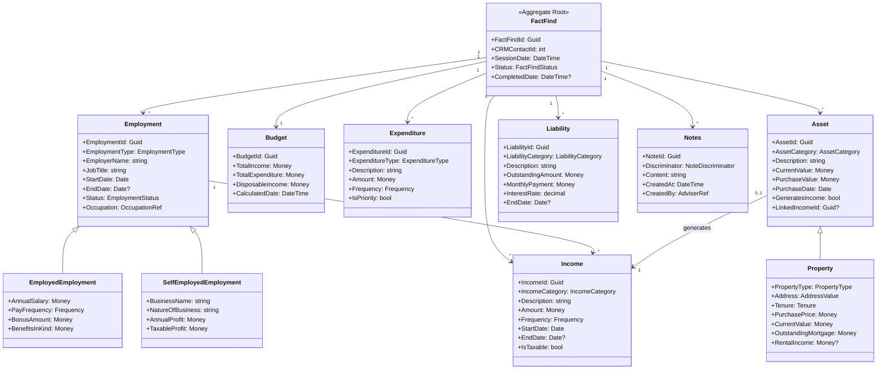
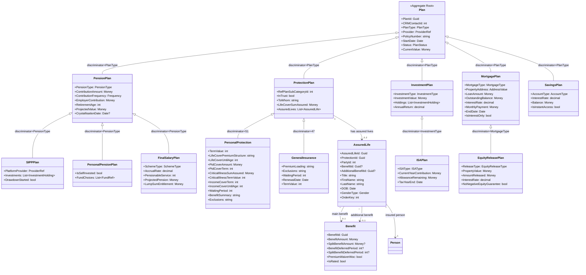
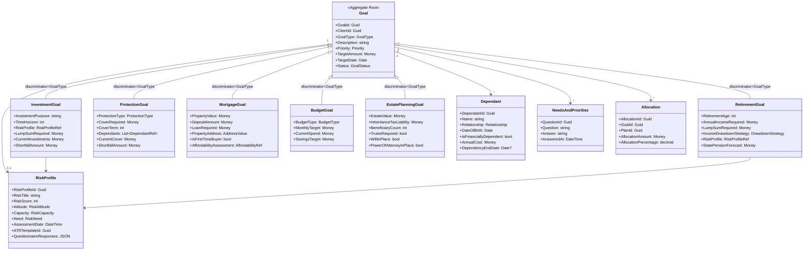
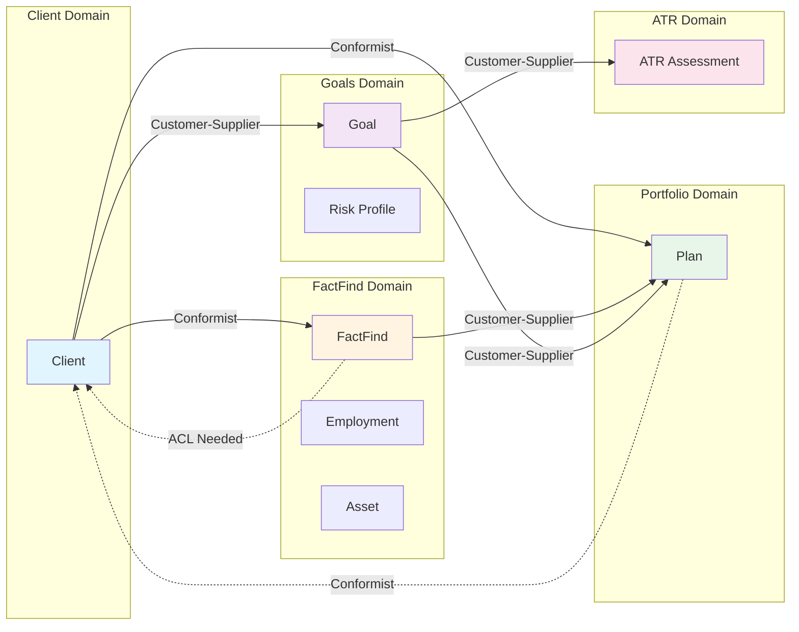

# Complete FactFind Domain Model

**Document Purpose:** This document serves as the authoritative reference for FactFind domain modeling. It consolidates the comprehensive domain model content with visual Mermaid diagrams, providing the complete domain architecture in a single, cohesive resource.

**Document Version:** 3.0 - Consolidated with Diagrams
**Analysis Date:** 2026-02-10 (Original), 2026-02-12 (V4 Update), 2026-02-13 (Consolidation)
**Sources Synthesized:**
- API Domain Analysis (24+ controllers in FactFind, 9+ in Portfolio, Requirements microservice)
- Database Schema Analysis (37+ tables in FactFind, Portfolio schema, Requirements schema)
- Code Structure Analysis (237+ domain entities from IntelligentOffice context)
- V4 Coverage Correction Analysis (4 parallel deep-dive analyses)

**Related Documents:**
- Complete-Domain-Analysis.md - Analysis findings and recommendations
- Complete-ERD.md - Complete Entity Relationship Diagrams
- API-Domain-Analysis.md - Complete API analysis
- API-Architecture-Patterns.md - Reference guide
- Client-FactFind-Boundary-Analysis.md - Architectural decision

---

## V4 COVERAGE CORRECTION ALERT

**CRITICAL UPDATE (2026-02-12):** The V4 coverage correction revealed extensive API coverage in **Portfolio domain** and **Requirements microservice** that dramatically changes the domain model understanding.

### V4 Domain Model Impact

| Domain Context | V3 Model | V4 Corrected Model | Key Changes |
|----------------|----------|-------------------|-------------|
| **Portfolio Plans** | Not included | **NEW BOUNDED CONTEXT** | 9 controllers, 1,773 plan types, polymorphic hierarchy |
| **Requirements/Goals** | Partial coverage | **Enhanced with microservice** | Separate microservice, event-driven, risk profile embedded |
| **Notes Management** | Scattered tables | **Unified API abstraction** | Single discriminator API, 10 note types |
| **Client Goals** | v1 only | **Modern microservice** | Separate DB, EF Core, domain events |

### New Bounded Contexts Discovered

**Portfolio Plans Context (NEW):**
- **Responsibility:** Product holdings, plan management, portfolio tracking
- **Aggregate Roots:** PensionPlan, ProtectionPlan, InvestmentPlan, SavingsAccount, Mortgage, Loan, CreditCard, CurrentAccount
- **Database:** Portfolio schema (TPolicyBusiness + extensions)
- **API:** 9 REST controllers with full CRUD
- **Pattern:** Polymorphic discriminator (1,773 plan types)
- **Integration:** Links to Goals, Properties, Income, Expenditure

**Requirements Context (ENHANCED - Microservice):**
- **Responsibility:** Client objectives, requirements capture, risk profiling
- **Architecture:** Separate microservice with dedicated database
- **Technology:** Entity Framework Core (not Hibernate), event-driven
- **Aggregate Roots:** Objective (polymorphic: 7 types)
- **Owned Entities:** RiskProfile (embedded)
- **API:** v2 REST with filtering, events published
- **Pattern:** Gold standard DDD microservice

**V4 Coverage Statistics:**
- API Controllers: 24 → **33+** (FactFind 24, Portfolio 9+, Requirements)
- Bounded Contexts: 6 → **8** (added Portfolio Plans, enhanced Requirements)
- API Coverage: 42% → **81%** (+39 percentage points)
- Database Schemas: 2 → **4** (FactFind, CRM, Portfolio, Requirements)

**See:** `steering/COVERAGE-CORRECTION-V4-ANALYSIS.md` for complete details.

---

## Domain Model Diagrams

This section provides visual representations of the domain models, bounded contexts, and integration patterns across the FactFind system.

### 1. High-Level Bounded Context Map

```mermaid
graph TB
    subgraph "Client Domain (CRM)"
        Client[Client Aggregate]
        Person[Person]
        Corporate[Corporate]
        Trust[Trust]
        Address[Address]
        Contact[Contact Detail]
        Vuln[Vulnerability]
        Marketing[Marketing Prefs]
        IDVerif[ID Verification]

        Client --> Person
        Client --> Corporate
        Client --> Trust
        Client --> Address
        Client --> Contact
        Client --> Vuln
        Client --> Marketing
        Client --> IDVerif
    end

    subgraph "FactFind Domain"
        FactFind[FactFind Session]
        Employment[Employment]
        Income[Income]
        Budget[Budget]
        Expenditure[Expenditure]
        Asset[Asset]
        Liability[Liability]
        Notes[Notes]

        FactFind --> Employment
        FactFind --> Income
        FactFind --> Budget
        FactFind --> Expenditure
        FactFind --> Asset
        FactFind --> Liability
        FactFind --> Notes
    end

    subgraph "Portfolio Domain"
        Plan[Plan Aggregate]
        Pension[Pension Plan]
        Protection[Protection Plan]
        Investment[Investment Plan]
        Mortgage[Mortgage Plan]
        Savings[Savings Plan]

        Plan --> Pension
        Plan --> Protection
        Plan --> Investment
        Plan --> Mortgage
        Plan --> Savings
    end

    subgraph "Goals Domain (Requirements)"
        Goal[Goal Aggregate]
        InvestGoal[Investment Goal]
        RetireGoal[Retirement Goal]
        ProtectGoal[Protection Goal]
        MortgageGoal[Mortgage Goal]
        RiskProfile[Risk Profile]
        Dependant[Dependant]

        Goal --> InvestGoal
        Goal --> RetireGoal
        Goal --> ProtectGoal
        Goal --> MortgageGoal
        Goal --> RiskProfile
        Goal --> Dependant
    end

    subgraph "ATR Domain"
        ATR[ATR Assessment]
        Questionnaire[Questionnaire]
        RiskScore[Risk Score]
    end

    Client -.->|CRMContactId| FactFind
    Client -.->|CRMContactId| Plan
    Client -.->|ClientId| Goal
    FactFind -.->|References| Plan
    Goal -.->|RiskProfile| ATR
    Goal -.->|Allocations| Plan

    style Client fill:#e1f5ff
    style FactFind fill:#fff4e1
    style Plan fill:#e8f5e9
    style Goal fill:#f3e5f5
    style ATR fill:#fce4ec
```



### 2. Client Profile Domain Model (CRM Bounded Context)

```mermaid
classDiagram
    class Client {
        <<Aggregate Root>>
        +ClientId: Guid
        +ClientType: ClientType
        +Status: ClientStatus
        +CreatedAt: DateTime
        +UpdatedAt: DateTime
    }

    class Person {
        +Title: string
        +FirstName: string
        +MiddleNames: string
        +LastName: string
        +DateOfBirth: Date
        +Gender: Gender
        +MaritalStatus: MaritalStatus
        +NationalInsuranceNumber: string
        +Nationality: CountryRef
        +Residency: TerritorialProfile
        +HealthProfile: HealthProfile
    }

    class Corporate {
        +CompanyName: string
        +TradingName: string
        +RegistrationNumber: string
        +IncorporationDate: Date
        +CompanyType: CompanyType
        +VATNumber: string
    }

    class Trust {
        +TrustName: string
        +TrustType: TrustType
        +SettlementDate: Date
        +Trustees: List~Person~
    }

    class Address {
        +AddressId: Guid
        +AddressType: AddressType
        +Line1: string
        +Line2: string
        +Town: string
        +County: string
        +Postcode: string
        +Country: CountryRef
        +IsPrimary: bool
        +FromDate: Date
        +ToDate: Date?
    }

    class ContactDetail {
        +ContactDetailId: Guid
        +ContactType: ContactType
        +Value: string
        +IsPrimary: bool
        +IsDefault: bool
        +VerificationStatus: VerificationStatus
    }

    class Vulnerability {
        +VulnerabilityId: Guid
        +AssessmentDate: DateTime
        +Categories: List~VulnerabilityCategory~
        +IsVulnerable: bool
        +ReviewDate: Date
        +Notes: string
    }

    class MarketingPreferences {
        +ConsentEmail: bool
        +ConsentPhone: bool
        +ConsentSMS: bool
        +ConsentMail: bool
        +ConsentThirdParty: bool
        +LastUpdated: DateTime
    }

    class IdentityVerification {
        +VerificationId: Guid
        +DocumentType: DocumentType
        +DocumentNumber: string
        +IssueDate: Date
        +ExpiryDate: Date
        +VerificationStatus: VerificationStatus
        +VerifiedAt: DateTime
        +VerifiedBy: AdviserRef
    }

    Client <|-- Person
    Client <|-- Corporate
    Client <|-- Trust
    Client "1" --> "*" Address
    Client "1" --> "*" ContactDetail
    Client "1" --> "0..1" Vulnerability
    Client "1" --> "1" MarketingPreferences
    Client "1" --> "*" IdentityVerification
```



### 3. FactFind Core Domain Model



### 4. Portfolio Plans Domain Model (Polymorphic Discriminator Pattern)

**CORRECTED February 12, 2026:** Protection Plans structure updated to reflect actual PolicyManagement schema.



### 5. Goals & Risk Domain Model (Requirements Microservice)



### 6. Context Map - Integration Patterns



### Integration Pattern Legend

- **Conformist** (Solid line): Downstream context conforms to upstream's model (e.g., FactFind uses CRM's client model)
- **Customer-Supplier** (Solid line): Upstream provides service to downstream (e.g., Goals consume Plans)
- **Anti-Corruption Layer (ACL)** (Dashed line): Translation layer needed to protect domain (e.g., FactFind should have ACL for CRM)

### Domain Model Statistics

| Domain | Aggregates | Entities | Value Objects | Events |
|--------|-----------|----------|---------------|--------|
| Client (CRM) | 1 | 8 | 15+ | 8 |
| FactFind Core | 1 | 10 | 20+ | 12 |
| Portfolio Plans | 1 | 19+ (1,773 types) | 10+ | 10 |
| Goals & Risk | 2 | 8 | 12+ | 8 |
| ATR | 1 | 3 | 5+ | 3 |
| **Total** | **6** | **48+** | **62+** | **41** |

---

## Executive Summary

### Key Findings (V4 Corrected)

**Domain Complexity:**
- 37+ database tables in FactFind
- 33+ API controllers across 3 monoliths + 1 microservice
- 270+ domain entities across codebase
- **8 proposed bounded contexts** (V4 corrected from 6)
- **1,773 plan types** in Portfolio domain

**Positive Findings (V4):**
- **EXCELLENT**: 81% API coverage with comprehensive portfolio and requirements coverage
- **POSITIVE**: Portfolio Plans API demonstrates gold standard polymorphic discriminator pattern
- **POSITIVE**: Requirements microservice shows modern DDD architecture
- **POSITIVE**: Unified Notes API resolves scattered notes technical debt

**Critical Issues:**
- **CRITICAL**: Tight CRM coupling blocks independent deployment
- **HIGH**: Dual API versions (v1/v2) create maintenance burden
- **HIGH**: Missing foreign key constraints risk data integrity
- **MEDIUM**: String-based enumerations lack validation
- **MEDIUM**: Inconsistent data types (INT vs BIGINT for Client IDs)

**Architectural Patterns Identified (V4 Enhanced):**
- **Polymorphic Discriminator Pattern** (Portfolio Plans API - 1,773 types)
- **Unified Discriminator Routing** (Notes API - 10 types)
- **Microservice DDD** (Requirements - separate DB, events, EF Core)
- **Cross-Schema Integration** (CRM ↔ FactFind ↔ Portfolio)
- Multi-tenancy via TenantId (IndigoClientId)
- Joint client support (dual ownership model)
- Optimistic concurrency (ConcurrencyId, Checksum, Version)
- Polymorphic employment status (table-per-hierarchy)
- Aggregate pattern (Expenditure with nested Expenses)
- Event-driven integration (v2 event publishing)

---

## 1. Unified Bounded Context Recommendations

After analyzing proposals from API (6 contexts), Database (6 contexts), code structure patterns, and V4 coverage corrections, the consolidated recommendation is **8 bounded contexts** with clear boundaries and integration patterns.

### 1.1 Context Comparison Table (V4 Updated)

| Context Name | API Proposal | Database Proposal | V4 Discovery | Reconciliation Status |
|--------------|--------------|-------------------|--------------|----------------------|
| **Client Financial Profile** | Yes (Employment, Income, Expenditure) | Yes (Employment + Cashflow contexts) | Confirmed | **MERGED** - Combine into single context |
| **Client Household** | Yes (Dependants) | Yes (Dependants) | Confirmed | **AGREED** - Exact match |
| **Client Goals** | Yes (Goals, Planning) | Yes (Goals) | **Enhanced** | **MICROSERVICE** - Separate Requirements microservice |
| **Client Obligations** | Yes (Liabilities) | Yes (Liabilities) | Confirmed | **AGREED** - Exact match |
| **Regulatory Compliance** | Yes (Disclosures, Declarations) | Yes (Interview & Compliance) | Confirmed | **REFINED** - Focus on compliance only |
| **Reference Data** | Yes (scattered endpoints) | Yes (Reference tables) | Confirmed | **AGREED** - Needs unification |
| **Portfolio Plans** | **NEW** | **NEW** | **V4 Discovery** | **NEW CONTEXT** - 9 controllers, 1,773 plan types |
| **Notes Management** | Partial | Partial | **V4 Discovery** | **UNIFIED** - Single API abstracts 10 tables |

### 1.2 Consolidated Bounded Context Definitions

#### Context 1: Client Financial Profile

**Responsibility:** Comprehensive financial situation capture - employment, income, expenditure, and budget management.

**Why Merged:** API and database analyses proposed separating Employment and Cashflow contexts, but analysis reveals tight coupling:
- Income entities link directly to Employment via FK
- Income category validation depends on employment type
- Employment income calculations aggregate from Income entities
- Splitting creates excessive cross-context queries

**Aggregate Roots:**
- Employment (with nested Income collection)
- Expenditure (with nested Expense collection)
- Budget (versioned entity)

**Core Entities:**
- Employment, EmploymentStatus (polymorphic)
- Income
- Expenditure, Expense
- Budget
- EmploymentHistory

**Database Tables:**
- TEmploymentDetail (Employment + EmploymentStatus)
- TDetailedIncomeBreakdown
- TExpenditure
- TExpenditureDetail
- TBudget
- TEmploymentHistoryItem
- TRefExpenditureType, TRefExpenditureGroup

**API Endpoints:**
- v1: `/clients/{clientId}/employments`, `/clients/{clientId}/incomes`, `/clients/{clientId}/expenditure`, `/clients/{clientId}/budgets`
- v2: `/clients/{clientId}/employments`, `/clients/{clientId}/incomes`, `/clients/{clientId}/expenditures`

**Ubiquitous Language:**
- Employment Status: Salaried, Profit-Based, Not Employed
- Income Frequency: Weekly, Fortnightly, Monthly, Quarterly, Annually
- Affordability: Include/exclude income in calculations
- Gross/Net amounts
- Basic, Guaranteed, Regular (income components)
- Detailed vs Summary expenditure
- Budget categories

**Integration Points:**
- **CRM Context** (upstream): Client identity via ClientId
- **Planning Context** (downstream): Income from withdrawals, Expenditure for contributions

**Transaction Boundaries:**
- Employment + linked Incomes (aggregate consistency)
- Expenditure + all Expenses (calculated total)
- Budget (individual entity, versioned)

---

#### Context 2: Client Household

**Responsibility:** Family structure, dependants, and financial dependency tracking.

**Aggregate Roots:**
- Dependant (individual aggregate per dependant)

**Core Entities:**
- Dependant

**Database Tables:**
- TDependants

**API Endpoints:**
- v1: `/clients/{clientId}/dependants`
- v2: `/clients/{clientId}/dependants`

**Ubiquitous Language:**
- Financially dependant
- Living with client
- Dependency duration: Permanent, Temporary, Until age/date
- Relationship types: Child, Spouse, Partner, Parent, Other

**Integration Points:**
- **CRM Context** (upstream): Client identity
- **Goals Context** (read-only): Estate planning scenarios

**Transaction Boundaries:**
- Single Dependant entity (independent lifecycle)

---

#### Context 3: Client Goals and Planning

**Responsibility:** Financial objectives, goal tracking, and planning aspirations.

**Aggregate Roots:**
- Goal (individual aggregate per goal)

**Core Entities:**
- Goal

**Database Tables:**
- TObjective
- TAtrInvestmentGeneral, TAtrRetirementGeneral (ATR - Assessed Tolerance to Risk)

**API Endpoints:**
- v1: `/clients/{clientId}/goals`, `/clients/{clientId}/adviceareas`

**Ubiquitous Language:**
- Product areas: Protection, Retirement, Investment
- Goal types: Growth with target, Growth without target, Income
- Target amount, Target date
- Risk profile, Risk discrepancy
- Mark as completed
- Link to plan
- Advice areas covered

**Integration Points:**
- **Planning Context** (downstream): Link goals to plans via PlanId
- **Product Context** (downstream): Product area references
- **Risk Context** (downstream): Risk profile adjustments

**Transaction Boundaries:**
- Single Goal entity (independent lifecycle)
- Goal completion (atomic state change)
- Plan linkage (eventually consistent)

---

#### Context 4: Client Obligations

**Responsibility:** Debts, liabilities, obligations, protection analysis, and repayment planning.

**Aggregate Roots:**
- Liability (individual aggregate per liability)

**Core Entities:**
- Liability

**Database Tables:**
- TLiabilities

**API Endpoints:**
- v1: `/clients/{clientId}/liabilities`

**Ubiquitous Language:**
- Liability categories: Car Loan, Credit Cards, Mortgages, Personal Loans, Student Loans
- Repayment methods: Interest Only, Repayment
- Protection types: Life Only, ASU, CIC, Death benefits
- Outstanding amount, Monthly payment
- Consolidation, Early redemption
- Guarantor mortgage

**Integration Points:**
- **Planning Context** (downstream): Link to plans for repayment tracking
- **Protection Context** (downstream): Protection product recommendations
- **Financial Profile Context** (read): Import liabilities to expenditure

**Transaction Boundaries:**
- Single Liability entity (independent lifecycle)

---

#### Context 5: Regulatory Compliance

**Responsibility:** Regulatory disclosures, declarations, terms of business, and compliance documentation.

**Aggregate Roots:**
- Declaration (one per fact-find)
- Disclosure (multiple per client)

**Core Entities:**
- Declaration
- Disclosure
- DisclosureType (reference)
- AdviceAreas

**Database Tables:**
- TDeclaration
- TDocumentDisclosure
- TRefDocumentDisclosureType
- TAdviceareas (moved from Interview context)

**API Endpoints:**
- v1: `/clients/{clientId}/factfinds/{factfindId}/disclosures`, `/clients/{clientId}/factfinds/{factfindId}/declaration`
- v2: `/clients/{clientId}/disclosures`, `/disclosures/documentTypes`

**Ubiquitous Language:**
- Terms of Business (ToB)
- Cost key facts, Services key facts
- Disclosure document types
- Issue date
- Declaration date, ID checked date
- Advice areas: Protection, Retirement, Investment, Estate

**Integration Points:**
- **CRM Context** (upstream): Client identity
- **Task/Workflow Context** (upstream): Task association
- **Document Context** (downstream): Document storage

**Transaction Boundaries:**
- Declaration (immutable after completion)
- Disclosure issuance (atomic event)

**Compliance Characteristics:**
- Audit trail required (CreatedOn, UpdatedOn, User tracking)
- Immutability after signing
- Regulatory retention requirements

---

#### Context 6: Reference Data Management

**Responsibility:** Lookup data, categorizations, enumerations, and firm-wide configuration.

**Aggregate Roots:**
- ReferenceData (generic)
- ExpenditureType, ExpenditureGroup
- DisclosureType
- RefInterviewType

**Core Entities:**
- ReferenceData
- ExpenditureType, ExpenditureGroup
- DisclosureType
- RefInterviewType

**Database Tables:**
- TRefData
- TRefExpenditureType, TRefExpenditureGroup
- TRefDocumentDisclosureType
- TRefInterviewType
- TRefData2ExpenditureType (junction)

**API Endpoints:**
- v2: `/incomes/refdata/{type}`, `/expenditures/refdata/categorygroups`, `/expenditures/refdata/categories`, `/disclosures/documentTypes`

**Ubiquitous Language:**
- Income categories
- Expenditure categories and groups
- Document types
- Interview types
- Region codes (for regional customization)
- Archived (soft delete)

**Integration Points:**
- **All Contexts** (provider): Read-only reference data

**Transaction Boundaries:**
- Individual reference data items
- Tenant-specific customizations

**Characteristics:**
- Multi-tenant support (TenantId)
- Soft delete (Archived flag)
- Ordinal-based ordering
- Regional variations (RegionCode)
- Aggressive caching suitable

---

#### Context 7: Portfolio Plans (NEW - V4)

**Responsibility:** Product holdings, plan management, portfolio tracking.

**Aggregate Roots:**
- Plan (polymorphic root with 1,773 plan types)

**Core Entities:**
- PensionPlan, ProtectionPlan, InvestmentPlan, SavingsAccount, Mortgage, Loan, CreditCard, CurrentAccount
- AssuredLife, Benefit (for Protection)
- InvestmentHolding (for Investments)

**Database Tables:**
- TPolicyBusiness (polymorphic root)
- TPolicyDetail, TPlanDescription, TPolicyOwner
- TPension, TProtection, TInvestment, TMortgage, TSavings
- TAssuredLife, TBenefit
- TInvestmentHolding

**API Endpoints:**
- v1: `/clients/{clientId}/plans/pensions`, `/clients/{clientId}/plans/protection`, `/clients/{clientId}/plans/investments`, etc.

**Ubiquitous Language:**
- Plan types: Pension, Protection, Investment, Mortgage, Savings
- Discriminator pattern (1,773 types)
- Plan status: Active, Matured, Surrendered
- Policy number, Provider
- Current value, Projected value
- Contributions, Withdrawals

**Integration Points:**
- **Goals Context** (upstream): Allocations from goals to plans
- **Financial Profile Context** (downstream): Income from withdrawals, Contributions to expenditure
- **CRM Context** (upstream): Client identity

**Transaction Boundaries:**
- Plan + PolicyDetail + Type-specific extension (aggregate)
- Assured lives and benefits (sub-aggregates)

---

#### Context 8: Notes Management (UNIFIED - V4)

**Responsibility:** Unified notes API abstracting 10 scattered note types.

**Aggregate Roots:**
- Note (discriminator-based)

**Core Entities:**
- Note (with 10 discriminator types)

**Database Tables:**
- TProfileNotes, TEmploymentNote, TProtectionMiscellaneous, TRetirementNextSteps, etc. (10 tables)

**API Endpoints:**
- v2: `/clients/{clientId}/notes?discriminator={type}`

**Discriminator Types:**
- Profile, Employment, AssetLiabilities, Budget, Mortgage, Protection, Retirement, Investment, EstatePlanning, Summary

**Integration Points:**
- **All FactFind Contexts** (provider): Notes for each domain area

**Transaction Boundaries:**
- Single Note entity (independent lifecycle)

---

### 1.3 Context Integration Map

```
┌─────────────────────────────────────────────────────────────────┐
│                         CRM Context (External)                   │
│                    Client Identity (ClientId)                    │
└────────────────┬────────────────────────────────────────────────┘
                 │
                 ├──────────────────────────────────────────────┐
                 │                                              │
                 v                                              v
┌────────────────────────────┐              ┌──────────────────────────────┐
│  Client Financial Profile  │              │    Regulatory Compliance     │
│  - Employment              │              │    - Declaration             │
│  - Income                  │              │    - Disclosure              │
│  - Expenditure             │              │    - AdviceAreas            │
│  - Budget                  │              └──────────────────────────────┘
└────────────┬───────────────┘                             │
             │                                             │
             │                                             v
             │                                  ┌──────────────────┐
             │                                  │ Task/Workflow    │
             │                                  │ Context          │
             │                                  └──────────────────┘
             │
             ├──────────────┬──────────────────────────┐
             v              v                          v
┌──────────────────┐  ┌──────────────┐  ┌───────────────────────┐
│ Client Household │  │ Client Goals │  │  Client Obligations   │
│ - Dependant      │  │ - Goal       │  │  - Liability          │
└──────────────────┘  └──────┬───────┘  └──────┬────────────────┘
                             │                  │
                             └────────┬─────────┘
                                      v
                         ┌─────────────────────────┐
                         │   Portfolio Plans       │
                         │   (NEW - V4)            │
                         │   - Plans               │
                         │   - Withdrawals         │
                         │   - Contributions       │
                         └─────────────────────────┘
                                      ^
                                      │
                         ┌────────────┴───────────┐
                         │ Reference Data         │
                         │ Management             │
                         │ (Read-Only Provider)   │
                         └────────────────────────┘
```

**Integration Patterns:**

| From Context | To Context | Pattern | Mechanism |
|--------------|------------|---------|-----------|
| CRM | All FactFind Contexts | **Conformist** | Shared ClientId (needs ACL) |
| Financial Profile | Portfolio Plans | **Customer-Supplier** | PlanId references, event publishing |
| Goals | Portfolio Plans | **Customer-Supplier** | PlanId weak reference |
| Obligations | Portfolio Plans | **Customer-Supplier** | PlanId weak reference |
| Obligations | Financial Profile | **Application Service** | User-initiated import to expenditure |
| All Contexts | Reference Data | **Published Language** | Shared reference IDs |

---

## 2. Complete Entity Catalog with Cross-Layer Mappings

This section provides the definitive entity catalog mapping Code Entities → Database Tables → API Contracts across all three layers.

### 2.1 Core Entity Mapping Matrix

| Domain Entity (Code) | Database Table | API v1 Contract | API v2 Contract | Bounded Context |
|---------------------|----------------|-----------------|-----------------|-----------------|
| ClientFactFind | TFactFind | ClientFactFindDocument | N/A | Compliance |
| Employment | TEmploymentDetail | EmploymentStatusDocument | EmploymentDocument | Financial Profile |
| EmploymentStatus (base) | TEmploymentDetail | EmploymentStatusDocument | EmploymentDocument | Financial Profile |
| SalariedEmploymentStatus | TEmploymentDetail (TPH) | EmploymentStatusDocument | EmploymentDocument | Financial Profile |
| ProfitBasedEmploymentStatus | TEmploymentDetail (TPH) | EmploymentStatusDocument | EmploymentDocument | Financial Profile |
| NotEmployedEmploymentStatus | TEmploymentDetail (TPH) | EmploymentStatusDocument | EmploymentDocument | Financial Profile |
| Income | TDetailedIncomeBreakdown | IncomeDocument | IncomeDocument | Financial Profile |
| Expenditure | TExpenditure | ExpenditureDocument | ExpenditureDocument | Financial Profile |
| Expense | TExpenditureDetail | ExpenditureDocumentExpense | ExpenditureDocument (nested) | Financial Profile |
| Budget | TBudget | BudgetDocument | N/A | Financial Profile |
| Goal | TObjective | GoalDocument | N/A | Goals |
| Liability | TLiabilities | LiabilityDocument | N/A | Obligations |
| Dependant | TDependants | DependantDocument | DependantDocument | Household |
| Declaration | TDeclaration | DeclarationDocument | N/A | Compliance |
| Disclosure | TDocumentDisclosure | DisclosureDocument | DisclosureDocument | Compliance |
| AdviceAreas | TAdviceareas | AdviceAreasDocument | N/A | Compliance |
| ExpenditureType | TRefExpenditureType | (embedded) | ReferenceDataDocument | Reference Data |
| ExpenditureGroup | TRefExpenditureGroup | (embedded) | ReferenceDataDocument | Reference Data |
| DisclosureType | TRefDocumentDisclosureType | (embedded) | ReferenceDataDocument | Reference Data |

---

## 3. Cross-Cutting Concerns Analysis

### 3.1 Multi-Tenancy

**Implementation Pattern:**

| Table | Tenant Column | Data Type | Immutable | Notes |
|-------|--------------|-----------|-----------|-------|
| TFactFind | IndigoClientId | INT | Yes | Constructor-only |
| TBudget | TenantId | INT | Yes | Constructor-only |
| TRefData | TenantId | INT | Yes (optional) | Tenant-specific reference data |

**Inconsistencies:**
- TFactFind uses IndigoClientId
- TBudget uses TenantId
- Other tables don't have tenant column (rely on ClientId → CRM → Tenant)

**API Layer:**
- Multi-tenancy via authentication/authorization
- Tenant ID derived from JWT token
- Not exposed in API contracts
- Filter applied at data access layer

**Recommendation:**
1. Standardize on TenantId naming
2. Add TenantId to all root aggregates
3. Enforce tenant isolation at database level (row-level security)
4. Add TenantId to all API responses for debugging

---

### 3.2 Audit Trail

**Current Implementation:**

| Entity | CreatedOn | CreatedBy | UpdatedOn | UpdatedBy | Pattern |
|--------|-----------|-----------|-----------|-----------|---------|
| Budget | Yes | Yes | Yes | Yes | **Full audit** |
| Income | No | No | LastUpdatedDate only | No | **Partial audit** |
| Employment | No | No | No | No | **No audit** |
| Goal | No | No | No | No | **No audit** |
| Liability | No | No | No | No | **No audit** |
| Dependant | No | No | No | No | **No audit** |
| Declaration | No | No | No | No | **No audit** (compliance entity!) |
| Disclosure | IssueDate only | No | No | No | **Minimal audit** |

**Issues:**
- Inconsistent audit implementation
- Compliance entities lack full audit trail
- Difficult to debug data changes
- Regulatory risk (financial services require audit)

**Recommendation:**
1. **Phase 1**: Add audit columns to compliance entities (Declaration, Disclosure)
2. **Phase 2**: Add audit columns to all transactional entities
3. **Phase 3**: Consider SQL Server temporal tables for full history
4. Use IntelliFlo.Platform.LegacyAuditing attributes (already in codebase)

---

### 3.3 Optimistic Concurrency Control

**Three Different Patterns Identified:**

#### Pattern 1: ConcurrencyId (Manual)

**Entities:** ClientFactFind, EmploymentStatus, Income, Dependant, Declaration

**Implementation:**
```xml
<version name="ConcurrencyId" column="ConcurrencyId" type="long" />
```

**Behavior:**
- Application increments on update
- Stale data detection via version mismatch
- Returns 409 Conflict on concurrent update

---

#### Pattern 2: Checksum (Computed)

**Entities:** Employment, Budget, All Notes entities

**Implementation:**
```sql
Checksum AS binary_checksum(*) PERSISTED
```

**Behavior:**
- Database auto-calculates on any column change
- Application reads Checksum, compares on update
- Non-deterministic (hash collisions possible)

**Issues:**
- Checksum collisions (rare but possible)
- Recomputed on every read (performance cost)
- Not compatible with all replication strategies

---

#### Pattern 3: Version (NHibernate)

**Entities:** Budget

**Implementation:**
```xml
<version name="ConcurrencyId" column="ConcurrencyId" type="long" />
```

**Behavior:**
- NHibernate automatically increments
- Framework-managed concurrency
- Best practice pattern

---

**Recommendation:**

1. **Standardize on NHibernate Version pattern** (Pattern 3)
2. Migrate from Checksum to Version:
   - Add ConcurrencyId BIGINT column
   - Initialize with 1
   - Update NHibernate mappings
   - Remove Checksum computed columns
3. Keep ConcurrencyId for entities already using it
4. API should return ETag header with concurrency token
5. API should accept If-Match header for updates

**API Pattern:**
```http
GET /v2/clients/123/employments/456
Response Headers:
  ETag: "12345"

PUT /v2/clients/123/employments/456
Request Headers:
  If-Match: "12345"
Response:
  200 OK (success)
  409 Conflict (concurrent modification)
  412 Precondition Failed (missing/invalid ETag)
```

---

## 4. Recommendations for API Contract Design

### 4.1 V3 API Design Principles

Based on consolidated analysis, V3 API should embody:

1. **Resource-Oriented Design**
   - RESTful resources aligned with aggregates
   - Hypermedia controls (HATEOAS Level 3)
   - Consistent naming conventions

2. **Bounded Context Alignment**
   - Endpoints grouped by domain context
   - `/factfind/financial/*`
   - `/factfind/household/*`
   - `/factfind/goals/*`
   - `/factfind/obligations/*`
   - `/factfind/compliance/*`

3. **Separation of Concerns**
   - No embedding of child collections (use links)
   - Employment → Incomes (link, not embed)
   - Expenditure → Expenses (link, not embed)

4. **Consistent Patterns**
   - Standard pagination: cursor-based
   - Standard filtering: OData query syntax
   - Standard sorting: `?orderBy=field asc|desc`
   - Standard expansion: `?expand=incomes,address`

5. **Versioning Strategy**
   - Route-based: `/v3/factfind/*`
   - No header-based sub-versioning
   - Deprecation timeline: 12 months

6. **Error Handling**
   - RFC 7807 Problem Details
   - Consistent error codes
   - Actionable error messages

7. **Concurrency**
   - ETags for all mutable resources
   - If-Match required for updates
   - 409 Conflict on version mismatch

8. **Security**
   - Granular scopes per context
   - OAuth 2.0 / OpenID Connect
   - Resource-level authorization

---

## Appendix

### File Locations

**Analysis Source Documents:**
- API Analysis: `steering/Domain-Architecture/API-Domain-Analysis.md`
- Database Analysis: `Context/schema/FactFind-Database-Schema-Analysis.md`
- Coverage Analysis: `steering/Domain-Architecture/Domain-Model-Analysis-V3-Coverage-Update.md`

**Code Locations:**
- Monolith.FactFind: `Context/Monolith.FactFind/`
- Monolith.CRM: `Context/Monolith.Crm/`
- IntelligentOffice: `Context/IntelligentOffice/`

**NHibernate Mappings:**
- `Context/Monolith.FactFind/**/*.hbm.xml`

**API Controllers:**
- V1: `Context/Monolith.FactFind/src/Monolith.FactFind/v1/Controllers/`
- V2: `Context/Monolith.FactFind/src/Monolith.FactFind/v2/Controllers/`

---

**Document Status:** Complete (V4 Corrected with Diagrams)
**Document Version:** 3.0
**Last Updated:** 2026-02-13
**Next Review:** Upon Phase 1 completion
**Owner:** Architecture Team
**Approved By:** [Pending]

---

**End of Complete FactFind Domain Model**
