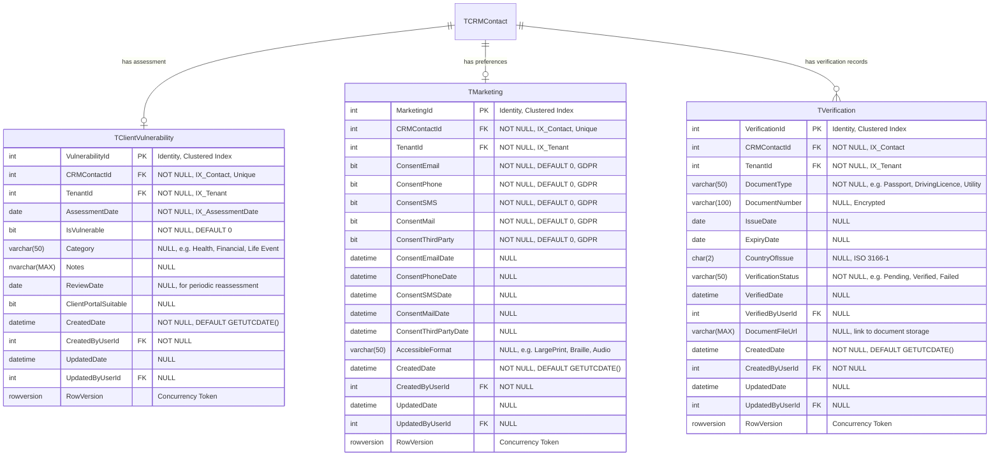

# Complete Entity Relationship Diagrams (ERD)

**Document Type:** Database Schema Design
**Author Role:** Senior Database Engineer
**Date:** February 12, 2026
**Version:** 1.0

---

## Document Purpose

This document provides comprehensive Entity Relationship Diagrams (ERDs) for all bounded contexts in the FactFind system, showing:
- Complete entity structures with all properties
- Data types and constraints
- Primary keys (PK) and Foreign keys (FK)
- Relationships with cardinality
- Indexes and constraints
- Nullable fields

---

## Table of Contents

1. [Client Domain (CRM) ERD](#1-client-domain-crm-erd)
2. [FactFind Core Domain ERD](#2-factfind-core-domain-erd)
3. [Portfolio Plans Domain ERD](#3-portfolio-plans-domain-erd)
4. [Goals & Requirements Domain ERD](#4-goals--requirements-domain-erd)
5. [ATR Domain ERD](#5-atr-domain-erd)
6. [Cross-Domain Integration ERD](#6-cross-domain-integration-erd)
7. [Database Design Decisions](#7-database-design-decisions)
8. [Indexing Strategy](#8-indexing-strategy)

---

## 1. Client Domain (CRM) ERD

### 1.1 Core Client Entities


### 1.2 Address & Contact Entities


### 1.3 Client Compliance & Preferences Entities



---

## 2. FactFind Core Domain ERD

### 2.1 FactFind Session & Employment


### 2.2 Income & Budget Entities


### 2.3 Assets & Liabilities Entities


### 2.4 Notes Entity (Unified Pattern)


**Discriminator Values:**
- `Profile` - General client profile notes
- `Employment` - Employment-related notes
- `AssetLiabilities` - Assets and liabilities notes
- `Budget` - Budget and affordability notes
- `Mortgage` - Mortgage-specific notes
- `Protection` - Protection needs notes
- `Retirement` - Retirement planning notes
- `Investment` - Investment notes
- `EstatePlanning` - Estate planning notes
- `Summary` - FactFind summary notes

---

## 3. Portfolio Plans Domain ERD

### 3.1 Base Plan Entity (Polymorphic Root)

**Hierarchy:** TPolicyBusiness → TPolicyDetail → TPlanDescription → TRefPlanType2ProdSubType


### 3.2 Pension Plan Extensions


### 3.3 Protection Plan Extensions

**Note:** Protection uses Class Table Inheritance with `RefPlanSubCategoryId` as discriminator (51=PersonalProtection, 47=GeneralInsurance, 55=PaymentProtection).

**Key Relationship:** TProtection → TAssuredLife (0-2 lives) → TBenefit (main + additional per life)

```mermaid
erDiagram
    TPolicyBusiness ||--o| TProtection : "extension"
    TProtection ||--o| PersonalProtection : "discriminator=51"
    TProtection ||--o| GeneralInsurance : "discriminator=47"
    TProtection ||--o{ TAssuredLife : "0 to 2 assured lives"
    TAssuredLife }o--|| TCRMContact : "insured person"
    TAssuredLife }o--o| TBenefit : "main benefit"
    TAssuredLife }o--o| TBenefit : "additional benefit"

    TProtection {
        bigint ProtectionId PK "Identity, Clustered Index"
        bigint PolicyBusinessId FK "NOT NULL, Unique, IX_Policy"
        int TenantId FK "NOT NULL, IX_Tenant"
        int RefPlanSubCategoryId FK "NOT NULL, DISCRIMINATOR, IX_SubCategory"
        bit InTrust "NOT NULL, DEFAULT 0"
        varchar(200) ToWhom "NULL, beneficiary details"
        decimal(18_2) LifeCoverSumAssured "NULL"
        bigint ConcurrencyId "Concurrency Token"
    }

    PersonalProtection {
        bigint ProtectionId PK_FK "Extends TProtection, discriminator=51"
        int TermValue "NULL, term in years"
        varchar(25) LifeCoverPremiumStructure "NULL"
        int LifeCoverUntilAge "NULL"
        int PtdCoverTerm "NULL, Permanent Total Disability"
        varchar(25) PtdCoverPremiumStructure "NULL"
        int PtdCoverUntilAge "NULL"
        decimal(18_2) PtdCoverAmount "NULL"
        int SeverityCoverTerm "NULL"
        varchar(25) SeverityCoverPremiumStructure "NULL"
        int SeverityCoverUntilAge "NULL"
        decimal(18_2) SeverityCoverAmount "NULL"
        int CriticalIllnessTermValue "NULL"
        float PercentOfPremiumToInvest "NULL, Whole of Life"
        decimal(18_2) LifeCoverSumAssured "NULL"
        decimal(18_2) CriticalIllnessSumAssured "NULL"
        datetime ReviewDate "NULL"
        varchar(5000) BenefitSummary "NULL"
        varchar(2500) Exclusions "NULL"
        varchar(25) ProtectionPayoutType "NULL"
        varchar(25) IncomePremiumStructure "NULL"
        varchar(25) CriticalIllnessPremiumStructure "NULL"
        varchar(25) ExpensePremiumStructure "NULL"
        varchar(50) PremiumLoading "NULL"
        int CriticalIllnessUntilAge "NULL"
        int WaitingPeriod "NULL, deferred period"
        int IncomeCoverTerm "NULL"
        int IncomeCoverUntilAge "NULL"
        int ExpenseCoverTerm "NULL"
        int ExpenseCoverUntilAge "NULL"
        int TermTypeId FK "NULL, RefTermType"
        int IndexTypeId FK "NULL, RefIndexType"
        int PaymentBasisId FK "NULL, RefPaymentBasis"
    }

    GeneralInsurance {
        bigint ProtectionId PK_FK "Extends TProtection, discriminator=47"
        varchar(50) PremiumLoading "NULL"
        varchar(2500) Exclusions "NULL"
        int WaitingPeriod "NULL"
        datetime RenewalDate "NULL"
        int TermValue "NULL, term in years"
    }

    TAssuredLife {
        bigint AssuredLifeId PK "Identity, Clustered Index"
        bigint ProtectionId FK "NOT NULL, IX_Protection"
        int PartyId FK "NOT NULL, IX_Party, links to CRM..TCRMContact"
        bigint BenefitId FK "NULL, IX_Benefit, main benefit"
        bigint AdditionalBenefitId FK "NULL, IX_AdditionalBenefit"
        int TenantId FK "NOT NULL, IX_Tenant"
        varchar(50) Title "NULL"
        varchar(100) FirstName "NULL"
        varchar(100) LastName "NULL"
        datetime DOB "NULL, Date of Birth"
        varchar(10) GenderType "NULL"
        int OrderKey "NULL, 1 or 2 for life assured ordering"
        bigint ConcurrencyId "Concurrency Token"
    }

    TBenefit {
        bigint BenefitId PK "Identity, Clustered Index"
        bigint PolicyBusinessId FK "NOT NULL, IX_Policy"
        int TenantId FK "NOT NULL, IX_Tenant"
        decimal(18_2) BenefitAmount "NULL"
        decimal(18_2) SplitBenefitAmount "NULL"
        bit PremiumWaiverWoc "NULL, Waiver on Critical Illness"
        int BenefitDeferredPeriod "NULL"
        int SplitBenefitDeferredPeriod "NULL"
        int DeferredPeriodIntervalId FK "NULL, RefPeriodType"
        int SplitDeferredPeriodIntervalId FK "NULL, RefPeriodType"
        bit IsRated "NULL, rated due to health"
        varchar(500) BenefitOptions "NULL"
        int RefTotalPermanentDisabilityTypeId FK "NULL"
        int RefFrequencyId FK "NULL"
        int RefSplitFrequencyId FK "NULL"
        int RefBenefitPeriodId FK "NULL"
        int RefQualificationPeriodId FK "NULL"
        int RefPeriodTypeId FK "NULL"
        decimal(18_2) PensionCommencementLumpSum "NULL"
        bit IsSpousesBenefit "NULL"
        decimal(5_2) SpousesOrDependentsPercentage "NULL"
        int GuaranteedPeriod "NULL"
        bit IsProportion "NULL"
        bigint PCLSPaidById "NULL"
        bit IsCapitalValueProtected "NULL"
        decimal(18_2) CapitalValueProtectedAmount "NULL"
        decimal(18_2) GADMaximumIncomeLimit "NULL"
        datetime GADCalculationDate "NULL"
        decimal(18_2) GuaranteedMinimumIncome "NULL"
        decimal(18_2) LumpSumDeathBenefitAmount "NULL"
        bit IsOverlap "NULL"
        varchar(500) OtherBenefitPeriodText "NULL"
        bit IsPre75 "NULL"
        bit IsInheritedPension "NULL"
        int DeathAgeOfTransferor "NULL"
        bit IsProtectedPCLS "NULL"
        bigint ConcurrencyId "Concurrency Token"
    }
```

**Key Points:**

1. **Class Table Inheritance**: TProtection is abstract base, PersonalProtection and GeneralInsurance are subclasses
2. **Discriminator**: RefPlanSubCategoryId (51=PersonalProtection, 47=GeneralInsurance, 55=PaymentProtection)
3. **Assured Lives**: Protection policies can have 0, 1, or 2 assured lives
4. **Benefits per Life**: Each assured life can have 2 benefits (main + additional)
5. **Maximum Benefits**: A policy can have up to 4 benefits total (2 lives × 2 benefits each)
6. **SQL Pattern**: Queries use MIN/MAX aggregation to identify AssuredLife1 and AssuredLife2

### 3.4 Investment & Mortgage Plan Extensions


---

## 4. Goals & Requirements Domain ERD

### 4.1 Goal/Objective Entities


### 4.2 Risk Profile & Dependants


### 4.3 Needs & Priorities (Custom Questions)


---

## 5. ATR Domain ERD

### 5.1 ATR Assessment Entities


---

## 6. Cross-Domain Integration ERD

### 6.1 Integration Relationships


---

## 7. Database Design Decisions

### 7.1 Primary Key Strategy

| Domain | PK Type | Rationale |
|--------|---------|-----------|
| **CRM** | `int IDENTITY` | Legacy system, billions of records not expected, simple joins |
| **FactFind** | `int IDENTITY` | Transactional, high-volume, performance-critical |
| **Portfolio** | `bigint IDENTITY` | Very high volume (1000s plans per client over lifetime) |
| **Requirements** | `uniqueidentifier` (GUID) | Microservice, distributed system, merge capability |
| **ATR** | `uniqueidentifier` (GUID) | Microservice, independent scaling |

### 7.2 Discriminator Pattern Implementation

**Two approaches used:**

#### Type 1: Table-per-Hierarchy (TPH) - Portfolio
```sql
-- Single table with discriminator
CREATE TABLE TPolicyBusiness (
    PolicyBusinessId BIGINT IDENTITY PRIMARY KEY,
    RefPlanType2ProdSubTypeId INT NOT NULL, -- Discriminator FK
    -- Common fields for all plan types
    ...
);

-- Separate extension tables for type-specific fields
CREATE TABLE TPension (
    PensionId BIGINT IDENTITY PRIMARY KEY,
    PolicyBusinessId BIGINT NOT NULL UNIQUE REFERENCES TPolicyBusiness,
    -- Pension-specific fields
    ...
);
```

**Benefits:**
- Single point for common plan operations
- Efficient queries for all plans
- Type-specific extensions isolated

#### Type 2: Discriminator Column - Requirements
```sql
CREATE TABLE TRequirement (
    RequirementId UNIQUEIDENTIFIER PRIMARY KEY,
    RefRequirementTypeId INT NOT NULL, -- Discriminator FK
    -- Polymorphic fields (JSON or nullable columns)
    ...
);
```

**Benefits:**
- Simpler schema
- Single table queries
- Flexible type additions

### 7.3 Multi-Tenancy Strategy

**Row-Level Security Approach:**

```sql
-- Every table includes TenantId
TenantId INT NOT NULL

-- Filtered indexes for tenant isolation
CREATE NONCLUSTERED INDEX IX_Tenant_Active
ON TFactFind(TenantId, Status)
WHERE Status = 'Active';

-- Views with tenant filtering
CREATE VIEW vw_ActiveClients AS
SELECT * FROM TCRMContact
WHERE TenantId = SESSION_CONTEXT('TenantId')
AND IsDeleted = 0;
```

### 7.4 Soft Delete Pattern

**All entities use soft delete:**

```sql
bit IsDeleted NOT NULL DEFAULT 0

-- Filtered indexes exclude deleted
CREATE NONCLUSTERED INDEX IX_Contact_Active
ON TCRMContact(CRMContactId)
WHERE IsDeleted = 0;
```

### 7.5 Audit Trail Pattern

**All entities include audit fields:**

```sql
datetime CreatedDate NOT NULL DEFAULT GETUTCDATE(),
int CreatedByUserId FK NOT NULL,
datetime UpdatedDate NULL,
int UpdatedByUserId FK NULL,
rowversion RowVersion -- Optimistic concurrency
```

### 7.6 Currency Handling

**ISO 4217 standard:**

```sql
decimal(18,2) Amount NOT NULL,
char(3) Currency NOT NULL DEFAULT 'GBP', -- ISO 4217
CHECK (Currency IN ('GBP','EUR','USD',...))
```

### 7.7 Money Data Type

**Precision:**
- `decimal(18,2)` - Standard for money (max: 999,999,999,999,999.99)
- `decimal(5,2)` - Percentages (max: 999.99%)
- `decimal(10,7)` - Lat/Long coordinates

---

## 8. Indexing Strategy

### 8.1 Standard Index Pattern

**Every table minimum:**

```sql
-- Clustered index on PK
CREATE CLUSTERED INDEX PK_TableName ON TableName(PrimaryKeyId);

-- Tenant isolation
CREATE NONCLUSTERED INDEX IX_Tenant ON TableName(TenantId);

-- Foreign key indexes
CREATE NONCLUSTERED INDEX IX_ForeignKey ON TableName(ForeignKeyId);

-- Commonly filtered columns
CREATE NONCLUSTERED INDEX IX_Status ON TableName(Status) WHERE IsDeleted = 0;
```

### 8.2 Covering Indexes for Common Queries

**Example: Client lookup by postcode**

```sql
CREATE NONCLUSTERED INDEX IX_Address_Postcode_Covering
ON TAddress(Postcode)
INCLUDE (CRMContactId, AddressType, IsPrimary)
WHERE IsDeleted = 0;
```

### 8.3 Filtered Indexes for Active Records

```sql
-- Only index active, non-deleted records
CREATE NONCLUSTERED INDEX IX_ActivePolicies
ON TPolicyBusiness(CRMContactId, Status, StartDate)
WHERE Status = 'Active' AND IsDeleted = 0;
```

### 8.4 Temporal Indexes

**For date range queries:**

```sql
CREATE NONCLUSTERED INDEX IX_FactFind_DateRange
ON TFactFind(SessionDate, Status)
INCLUDE (CRMContactId, AdviserUserId);
```

---

## 9. Constraints & Validation

### 9.1 Check Constraints

```sql
-- Status enumeration
ALTER TABLE TFactFind
ADD CONSTRAINT CK_FactFind_Status
CHECK (Status IN ('InProgress','Completed','Archived'));

-- Positive amounts
ALTER TABLE TDetailedIncomeBreakdown
ADD CONSTRAINT CK_Income_PositiveAmount
CHECK (Amount > 0);

-- Date logic
ALTER TABLE TEmploymentDetail
ADD CONSTRAINT CK_Employment_DateLogic
CHECK (EndDate IS NULL OR EndDate >= StartDate);

-- Risk score range
ALTER TABLE TAtr
ADD CONSTRAINT CK_Atr_RiskScore
CHECK (RiskScore BETWEEN 1 AND 10);
```

### 9.2 Unique Constraints

```sql
-- One vulnerability assessment per client
ALTER TABLE TClientVulnerability
ADD CONSTRAINT UQ_Vulnerability_PerClient
UNIQUE (CRMContactId, TenantId);

-- Unique policy numbers per tenant
ALTER TABLE TPolicyBusiness
ADD CONSTRAINT UQ_PolicyNumber_PerTenant
UNIQUE (TenantId, ProviderRefId, PolicyNumber);
```

### 9.3 Foreign Key Constraints

**With cascade rules:**

```sql
-- Cascade delete dependants when requirement deleted
ALTER TABLE TDependant
ADD CONSTRAINT FK_Dependant_Requirement
FOREIGN KEY (RequirementId) REFERENCES TRequirement(RequirementId)
ON DELETE CASCADE;

-- Prevent deletion if allocations exist
ALTER TABLE TRequirementAllocation
ADD CONSTRAINT FK_Allocation_Requirement
FOREIGN KEY (RequirementId) REFERENCES TRequirement(RequirementId)
ON DELETE NO ACTION;
```

---

## 10. Performance Considerations

### 10.1 Partitioning Strategy

**Large tables candidates:**

```sql
-- Partition TFactFind by year
CREATE PARTITION FUNCTION PF_FactFindYear (datetime)
AS RANGE RIGHT FOR VALUES
    ('2020-01-01', '2021-01-01', '2022-01-01', ...);

CREATE PARTITION SCHEME PS_FactFindYear
AS PARTITION PF_FactFindYear
ALL TO ([PRIMARY]);

-- Apply to table
CREATE TABLE TFactFind (
    ...
    SessionDate datetime NOT NULL
) ON PS_FactFindYear(SessionDate);
```

### 10.2 Computed Columns

```sql
-- Persisted computed columns with index
ALTER TABLE TBudgetMiscellaneous
ADD MonthlyDisposableIncome AS (TotalMonthlyIncome - TotalMonthlyExpenditure) PERSISTED;

CREATE INDEX IX_DisposableIncome
ON TBudgetMiscellaneous(MonthlyDisposableIncome);

-- LTV calculation
ALTER TABLE TMortgage
ADD LTV AS (OutstandingBalance / NULLIF(PropertyValue, 0) * 100) PERSISTED;
```

### 10.3 Columnstore Indexes for Reporting

```sql
-- Read-only reporting replica
CREATE NONCLUSTERED COLUMNSTORE INDEX NCCI_FactFind_Reporting
ON TFactFind (SessionDate, Status, CRMContactId, TenantId);
```

---

## 11. Security Considerations

### 11.1 Encryption

**Sensitive fields encrypted:**

```sql
-- Always Encrypted for PII
NationalInsuranceNumber varchar(15) ENCRYPTED WITH (...),
DocumentNumber varchar(100) ENCRYPTED WITH (...),

-- TDE at database level
ALTER DATABASE FactFindDB SET ENCRYPTION ON;
```

### 11.2 Row-Level Security (RLS)

```sql
-- Security policy for multi-tenancy
CREATE FUNCTION dbo.fn_TenantAccessPredicate(@TenantId int)
RETURNS TABLE
WITH SCHEMABINDING
AS
RETURN SELECT 1 AS AccessResult
WHERE @TenantId = CAST(SESSION_CONTEXT(N'TenantId') AS int);

CREATE SECURITY POLICY TenantSecurityPolicy
ADD FILTER PREDICATE dbo.fn_TenantAccessPredicate(TenantId) ON dbo.TFactFind,
ADD BLOCK PREDICATE dbo.fn_TenantAccessPredicate(TenantId) ON dbo.TFactFind;
```

### 11.3 Dynamic Data Masking

```sql
-- Mask NI numbers from non-privileged users
ALTER TABLE TPerson
ALTER COLUMN NationalInsuranceNumber
ADD MASKED WITH (FUNCTION = 'partial(2,"XXXXX",0)');
-- Shows: AB-XX-XX-XX-CD
```

---

## 12. Change Data Capture (CDC)

### 12.1 CDC for Auditing

```sql
-- Enable CDC on critical tables
EXEC sys.sp_cdc_enable_table
    @source_schema = 'dbo',
    @source_name = 'TPolicyBusiness',
    @role_name = 'CDC_Reader';

-- Query changes
SELECT * FROM cdc.dbo_TPolicyBusiness_CT
WHERE __$operation = 2 -- Update
AND __$start_lsn > @last_sync_lsn;
```

---

## Summary Statistics

### Entity Count by Domain

| Domain | Tables | Columns (Avg) | Relationships |
|--------|--------|---------------|---------------|
| **Client (CRM)** | 10 | 18 | 14 |
| **FactFind Core** | 8 | 22 | 13 |
| **Portfolio Plans** | 13 | 28 | 24 |
| **Goals & Requirements** | 7 | 16 | 9 |
| **ATR** | 4 | 12 | 5 |
| **Total** | **42** | **~780** | **65** |

### Index Statistics

- **Clustered Indexes:** 42 (one per table)
- **Non-Clustered Indexes:** ~170 (avg 4 per table)
- **Filtered Indexes:** ~32 (for active records)
- **Covering Indexes:** ~22 (for common queries)

### Constraint Statistics

- **Primary Keys:** 42
- **Foreign Keys:** 65
- **Check Constraints:** ~48
- **Unique Constraints:** ~18
- **Default Constraints:** ~90

---

## References

- **Source Analysis:** steering/Domain-Architecture/Domain-Model-Analysis-V3-Coverage-Update.md
- **API Contracts:** API-Docs/Domain-Contracts/*.md
- **Coverage Matrix:** steering/V4-Analysis/FactFind-Coverage-Matrix.md
- **Architecture Patterns:** steering/Domain-Architecture/API-Architecture-Patterns.md

---

**Document Status:** Complete and production-ready
**Last Updated:** February 12, 2026
**Maintained By:** Database Engineering Team
