# FactFind System - Complete Entity Catalog
**Version:** 3.0
**Date:** 2026-03-06
**Purpose:** Comprehensive reference catalog of all 52 entities in the FactFind system

---

## Quick Reference Index

### By Bounded Context

| Context | Entity Count | Page Reference |
|---------|--------------|----------------|
| FactFind Root | 2 | [Section 1](#1-factfind-root-context) |
| Client Management | 15 | [Section 2](#2-client-management-context) |
| Circumstances | 7 | [Section 3](#3-circumstances-context) |
| Assets & Liabilities | 3 | [Section 4](#4-assets--liabilities-context) |
| Plans & Investments | 11 | [Section 5](#5-plans--investments-context) |
| Goals & Objectives | 1 | [Section 6](#6-goals--objectives-context) |
| Risk Assessment | 2 | [Section 7](#7-risk-assessment-context) |
| Reference Data | 35+ | [Section 8](#8-reference-data-context) |

### Aggregate Roots
1. **FactFind** - Primary root aggregate for all financial planning data
2. **Client** - Sub-aggregate for client personal and demographic data

---

## 1. FactFind Root Context

### 1.1 FactFind Entity
**Type:** Aggregate Root | **API:** `/api/v3/factfinds`

| Field | Type | Required | FK | Description |
|-------|------|----------|-----|-------------|
| id | integer | Yes (PK) | - | Unique identifier |
| href | string | ReadOnly | - | API resource link |
| factFindNumber | string | No | - | Business reference |
| status | enum | No | - | InProgress, Completed, Archived |
| clients | ReferenceLink[] | Yes | Client.id | Associated clients (min 1, supports joint) |
| meeting.meetingOn | date | No | - | Meeting date |
| meeting.meetingType | enum | No | - | FaceToFace, Videocall, Telephone, etc. |
| meeting.clientsPresent | ReferenceLink[] | No | Client.id | Attending clients |
| meeting.anyOtherAudience | boolean | No | - | Others present |
| meeting.notes | string(5000) | No | - | Meeting notes |
| disclosureKeyfacts | array | No | - | Regulatory disclosure documents |
| createdAt | datetime | ReadOnly | - | Creation timestamp |
| createdBy | UserRef | ReadOnly | User.id | Creator |
| updatedAt | datetime | ReadOnly | - | Last update timestamp |
| updatedBy | UserRef | ReadOnly | User.id | Last updater |

**Relationships:**
- Has 1 Control Options (singleton)
- Has many Clients (1+)
- Has many Assets, Liabilities, Investments, Pensions, Mortgages, Protections, Objectives
- Has 1 ATR Assessment, Net Worth, Affordability (singletons)

**Business Rules:**
- Must have at least one client
- Supports joint fact finds (multiple clients)
- Cascading delete to all nested entities
- FCA requires disclosure documents before advice

---

### 1.2 Control Options Entity
**Type:** Singleton | **API:** `/api/v3/factfinds/{id}/controloptions`

| Field | Type | Required | FK | Description |
|-------|------|----------|-----|-------------|
| id | integer | Yes (PK) | - | Matches FactFind.id |
| href | string | ReadOnly | - | API resource link |
| factfind | ReferenceLink | ReadOnly | FactFind.id | Parent FactFind |
| investments.hasCash | boolean | No | - | Has cash savings |
| investments.hasInvestments | boolean | No | - | Has investments (ISAs, bonds, stocks) |
| pensions.hasEmployerPensionSchemes | boolean | No | - | Has employer pensions |
| pensions.hasFinalSalary | boolean | No | - | Has DB pensions |
| pensions.hasMoneyPurchases | boolean | No | - | Has DC pensions |
| pensions.hasPersonalPensions | boolean | No | - | Has personal pensions/SIPPs |
| pensions.hasAnnuities | boolean | No | - | Has annuities |
| mortgages.hasMortgages | boolean | No | - | Has residential mortgages |
| mortgages.hasEquityRelease | boolean | No | - | Has equity release |
| protections.hasProtection | boolean | No | - | Has protection products |
| assets.hasAssets | boolean | No | - | Has assets (property, vehicles, etc.) |
| liabilities.hasLiabilities | boolean | No | - | Has liabilities |
| liabilities.reductionOfLiabilities.isExpected | boolean | No | - | Plans to reduce liabilities |
| liabilities.reductionOfLiabilities.nonReductionReason | enum | No | - | RetainControlOfCapital, PensionPlanning, Other |
| liabilities.reductionOfLiabilities.details | string(1000) | No | - | Liability strategy details |

**Purpose:** Section gating - controls which FactFind sections are shown based on client circumstances

---

## 2. Client Management Context

### 2.1 Client Entity
**Type:** Sub-Aggregate Root | **API:** `/api/v3/factfinds/{factfindId}/clients`

| Field | Type | Required | FK | Description |
|-------|------|----------|-----|-------------|
| id | integer | Yes (PK) | - | Unique identifier |
| href | string | ReadOnly | - | API resource link |
| factfind | ReferenceLink | ReadOnly | FactFind.id | Parent FactFind |
| clientType | enum | Yes | - | Person, Corporate, Trust |
| clientNumber | string(50) | No | - | Business reference number |
| clientCategory | enum | No | - | HighNetWorth, MassMarket, etc. |
| clientSegment | enum | No | - | A, B, C, D (prioritization) |
| clientSegmentDate | date | No | - | Segment date |
| serviceStatus | enum | No | - | Active, Inactive, Prospect, etc. |
| serviceStatusDate | date | No | - | Status date |
| isJoint | boolean | No | - | Part of joint fact find |
| isHeadOfFamilyGroup | boolean | No | - | Primary family contact |
| spouseRef | ReferenceLink | No | Client.id | Spouse/partner client |
| adviser | ReferenceLink | No | Adviser.id | Assigned adviser |
| paraplannerRef | ReferenceLink | No | Paraplanner.id | Assigned paraplanner |
| officeRef | ReferenceLink | No | Office.id | Managing office/branch |
| isMatchingServiceProposition | boolean | No | - | Requires matching service (vulnerability) |
| matchingServicePropositionReason | string | No | - | Reason for matching service |
| createdAt | datetime | ReadOnly | - | Creation timestamp |
| createdBy | UserRef | ReadOnly | User.id | Creator |
| updatedAt | datetime | ReadOnly | - | Last update timestamp |
| updatedBy | UserRef | ReadOnly | User.id | Last updater |

**Polymorphic Fields (based on clientType):**

**When clientType = Person:**
| Field | Type | Required | Description |
|-------|------|----------|-------------|
| personValue.title | enum | No | MR, MRS, MS, DR, PROF, etc. |
| personValue.firstName | string(50) | Yes | Given name |
| personValue.middleNames | string(100) | No | Middle names |
| personValue.lastName | string(50) | Yes | Surname |
| personValue.preferredName | string(50) | No | Preferred name |
| personValue.salutation | string(100) | No | How to address (Mr Smith) |
| personValue.fullName | string(200) | ReadOnly | Complete formatted name |
| personValue.dateOfBirth | date | Yes | Birth date |
| personValue.age | integer | ReadOnly | Calculated age |
| personValue.gender | enum | No | M, F, O, X |
| personValue.maritalStatus | SelectionValue | No | Single, Married, Divorced, etc. |
| personValue.niNumber | string(20) | No | National Insurance number |
| personValue.occupation | string(100) | No | Job title |
| personValue.occupationCode | OccupationCode | No | SOC code |
| personValue.employmentStatus | enum | No | Employed, SelfEmployed, Retired, etc. |
| personValue.smokingStatus | enum | No | NEVER, FORMER, CURRENT |
| personValue.isDeceased | boolean | No | Deceased flag |
| personValue.deceasedDate | date | No | Date of death |
| personValue.healthMetrics.heightCm | decimal | No | Height (cm) |
| personValue.healthMetrics.weightKg | decimal | No | Weight (kg) |
| personValue.healthMetrics.bmi | decimal | ReadOnly | Body Mass Index |
| personValue.healthMetrics.bmiCategory | enum | ReadOnly | Underweight, Healthy, Overweight, Obese |
| personValue.healthMetrics.lastMeasured | date | No | Measurement date |
| territorialProfile.countryOfBirth | CountryRef | No | Birth country |
| territorialProfile.placeOfBirth | string(100) | No | Birth city |
| territorialProfile.countryOfResidence | CountryRef | Yes | Current residence |
| territorialProfile.countryOfDomicile | CountryRef | Yes | Tax domicile |
| territorialProfile.countryOfOrigin | CountryRef | No | Origin country |
| territorialProfile.countriesOfCitizenship | CountryRef[] | No | Citizenship list |
| territorialProfile.ukResident | boolean | No | UK tax resident |
| territorialProfile.ukDomicile | boolean | No | UK domiciled |
| territorialProfile.expatriate | boolean | No | Expatriate status |

**When clientType = Corporate:** (corporateValue fields)
**When clientType = Trust:** (trustValue fields)

**Relationships:**
- Belongs to FactFind
- May link to Spouse (Client)
- Has many: Addresses, Contacts, Professional Contacts, Dependants, Vulnerabilities
- Has 1: Estate Planning, Financial Profile, Marketing Preferences, Credit History
- Has many: Identity Verifications, DPA Agreements, Bank Accounts
- Has many: Employment records, Income, Expenditure
- Has 1: Employment Summary

**Business Rules:**
- personValue required when clientType=Person
- corporateValue required when clientType=Corporate
- trustValue required when clientType=Trust
- At least one primary contact (email or phone) required
- At least one current address required
- Joint clients must have valid spouseRef
- Identity verification must be valid for active clients

---

### 2.2 Address Entity
**Type:** Child | **API:** `/api/v3/factfinds/{factfindId}/clients/{clientId}/addresses`

| Field | Type | Required | FK | Description |
|-------|------|----------|-----|-------------|
| id | integer | Yes (PK) | - | Unique identifier |
| href | string | ReadOnly | - | API resource link |
| factfind | ReferenceLink | ReadOnly | FactFind.id | Parent FactFind |
| client | ReferenceLink | ReadOnly | Client.id | Parent Client |
| addressType | enum | Yes | - | Residential, Previous, Business, Correspondence, etc. |
| address.line1 | string(100) | Yes | - | Address line 1 |
| address.line2 | string(100) | No | - | Address line 2 |
| address.city | string(50) | Yes | - | City/town |
| address.county | string(50) | No | - | County/region |
| address.postcode | string(20) | Yes | - | Postal/ZIP code |
| address.country | string(2) | Yes | - | ISO 3166-1 alpha-2 country code |
| residencyPeriod.startDate | date | Yes | - | Residency start date |
| residencyPeriod.endDate | date | No | - | Residency end date (null = current) |
| residencyStatus | enum | No | - | Owner, Tenant, LivingWithParents, etc. |
| isCorrespondenceAddress | boolean | No | - | Default correspondence address |
| isOnElectoralRoll | boolean | No | - | On electoral register |
| createdAt | datetime | ReadOnly | - | Creation timestamp |
| updatedAt | datetime | ReadOnly | - | Last update timestamp |

**Business Rules:**
- At least one current address (endDate=null) required per client
- Only one correspondence address per client
- Address history tracked for identity verification

---

### 2.3 Contact Entity
**Type:** Child | **API:** `/api/v3/factfinds/{factfindId}/clients/{clientId}/contacts`

| Field | Type | Required | FK | Description |
|-------|------|----------|-----|-------------|
| id | integer | Yes (PK) | - | Unique identifier |
| factfind | ReferenceLink | ReadOnly | FactFind.id | Parent FactFind |
| client | ReferenceLink | ReadOnly | Client.id | Parent Client |
| contactType | enum | Yes | - | Email, Mobile, Landline, Fax, Website, SocialMedia |
| contactValue | string(200) | Yes | - | Email address, phone number, URL |
| isPrimary | boolean | No | - | Primary contact method |
| isPreferred | boolean | No | - | Preferred contact method |
| notes | string(500) | No | - | Additional notes |
| createdAt | datetime | ReadOnly | - | Creation timestamp |
| updatedAt | datetime | ReadOnly | - | Last update timestamp |

**Business Rules:**
- At least one primary contact (Email or Mobile) required
- Email must be valid format
- Phone numbers validated for country

---

### 2.4 Professional Contact Entity
**Type:** Child | **API:** `/api/v3/factfinds/{factfindId}/clients/{clientId}/professionalcontacts`

| Field | Type | Required | FK | Description |
|-------|------|----------|-----|-------------|
| id | integer | Yes (PK) | - | Unique identifier |
| client | ReferenceLink | ReadOnly | Client.id | Parent Client |
| contactType | enum | Yes | - | Solicitor, Accountant, Mortgage Broker, IFA, etc. |
| name | string(100) | Yes | - | Professional name |
| firmName | string(100) | No | - | Firm/company name |
| email | string(200) | No | - | Email address |
| phone | string(50) | No | - | Phone number |
| address | AddressValue | No | - | Business address |
| notes | string(1000) | No | - | Additional notes |
| createdAt | datetime | ReadOnly | - | Creation timestamp |
| updatedAt | datetime | ReadOnly | - | Last update timestamp |

**Purpose:** Track client's existing professional advisers for coordination and referrals

---

### 2.5 Client Relationship Entity
**Type:** Child | **API:** `/api/v3/factfinds/{factfindId}/clients/{clientId}/relationships`

| Field | Type | Required | FK | Description |
|-------|------|----------|-----|-------------|
| id | integer | Yes (PK) | - | Unique identifier |
| client | ReferenceLink | ReadOnly | Client.id | Source client |
| relatedClient | ReferenceLink | Yes | Client.id | Related client |
| relationshipType | enum | Yes | - | Spouse, Partner, Parent, Child, Sibling, etc. |
| relationshipStatus | enum | No | - | Current, Former, Deceased |
| effectiveFrom | date | No | - | Relationship start date |
| effectiveTo | date | No | - | Relationship end date (null = current) |
| notes | string(500) | No | - | Additional notes |
| createdAt | datetime | ReadOnly | - | Creation timestamp |
| updatedAt | datetime | ReadOnly | - | Last update timestamp |

**Purpose:** Track family relationships beyond spouse for estate planning and protection needs analysis

---

### 2.6 Dependant Entity
**Type:** Child | **API:** `/api/v3/factfinds/{factfindId}/clients/{clientId}/dependants`

| Field | Type | Required | FK | Description |
|-------|------|----------|-----|-------------|
| id | integer | Yes (PK) | - | Unique identifier |
| client | ReferenceLink | ReadOnly | Client.id | Parent Client |
| firstName | string(50) | Yes | - | Given name |
| lastName | string(50) | Yes | - | Surname |
| dateOfBirth | date | Yes | - | Birth date |
| age | integer | ReadOnly | - | Calculated age |
| relationship | enum | Yes | - | Child, Stepchild, Grandchild, Parent, Other |
| isFinanciallyDependent | boolean | Yes | - | Financially dependent flag |
| dependencyEndAge | integer | No | - | Age dependency expected to end |
| hasSpecialNeeds | boolean | No | - | Special needs flag |
| specialNeedsDetails | string(1000) | No | - | Special needs description |
| notes | string(1000) | No | - | Additional notes |
| createdAt | datetime | ReadOnly | - | Creation timestamp |
| updatedAt | datetime | ReadOnly | - | Last update timestamp |

**Purpose:** Track financial dependants for protection needs, estate planning, and affordability calculations

---

### 2.7 Vulnerability Entity
**Type:** Child | **API:** `/api/v3/factfinds/{factfindId}/clients/{clientId}/vulnerabilities`

| Field | Type | Required | FK | Description |
|-------|------|----------|-----|-------------|
| id | integer | Yes (PK) | - | Unique identifier |
| client | ReferenceLink | ReadOnly | Client.id | Parent Client |
| vulnerabilityType | enum | Yes | - | Health, LifeEvent, Resilience, Capability |
| category | enum | Yes | - | Physical, Mental, Financial, Digital, etc. |
| description | string(2000) | No | - | Vulnerability description |
| severity | enum | No | - | Low, Medium, High |
| identifiedOn | date | Yes | - | Identification date |
| requiresMatchingService | boolean | No | - | Matching service required |
| adjustmentsMade | string(2000) | No | - | Reasonable adjustments implemented |
| reviewDate | date | No | - | Next review date |
| notes | string(2000) | No | - | Additional notes |
| createdAt | datetime | ReadOnly | - | Creation timestamp |
| updatedAt | datetime | ReadOnly | - | Last update timestamp |

**Purpose:** FCA Consumer Duty compliance - identify and support vulnerable customers

---

### 2.8 Estate Planning Entity
**Type:** Singleton | **API:** `/api/v3/factfinds/{factfindId}/clients/{clientId}/estateplanning`

**Parent Fields:**
| Field | Type | Required | FK | Description |
|-------|------|----------|-----|-------------|
| id | integer | Yes (PK) | - | Unique identifier |
| client | ReferenceLink | ReadOnly | Client.id | Parent Client |
| hasWill | boolean | No | - | Has a will |
| hasLPA | boolean | No | - | Has Lasting Power of Attorney |
| hasGifts | boolean | No | - | Has made gifts (IHT planning) |
| hasTrusts | boolean | No | - | Has trusts |

**Will Sub-Collection:**
| Field | Type | Description |
|-------|------|-------------|
| will[].willType | enum | Single, Mirror, Mutual |
| will[].dateCreated | date | Will creation date |
| will[].lastReviewed | date | Last review date |
| will[].solicitorName | string(100) | Solicitor name |
| will[].executors | string(500) | Named executors |
| will[].beneficiaries | string(1000) | Named beneficiaries |
| will[].specificBequests | string(2000) | Specific gifts |
| will[].residualEstate | string(1000) | Residuary beneficiaries |
| will[].guardianship | string(500) | Child guardians |
| will[].notes | string(2000) | Additional notes |

**LPA Sub-Collection:**
| Field | Type | Description |
|-------|------|-------------|
| lpa[].lpaType | enum | Property & Affairs, Health & Welfare, Both |
| lpa[].dateCreated | date | LPA registration date |
| lpa[].attorneys | string(500) | Named attorneys |
| lpa[].replacementAttorneys | string(500) | Replacement attorneys |
| lpa[].restrictions | string(1000) | Restrictions/guidance |
| lpa[].isRegistered | boolean | OPG registration status |

**Gift Sub-Collection:**
| Field | Type | Description |
|-------|------|-------------|
| gift[].giftDate | date | Date gift made |
| gift[].recipient | string(100) | Gift recipient |
| gift[].giftType | enum | Cash, Property, Shares, Other |
| gift[].value | MoneyValue | Gift value |
| gift[].isExempt | boolean | Exempt from IHT |
| gift[].exemptionReason | string(500) | Exemption reason |

**Trust Sub-Collection:**
| Field | Type | Description |
|-------|------|-------------|
| trust[].trustName | string(100) | Trust name |
| trust[].trustType | enum | Discretionary, Bare, Interest in Possession, etc. |
| trust[].dateEstablished | date | Establishment date |
| trust[].trustees | string(500) | Named trustees |
| trust[].beneficiaries | string(1000) | Named beneficiaries |
| trust[].trustValue | MoneyValue | Trust value |
| trust[].purpose | string(1000) | Trust purpose |

**Purpose:** Comprehensive estate planning tracking for IHT planning and Consumer Duty compliance

---

### 2.9 Identity Verification Entity
**Type:** Child | **API:** `/api/v3/factfinds/{factfindId}/clients/{clientId}/identityverifications`

| Field | Type | Required | FK | Description |
|-------|------|----------|-----|-------------|
| id | integer | Yes (PK) | - | Unique identifier |
| client | ReferenceLink | ReadOnly | Client.id | Parent Client |
| verificationType | enum | Yes | - | ElectronicVerification, DocumentVerification, BiometricVerification |
| verificationMethod | enum | Yes | - | Passport, DrivingLicence, UtilityBill, BankStatement, eIDV |
| documentType | enum | No | - | Document type verified |
| documentNumber | string(100) | No | - | Document reference number (encrypted) |
| issueDate | date | No | - | Document issue date |
| expiryDate | date | No | - | Document expiry date |
| verificationDate | date | Yes | - | Verification date |
| verificationStatus | enum | Yes | - | Verified, Failed, Pending, Expired |
| verifiedBy | UserRef | No | User.id | Verifying user |
| evidenceDocumentPath | string(500) | No | - | Document storage path |
| notes | string(2000) | No | - | Verification notes |
| createdAt | datetime | ReadOnly | - | Creation timestamp |
| updatedAt | datetime | ReadOnly | - | Last update timestamp |

**Purpose:** MLR 2017 AML/KYC compliance - identity verification tracking

---

### 2.10 Credit History Entity
**Type:** Singleton | **API:** `/api/v3/factfinds/{factfindId}/clients/{clientId}/credithistory`

| Field | Type | Required | FK | Description |
|-------|------|----------|-----|-------------|
| id | integer | Yes (PK) | - | Unique identifier |
| client | ReferenceLink | ReadOnly | Client.id | Parent Client |
| creditScore | integer | No | - | Credit score (0-999) |
| creditRating | enum | No | - | Excellent, Good, Fair, Poor, VeryPoor |
| scoringAgency | enum | No | - | Experian, Equifax, TransUnion |
| scoreDate | date | No | - | Score date |
| hasAdverseCredit | boolean | No | - | Adverse credit flag |
| hasCCJ | boolean | No | - | County Court Judgments |
| hasDefaultedCredit | boolean | No | - | Defaults on record |
| hasBankruptcy | boolean | No | - | Bankruptcy history |
| hasIVA | boolean | No | - | Individual Voluntary Arrangement |
| hasMissedPayments | boolean | No | - | Missed payments |
| hasBeenRefusedCredit | boolean | ReadOnly | - | Calculated from events |
| refusedMortgageOrCredit | boolean | No | - | Mortgage/credit refusal |
| adverseCreditDetails | string(2000) | No | - | Details of adverse events |
| createdAt | datetime | ReadOnly | - | Creation timestamp |
| updatedAt | datetime | ReadOnly | - | Last update timestamp |

**Credit Event Sub-Collection:**
| Field | Type | Required | Description |
|-------|------|----------|-------------|
| creditEvents[].eventType | enum | Yes | CCJ, Default, Bankruptcy, IVA, MissedPayment, Refusal |
| creditEvents[].eventDate | date | Yes | Event date |
| creditEvents[].amount | MoneyValue | No | Amount (if applicable) |
| creditEvents[].status | enum | No | Active, Satisfied, Discharged |
| creditEvents[].details | string(1000) | No | Event details |

**Purpose:** Credit risk assessment for mortgage applications and affordability

---

### 2.11 Financial Profile Entity
**Type:** Singleton | **API:** `/api/v3/factfinds/{factfindId}/clients/{clientId}/financialprofile`

| Field | Type | Required | FK | Description |
|-------|------|----------|-----|-------------|
| id | integer | Yes (PK) | - | Unique identifier |
| client | ReferenceLink | ReadOnly | Client.id | Parent Client |
| annualIncome | MoneyValue | No | - | Gross annual income |
| netWorth | MoneyValue | No | - | Estimated net worth |
| liquidAssets | MoneyValue | No | - | Cash and liquid assets |
| monthlyDisposableIncome | MoneyValue | No | - | Surplus after expenses |
| emergencyFundMonths | integer | No | - | Months of expenses covered |
| hasEmergencyFund | boolean | No | - | Emergency fund in place |
| financialKnowledge | enum | No | - | None, Basic, Intermediate, Advanced, Expert |
| investmentExperience | enum | No | - | None, Limited, Moderate, Extensive |
| taxBracket | enum | No | - | Basic, Higher, Additional |
| estimatedTaxRate | decimal | No | - | Overall tax rate % |
| wealthSource | enum | No | - | Employment, Business, Inheritance, Investment, etc. |
| financialGoals | string(2000) | No | - | Summary of financial goals |
| createdAt | datetime | ReadOnly | - | Creation timestamp |
| updatedAt | datetime | ReadOnly | - | Last update timestamp |

**Purpose:** Financial sophistication and behavior profiling for suitability

---

### 2.12 Marketing Preferences Entity
**Type:** Singleton | **API:** `/api/v3/factfinds/{factfindId}/clients/{clientId}/marketingpreferences`

| Field | Type | Required | FK | Description |
|-------|------|----------|-----|-------------|
| id | integer | Yes (PK) | - | Unique identifier |
| client | ReferenceLink | ReadOnly | Client.id | Parent Client |
| consentGivenDate | date | No | - | Initial consent date |
| consentMethod | enum | No | - | Online, Paper, Telephone, InPerson |
| email.canContact | boolean | No | - | Email marketing consent |
| email.consentDate | date | No | - | Email consent date |
| email.unsubscribeDate | date | No | - | Email opt-out date |
| phone.canContact | boolean | No | - | Phone marketing consent |
| phone.consentDate | date | No | - | Phone consent date |
| phone.unsubscribeDate | date | No | - | Phone opt-out date |
| sms.canContact | boolean | No | - | SMS marketing consent |
| sms.consentDate | date | No | - | SMS consent date |
| sms.unsubscribeDate | date | No | - | SMS opt-out date |
| post.canContact | boolean | No | - | Postal marketing consent |
| post.consentDate | date | No | - | Post consent date |
| post.unsubscribeDate | date | No | - | Post opt-out date |
| thirdParty.canShare | boolean | No | - | Third-party sharing consent |
| thirdParty.consentDate | date | No | - | Sharing consent date |
| preferences.newsletter | boolean | No | - | Newsletter subscription |
| preferences.productUpdates | boolean | No | - | Product update notifications |
| preferences.events | boolean | No | - | Event invitations |
| preferredContactMethod | enum | No | - | Email, Phone, SMS, Post |
| optOutAll | boolean | No | - | Opt-out of all marketing |
| createdAt | datetime | ReadOnly | - | Creation timestamp |
| updatedAt | datetime | ReadOnly | - | Last update timestamp |

**Purpose:** GDPR and PECR compliance - marketing consent management

---

### 2.13 DPA Agreement Entity
**Type:** Child | **API:** `/api/v3/factfinds/{factfindId}/clients/{clientId}/dpaagreements`

| Field | Type | Required | FK | Description |
|-------|------|----------|-----|-------------|
| id | integer | Yes (PK) | - | Unique identifier |
| client | ReferenceLink | ReadOnly | Client.id | Parent Client |
| agreementType | enum | Yes | - | DataProcessing, PrivacyNotice, TermsOfBusiness, ClientAgreement |
| agreementVersion | string(20) | Yes | - | Document version |
| agreedDate | date | Yes | - | Agreement date |
| agreedMethod | enum | Yes | - | Digital, Paper, Verbal (with consent recording) |
| digitalSignature | string(500) | No | - | Digital signature (if digital) |
| ipAddress | string(50) | No | - | IP address (if online) |
| documentPath | string(500) | No | - | Stored document path |
| expiryDate | date | No | - | Agreement expiry date |
| isActive | boolean | Yes | - | Active status |
| notes | string(1000) | No | - | Additional notes |
| createdAt | datetime | ReadOnly | - | Creation timestamp |
| updatedAt | datetime | ReadOnly | - | Last update timestamp |

**Purpose:** GDPR Article 6 compliance - lawful basis for processing and data protection agreements

---

### 2.14 Bank Account Entity
**Type:** Child | **API:** `/api/v3/factfinds/{factfindId}/clients/{clientId}/bankaccounts`

| Field | Type | Required | FK | Description |
|-------|------|----------|-----|-------------|
| id | integer | Yes (PK) | - | Unique identifier |
| factfind | ReferenceLink | ReadOnly | FactFind.id | Parent FactFind |
| client | ReferenceLink | ReadOnly | Client.id | Primary owner client |
| owners | ReferenceLink[] | No | Client.id | Account owners (for joint accounts) |
| bank.name | string(100) | Yes | - | Bank name |
| bank.address | AddressValue | Yes | - | Bank branch address |
| account.name | string(100) | Yes | - | Account name/label |
| account.number | string(50) | Yes | - | Account number (masked in response) |
| account.routing | string(20) | Yes | - | Sort code (UK) or routing number |
| account.iban | string(50) | No | - | International Bank Account Number |
| account.swift | string(20) | No | - | SWIFT/BIC code |
| isDefault | boolean | Yes | - | Default account for transactions |
| accountType | enum | No | - | CURRENT, SAVINGS, ISA, BUSINESS, JOINT |
| currency | string(3) | No | - | ISO 4217 currency code (default: GBP) |
| cashAccount | ReferenceLink | No | Investment.id | Linked cash investment account |
| createdAt | datetime | ReadOnly | - | Creation timestamp |
| updatedAt | datetime | ReadOnly | - | Last update timestamp |

**Business Rules:**
- Only one default account per client
- Account numbers masked in responses (****5678)
- Full number stored encrypted
- IBAN validation (ISO 13616)
- Sort code format: XX-XX-XX

**Purpose:** PSD2 and payment processing - bank account details for payments and direct debits

---

## 3. Circumstances Context

### 3.1 Employment Entity
**Type:** Child | **API:** `/api/v3/factfinds/{factfindId}/clients/{clientId}/employment`

| Field | Type | Required | FK | Description |
|-------|------|----------|-----|-------------|
| id | integer | Yes (PK) | - | Unique identifier |
| client | ReferenceLink | ReadOnly | Client.id | Parent Client |
| factfind | ReferenceLink | ReadOnly | FactFind.id | Parent FactFind |
| employmentStatus | enum | Yes | - | Employed, SelfEmployed, Retired, Unemployed, Homemaker, Student |
| employmentType | enum | No | - | FullTime, PartTime, Contract, Seasonal, ZeroHours |
| employerName | string(100) | No | - | Employer name |
| jobTitle | string(100) | No | - | Job title/position |
| occupation | string(100) | No | - | Occupation description |
| occupationCode | OccupationCode | No | - | SOC code |
| industryType | string(100) | No | - | Industry/sector |
| employmentPeriod.startDate | date | Yes | - | Employment start date |
| employmentPeriod.endDate | date | No | - | Employment end date (null = current) |
| isCurrent | boolean | Yes | - | Current employment flag |
| grossAnnualSalary | MoneyValue | No | - | Annual gross salary |
| hoursPerWeek | decimal | No | - | Weekly hours worked |
| probationEndDate | date | No | - | Probation period end |
| retirementAge | integer | No | - | Expected retirement age |
| contractType | enum | No | - | Permanent, Fixed Term, Contractor |
| addressLine1 | string(100) | No | - | Employer address line 1 |
| city | string(50) | No | - | Employer city |
| postcode | string(20) | No | - | Employer postcode |
| country | string(2) | No | - | Employer country |
| notes | string(2000) | No | - | Additional notes |
| createdAt | datetime | ReadOnly | - | Creation timestamp |
| updatedAt | datetime | ReadOnly | - | Last update timestamp |

**Purpose:** Employment history for affordability, mortgage applications, and pension tracking

---

### 3.2 Employment Summary Entity
**Type:** Singleton | **API:** `/api/v3/factfinds/{factfindId}/clients/{clientId}/employmentsummary`

| Field | Type | Required | FK | Description |
|-------|------|----------|-----|-------------|
| id | integer | Yes (PK) | - | Unique identifier |
| client | ReferenceLink | ReadOnly | Client.id | Parent Client |
| currentEmploymentStatus | enum | ReadOnly | - | Derived from current employment |
| totalYearsEmployed | integer | ReadOnly | - | Calculated total years |
| yearsInCurrentRole | integer | ReadOnly | - | Years in current position |
| notes | string(1000) | No | - | Summary notes |

**Purpose:** Aggregated employment metrics for reporting and mortgage applications

---

### 3.3 Income Entity
**Type:** Child | **API:** `/api/v3/factfinds/{factfindId}/clients/{clientId}/income`

| Field | Type | Required | FK | Description |
|-------|------|----------|-----|-------------|
| id | integer | Yes (PK) | - | Unique identifier |
| client | ReferenceLink | ReadOnly | Client.id | Parent Client |
| factfind | ReferenceLink | ReadOnly | FactFind.id | Parent FactFind |
| incomeType | enum | Yes | - | Employment, SelfEmployment, Rental, Investment, Pension, Benefits, Other |
| description | string(200) | Yes | - | Income description |
| grossAmount | MoneyValue | Yes | - | Gross amount |
| frequency | FrequencyValue | Yes | - | Payment frequency |
| annualizedAmount | MoneyValue | ReadOnly | - | Calculated annual amount |
| netAmount | MoneyValue | No | - | Net amount after deductions |
| taxDeducted | MoneyValue | No | - | Tax deducted |
| nationalInsuranceDeducted | MoneyValue | No | - | NI deducted |
| isTaxable | boolean | No | - | Taxable income flag |
| isGuaranteed | boolean | No | - | Guaranteed income flag |
| isOngoing | boolean | Yes | - | Ongoing vs one-time |
| isPrimary | boolean | No | - | Primary income source |
| incomePeriod.startDate | date | Yes | - | Income start date |
| incomePeriod.endDate | date | No | - | Income end date (null = ongoing) |
| employment | ReferenceLink | No | Employment.id | Linked employment |
| asset | ReferenceLink | No | Asset.id | Linked asset (rental property, investment) |
| notes | string(2000) | No | - | Additional notes |
| createdAt | datetime | ReadOnly | - | Creation timestamp |
| updatedAt | datetime | ReadOnly | - | Last update timestamp |

**Purpose:** Comprehensive income tracking for affordability and financial planning

---

### 3.4 Income Changes Entity
**Type:** Child | **API:** `/api/v3/factfinds/{factfindId}/clients/{clientId}/incomechanges`

| Field | Type | Required | FK | Description |
|-------|------|----------|-----|-------------|
| id | integer | Yes (PK) | - | Unique identifier |
| client | ReferenceLink | ReadOnly | Client.id | Parent Client |
| income | ReferenceLink | No | Income.id | Linked income (if change to existing) |
| changeType | enum | Yes | - | Increase, Decrease, NewIncome, LossOfIncome |
| changeReason | string(500) | No | - | Reason for change |
| currentAmount | MoneyValue | Yes | - | Current amount |
| projectedAmount | MoneyValue | Yes | - | Projected amount after change |
| effectiveDate | date | Yes | - | Change effective date |
| isConfirmed | boolean | No | - | Confirmed vs anticipated change |
| notes | string(1000) | No | - | Additional notes |
| createdAt | datetime | ReadOnly | - | Creation timestamp |
| updatedAt | datetime | ReadOnly | - | Last update timestamp |

**Purpose:** Future income change projections for cash flow planning

---

### 3.5 Expenditure Entity
**Type:** Child | **API:** `/api/v3/factfinds/{factfindId}/clients/{clientId}/expenditure`

| Field | Type | Required | FK | Description |
|-------|------|----------|-----|-------------|
| id | integer | Yes (PK) | - | Unique identifier |
| client | ReferenceLink | ReadOnly | Client.id | Parent Client |
| factfind | ReferenceLink | ReadOnly | FactFind.id | Parent FactFind |
| expenditureType | enum | Yes | - | Housing, Transport, Food, Utilities, Insurance, etc. |
| expenditureCategory | enum | Yes | - | Essential, Discretionary |
| description | string(200) | Yes | - | Expenditure description |
| amount | MoneyValue | Yes | - | Expenditure amount |
| frequency | FrequencyValue | Yes | - | Payment frequency |
| annualizedAmount | MoneyValue | ReadOnly | - | Calculated annual amount |
| isRecurring | boolean | Yes | - | Recurring expense flag |
| isEssential | boolean | Yes | - | Essential vs discretionary |
| paymentMethod | enum | No | - | DirectDebit, StandingOrder, Cash, Card, etc. |
| expenditurePeriod.startDate | date | Yes | - | Expense start date |
| expenditurePeriod.endDate | date | No | - | Expense end date (null = ongoing) |
| liability | ReferenceLink | No | Liability.id | Linked liability (loan repayment) |
| notes | string(2000) | No | - | Additional notes |
| createdAt | datetime | ReadOnly | - | Creation timestamp |
| updatedAt | datetime | ReadOnly | - | Last update timestamp |

**Expenditure Types:**
- Housing: Mortgage, Rent, Council Tax, Service Charge
- Transport: Car Loan, Fuel, Insurance, Public Transport
- Food: Groceries, Dining Out
- Utilities: Electricity, Gas, Water, Internet, Phone
- Insurance: Life, Health, Home, Contents
- Childcare: School Fees, Nursery, Childcare
- Leisure: Entertainment, Holidays, Hobbies
- Healthcare: Medical, Dental, Prescriptions
- Other: Miscellaneous expenses

**Purpose:** FCA MCOB affordability assessment - comprehensive expenditure tracking

---

### 3.6 Expenditure Changes Entity
**Type:** Child | **API:** `/api/v3/factfinds/{factfindId}/clients/{clientId}/expenditurechanges`

| Field | Type | Required | FK | Description |
|-------|------|----------|-----|-------------|
| id | integer | Yes (PK) | - | Unique identifier |
| client | ReferenceLink | ReadOnly | Client.id | Parent Client |
| expenditure | ReferenceLink | No | Expenditure.id | Linked expenditure |
| changeType | enum | Yes | - | Increase, Decrease, NewExpense, EndOfExpense |
| changeReason | string(500) | No | - | Reason for change |
| currentAmount | MoneyValue | Yes | - | Current amount |
| projectedAmount | MoneyValue | Yes | - | Projected amount after change |
| effectiveDate | date | Yes | - | Change effective date |
| isConfirmed | boolean | No | - | Confirmed vs anticipated change |
| notes | string(1000) | No | - | Additional notes |
| createdAt | datetime | ReadOnly | - | Creation timestamp |
| updatedAt | datetime | ReadOnly | - | Last update timestamp |

**Purpose:** Future expenditure change projections for cash flow planning

---

### 3.7 Affordability Entity
**Type:** Singleton | **API:** `/api/v3/factfinds/{factfindId}/affordability`

| Field | Type | Required | FK | Description |
|-------|------|----------|-----|-------------|
| id | integer | Yes (PK) | - | Unique identifier |
| factfind | ReferenceLink | ReadOnly | FactFind.id | Parent FactFind |
| totalIncome | MoneyValue | ReadOnly | - | Total annual income (all clients) |
| totalEssentialExpenditure | MoneyValue | ReadOnly | - | Total essential expenditure |
| totalDiscretionaryExpenditure | MoneyValue | ReadOnly | - | Total discretionary expenditure |
| totalExpenditure | MoneyValue | ReadOnly | - | Total expenditure |
| monthlySurplus | MoneyValue | ReadOnly | - | Monthly surplus (income - expenditure) |
| annualSurplus | MoneyValue | ReadOnly | - | Annual surplus |
| surplusPercentage | decimal | ReadOnly | - | Surplus as % of income |
| lastCalculated | datetime | ReadOnly | - | Last calculation timestamp |

**Purpose:** Automated affordability calculation for mortgage applications and financial planning

---

## 4. Assets & Liabilities Context

### 4.1 Asset Entity
**Type:** Child | **API:** `/api/v3/factfinds/{factfindId}/assets`

| Field | Type | Required | FK | Description |
|-------|------|----------|-----|-------------|
| id | integer | Yes (PK) | - | Unique identifier |
| factfind | ReferenceLink | ReadOnly | FactFind.id | Parent FactFind |
| owners | ReferenceLink[] | Yes | Client.id | Asset owners |
| assetType | enum | Yes | - | Property, Vehicle, Collectibles, Business, Crypto, Other |
| description | string(200) | Yes | - | Asset description |
| currentValue | MoneyValue | Yes | - | Current valuation |
| valuationDate | date | Yes | - | Valuation date |
| purchaseDate | date | No | - | Purchase date |
| purchasePrice | MoneyValue | No | - | Purchase price |
| ownership.type | enum | No | - | Sole, JointTenants, TenantsInCommon |
| ownership.percentage | decimal | No | - | Ownership percentage (for TIC) |
| isGeneratingIncome | boolean | No | - | Income-generating flag |
| annualIncome | MoneyValue | No | - | Annual income from asset |
| linkedMortgage | ReferenceLink | No | Mortgage.id | Linked mortgage (for property) |
| notes | string(2000) | No | - | Additional notes |
| createdAt | datetime | ReadOnly | - | Creation timestamp |
| updatedAt | datetime | ReadOnly | - | Last update timestamp |

**Purpose:** Asset portfolio tracking for net worth calculation and financial planning

---

### 4.2 Liability Entity
**Type:** Child | **API:** `/api/v3/factfinds/{factfindId}/liabilities`

| Field | Type | Required | FK | Description |
|-------|------|----------|-----|-------------|
| id | integer | Yes (PK) | - | Unique identifier |
| factfind | ReferenceLink | ReadOnly | FactFind.id | Parent FactFind |
| owners | ReferenceLink[] | Yes | Client.id | Liable parties |
| liabilityType | enum | Yes | - | Mortgage, PersonalLoan, CreditCard, Overdraft, StudentLoan, BusinessLoan, Other |
| description | string(200) | Yes | - | Liability description |
| lender | string(100) | Yes | - | Lender/creditor name |
| accountNumber | string(50) | No | - | Account number (masked) |
| originalAmount | MoneyValue | Yes | - | Original borrowed amount |
| currentBalance | MoneyValue | Yes | - | Current outstanding balance |
| balanceDate | date | Yes | - | Balance as of date |
| interestRate | decimal | No | - | Annual interest rate % |
| monthlyPayment | MoneyValue | No | - | Monthly repayment amount |
| paymentFrequency | FrequencyValue | No | - | Payment frequency |
| termMonths | integer | No | - | Total term in months |
| remainingMonths | integer | No | - | Remaining months |
| startDate | date | No | - | Liability start date |
| endDate | date | No | - | Expected end date |
| securedAsset | ReferenceLink | No | Asset.id | Secured asset (for secured loans) |
| isConsolidating | boolean | No | - | Planning to consolidate |
| notes | string(2000) | No | - | Additional notes |
| createdAt | datetime | ReadOnly | - | Creation timestamp |
| updatedAt | datetime | ReadOnly | - | Last update timestamp |

**Purpose:** Debt tracking for net worth, affordability, and debt consolidation advice

---

### 4.3 Net Worth Entity
**Type:** Singleton | **API:** `/api/v3/factfinds/{factfindId}/networth`

| Field | Type | Required | FK | Description |
|-------|------|----------|-----|-------------|
| id | integer | Yes (PK) | - | Unique identifier |
| factfind | ReferenceLink | ReadOnly | FactFind.id | Parent FactFind |
| totalAssets | MoneyValue | ReadOnly | - | Sum of all assets |
| totalLiabilities | MoneyValue | ReadOnly | - | Sum of all liabilities |
| netWorth | MoneyValue | ReadOnly | - | Assets minus liabilities |
| liquidAssets | MoneyValue | ReadOnly | - | Cash and easily liquidated assets |
| propertyAssets | MoneyValue | ReadOnly | - | Property portfolio value |
| pensionAssets | MoneyValue | ReadOnly | - | Total pension values |
| investmentAssets | MoneyValue | ReadOnly | - | Investment portfolio value |
| securedDebt | MoneyValue | ReadOnly | - | Mortgages and secured loans |
| unsecuredDebt | MoneyValue | ReadOnly | - | Credit cards, personal loans |
| debtToAssetRatio | decimal | ReadOnly | - | Liabilities / Assets ratio |
| lastCalculated | datetime | ReadOnly | - | Last calculation timestamp |

**Purpose:** Automated net worth calculation and wealth tracking

---

## 5. Plans & Investments Context

### 5.1 Investment Entity
**Type:** Child | **API:** `/api/v3/factfinds/{factfindId}/investments`

**Core Fields:** (23 main properties)
| Field | Type | Required | FK | Description |
|-------|------|----------|-----|-------------|
| id | integer | Yes (PK) | - | Unique identifier |
| factfind | ReferenceLink | ReadOnly | FactFind.id | Parent FactFind |
| owners | ReferenceLink[] | Yes | Client.id | Investment owners |
| provider | ProviderRef | Yes | - | Investment provider/platform |
| accountNumber | string(50) | No | - | Account/policy number |
| investmentType | enum | Yes | - | ISA, GIA, Bond, OnshoreInvestmentBond, etc. |
| productName | string(100) | Yes | - | Product name |
| currentValue | MoneyValue | Yes | - | Current value |
| valuationDate | date | Yes | - | Valuation date |
| startDate | date | No | - | Investment start date |
| adviceType | enum | No | - | INITIAL, ONGOING, EXECUTIONONLY |
| arrangementCategory | enum | No | - | INVESTMENT, CASH, PENSION |
| arrangemendId | string(100) | No | - | Arrangement ID |
| annualIsaAllowance | MoneyValue | No | - | ISA allowance (if ISA) |
| annualizedReturn | decimal | No | - | Annual return % |
| totalReturn | MoneyValue | No | - | Total return to date |
| charges.annualManagementCharge | decimal | No | - | AMC % |
| charges.platformFee | decimal | No | - | Platform fee % |
| charges.totalExpenseRatio | decimal | No | - | TER % |
| adviser | ReferenceLink | No | Adviser.id | Managing adviser |
| lifeCycle | LifeCycleRef | No | - | Lifecycle stage |
| notes | string(2000) | No | - | Additional notes |
| createdAt | datetime | ReadOnly | - | Creation timestamp |
| updatedAt | datetime | ReadOnly | - | Last update timestamp |

**Purpose:** Investment portfolio tracking for wealth management and reporting

---

### 5.2 Final Salary Pension Entity
**Type:** Child | **API:** `/api/v3/factfinds/{factfindId}/pensions/finalsalary`

**Core Fields:** (33 properties including nested)
| Field | Type | Required | FK | Description |
|-------|------|----------|-----|-------------|
| id | integer | Yes (PK) | - | Unique identifier |
| factfind | ReferenceLink | ReadOnly | FactFind.id | Parent FactFind |
| owners | ReferenceLink[] | Yes | Client.id | Scheme members |
| provider | ProviderRef | Yes | - | Pension scheme provider (NHS, Teachers, etc.) |
| schemeType | enum | Yes | - | FinalSalary, CARE, Hybrid |
| policyNumber | string(50) | No | - | Member/policy number |
| employer | string(100) | Yes | - | Employer name |
| normalRetirementAge | integer | Yes | - | Normal retirement age |
| dateSchemeJoined | date | Yes | - | Date joined scheme |
| expectedYearsOfService | integer | No | - | Total expected service years |
| pensionableSalary | MoneyValue | Yes | - | Current pensionable salary |
| accrualRate | string(20) | Yes | - | Accrual rate (1/60, 1/80, 1/54, etc.) |
| pensionAtRetirement.prospectiveWithNoLumpsumTaken | MoneyValue | No | - | Annual pension (no lump sum) |
| pensionAtRetirement.prospectiveWithLumpsumTaken | MoneyValue | No | - | Annual pension (with lump sum) |
| pensionAtRetirement.prospectiveLumpSum | MoneyValue | No | - | Max tax-free lump sum |
| isIndexed | boolean | No | - | Inflation-indexed flag |
| indexationNotes | string(500) | No | - | Indexation details (CPI capped, etc.) |
| isPreserved | boolean | No | - | Preserved/deferred flag |
| transferValue.cashEquivalentValue | MoneyValue | No | - | CETV amount |
| transferValue.expiryOn | date | No | - | CETV quote expiry |
| gmpAmount | MoneyValue | No | - | Guaranteed Minimum Pension |
| deathInService.lumpsumMultiple | decimal | No | - | Death benefit multiple (3x, 4x salary) |
| deathInService.lumpsumAmount | MoneyValue | No | - | Death benefit amount |
| earlyRetirement.earliestAge | integer | No | - | Earliest retirement age |
| earlyRetirement.reductionFactor | decimal | No | - | Annual reduction % |
| dependantBenefits.spousePension | decimal | No | - | Spouse % (50%, 66.67%) |
| dependantBenefits.childrensPension | decimal | No | - | Children's % |
| lifeCycle | LifeCycleRef | No | - | Lifecycle stage |
| notes | string(2000) | No | - | Additional notes |
| createdAt | datetime | ReadOnly | - | Creation timestamp |
| updatedAt | datetime | ReadOnly | - | Last update timestamp |

**Purpose:** Defined Benefit pension tracking for retirement planning and transfer analysis

---

### 5.3 Annuity Entity
**Type:** Child | **API:** `/api/v3/factfinds/{factfindId}/pensions/annuity`

**Core Fields:** (27 properties including nested)
| Field | Type | Required | FK | Description |
|-------|------|----------|-----|-------------|
| id | integer | Yes (PK) | - | Unique identifier |
| factfind | ReferenceLink | ReadOnly | FactFind.id | Parent FactFind |
| owners | ReferenceLink[] | Yes | Client.id | Annuity owners |
| provider | ProviderRef | Yes | - | Annuity provider |
| annuityType | enum | Yes | - | Lifetime, FixedTerm, Enhanced, Impaired |
| policyNumber | string(50) | No | - | Policy number |
| purchasePrice | MoneyValue | Yes | - | Amount used to purchase |
| purchaseDate | date | Yes | - | Purchase date |
| incomeType | enum | Yes | - | Level, Escalating, RPI_Linked, CPI_Linked |
| escalationRate | decimal | No | - | Escalation % (if escalating) |
| initialAnnualIncome | MoneyValue | Yes | - | Initial annual income |
| currentAnnualIncome | MoneyValue | Yes | - | Current annual income |
| paymentFrequency | enum | Yes | - | Monthly, Quarterly, Annual |
| isJointLife | boolean | Yes | - | Joint-life annuity flag |
| jointLifePercentage | decimal | No | - | Spouse % on death (50%, 66.67%, 100%) |
| guaranteePeriod | integer | No | - | Guarantee period (years) - 0, 5, 10 |
| valueProtection | boolean | No | - | Return of capital on death |
| pcls.amount | MoneyValue | No | - | PCLS amount taken |
| pcls.percentage | decimal | No | - | PCLS % of fund |
| lifeCycle | LifeCycleRef | No | - | Lifecycle stage |
| isEnhanced | boolean | No | - | Enhanced/impaired life annuity |
| enhancementFactors | array | No | - | Health factors (smoking, medical) |
| notes | string(2000) | No | - | Additional notes |
| createdAt | datetime | ReadOnly | - | Creation timestamp |
| updatedAt | datetime | ReadOnly | - | Last update timestamp |

**Purpose:** Annuity income tracking for retirement planning

---

### 5.4 Personal Pension Entity
**Type:** Child | **API:** `/api/v3/factfinds/{factfindId}/pensions/personalpension`

**Core Fields:** (50+ properties including nested)
| Field | Type | Required | FK | Description |
|-------|------|----------|-----|-------------|
| id | integer | Yes (PK) | - | Unique identifier |
| factfind | ReferenceLink | ReadOnly | FactFind.id | Parent FactFind |
| owners | ReferenceLink[] | Yes | Client.id | Pension owners |
| provider | ProviderRef | Yes | - | Pension provider/platform |
| pensionType | enum | Yes | - | PersonalPension, SIPP, Stakeholder, GroupPersonalPension |
| productName | string(100) | Yes | - | Pension product name |
| policyNumber | string(50) | No | - | Policy/account number |
| currentValue | MoneyValue | Yes | - | Current pension value |
| valuationDate | date | Yes | - | Valuation date |
| startedOn | date | No | - | Pension start date |
| retirementAge | integer | No | - | Target retirement age |
| crystallisationStatus | enum | Yes | - | Uncrystallised, PartiallyCrystallised, FullyCrystallised, InDrawdown |
| pensionArrangement | enum | No | - | Accumulation, CappedDrawdown, FlexiAccessDrawdown |
| pcls.value | MoneyValue | No | - | PCLS amount taken |
| pcls.paidBy | enum | No | - | OriginatingScheme, ReceivingScheme |
| pcls.datePaid | date | No | - | PCLS payment date |
| gadMaximumIncomeLimitAnnual | MoneyValue | No | - | GAD max (capped drawdown) |
| gadCalculatedOn | date | No | - | GAD calculation date |
| lifetimeAllowanceUsed | decimal | No | - | LTA used % (abolished 2024) |
| isInTrust | boolean | No | - | In trust flag |
| contributions | array | No | - | Contribution history |
| fundHoldings | array | No | - | Fund portfolio |
| deathBenefits.nominatedBeneficiaries | array | No | - | Nominated beneficiaries |
| deathBenefits.expressionOfWish | string(1000) | No | - | Expression of wish |
| charges.annualManagementCharge | decimal | No | - | AMC % |
| charges.platformFee | decimal | No | - | Platform fee % |
| charges.totalExpenseRatio | decimal | No | - | TER % |
| guaranteedAnnuityRate | decimal | No | - | Protected annuity rate |
| hasLifestylingStrategy | boolean | No | - | Auto de-risking flag |
| lifestylingStrategyDetails | string(500) | No | - | Lifestyling details |
| notes | string(2000) | No | - | Additional notes |
| createdAt | datetime | ReadOnly | - | Creation timestamp |
| updatedAt | datetime | ReadOnly | - | Last update timestamp |

**Purpose:** DC pension tracking for accumulation, drawdown, and retirement planning

---

### 5.5 State Pension Entity
**Type:** Child | **API:** `/api/v3/factfinds/{factfindId}/pensions/statepension`

| Field | Type | Required | FK | Description |
|-------|------|----------|-----|-------------|
| id | integer | Yes (PK) | - | Unique identifier |
| factfind | ReferenceLink | ReadOnly | FactFind.id | Parent FactFind |
| owner | ReferenceLink | Yes | Client.id | State Pension recipient (single owner) |
| retirementAge | integer | Yes | - | State Pension age (65-68) |
| statePensionProvision.basicAmount | MoneyValue | No | - | Basic/New State Pension amount |
| statePensionProvision.additionalAmount | MoneyValue | No | - | Additional Pension (SERPS/S2P) |
| statePensionProvision.benefitCredit | MoneyValue | No | - | Pension Credit entitlement |
| spousePension | MoneyValue | No | - | Inherited spouse pension |
| br19Projection | string(2000) | No | - | BR19 forecast reference/data |
| notes | string(2000) | No | - | Additional notes |
| createdAt | datetime | ReadOnly | - | Creation timestamp |
| updatedAt | datetime | ReadOnly | - | Last update timestamp |

**Purpose:** State Pension tracking for retirement income forecasting

**Key Amounts (2024/25):**
- New State Pension: £11,502.40 per year (£221.20 per week)
- Old State Pension: £8,814.00 per year (£169.50 per week)

---

### 5.6 Employer Pension Scheme Entity
**Type:** Child | **API:** `/api/v3/factfinds/{factfindId}/pensions/employerschemes`

| Field | Type | Required | FK | Description |
|-------|------|----------|-----|-------------|
| id | integer | Yes (PK) | - | Unique identifier |
| factfind | ReferenceLink | ReadOnly | FactFind.id | Parent FactFind |
| owner | ReferenceLink | Yes | Client.id | Scheme member |
| isCurrentMember | boolean | Yes | - | Currently contributing flag |
| isProblemMember | boolean | Yes | - | Lost/disputed scheme flag |
| schemeJoinedOn | date | Yes | - | Date joined scheme |
| details | string(2000) | No | - | Scheme details (provider, policy, notes) |
| createdAt | datetime | ReadOnly | - | Creation timestamp |
| updatedAt | datetime | ReadOnly | - | Last update timestamp |

**Purpose:** Workplace pension tracking for consolidation analysis

---

### 5.7 Mortgage Entity
**Type:** Child | **API:** `/api/v3/factfinds/{factfindId}/mortgages`

**Core Fields:** (30+ core properties including nested objects)
| Field | Type | Required | FK | Description |
|-------|------|----------|-----|-------------|
| id | integer | Yes (PK) | - | Unique identifier |
| factfind | ReferenceLink | ReadOnly | FactFind.id | Parent FactFind |
| owners | array | Yes | Client.id | Mortgage owners with ownership % |
| lenderName | string(100) | Yes | - | Mortgage lender |
| productType | enum | Yes | - | Residential, BTL, SecondCharge, LifetimeMortgage |
| productName | string(100) | Yes | - | Mortgage product name |
| accountNumber | string(50) | No | - | Account number |
| property | ReferenceLink | Yes | Asset.id | Secured property |
| loanAmounts.originalLoanAmount | MoneyValue | Yes | - | Original loan |
| loanAmounts.currentBalance | MoneyValue | Yes | - | Current balance |
| loanAmounts.originalLTV | decimal | ReadOnly | - | Original LTV % |
| loanAmounts.currentLTV | decimal | ReadOnly | - | Current LTV % (calculated) |
| interestTerms.rateType | enum | Yes | - | Fixed, Variable, Tracker, Discount, Capped |
| interestTerms.interestRate | decimal | Yes | - | Current interest rate % |
| interestTerms.annualPercentageRate | decimal | No | - | APR % |
| interestTerms.initialTermYears | integer | No | - | Initial rate period (years) |
| interestTerms.initialRatePeriodEndsOn | date | No | - | Initial rate end date |
| interestTerms.remainingTermYears | integer | No | - | Remaining term (years) |
| interestTerms.remainingTermMonths | integer | No | - | Remaining term (months) |
| repaymentStructure.repaymentType | enum | Yes | - | Repayment, InterestOnly, PartAndPart |
| repaymentStructure.monthlyPayment | MoneyValue | Yes | - | Monthly payment |
| repaymentStructure.principalPayment | MoneyValue | No | - | Principal component |
| repaymentStructure.interestPayment | MoneyValue | No | - | Interest component |
| repaymentStructure.overpaymentsMade | MoneyValue | No | - | Total overpayments |
| repaymentStructure.overpaymentAllowance | string(200) | No | - | Overpayment terms |
| keyDates.applicationDate | date | No | - | Application date |
| keyDates.offerDate | date | No | - | Offer date |
| keyDates.completionDate | date | No | - | Completion date |
| keyDates.maturityDate | date | No | - | Maturity date |
| keyDates.initialRateEndsOn | date | No | - | Initial rate end |
| keyDates.nextReviewDate | date | No | - | Next review date |
| redemptionTerms.earlyRepaymentCharge | MoneyValue | No | - | Current ERC amount |
| redemptionTerms.ercAppliesUntil | date | No | - | ERC end date |
| redemptionTerms.ercPercentage | decimal | No | - | ERC % of balance |
| redemptionTerms.overpaymentLimit | decimal | No | - | Overpayment limit % |
| redemptionTerms.portabilityAvailable | boolean | No | - | Portability flag |
| linkedArrangements | array | No | - | Linked protection policies |
| notes | string(2000) | No | - | Additional notes |
| createdAt | datetime | ReadOnly | - | Creation timestamp |
| updatedAt | datetime | ReadOnly | - | Last update timestamp |

**Purpose:** Comprehensive mortgage tracking for advice, remortgage, and protection analysis

---

### 5.8 Personal Protection Entity
**Type:** Child | **API:** `/api/v3/factfinds/{factfindId}/protections`

**Core Fields:** (38+ core properties including nested objects)
| Field | Type | Required | FK | Description |
|-------|------|----------|-----|-------------|
| id | integer | Yes (PK) | - | Unique identifier |
| factfind | ReferenceLink | ReadOnly | FactFind.id | Parent FactFind |
| owners | ReferenceLink[] | Yes | Client.id | Policy owners/lives assured |
| provider | ProviderRef | Yes | - | Insurance provider |
| protectionType | TypeRef | Yes | - | Life, CriticalIllness, IncomeProtection, etc. |
| policyNumber | string(50) | No | - | Policy number |
| sumAssured | MoneyValue | Yes | - | Coverage amount |
| premiums | array | No | - | Premium history |
| lifeCover.term | string(20) | No | - | Term (ISO 8601 duration, e.g., P25Y) |
| lifeCover.sumAssured | MoneyValue | No | - | Life cover amount |
| lifeCover.premiumStructure | enum | No | - | Level, Stepped, Hybrid |
| lifeCover.paymentBasis | enum | No | - | FirstDeath, SecondDeath, Split |
| lifeCover.untilAge | integer | No | - | Cover until age |
| criticalIllnessCover.premiumStructure | enum | No | - | Level, Stepped |
| criticalIllnessCover.amount | MoneyValue | No | - | CI cover amount |
| criticalIllnessCover.term | string(20) | No | - | CI term |
| criticalIllnessCover.untilAge | integer | No | - | CI until age |
| incomeProtectionCover.weeklyBenefit | MoneyValue | No | - | Weekly benefit |
| incomeProtectionCover.deferredPeriod | integer | No | - | Waiting period (weeks) |
| incomeProtectionCover.term | string(20) | No | - | IP term |
| indexType | enum | No | - | RPI, CPI, Fixed, None |
| inTrust | boolean | No | - | In trust flag |
| inTrustToWhom | string(500) | No | - | Trust beneficiaries |
| benefitOptions | array | No | - | Policy features (Convertible, WaiverOfPremium, etc.) |
| isRated | boolean | No | - | Rated policy (health loading) |
| isPremiumWaiverWoc | boolean | No | - | Premium waiver benefit |
| benefitSummary | string(1000) | No | - | Benefit summary |
| exclusionNotes | string(1000) | No | - | Policy exclusions |
| protectionPayoutType | enum | No | - | Agreed, Indexed, Reviewable |
| notes | string(2000) | No | - | Additional notes |
| createdAt | datetime | ReadOnly | - | Creation timestamp |
| updatedAt | datetime | ReadOnly | - | Last update timestamp |

**Purpose:** Protection portfolio tracking for needs analysis and policy review

---

### 5.9 Protection Review Entity
**Type:** Singleton | **API:** `/api/v3/factfinds/{factfindId}/protectionreview`

| Field | Type | Required | FK | Description |
|-------|------|----------|-----|-------------|
| id | integer | Yes (PK) | - | Unique identifier |
| factfind | ReferenceLink | ReadOnly | FactFind.id | Parent FactFind |
| lastReviewDate | date | No | - | Last review date |
| nextReviewDate | date | No | - | Scheduled review date |
| reviewNotes | string(2000) | No | - | Review notes |
| hasExistingBuildingInsurance | boolean | No | - | Building insurance flag |
| hasExistingContentInsurance | boolean | No | - | Contents insurance flag |
| hasSufficientCover | boolean | No | - | Adequate cover flag |
| buyToLetProperties.haveBuildingContentInsurance | boolean | No | - | BTL insurance flag |
| createdAt | datetime | ReadOnly | - | Creation timestamp |
| updatedAt | datetime | ReadOnly | - | Last update timestamp |

**Purpose:** Protection review tracking and insurance gap analysis

---

## 6. Goals & Objectives Context

### 6.1 Objective (Goal) Entity
**Type:** Child | **API:** `/api/v3/factfinds/{factfindId}/objectives`

| Field | Type | Required | FK | Description |
|-------|------|----------|-----|-------------|
| id | integer | Yes (PK) | - | Unique identifier |
| factfind | ReferenceLink | ReadOnly | FactFind.id | Parent FactFind |
| client | ReferenceLink | Yes | Client.id | Goal owner |
| goalType | enum | Yes | - | Retirement, Education, PropertyPurchase, Wedding, Travel, Emergency, Other |
| goalName | string(100) | Yes | - | Goal name |
| description | string(2000) | No | - | Goal description |
| targetAmount | MoneyValue | Yes | - | Target amount needed |
| targetDate | date | Yes | - | Target achievement date |
| yearsToGoal | integer | ReadOnly | - | Calculated years remaining |
| currentSavings | MoneyValue | No | - | Current savings toward goal |
| monthlyContribution | MoneyValue | No | - | Monthly contribution |
| projectedShortfall | MoneyValue | No | - | Projected shortfall |
| isAchievable | boolean | No | - | Achievable flag |
| priority | enum | No | - | High, Medium, Low |
| status | enum | No | - | InProgress, Achieved, Deferred, Abandoned |
| notes | string(2000) | No | - | Additional notes |
| createdAt | datetime | ReadOnly | - | Creation timestamp |
| updatedAt | datetime | ReadOnly | - | Last update timestamp |

**Purpose:** Financial goal tracking and progress monitoring

---

## 7. Risk Assessment Context

### 7.1 ATR Assessment Entity
**Type:** Singleton | **API:** `/api/v3/factfinds/{factfindId}/atr-assessment`

| Field | Type | Required | FK | Description |
|-------|------|----------|-----|-------------|
| id | integer | Yes (PK) | - | Unique identifier |
| factfind | ReferenceLink | ReadOnly | FactFind.id | Parent FactFind |
| client | ReferenceLink | Yes | Client.id | Assessed client |
| adviser | ReferenceLink | No | Adviser.id | Assessing adviser |
| assessmentDate | date | Yes | - | Assessment date |
| assessmentType | enum | Yes | - | ATR (Attitude to Risk) |
| attitudeToRiskScore | integer | No | - | ATR score (1-10) |
| attitudeToRiskRating | enum | No | - | Cautious, Moderate, Balanced, Growth, Adventurous |
| capacityForLossScore | integer | No | - | CFL score (1-10) |
| capacityForLossRating | enum | No | - | Low, Medium, High |
| overallRiskRating | enum | No | - | Combined risk rating |
| timeHorizon | enum | No | - | ShortTerm, MediumTerm, LongTerm |
| yearsToRetirement | integer | No | - | Years to retirement |
| investmentExperience | enum | No | - | None, Limited, Moderate, Extensive |
| hasInvestedBefore | boolean | No | - | Previous investment flag |
| understandsRisk | boolean | No | - | Risk understanding flag |
| comfortableWithVolatility | boolean | No | - | Volatility comfort flag |
| wouldAcceptLosses | boolean | No | - | Loss acceptance flag |
| questionsAndAnswers | array | No | - | Q&A pairs |
| reviewDate | date | No | - | Next review date |
| validUntil | date | No | - | Validity expiry date |
| isValid | boolean | No | - | Current validity flag |
| notes | string(2000) | No | - | Assessment notes |
| createdAt | datetime | ReadOnly | - | Creation timestamp |
| updatedAt | datetime | ReadOnly | - | Last update timestamp |

**Purpose:** FCA suitability requirements - risk profiling for investment advice

---

### 7.2 Risk Profile Entity
**Type:** Child | **API:** (Embedded in ATR Assessment or Investment)

| Field | Type | Required | Description |
|-------|------|----------|-------------|
| attitudeToRiskRating | enum | No | Cautious, Moderate, Balanced, Growth, Adventurous |
| attitudeToRiskScore | integer | No | ATR score (1-10) |
| capacityForLossRating | enum | No | Low, Medium, High |
| capacityForLossScore | integer | No | CFL score (1-10) |
| overallRiskRating | enum | No | Combined risk rating |
| timeHorizon | enum | No | Investment time horizon |
| investmentExperience | enum | No | Investment experience level |

**Purpose:** Risk profile summary for investment suitability

---

## 8. Reference Data Context

### Reference Data Entities (35+ Lookup Tables)

The system uses 35+ reference data entities to maintain consistency and provide standardized selections:

**Core Reference Types:**
1. Gender (M, F, O, X)
2. Title (Mr, Mrs, Ms, Dr, Prof, etc.)
3. Marital Status (Single, Married, Divorced, Widowed, CivilPartnership, Separated)
4. Client Type (Person, Corporate, Trust)
5. Service Status (Active, Inactive, Prospect, OnHold, Archived)
6. Employment Status (Employed, SelfEmployed, Retired, Unemployed, Homemaker, Student, Other)
7. Smoking Status (NEVER, FORMER, CURRENT)
8. BMI Category (Underweight, Healthy, Overweight, Obese)
9. Country (ISO 3166-1 alpha-2, 249 countries)
10. Currency (ISO 4217, 180+ currencies)
11. Frequency (Daily, Weekly, Fortnightly, FourWeekly, Monthly, Quarterly, SemiAnnually, Annually)

**Financial Reference Types:**
12. Income Type (Employment, SelfEmployment, Rental, Investment, Pension, Benefits, Other)
13. Expenditure Category (Housing, Transport, Food, Utilities, Insurance, Childcare, Healthcare, Leisure, Other)
14. Asset Type (Property, Vehicle, Collectibles, Business, Crypto, Jewelry, Art, Other)
15. Liability Type (Mortgage, PersonalLoan, CreditCard, Overdraft, StudentLoan, BusinessLoan, Other)
16. Investment Type (ISA, GIA, Bond, OnshoreInvestmentBond, OffshoreInvestmentBond, VCT, EIS, etc.)
17. Pension Type (PersonalPension, SIPP, Stakeholder, GroupPersonalPension, FinalSalary, CARE, Hybrid)
18. Annuity Type (Lifetime, FixedTerm, Enhanced, Impaired)
19. Mortgage Rate Type (Fixed, Variable, Tracker, Discount, Capped)
20. Repayment Type (Repayment, InterestOnly, PartAndPart)
21. Product Type (Residential, BTL, SecondCharge, LifetimeMortgage, EquityRelease)
22. Protection Type (Life, CriticalIllness, IncomeProtection, FamilyIncomeBonus, etc.)

**Operational Reference Types:**
23. Occupation Code (SOC 2020 - 400+ occupation codes)
24. Industry Type (SIC codes - 600+ industries)
25. Pension Provider (100+ providers: Aviva, L&G, Scottish Widows, etc.)
26. Investment Provider (50+ platforms: Vanguard, Fidelity, AJ Bell, etc.)
27. Life Office (80+ insurers)
28. Mortgage Lender (40+ lenders: HSBC, Barclays, Nationwide, etc.)
29. Lifecycle Stage (Accumulation, Consolidation, Preservation, Distribution, Legacy)

**Compliance Reference Types:**
30. Vulnerability Type (Health, LifeEvent, Resilience, Capability)
31. Vulnerability Category (Physical, Mental, Financial, Digital, Social)
32. Identity Verification Method (Passport, DrivingLicence, UtilityBill, BankStatement, eIDV)
33. Credit Event Type (CCJ, Default, Bankruptcy, IVA, MissedPayment, Refusal)
34. Meeting Type (FaceToFace, Videocall, Telephone, Electronic, etc.)
35. Disclosure Document Type (CombinedInitialDisclosureDocument, TermsOfBusiness, KIID, etc.)

**Additional Reference Types:**
36. Relationship Type (Spouse, Partner, Parent, Child, Sibling, Grandparent, etc.)
37. Address Type (Residential, Previous, Business, Correspondence)
38. Contact Type (Email, Mobile, Landline, Fax, Website, SocialMedia)
39. Professional Contact Type (Solicitor, Accountant, MortgageBroker, IFA, Banker, etc.)
40. Account Type (CURRENT, SAVINGS, ISA, BUSINESS, JOINT)
41. Goal Type (Retirement, Education, PropertyPurchase, Wedding, Travel, Emergency, Other)
42. Risk Rating (Cautious, Moderate, Balanced, Growth, Adventurous)
43. Time Horizon (ShortTerm, MediumTerm, LongTerm)
44. Investment Experience (None, Limited, Moderate, Extensive)
45. Ownership Type (Sole, JointTenants, TenantsInCommon)

**API Base Path:** `/api/v3/reference/*`

**Standard Reference Entity Structure:**
```json
{
  "code": "CODE",
  "display": "Display Name",
  "sortOrder": 10,
  "isActive": true,
  "effectiveFrom": "2020-01-01",
  "effectiveTo": null
}
```

---

## System-Wide ERD

```mermaid
erDiagram
    FACTFIND ||--o{ CLIENT : "contains"
    FACTFIND ||--o| CONTROL_OPTIONS : "has"
    FACTFIND ||--o{ ASSET : "owns"
    FACTFIND ||--o{ LIABILITY : "tracks"
    FACTFIND ||--o| NET_WORTH : "calculates"
    FACTFIND ||--o| AFFORDABILITY : "assesses"
    FACTFIND ||--o{ INVESTMENT : "manages"
    FACTFIND ||--o{ FINAL_SALARY_PENSION : "tracks"
    FACTFIND ||--o{ ANNUITY : "holds"
    FACTFIND ||--o{ PERSONAL_PENSION : "manages"
    FACTFIND ||--o{ STATE_PENSION : "tracks"
    FACTFIND ||--o{ EMPLOYER_PENSION_SCHEME : "holds"
    FACTFIND ||--o{ MORTGAGE : "secures"
    FACTFIND ||--o{ PERSONAL_PROTECTION : "protects"
    FACTFIND ||--o| PROTECTION_REVIEW : "reviews"
    FACTFIND ||--o{ OBJECTIVE : "pursues"
    FACTFIND ||--o| ATR_ASSESSMENT : "assesses"

    CLIENT ||--o{ ADDRESS : "has"
    CLIENT ||--o{ CONTACT : "has"
    CLIENT ||--o{ PROFESSIONAL_CONTACT : "knows"
    CLIENT ||--o{ CLIENT_RELATIONSHIP : "relates to"
    CLIENT ||--o{ DEPENDANT : "supports"
    CLIENT ||--o{ VULNERABILITY : "identifies"
    CLIENT ||--o| ESTATE_PLANNING : "plans"
    CLIENT ||--o{ IDENTITY_VERIFICATION : "verified by"
    CLIENT ||--o| CREDIT_HISTORY : "has"
    CLIENT ||--o| FINANCIAL_PROFILE : "profiles"
    CLIENT ||--o| MARKETING_PREFERENCES : "consents"
    CLIENT ||--o{ DPA_AGREEMENT : "agrees to"
    CLIENT ||--o{ BANK_ACCOUNT : "holds"
    CLIENT ||--o{ EMPLOYMENT : "works"
    CLIENT ||--o| EMPLOYMENT_SUMMARY : "summarizes"
    CLIENT ||--o{ INCOME : "earns"
    CLIENT ||--o{ INCOME_CHANGES : "projects"
    CLIENT ||--o{ EXPENDITURE : "spends"
    CLIENT ||--o{ EXPENDITURE_CHANGES : "forecasts"

    CREDIT_HISTORY ||--o{ CREDIT_EVENT : "contains"
    ESTATE_PLANNING ||--o{ WILL : "includes"
    ESTATE_PLANNING ||--o{ LPA : "grants"
    ESTATE_PLANNING ||--o{ GIFT : "makes"
    ESTATE_PLANNING ||--o{ TRUST : "establishes"

    INCOME }o--|| EMPLOYMENT : "from"
    INCOME }o--|| ASSET : "generated by"
    EXPENDITURE }o--|| LIABILITY : "pays for"
    ASSET }o--|| MORTGAGE : "secured by"
    PERSONAL_PROTECTION }o--|| MORTGAGE : "protects"
    BANK_ACCOUNT }o--|| INVESTMENT : "linked to"
```



---

## Appendix A: Field Type Mappings

### Data Type Reference

| Type in Contracts | SQL Type | C# Type | JSON Type | Max Length | Validation |
|-------------------|----------|---------|-----------|------------|------------|
| integer | INT | int | number | - | >= 0 |
| decimal | DECIMAL(18,4) | decimal | number | - | Precision 4 |
| string | NVARCHAR | string | string | Varies | See field |
| boolean | BIT | bool | boolean | - | true/false |
| date | DATE | DateTime | string | - | ISO 8601 (YYYY-MM-DD) |
| datetime | DATETIME2 | DateTime | string | - | ISO 8601 with timezone |
| enum | VARCHAR(50) | enum | string | 50 | Predefined values |
| MoneyValue | Complex | class | object | - | { amount, currency } |
| AddressValue | Complex | class | object | - | { line1, city, postcode, country } |
| ReferenceLink | Complex | class | object | - | { id, href, name, code } |
| array | - | List<T> | array | - | Collection of objects |

---

## Appendix B: Validation Rules Matrix

### Common Validation Rules

| Rule Type | Applies To | Rule | Example |
|-----------|------------|------|---------|
| Required Field | All | Field must be present and non-null | firstName (for Person clients) |
| Max Length | string | Length <= specified | firstName <= 50 chars |
| Email Format | email | Valid RFC 5322 format | user@example.com |
| Date Range | date | Past, present, or future constraint | dateOfBirth must be in past |
| Enum Values | enum | Value must be in defined set | clientType in [Person, Corporate, Trust] |
| Money Positive | MoneyValue | amount >= 0 | currentValue.amount >= 0 |
| FK Validation | ReferenceLink | Referenced entity must exist | client.id must exist |
| Conditional Required | varies | Required if condition met | personValue required when clientType=Person |
| UK Postcode | string | UK postcode format | SW1A 1AA |
| Sort Code | string | Format XX-XX-XX | 20-00-00 |
| NI Number | string | UK NI format | AB123456C |
| IBAN | string | ISO 13616 valid | GB29 NWBK 6016 1331 9268 19 |
| Phone Number | string | E.164 format | +44 20 7946 0958 |
| Percentage | decimal | 0.0 <= value <= 100.0 | ownershipPercentage |
| Rate | decimal | 0.0 <= value <= 100.0 | interestRate |
| Age | integer | 0 <= value <= 150 | age |
| Years | integer | 0 <= value <= 100 | yearsToRetirement |

---

## Appendix C: Foreign Key Index

### Primary Foreign Key Relationships

| Child Entity | FK Field | Parent Entity | Relationship Type | Cascade Delete |
|--------------|----------|---------------|-------------------|----------------|
| All Entities | factfind | FactFind | Many-to-One | Yes |
| Client | factfind | FactFind | Many-to-One | Yes |
| Client | spouseRef | Client | One-to-One | No |
| Address | client | Client | Many-to-One | Yes |
| Contact | client | Client | Many-to-One | Yes |
| Professional Contact | client | Client | Many-to-One | Yes |
| Client Relationship | client | Client | Many-to-One | Yes |
| Client Relationship | relatedClient | Client | Many-to-One | No |
| Dependant | client | Client | Many-to-One | Yes |
| Vulnerability | client | Client | Many-to-One | Yes |
| Estate Planning | client | Client | One-to-One | Yes |
| Identity Verification | client | Client | Many-to-One | Yes |
| Credit History | client | Client | One-to-One | Yes |
| Credit Event | creditHistory | Credit History | Many-to-One | Yes |
| Financial Profile | client | Client | One-to-One | Yes |
| Marketing Preferences | client | Client | One-to-One | Yes |
| DPA Agreement | client | Client | Many-to-One | Yes |
| Bank Account | client | Client | Many-to-One | Yes |
| Bank Account | cashAccount | Investment | One-to-One | No |
| Employment | client | Client | Many-to-One | Yes |
| Employment Summary | client | Client | One-to-One | Yes |
| Income | client | Client | Many-to-One | Yes |
| Income | employment | Employment | Many-to-One | No |
| Income | asset | Asset | Many-to-One | No |
| Income Changes | client | Client | Many-to-One | Yes |
| Income Changes | income | Income | Many-to-One | No |
| Expenditure | client | Client | Many-to-One | Yes |
| Expenditure | liability | Liability | Many-to-One | No |
| Expenditure Changes | client | Client | Many-to-One | Yes |
| Expenditure Changes | expenditure | Expenditure | Many-to-One | No |
| Affordability | factfind | FactFind | One-to-One | Yes |
| Asset | factfind | FactFind | Many-to-One | Yes |
| Asset | linkedMortgage | Mortgage | One-to-One | No |
| Liability | factfind | FactFind | Many-to-One | Yes |
| Liability | securedAsset | Asset | Many-to-One | No |
| Net Worth | factfind | FactFind | One-to-One | Yes |
| Investment | factfind | FactFind | Many-to-One | Yes |
| Final Salary Pension | factfind | FactFind | Many-to-One | Yes |
| Annuity | factfind | FactFind | Many-to-One | Yes |
| Personal Pension | factfind | FactFind | Many-to-One | Yes |
| State Pension | factfind | FactFind | Many-to-One | Yes |
| Employer Pension Scheme | factfind | FactFind | Many-to-One | Yes |
| Mortgage | factfind | FactFind | Many-to-One | Yes |
| Mortgage | property | Asset | Many-to-One | No |
| Personal Protection | factfind | FactFind | Many-to-One | Yes |
| Protection Review | factfind | FactFind | One-to-One | Yes |
| Objective | factfind | FactFind | Many-to-One | Yes |
| Objective | client | Client | Many-to-One | No |
| ATR Assessment | factfind | FactFind | One-to-One | Yes |
| ATR Assessment | client | Client | Many-to-One | No |

---

## Summary Statistics

### Entity Count by Context

| Context | Entities | Percentage |
|---------|----------|------------|
| FactFind Root | 2 | 4% |
| Client Management | 15 | 29% |
| Circumstances | 7 | 13% |
| Assets & Liabilities | 3 | 6% |
| Plans & Investments | 11 | 21% |
| Goals & Objectives | 1 | 2% |
| Risk Assessment | 2 | 4% |
| Reference Data | 35+ | 21% |
| **Total** | **52+** | **100%** |

### Field Count Statistics

- **Total Fields:** 900+ across all entities
- **Average Fields per Entity:** 17.3
- **Largest Entity:** Personal Pension (50+ fields)
- **Complex Nested Objects:** 120+
- **Foreign Key Relationships:** 45+

### API Endpoint Statistics

- **Total API Endpoints:** 276
- **GET Operations:** 110+
- **POST Operations:** 50+
- **PATCH Operations:** 50+
- **DELETE Operations:** 50+
- **PUT Operations:** 10+ (Control Options sections)

---

## Document History

| Version | Date | Author | Changes |
|---------|------|--------|---------|
| 3.0 | 2026-03-06 | AI Assistant | Complete entity catalog created from v3 API and contract specs |

---

**End of Entity Catalog**
