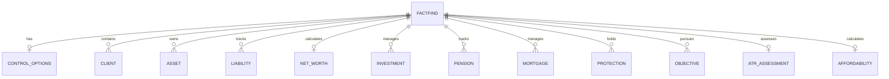

# FactFind System - Comprehensive Entity Data Model
**Version:** 3.0
**Date:** 2026-03-06
**Status:** Active Reference Document
**Purpose:** Complete data model specification for all entities in the FactFind wealth management platform

---

## Executive Summary

### System Overview
The FactFind system is a comprehensive wealth management platform built on Domain-Driven Design (DDD) principles, supporting end-to-end financial advisory services from client onboarding through retirement planning.

### Entity Statistics
- **Total Entities:** 52 domain entities
- **Bounded Contexts:** 8 distinct business domains
- **Aggregate Roots:** 2 primary (FactFind, Client)
- **Total Fields:** 900+ business fields
- **Value Objects:** 12 common value types
- **Reference Data Entities:** 35+ lookup entities

### Bounded Contexts Overview

| Context | Entities | Purpose |
|---------|----------|---------|
| **FactFind Root** | 2 entities | Lifecycle management and control options |
| **Client Management** | 15 entities | Client onboarding, KYC, and relationship management |
| **Circumstances** | 6 entities | Employment, income, expenditure, and affordability |
| **Assets & Liabilities** | 3 entities | Asset tracking, debt management, and net worth |
| **Plans & Investments** | 11 entities | Pensions, investments, mortgages, and protection |
| **Goals & Objectives** | 2 entities | Financial goal setting and tracking |
| **Risk Assessment** | 2 entities | Attitude to risk and capacity for loss |
| **Reference Data** | 35+ entities | Lookup tables and enumeration values |

### Aggregate Roots

#### Primary Aggregate Root: FactFind
- **Purpose:** Root container for all client financial planning information
- **Scope:** Transactional boundary for all nested entities
- **Lifecycle:** Controls creation, modification, and deletion of child entities
- **Children:** 50+ nested entity types

#### Secondary Aggregate Root: Client
- **Purpose:** Core entity representing individuals, companies, or trusts
- **Scope:** Personal information, relationships, and client-specific data
- **Lifecycle:** Can exist across multiple FactFinds
- **Children:** 14 nested entity types

---

## Table of Contents

### Part 1: Architecture & Patterns
1. [Bounded Contexts](#bounded-contexts)
2. [Aggregate Root Pattern](#aggregate-root-pattern)
3. [Entity Relationship Overview](#entity-relationship-overview)
4. [Value Objects Reference](#value-objects-reference)

### Part 2: Entity Catalog
5. [FactFind Root Context](#factfind-root-context)
6. [Client Management Context](#client-management-context)
7. [Circumstances Context](#circumstances-context)
8. [Assets & Liabilities Context](#assets--liabilities-context)
9. [Plans & Investments Context](#plans--investments-context)
10. [Goals & Objectives Context](#goals--objectives-context)
11. [Risk Assessment Context](#risk-assessment-context)
12. [Reference Data Context](#reference-data-context)

### Part 3: Data Model Diagrams
13. [System-Wide Entity Relationship Diagram](#system-wide-erd)
14. [Context-Specific ERDs](#context-specific-erds)

### Part 4: Appendices
15. [Appendix A: Field Type Mappings](#appendix-a-field-type-mappings)
16. [Appendix B: Validation Rules Matrix](#appendix-b-validation-rules-matrix)
17. [Appendix C: Foreign Key Index](#appendix-c-foreign-key-index)

---

## Bounded Contexts

### 1. FactFind Root Context
**Purpose:** Central coordination and lifecycle management

**Entities:**
- FactFind (Aggregate Root)
- Control Options

**Responsibilities:**
- FactFind creation and lifecycle management
- Client associations (individual or joint)
- Meeting tracking and recording compliance
- Disclosure document management
- Section gating and conditional logic

**API Base Path:** `/api/v3/factfinds`

---

### 2. Client Management Context
**Purpose:** Client onboarding, identity, compliance, and relationship management

**Entities:**
- Client (Aggregate Root in context)
- Address
- Contact
- Professional Contact
- Client Relationship
- Dependant
- Vulnerability
- Estate Planning (Will, LPA, Gift, Trust)
- Identity Verification
- Credit History
- Credit Event
- Financial Profile
- Marketing Preferences
- DPA Agreement
- Bank Account

**Responsibilities:**
- Client demographic information (Person, Corporate, Trust)
- Address history and residency tracking
- Contact method management (email, phone, fax)
- Professional contacts (solicitor, accountant)
- Family relationships and dependants
- Vulnerability assessment and matching service
- Estate planning (wills, LPAs, trusts, gifts)
- Identity verification (KYC/AML)
- Credit history and creditworthiness
- Financial profile and behavior
- Marketing consent and preferences
- Data protection agreements
- Bank account details

**API Base Paths:**
- `/api/v3/factfinds/{factfindId}/clients`
- `/api/v3/factfinds/{factfindId}/clients/{clientId}/*`

---

### 3. Circumstances Context
**Purpose:** Employment, income, and expenditure tracking for affordability assessment

**Entities:**
- Employment
- Employment Summary
- Income
- Income Changes
- Expenditure
- Expenditure Changes
- Affordability

**Responsibilities:**
- Employment history (current and previous)
- Employment status tracking (Employed, Self-Employed, Retired)
- Income from all sources (employment, rental, investment, benefits)
- Income change projections
- Regular and discretionary expenditure
- Expenditure change forecasts
- Affordability calculations and surplus analysis

**API Base Paths:**
- `/api/v3/factfinds/{factfindId}/clients/{clientId}/employment`
- `/api/v3/factfinds/{factfindId}/clients/{clientId}/income`
- `/api/v3/factfinds/{factfindId}/clients/{clientId}/expenditure`
- `/api/v3/factfinds/{factfindId}/affordability`

---

### 4. Assets & Liabilities Context
**Purpose:** Asset and debt tracking, net worth calculation

**Entities:**
- Asset
- Liability
- Net Worth

**Responsibilities:**
- Asset management (property, vehicles, valuables, collectibles)
- Property valuations and ownership tracking
- Liability tracking (loans, credit cards, overdrafts)
- Debt servicing costs
- Net worth calculation and aggregation
- Asset allocation analysis

**API Base Paths:**
- `/api/v3/factfinds/{factfindId}/assets`
- `/api/v3/factfinds/{factfindId}/liabilities`
- `/api/v3/factfinds/{factfindId}/networth`

---

### 5. Plans & Investments Context
**Purpose:** Pensions, investments, mortgages, and protection products

**Entities:**
- Investment
- Final Salary Pension
- Annuity
- Personal Pension
- State Pension
- Employer Pension Scheme
- Mortgage
- Personal Protection
- Protection Review

**Responsibilities:**
- Investment portfolio management (ISAs, GIAs, bonds)
- Defined Benefit pension tracking (CETV, accrual rates)
- Annuity management (lifetime, fixed-term, joint-life)
- Defined Contribution pensions (SIPP, drawdown, crystallisation)
- State Pension entitlements (old and new system)
- Employer pension schemes (current and deferred)
- Mortgage arrangements (residential, BTL, equity release)
- Protection policies (life, critical illness, income protection)
- Protection reviews and needs analysis

**API Base Paths:**
- `/api/v3/factfinds/{factfindId}/investments`
- `/api/v3/factfinds/{factfindId}/pensions/finalsalary`
- `/api/v3/factfinds/{factfindId}/pensions/annuity`
- `/api/v3/factfinds/{factfindId}/pensions/personalpension`
- `/api/v3/factfinds/{factfindId}/pensions/statepension`
- `/api/v3/factfinds/{factfindId}/pensions/employerschemes`
- `/api/v3/factfinds/{factfindId}/mortgages`
- `/api/v3/factfinds/{factfindId}/protections`

---

### 6. Goals & Objectives Context
**Purpose:** Financial goal setting, tracking, and prioritization

**Entities:**
- Goal (Objective)

**Responsibilities:**
- Goal definition and categorization (Retirement, Education, Property)
- Target amounts and timelines
- Current savings tracking
- Progress monitoring
- Achievability analysis
- Goal prioritization

**API Base Path:** `/api/v3/factfinds/{factfindId}/objectives`

---

### 7. Risk Assessment Context
**Purpose:** Client risk profiling and capacity for loss assessment

**Entities:**
- ATR Assessment (Attitude to Risk)
- Risk Profile

**Responsibilities:**
- Risk questionnaire management
- Attitude to risk scoring
- Capacity for loss assessment
- Risk rating calculation (Cautious to Adventurous)
- Time horizon analysis
- Investment experience tracking
- Risk assessment validity and review dates

**API Base Path:** `/api/v3/factfinds/{factfindId}/atr-assessment`

---

### 8. Reference Data Context
**Purpose:** Centralized lookup data and enumeration values

**Reference Entities:**
- Gender (M, F, O, X)
- Title (Mr, Mrs, Ms, Dr, etc.)
- Marital Status (Single, Married, Divorced, etc.)
- Client Type (Person, Corporate, Trust)
- Service Status (Active, Inactive, Prospect, etc.)
- Employment Status (Employed, Self-Employed, Retired, etc.)
- Country (ISO 3166-1 alpha-2)
- Currency (ISO 4217)
- Frequency (Daily, Weekly, Monthly, Annual)
- Income Type (Employment, Rental, Investment, Benefits)
- Expenditure Category (Housing, Transport, Food, etc.)
- Asset Type (Property, Vehicle, Collectibles, etc.)
- Liability Type (Mortgage, Loan, CreditCard, etc.)
- Investment Type (ISA, GIA, Bond, etc.)
- Pension Provider
- Protection Type (Life, CriticalIllness, IncomeProtection, etc.)
- Mortgage Rate Type (Fixed, Variable, Tracker)
- Repayment Type (Repayment, InterestOnly, PartAndPart)
- ...and 18 more reference entities

**API Base Path:** `/api/v3/reference/*`

---

## Aggregate Root Pattern

### FactFind Aggregate Root

```mermaid
graph TD
    FF[FactFind<br/>Aggregate Root] --> CO[Control Options]
    FF --> CL[Client Collection]
    FF --> AS[Asset Collection]
    FF --> LB[Liability Collection]
    FF --> IN[Investment Collection]
    FF --> FS[Final Salary Pension Collection]
    FF --> AN[Annuity Collection]
    FF --> PP[Personal Pension Collection]
    FF --> SP[State Pension Collection]
    FF --> ES[Employer Pension Scheme Collection]
    FF --> MG[Mortgage Collection]
    FF --> PR[Protection Collection]
    FF --> OB[Objective Collection]
    FF --> AR[ATR Assessment]
    FF --> NW[Net Worth]
    FF --> AF[Affordability]

    CL --> AD[Address Collection]
    CL --> CN[Contact Collection]
    CL --> PC[Professional Contact Collection]
    CL --> CR[Client Relationship Collection]
    CL --> DP[Dependant Collection]
    CL --> VL[Vulnerability Collection]
    CL --> EP[Estate Planning]
    CL --> IV[Identity Verification Collection]
    CL --> CH[Credit History Collection]
    CL --> FP[Financial Profile]
    CL --> MP[Marketing Preferences]
    CL --> DA[DPA Agreement Collection]
    CL --> BA[Bank Account Collection]
    CL --> EM[Employment Collection]
    CL --> IC[Income Collection]
    CL --> EX[Expenditure Collection]
    CL --> ES2[Employment Summary]
```



**Transactional Boundary:**
- All entities within a FactFind form a single transactional unit
- Changes are atomic within the aggregate
- Deleting a FactFind cascades to all nested entities
- Optimistic concurrency control at FactFind level

**Benefits:**
- Clear ownership and lifecycle management
- Simplified consistency guarantees
- Natural multi-tenancy isolation
- Efficient authorization checks (inherit from root)

---

### Client Sub-Aggregate

```mermaid
graph TD
    CL[Client<br/>Sub-Aggregate] --> PV[Person Value]
    CL --> CV[Corporate Value]
    CL --> TV[Trust Value]
    CL --> TP[Territorial Profile]
    CL --> AD[Addresses]
    CL --> CO[Contacts]
    CL --> PC[Professional Contacts]
    CL --> DP[Dependants]
    CL --> VL[Vulnerabilities]
    CL --> EP[Estate Planning]
    CL --> IV[Identity Verifications]
    CL --> CH[Credit History]
    CL --> FP[Financial Profile]
    CL --> MP[Marketing Preferences]
    CL --> DA[DPA Agreements]
    CL --> BA[Bank Accounts]
    CL --> EM[Employment]
    CL --> IN[Income]
    CL --> EX[Expenditure]
```



**Client Types:**
- **Person:** Individual clients (retail, HNW)
- **Corporate:** Company clients (corporate advice)
- **Trust:** Trust entities

**Polymorphic Properties:**
- `personValue` - Only for Person clients
- `corporateValue` - Only for Corporate clients
- `trustValue` - Only for Trust clients

---

## Entity Relationship Overview

### Master Entity Relationship Diagram

```mermaid
erDiagram
    FACTFIND ||--o{ CLIENT : contains
    FACTFIND ||--o| CONTROL_OPTIONS : has
    FACTFIND ||--o{ ASSET : contains
    FACTFIND ||--o{ LIABILITY : contains
    FACTFIND ||--o| NET_WORTH : calculates
    FACTFIND ||--o{ INVESTMENT : contains
    FACTFIND ||--o{ FINAL_SALARY_PENSION : contains
    FACTFIND ||--o{ ANNUITY : contains
    FACTFIND ||--o{ PERSONAL_PENSION : contains
    FACTFIND ||--o{ STATE_PENSION : contains
    FACTFIND ||--o{ EMPLOYER_PENSION_SCHEME : contains
    FACTFIND ||--o{ MORTGAGE : contains
    FACTFIND ||--o{ PERSONAL_PROTECTION : contains
    FACTFIND ||--o{ OBJECTIVE : contains
    FACTFIND ||--o| ATR_ASSESSMENT : has
    FACTFIND ||--o| AFFORDABILITY : calculates

    CLIENT ||--o{ ADDRESS : has
    CLIENT ||--o{ CONTACT : has
    CLIENT ||--o{ PROFESSIONAL_CONTACT : has
    CLIENT ||--o{ CLIENT_RELATIONSHIP : has
    CLIENT ||--o{ DEPENDANT : has
    CLIENT ||--o{ VULNERABILITY : has
    CLIENT ||--o| ESTATE_PLANNING : has
    CLIENT ||--o{ IDENTITY_VERIFICATION : has
    CLIENT ||--o| CREDIT_HISTORY : has
    CLIENT ||--o| FINANCIAL_PROFILE : has
    CLIENT ||--o| MARKETING_PREFERENCES : has
    CLIENT ||--o{ DPA_AGREEMENT : has
    CLIENT ||--o{ BANK_ACCOUNT : has
    CLIENT ||--o{ EMPLOYMENT : has
    CLIENT ||--o{ INCOME : earns
    CLIENT ||--o{ EXPENDITURE : spends
    CLIENT ||--o| EMPLOYMENT_SUMMARY : summarizes

    CREDIT_HISTORY ||--o{ CREDIT_EVENT : contains
    ESTATE_PLANNING ||--o{ WILL : includes
    ESTATE_PLANNING ||--o{ LPA : includes
    ESTATE_PLANNING ||--o{ GIFT : includes
    ESTATE_PLANNING ||--o{ TRUST : includes

    INCOME }o--|| EMPLOYMENT : "from"
    INCOME }o--|| ASSET : "generated by"
    EXPENDITURE }o--|| LIABILITY : "pays for"

    ASSET }o--|| MORTGAGE : "secured by"

    PERSONAL_PROTECTION }o--|| MORTGAGE : "protects"
```



---

## Value Objects Reference

Value objects are immutable objects that have no independent identity and are defined only by their properties.

### 1. MoneyValue
**Purpose:** Represents monetary amounts with currency

**Properties:**
| Field | Type | Required | Description | Example |
|-------|------|----------|-------------|---------|
| amount | decimal | Yes | Numeric amount | 125000.00 |
| currency | CurrencyRef | Yes | ISO 4217 currency code | { code: "GBP", symbol: "£", display: "British Pound" } |

**Usage:**
- All financial amounts (income, expenditure, assets, liabilities, pension values)
- Investment valuations
- Mortgage balances
- Protection cover amounts

**Example:**
```json
{
  "amount": 125000.00,
  "currency": {
    "code": "GBP",
    "symbol": "£",
    "display": "British Pound"
  }
}
```

---

### 2. DateRange
**Purpose:** Represents a period with start and end dates

**Properties:**
| Field | Type | Required | Description | Example |
|-------|------|----------|-------------|---------|
| startDate | date | Yes | Period start date | 2020-01-15 |
| endDate | date | No | Period end date (null = ongoing) | 2025-12-31 or null |

**Usage:**
- Employment periods
- Address residency periods
- Income periods
- Liability term dates
- Pension contribution periods

**Example:**
```json
{
  "startDate": "2020-01-15",
  "endDate": null
}
```

---

### 3. AddressValue
**Purpose:** Physical address details

**Properties:**
| Field | Type | Required | Max Length | Description | Example |
|-------|------|----------|------------|-------------|---------|
| line1 | string | Yes | 100 | Address line 1 | 123 High Street |
| line2 | string | No | 100 | Address line 2 | Apartment 4B |
| city | string | Yes | 50 | City/town | London |
| county | string | No | 50 | County/region/state | Greater London |
| postcode | string | Yes | 20 | Postal/ZIP code | SW1A 1AA |
| country | string | Yes | 2 | ISO 3166-1 alpha-2 | GB |

**Usage:**
- Client addresses
- Professional contact addresses
- Bank branch addresses
- Property addresses

**Example:**
```json
{
  "line1": "123 High Street",
  "line2": "Apartment 4B",
  "city": "London",
  "county": "Greater London",
  "postcode": "SW1A 1AA",
  "country": "GB"
}
```

---

### 4. PersonName
**Purpose:** Person's name components

**Properties:**
| Field | Type | Required | Max Length | Description | Example |
|-------|------|----------|------------|-------------|---------|
| title | enum | No | 10 | Title | MR, MRS, MS, DR, PROF |
| firstName | string | Yes | 50 | Given name | John |
| middleNames | string | No | 100 | Middle names | Michael Robert |
| lastName | string | Yes | 50 | Surname/family name | Smith |
| preferredName | string | No | 50 | Preferred name | John |
| salutation | string | No | 100 | How to address | Mr Smith |
| fullName | string | ReadOnly | 200 | Complete formatted name | Mr John Michael Robert Smith |

**Usage:**
- Client person details
- Dependant names
- Beneficiary names

---

### 5. TerritorialProfile
**Purpose:** Citizenship, residency, and domicile status

**Properties:**
| Field | Type | Required | Description | Example |
|-------|------|----------|-------------|---------|
| countryOfBirth | CountryRef | No | Birth country | GB - United Kingdom |
| placeOfBirth | string | No | Birth city | London |
| countryOfResidence | CountryRef | Yes | Current residence | GB - United Kingdom |
| countryOfDomicile | CountryRef | Yes | Tax domicile | GB - United Kingdom |
| countryOfOrigin | CountryRef | No | Origin country | GB - United Kingdom |
| countriesOfCitizenship | CountryRef[] | No | Citizenship list | [GB, IE] |
| ukResident | boolean | No | UK tax resident | true |
| ukDomicile | boolean | No | UK domiciled | true |
| expatriate | boolean | No | Expatriate status | false |

**Usage:**
- Client territorial profile
- Tax residency determination
- Cross-border planning

---

### 6. HealthMetrics
**Purpose:** Health measurements for insurance

**Properties:**
| Field | Type | Required | Description | Example |
|-------|------|----------|-------------|---------|
| heightCm | decimal | No | Height in centimeters | 178.0 |
| weightKg | decimal | No | Weight in kilograms | 82.5 |
| bmi | decimal | ReadOnly | Body Mass Index (calculated) | 26.04 |
| bmiCategory | enum | ReadOnly | BMI classification | Overweight |
| lastMeasured | date | No | Measurement date | 2026-01-15 |

**BMI Categories:**
- Underweight: < 18.5
- Healthy: 18.5 - 24.9
- Overweight: 25.0 - 29.9
- Obese: >= 30.0

**Usage:**
- Client health profile
- Protection policy underwriting
- Life assurance pricing

---

### 7. ReferenceLink
**Purpose:** Reference to another entity (foreign key with display name)

**Properties:**
| Field | Type | Required | Description | Example |
|-------|------|----------|-------------|---------|
| id | integer | Yes | Entity ID | 8496 |
| href | string | ReadOnly | API link | /api/v3/factfinds/679/clients/8496 |
| name | string | ReadOnly | Display name | John Smith |
| code | string | No | Business code | C00001234 |

**Usage:**
- Client references
- Adviser references
- Office references
- Provider references
- Paraplanner references
- Spouse references

**Example:**
```json
{
  "id": 8496,
  "href": "/api/v3/factfinds/679/clients/8496",
  "name": "John Smith",
  "code": "C00001234"
}
```

---

### 8. FrequencyValue
**Purpose:** Recurring frequency with periods per year

**Properties:**
| Field | Type | Required | Description | Example |
|-------|------|----------|-------------|---------|
| code | enum | Yes | Frequency code | M, Q, A |
| display | string | ReadOnly | Display name | Monthly |
| periodsPerYear | integer | ReadOnly | Periods count | 12 |

**Frequency Codes:**
- D: Daily (365)
- W: Weekly (52)
- FW: Fortnightly (26)
- FW: Four Weekly (13)
- M: Monthly (12)
- Q: Quarterly (4)
- SA: Semi-Annually (2)
- A: Annually (1)

**Usage:**
- Income frequency
- Expenditure frequency
- Payment frequency
- Premium frequency
- Contribution frequency

---

### 9. OccupationCode (SOC)
**Purpose:** Standard Occupational Classification

**Properties:**
| Field | Type | Required | Description | Example |
|-------|------|----------|-------------|---------|
| code | string | Yes | SOC code | 2136 |
| display | string | ReadOnly | Occupation name | Programmers and Software Development Professionals |
| socVersion | string | ReadOnly | SOC standard version | SOC2020 |

**Usage:**
- Client occupation
- Employment job title
- Mortgage affordability
- Protection underwriting

---

### 10. CountryReference
**Purpose:** Country details with ISO codes

**Properties:**
| Field | Type | Required | Description | Example |
|-------|------|----------|-------------|---------|
| code | string | Yes | ISO 3166-1 alpha-2 | GB |
| alpha3 | string | ReadOnly | ISO 3166-1 alpha-3 | GBR |
| display | string | ReadOnly | Country name | United Kingdom |

**Usage:**
- Addresses
- Territorial profile
- Bank locations
- Citizenship

---

### 11. AuditFields
**Purpose:** Standard audit trail fields on all entities

**Properties:**
| Field | Type | Required | Description | Example |
|-------|------|----------|-------------|---------|
| id | integer | Yes (ReadOnly) | Unique identifier | 8496 |
| href | string | Yes (ReadOnly) | API resource link | /api/v3/factfinds/679/clients/8496 |
| createdAt | datetime | Yes (ReadOnly) | Creation timestamp | 2020-01-15T10:30:00Z |
| createdBy | UserRef | No (ReadOnly) | Creator user | { id: 1234, name: "Jane Doe" } |
| updatedAt | datetime | Yes (ReadOnly) | Last update timestamp | 2026-02-16T14:30:00Z |
| updatedBy | UserRef | No (ReadOnly) | Last updater user | { id: 1234, name: "Jane Doe" } |

**Usage:**
- All entities (standard pattern)
- Audit trail tracking
- Concurrency control
- Change history

---

### 12. SelectionValue
**Purpose:** Reference data selection with code and display

**Properties:**
| Field | Type | Required | Description | Example |
|-------|------|----------|-------------|---------|
| code | string | Yes | Reference code | MAR |
| display | string | ReadOnly | Display value | Married |
| effectiveFrom | date | No | Effective from date | 2005-06-20 |

**Usage:**
- Marital status
- Gender
- Title
- Employment status
- All reference data selections

---

## FactFind Root Context

---

## ENTITY: FactFind

### Overview
**Aggregate Root:** Yes
**Bounded Context:** FactFind Root
**Business Purpose:** Root container for all client financial planning information. Represents a formal data-gathering exercise as part of the financial advice process.

### Properties

| Field Name | Data Type | Required | Max Length | Primary Key | Foreign Key | Description | Example |
|------------|-----------|----------|------------|-------------|-------------|-------------|---------|
| id | integer | Yes (ReadOnly) | - | Yes | - | Unique system identifier | 679 |
| href | string | Yes (ReadOnly) | 200 | - | - | API resource link | /api/v3/factfinds/679 |
| factFindNumber | string | No | 50 | - | - | Business reference number | FF-2025-00123 |
| status | enum | No | 20 | - | - | Current status (InProgress, Completed, Archived) | InProgress |
| clients | ReferenceLink[] | Yes | - | - | Client.id | Associated clients (min 1) | [{ id: 123, name: "John Smith" }] |
| meeting | MeetingValue | No | - | - | - | Meeting details (date, type, attendees) | Complex object |
| disclosureKeyfacts | DisclosureDocument[] | No | - | - | - | Regulatory disclosure documents issued | Complex object |
| createdAt | datetime | Yes (ReadOnly) | - | - | - | Creation timestamp | 2026-03-05T10:00:00Z |
| createdBy | UserRef | No (ReadOnly) | - | - | User.id | Creator user | { id: 1234, name: "Jane Doe" } |
| updatedAt | datetime | Yes (ReadOnly) | - | - | - | Last update timestamp | 2026-03-05T15:30:00Z |
| updatedBy | UserRef | No (ReadOnly) | - | - | User.id | Last updater user | { id: 1234, name: "Jane Doe" } |

### Nested Objects

#### meeting
| Field | Type | Required | Description | Example |
|-------|------|----------|-------------|---------|
| meetingOn | date | No | Meeting date | 2026-03-05 |
| meetingType | enum | No | Meeting type (FaceToFace, Videocall, Telephone, etc.) | FaceToFace |
| clientsPresent | ReferenceLink[] | No | Clients who attended | [{ id: 123 }] |
| anyOtherAudience | boolean | No | Others present (interpreter, family) | false |
| notes | string | No (max 5000) | Meeting notes | Initial consultation discussion |

#### disclosureKeyfacts[] (each item)
| Field | Type | Required | Description | Example |
|-------|------|----------|-------------|---------|
| Type | enum | Yes | Document type (CombinedInitialDisclosureDocument, TermsOfBusiness, etc.) | CombinedInitialDisclosureDocument |
| IssuedOn | date | Yes | Date document issued | 2026-03-05 |

### Relationships

**Parent:** None (Root Aggregate)

**Children:**
- Client (1-to-many) - via clients[] array
- Control Options (1-to-1) - singleton child
- Asset (1-to-many)
- Liability (1-to-many)
- Net Worth (1-to-1) - calculated singleton
- Investment (1-to-many)
- Final Salary Pension (1-to-many)
- Annuity (1-to-many)
- Personal Pension (1-to-many)
- State Pension (1-to-many)
- Employer Pension Scheme (1-to-many)
- Mortgage (1-to-many)
- Personal Protection (1-to-many)
- Protection Review (1-to-1) - singleton
- Objective (1-to-many)
- ATR Assessment (1-to-1) - singleton
- Affordability (1-to-1) - calculated singleton

### Business Rules

1. **Client Association:** Must have at least one client in clients[] array
2. **Joint FactFind:** Can have multiple clients (couples, families, business partners)
3. **Meeting Recording:** If meetingType includes "Recorded", must document consent in notes
4. **Disclosure Compliance:** FCA requires Combined Initial Disclosure Document before providing advice
5. **Client Present Validation:** All clients in clientsPresent must be in clients[] array
6. **Cascading Delete:** Deleting FactFind cascades to all nested entities
7. **Status Transitions:** InProgress → Completed → Archived

### API Endpoints

**Base Path:** `/api/v3/factfinds`

| Method | Endpoint | Description |
|--------|----------|-------------|
| GET | `/api/v3/factfinds` | List all fact finds (with pagination & filtering) |
| POST | `/api/v3/factfinds` | Create new fact find |
| GET | `/api/v3/factfinds/{id}` | Get fact find by ID |
| PATCH | `/api/v3/factfinds/{id}` | Update fact find |
| DELETE | `/api/v3/factfinds/{id}` | Delete fact find |

### Entity Relationship Diagram



---

## ENTITY: Control Options

### Overview
**Aggregate Root:** No
**Parent:** FactFind
**Bounded Context:** FactFind Root
**Business Purpose:** High-level control flags determining which FactFind sections are relevant to a client. Enables conditional logic and improves efficiency by showing only applicable sections.

### Properties

| Field Name | Data Type | Required | Max Length | Primary Key | Foreign Key | Description | Example |
|------------|-----------|----------|------------|-------------|-------------|-------------|---------|
| id | integer | Yes (ReadOnly) | - | Yes | - | Unique identifier (matches factfind.id) | 679 |
| href | string | Yes (ReadOnly) | 200 | - | - | API resource link | /api/v3/factfinds/679/controloptions |
| factfind | ReferenceLink | Yes (ReadOnly) | - | - | FactFind.id | Parent FactFind | { id: 679 } |
| investments | InvestmentFlags | No | - | - | - | Investment control flags | { hasCash: true, hasInvestments: true } |
| pensions | PensionFlags | No | - | - | - | Pension control flags | Complex object |
| mortgages | MortgageFlags | No | - | - | - | Mortgage control flags | { hasMortgages: true, hasEquityRelease: false } |
| protections | ProtectionFlags | No | - | - | - | Protection control flags | { hasProtection: true } |
| assets | AssetFlags | No | - | - | - | Asset control flags | { hasAssets: true } |
| liabilities | LiabilityFlags | No | - | - | - | Liability control flags and reduction planning | Complex object |

### Nested Objects

#### investments
| Field | Type | Description | Example |
|-------|------|-------------|---------|
| hasCash | boolean | Has cash savings or accounts | true |
| hasInvestments | boolean | Has investment products (ISAs, bonds, stocks, funds) | true |

#### pensions
| Field | Type | Description | Example |
|-------|------|-------------|---------|
| hasEmployerPensionSchemes | boolean | Has employer pension schemes | true |
| hasFinalSalary | boolean | Has final salary (defined benefit) pensions | true |
| hasMoneyPurchases | boolean | Has money purchase (defined contribution) pensions | true |
| hasPersonalPensions | boolean | Has personal pensions (SIPPs, stakeholder) | true |
| hasAnnuities | boolean | Has annuity products | true |

#### mortgages
| Field | Type | Description | Example |
|-------|------|-------------|---------|
| hasMortgages | boolean | Has residential mortgages | true |
| hasEquityRelease | boolean | Has equity release products | true |

#### protections
| Field | Type | Description | Example |
|-------|------|-------------|---------|
| hasProtection | boolean | Has protection products (life, CI, income protection) | true |

#### assets
| Field | Type | Description | Example |
|-------|------|-------------|---------|
| hasAssets | boolean | Has assets (property, vehicles, valuables, collectibles) | true |

#### liabilities
| Field | Type | Description | Example |
|-------|------|-------------|---------|
| hasLiabilities | boolean | Has liabilities (loans, credit cards, overdrafts) | true |
| reductionOfLiabilities | ReductionPlan | Liability reduction strategy | Complex object |

#### liabilities.reductionOfLiabilities
| Field | Type | Max Length | Description | Example |
|-------|------|------------|-------------|---------|
| isExpected | boolean | - | Whether reduction of liabilities is expected/planned | false |
| nonReductionReason | enum | - | Reason for not reducing (RetainControlOfCapital, PensionPlanning, Other) | RetainControlOfCapital |
| details | string | 1000 | Additional details about liability strategy | Client prefers liquidity |

### Relationships

**Parent:** FactFind (1-to-1)

**Children:** None

### Business Rules

1. **Singleton Resource:** Only one Control Options record per FactFind
2. **Section Gating:** If flag is false, system should hide corresponding section
3. **Flag Independence:** Multiple flags can be true simultaneously (e.g., multiple pension types)
4. **Non-Reduction Reason:** If isExpected is false, nonReductionReason should be provided
5. **Other Reason Details:** If nonReductionReason is "Other", details field should explain

### API Endpoints

**Base Path:** `/api/v3/factfinds/{factfindId}/controloptions`

| Method | Endpoint | Description |
|--------|----------|-------------|
| GET | `/api/v3/factfinds/{id}/controloptions` | Get control options |
| PUT | `/api/v3/factfinds/{id}/controloptions/assets` | Update assets section |
| PUT | `/api/v3/factfinds/{id}/controloptions/liabilities` | Update liabilities section |
| PUT | `/api/v3/factfinds/{id}/controloptions/investments` | Update investments section |
| PUT | `/api/v3/factfinds/{id}/controloptions/pensions` | Update pensions section |
| PUT | `/api/v3/factfinds/{id}/controloptions/protections` | Update protections section |
| PUT | `/api/v3/factfinds/{id}/controloptions/mortgages` | Update mortgages section |

---

