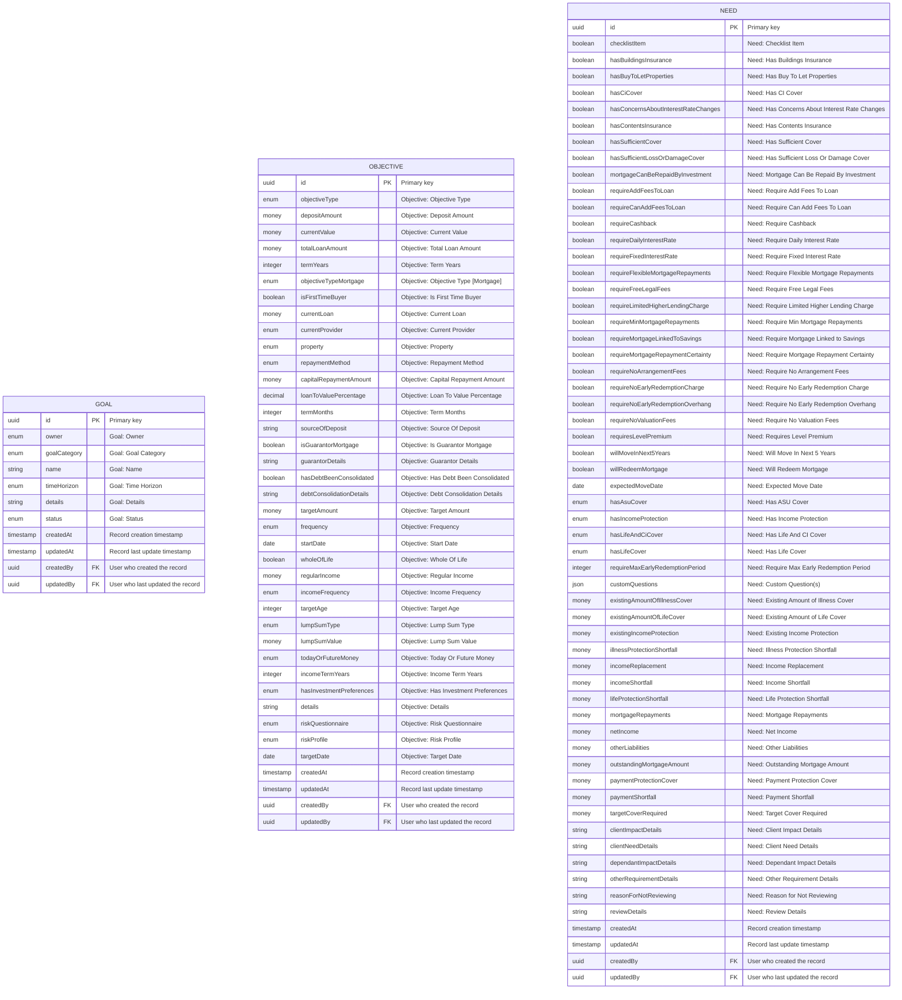
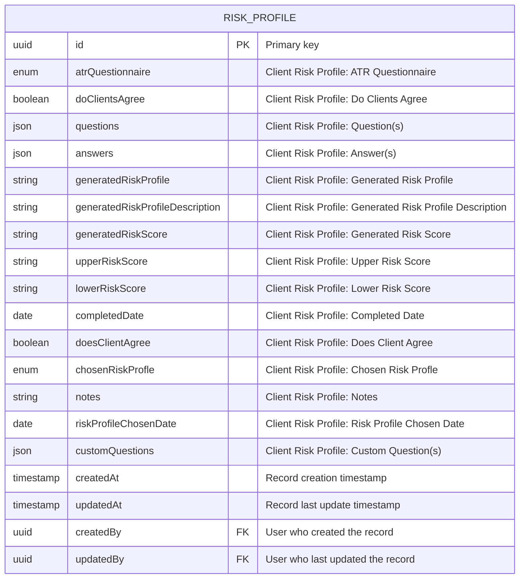
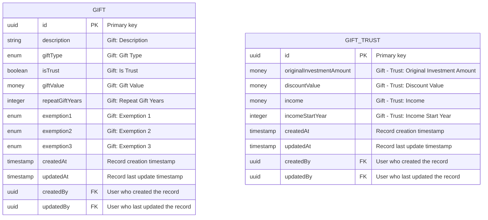

# Greenfield ERD Design - FactFind System

## Document Information
- **Version**: 4.0
- **Date**: 2026-02-16
- **Design Approach**: Greenfield DDD-based architecture with industry-standard terminology
- **Source**: Business requirements from Fact Find Data Analysis v6.1.xlsx (ALL 1,786 Excel fields included)
- **Industry Standards**: FCA Handbook, MiFID II, IDD, Consumer Duty, PROD regulations
- **Terminology Reference**: Intelligent Office, Salesforce FSC, Xplan, MoneyHub, Voyant, Finametrica, Oxford Risk
- **Regulatory Alignment**: FCA Handbook (COBS, PROD, ICOBS), SMCR, Consumer Duty, GDPR, MLR 2017

---

## Executive Summary

This document presents a completely new greenfield Entity-Relationship Design for the FactFind system, built from first principles based on business requirements analysis. The design employs Domain-Driven Design (DDD) principles, modern data modeling patterns, and event-driven architecture to create an optimal system architecture free from legacy constraints.

**Key Update**: This version contains ONLY fields that exist in the Excel source (1,786 fields mapped to 39 entities), plus standard audit fields (createdAt, updatedAt, createdBy, updatedBy) and necessary foreign keys for relationships.

### Key Design Principles
1. **Aggregate-Oriented Design**: Clear transactional boundaries based on business consistency requirements
2. **Rich Domain Models**: Behavior-rich entities with proper encapsulation
3. **Event-Driven Architecture**: Domain events for loose coupling and eventual consistency
4. **Ubiquitous Language**: Industry-standard terminology from FCA, MiFID II, and wealth management platforms
5. **Bounded Contexts**: Clear separation aligned with financial services business capabilities and regulatory requirements
6. **Immutable History**: Audit trails and temporal tracking for regulatory compliance (SMCR, Consumer Duty)
7. **Regulatory Compliance**: Built-in support for Appropriateness Assessment, Target Market, and Value Assessment
8. **Excel Field Fidelity**: Every field in this ERD maps directly to a field in the Excel source system

---

## Business Domain Analysis

### Core Business Capabilities

From the Excel analysis, the system supports these primary business capabilities aligned with wealth management industry practices:

#### 1. Client Onboarding & KYC (Know Your Customer)
- Personal and corporate client onboarding
- Client relationships and family groupings
- Data Protection Act (DPA) agreements and GDPR compliance
- Anti-Money Laundering (AML) checks
- Contact management and professional advisors
- Vulnerable customer identification and support

#### 2. Circumstances & Financial Position (Fact Finding)
- Client meetings and scope of advice
- Employment and income discovery
- Asset and liability identification
- Budget and cashflow analysis (essential vs non-essential expenditure)
- Emergency fund assessment

#### 3. Existing Arrangements (Current Holdings)
- Pension arrangements and fund values
- Investment portfolios and wrappers (ISA, GIA, Bond)
- Protection arrangements (Life, Critical Illness, Income Protection)
- Mortgage arrangements
- General insurance policies
- Annuity arrangements

#### 4. Goals & Objectives
- Short, medium, and long-term goal identification
- Protection gap analysis
- Retirement planning (target retirement age, desired income)
- Estate planning (IHT, trusts, gifting strategies)
- Education funding
- Lifestyle goals

#### 5. Attitude to Risk & Capacity for Loss
- Attitude to Risk (ATR) questionnaire and scoring
- Capacity for Loss evaluation
- Risk tolerance and risk required analysis
- Investment knowledge and experience assessment
- Appropriateness assessment (MiFID II)

#### 6. Recommendations & Suitability
- Product research and selection
- Suitability assessment and report
- Reasons why analysis
- Alternative products considered
- Target Market assessment (PROD)
- Value assessment (Consumer Duty)
- Cost and charges disclosure

---

## Bounded Context Design

Based on the business capabilities and industry practices, we identify these optimal bounded contexts aligned with wealth management platforms (Intelligent Office, Salesforce Financial Services Cloud, Xplan):

### 1. Client Onboarding & KYC Context
**Purpose**: Manage client identities, relationships, and regulatory onboarding requirements

**Responsibilities**:
- Client registration and Know Your Customer (KYC) checks
- Client relationships (spouse, dependants, business partners, beneficial owners)
- Data Protection Act (DPA) and GDPR consent management
- Anti-Money Laundering (AML) verification
- Contact information and correspondence addresses
- Professional contacts (accountants, solicitors, trustees)
- Vulnerable customer flags and support needs

**Aggregate Root**: `CLIENT`

**Key Industry Terms**: KYC, AML, CDD (Customer Due Diligence), Enhanced Due Diligence, PEP (Politically Exposed Person), Vulnerable Customer

### 2. Circumstances & Financial Position Context (Fact Finding)
**Purpose**: Capture comprehensive client circumstances and current financial position

**Responsibilities**:
- Fact find sessions and scope of advice
- Employment and income discovery
- Asset and liability identification
- Budget analysis (essential vs discretionary expenditure)
- Emergency fund assessment
- Cashflow modeling

**Aggregate Root**: `ADVICE_CASE`

**Key Industry Terms**: Circumstances, Financial Position, Discovery, Emergency Fund, Essential Expenditure, Discretionary Expenditure, Net Disposable Income

### 3. Existing Arrangements Context (Current Holdings)
**Purpose**: Record and track client's existing financial arrangements and products

**Responsibilities**:
- Pension arrangements (DC, DB, SIPP, SSAS)
- Investment portfolios and wrappers (ISA, GIA, Offshore Bond, Onshore Bond)
- Protection arrangements (Life Assurance, Critical Illness Cover, Income Protection)
- Mortgage arrangements
- General insurance policies
- Annuity contracts (Lifetime Annuity, Fixed Term Annuity)

**Aggregate Root**: `ARRANGEMENT`

**Key Industry Terms**: Arrangements, Holdings, Policies, Plans, Defined Contribution (DC), Defined Benefit (DB), SIPP, SSAS, Wrapper, ISA Allowance, Annual Allowance, Lifetime Allowance, PCLS (Pension Commencement Lump Sum), UFPLS (Uncrystallised Funds Pension Lump Sum)

### 4. Goals & Objectives Context
**Purpose**: Capture and track client goals, objectives, and priorities

**Responsibilities**:
- Short, medium, and long-term goal definition
- Protection gap analysis
- Retirement planning (target retirement age, desired retirement income)
- Estate planning objectives (IHT mitigation, trusts, gifting)
- Education funding goals
- Goal prioritization and target dates
- Funding source allocation

**Aggregate Root**: `GOAL`

**Key Industry Terms**: Goals, Objectives, Priorities, Target Retirement Age, Desired Retirement Income, Protection Gap, Estate Planning, IHT (Inheritance Tax), Gift Planning, Potentially Exempt Transfer (PET)

### 5. Attitude to Risk & Capacity for Loss Context
**Purpose**: Assess and record client's risk profile and investment suitability

**Responsibilities**:
- Attitude to Risk (ATR) questionnaire and scoring
- Capacity for Loss assessment
- Risk tolerance vs risk required analysis
- Investment knowledge and experience evaluation
- Appropriateness assessment (MiFID II for non-advised)
- Risk rating assignment

**Aggregate Root**: `RISK_PROFILE`

**Key Industry Terms**: Attitude to Risk (ATR), Capacity for Loss (CfL), Risk Tolerance, Risk Required, Risk Capacity, Appropriateness Assessment, Investment Knowledge, Investment Experience, Risk Rating (Cautious, Balanced, Adventurous, etc.)

---

## Core Entity Model

This section presents all 39 entities organized by bounded context, with complete field definitions from Excel.


### 1. Client Onboarding & KYC Context Entities

**Context Purpose**: Manage client identities, relationships, and regulatory onboarding.

**Industry Alignment**: This context aligns with FCA COBS requirements for client classification, AML/CTF regulations (MLR 2017), and GDPR data protection requirements.

**Entities in this Context**:


```mermaid
erDiagram

    CLIENT {
        uuid id PK "Primary key"
        boolean hasEverSmoked "Client: Has Ever Smoked"
        boolean hasPreferredName "Client: Has Preferred Name"
        boolean hasPreviousName "Client: Has Previous Name"
        boolean hasWill "Client: Has Will"
        boolean inGoodHealth "Client: In Good Health"
        boolean isExpatriate "Client: Is Expatriate"
        boolean isHeadOfFamilyGroup "Client: Is Head of Family Group"
        boolean isJoint "Client: Is Joint"
        boolean isMatchingServiceProposition "Client: Is Matching Service Proposition"
        boolean isPowerOfAttorneyGranted "Client: Is Power of Attorney Granted"
        boolean isUkResident "Client: Is UK Resident"
        boolean isWillAdvised "Client: Is Will Advised"
        boolean isWillUpToDate "Client: Is Will Up To Date"
        boolean isdeceased "Client: IsDeceased"
        date bankStatementSeen "Client: Bank Statement Seen"
        date clientSegmentDate "Client: Client Segment Date"
        date councilTaxBillSeen "Client: Council Tax Bill Seen"
        date dateOfBirth "Client: Date of Birth"
        date drivingLicenceExpiryDate "Client: Driving Licence Expiry Date"
        date gunCertificateExpiryDate "Client: Gun Certificate Expiry Date"
        date homeVisit "Client: Home Visit"
        date idCheckCompletedDate "Client: ID Check Completed Date"
        date idCheckExpiryDate "Client: ID Check Expiry Date"
        date inlandRevenueTaxNotification "Client: Inland Revenue Tax Notification"
        date isdeceasedon "Client: IsDeceasedOn"
        date maritalStatusSince "Client: Marital Status Since"
        date microficheIssueDate "Client: Microfiche Issue Date"
        date mortgageStatementSeen "Client: Mortgage Statement Seen"
        date originalDrivingLicenceSeen "Client: Original Driving Licence Seen"
        date originalGunCertificateSeen "Client: Original Gun Certificate Seen"
        date originalPassportSeen "Client: Original Passport Seen"
        date passportExpiryDate "Client: Passport Expiry Date"
        date premisesEntered "Client: Premises Entered"
        date serviceStatusDate "Client: Service Status Date"
        date utilitiesBillSeen "Client: Utilities Bill Seen"
        decimal widowsReliefNrbDeceasedPercentage "Client: Widows Relief NRB Deceased Percentage"
        decimal widowsReliefPropertyAdditionalNrbDeceasedPercentage "Client: Widows Relief Property Additional NRB Deceased Percentage"
        enum adviserName "Client: Adviser Name"
        enum campaignSource "Client: Campaign Source"
        enum campaignType "Client: Campaign Type"
        enum clientCategory "Client: Client Category"
        enum clientSegment "Client: Client Segment"
        enum clientType "Client: Client Type"
        enum countryOfBirth "Client: Country of Birth"
        enum countryOfDomicile "Client: Country of Domicile"
        enum countryOfOrigin "Client: Country of Origin"
        enum countryOfResidence "Client: Country of Residence"
        enum creditedGroup "Client: Credited Group"
        enum gender "Client: Gender"
        enum hasNicotineReplacementInLastYear "Client: Has Nicotine Replacement In Last Year"
        enum hasSmokedInLast12Months "Client: Has Smoked In Last 12 Months"
        enum hasVapedInLastYear "Client: Has Vaped In Last Year"
        enum isSmoker "Client: Is Smoker"
        enum maritalStatus "Client: Marital Status"
        enum nationalityCountry "Client: Nationality Country"
        enum relationshipType "Client: Relationship Type"
        enum serviceStatus "Client: Service Status"
        enum title "Client: Title"
        integer age "Client: Age"
        integer taxYearWhenPropertySold "Client: Tax Year When Property Sold"
        money businessAssetRelief "Client: Business Asset Relief"
        money cost "Client: Cost"
        money grossAnnualIncome "Client: Gross Annual Income"
        money householdIncome "Client: Household Income"
        money householdNetWorth "Client: Household Net Worth"
        money netWorth "Client: Net Worth"
        money propertyAdditionalNrb "Client: Property Additional NRB"
        money totalAssets "Client: Total Assets"
        money totalJointAssets "Client: Total Joint Assets"
        string 3rdPartyRef "Client: 3rd Party Ref"
        string clientName "Client: Client Name"
        string description "Client: Description"
        string drivingLicenceRef "Client: Driving Licence Ref"
        string electricityBillRef "Client: Electricity Bill Ref"
        string expectingInheritanceDetails "Client: Expecting Inheritance Details"
        string firstName "Client: First Name"
        string fullName "Client: Full Name"
        string giftInLast7YearsDetails "Client: Gift In Last 7 Years Details"
        string gunCertificateRef "Client: Gun Certificate Ref"
        string hasOtherConsiderations "Client: Has Other Considerations"
        string idCheckIssuer "Client: ID Check Issuer"
        string idCheckReference "Client: ID Check Reference"
        string idCheckResult "Client: ID Check Result"
        string inPoorHealthDetails "Client: In Poor Health Details"
        string lastName "Client: Last Name"
        string maidenNamePreviousName "Client: Maiden Name / Previous Name"
        string matchingServicePropositionReason "Client: Matching Service Proposition Reason"
        string medicalConditions "Client: Medical Conditions"
        string microficheNumber "Client: Microfiche number"
        string middleName "Client: Middle Name"
        string migrationRef "Client: Migration Ref"
        string mother'sMaidenName "Client: Mother's Maiden Name"
        string nationalClientIdentifier "Client: National Client Identifier"
        string nationalInsuranceNumber "Client: National Insurance Number"
        string notes "Client: Notes"
        string otherConsiderationsDetails "Client: Other Considerations Details"
        string otherTitle "Client: Other Title"
        string passportRef "Client: Passport ref"
        string placeOfBirth "Client: Place of Birth"
        string powerOfAttorneyName "Client: Power of Attorney Name"
        string profilePicture "Client: Profile Picture"
        string recentGiftDetails "Client: Recent Gift Details"
        string regularGiftDetails "Client: Regular Gift Details"
        string salutation "Client: Salutation"
        string score "Client: Score"
        string secondaryReference "Client: Secondary Reference"
        string spouse "Client: Spouse"
        string taxCode "Client: Tax Code"
        string willDetails "Client: Will Details"
        timestamp createdAt "Record creation timestamp"
        timestamp updatedAt "Record last update timestamp"
        uuid createdBy FK "User who created the record"
        uuid updatedBy FK "User who last updated the record"
    }


    ADDRESS {
        uuid id PK "Primary key"
        boolean correspondenceAddress "Address: Correspondence Address"
        boolean default "Address: Default"
        boolean isOnElectoralRoll "Address: Is On Electoral Roll"
        boolean sameAddressAs "Address: Same Address As"
        date residentFromDate "Address: Resident From Date"
        date residentToDate "Address: Resident To Date"
        enum addressStatus "Address: Address Status"
        enum addressType "Address: Address Type"
        enum country "Address: Country"
        enum county "Address: County"
        enum owner "Address: Owner"
        enum relatedAddress "Address: Related Address"
        enum residencyStatus "Address: Residency Status"
        enum shareAddressWith "Address: Share Address With"
        integer durationAtAddressMonths "Address: Duration At Address (Months)"
        integer durationAtAddressYears "Address: Duration At Address (Years)"
        string addressLine1 "Address: Address Line 1"
        string addressLine2 "Address: Address Line 2"
        string addressLine3 "Address: Address Line 3"
        string addressLine4 "Address: Address Line 4"
        string city "Address: City"
        string postcode "Address: Postcode"
        timestamp createdAt "Record creation timestamp"
        timestamp updatedAt "Record last update timestamp"
        uuid createdBy FK "User who created the record"
        uuid updatedBy FK "User who last updated the record"
    }


    CONTACT_DETAIL {
        uuid id PK "Primary key"
        enum owner "Contact: Owner"
        enum contactType "Contact: Contact Type"
        string value "Contact: Value"
        string note "Contact: Note"
        boolean preferredContact "Contact: Preferred Contact"
        timestamp createdAt "Record creation timestamp"
        timestamp updatedAt "Record last update timestamp"
        uuid createdBy FK "User who created the record"
        uuid updatedBy FK "User who last updated the record"
    }


    PROFESSIONAL_CONTACT {
        uuid id PK "Primary key"
        enum contactType "Professional Contact: Contact Type"
        string contactName "Professional Contact: Contact Name"
        string companyName "Professional Contact: Company Name"
        string addressLine1 "Professional Contact: Address Line 1"
        string postCode "Professional Contact: Post Code"
        string telephoneNumber "Professional Contact: Telephone Number"
        string facsimileNumber "Professional Contact: Facsimile Number"
        string mobileNumber "Professional Contact: Mobile Number"
        string emailAddress "Professional Contact: Email Address"
        string addressLine2 "Professional Contact: Address Line 2"
        string addressLine3 "Professional Contact: Address Line 3"
        string addressLine4 "Professional Contact: Address Line 4"
        string cityTown "Professional Contact: City Town"
        enum county "Professional Contact: County"
        enum permissionToContact "Professional Contact: Permission To Contact"
        boolean contactProvidingSourceOfFunds "Professional Contact: Contact Providing Source Of Funds"
        timestamp createdAt "Record creation timestamp"
        timestamp updatedAt "Record last update timestamp"
        uuid createdBy FK "User who created the record"
        uuid updatedBy FK "User who last updated the record"
    }


    CLIENT_RELATIONSHIP {
        uuid id PK "Primary key"
        string name "Client Relationship: Name"
        enum relationship "Client Relationship: Relationship"
        boolean partner "Client Relationship: Partner"
        boolean familyGrouping "Client Relationship: Family Grouping"
        boolean canRelatedViewClientsPlansAssets "Client Relationship: Can Related View Clients Plans Assets"
        boolean canClientViewRelatedsPlansAssets "Client Relationship: Can Client View Relateds Plans Assets"
        boolean canRelatedAccessClientsData "Client Relationship: Can Related Access Clients Data"
        boolean canClientAccessRelatedsData "Client Relationship: Can Client Access Relateds Data"
        timestamp createdAt "Record creation timestamp"
        timestamp updatedAt "Record last update timestamp"
        uuid createdBy FK "User who created the record"
        uuid updatedBy FK "User who last updated the record"
    }


    DPA_CONSENT {
        uuid id PK "Primary key"
        string policyName "DPA Policy: Policy Name"
        enum client "DPA Policy: Client"
        boolean dpaStatements "DPA Policy: DPA Statement(s)"
        date agreementDate "DPA Policy: Agreement Date"
        timestamp createdAt "Record creation timestamp"
        timestamp updatedAt "Record last update timestamp"
        uuid createdBy FK "User who created the record"
        uuid updatedBy FK "User who last updated the record"
    }


    MARKETING_CONSENT {
        uuid id PK "Primary key"
        enum clientName "Client Marketing: Client Name"
        enum canContactForMarketingPurposes "Client Marketing: Can Contact For Marketing Purposes"
        date consentedDate "Client Marketing: Consented Date"
        boolean allowCompanyContactByTelephone "Client Marketing: Allow Company Contact By Telephone"
        boolean allowCompanyContactByMail "Client Marketing: Allow Company Contact By Mail"
        boolean allowCompanyContactByEmail "Client Marketing: Allow Company Contact By Email"
        boolean allowCompanyContactBySms "Client Marketing: Allow Company Contact By Sms"
        boolean allowCompanyContactBySocialMedia "Client Marketing: Allow Company Contact By Social Media"
        boolean allowCompanyContactByAutomatedCalls "Client Marketing: Allow Company Contact By Automated Calls"
        boolean allowCompanyContactByPfp "Client Marketing: Allow Company Contact By PFP"
        boolean allowOtherContactByTelephone "Client Marketing: Allow Other Contact By Telephone"
        boolean allowOtherContactByMail "Client Marketing: Allow Other Contact By Mail"
        boolean allowOtherContactByEmail "Client Marketing: Allow Other Contact By Email"
        boolean allowOtherContactBySms "Client Marketing: Allow Other Contact By Sms"
        boolean allowOtherContactBySocialMedia "Client Marketing: Allow Other Contact By Social Media"
        boolean allowOtherContactByAutomatedCalls "Client Marketing: Allow Other Contact By Automated Calls"
        boolean allowOtherContactByPfp "Client Marketing: Allow Other Contact By PFP"
        enum accessibleFormat "Client Marketing: Accessible Format"
        enum deliveryMethod "Client Marketing: Delivery Method"
        timestamp createdAt "Record creation timestamp"
        timestamp updatedAt "Record last update timestamp"
        uuid createdBy FK "User who created the record"
        uuid updatedBy FK "User who last updated the record"
    }


    VULNERABLE_CUSTOMER_FLAG {
        uuid id PK "Primary key"
        enum hasVulnerability "Vulnerability: Has Vulnerability"
        enum vulnerabilityType "Vulnerability: Vulnerability Type"
        enum vulnerabilityCategory "Vulnerability: Vulnerability Category"
        enum isClientPortalSuitable "Vulnerability: Is Client Portal Suitable"
        string clientPortalSuitabilityDetails "Vulnerability: Client Portal Suitability Details"
        string vulnerabilityActionTakenDetails "Vulnerability: Vulnerability Action Taken Details"
        date dateAssessed "Vulnerability: Date Assessed"
        date reviewDate "Vulnerability: Review Date"
        timestamp createdAt "Record creation timestamp"
        timestamp updatedAt "Record last update timestamp"
        uuid createdBy FK "User who created the record"
        uuid updatedBy FK "User who last updated the record"
    }


    DEPENDANT {
        uuid id PK "Primary key"
        string fullName "Dependant: Full Name"
        date dateOfBirth "Dependant: Date of Birth"
        integer age "Dependant: Age"
        enum relationship "Dependant: Relationship"
        enum relatedTo "Dependant: Related To"
        enum isFinanciallyDependent "Dependant: Is Financially Dependent"
        string period "Dependant: Period"
        boolean isLivingWithClient "Dependant: Is Living With [Client]"
        date financiallyDependentUntilDate "Dependant: Financially Dependent Until Date"
        integer financiallyDependentUntilAge "Dependant: Financially Dependent Until Age"
        string notes "Dependant: Notes"
        timestamp createdAt "Record creation timestamp"
        timestamp updatedAt "Record last update timestamp"
        uuid createdBy FK "User who created the record"
        uuid updatedBy FK "User who last updated the record"
    }


```


#### CLIENT Entity

**Excel Source**: Client Profile

**Excel Field Count**: 96


#### ADDRESS Entity

**Excel Source**: Assets & Liabilities

**Excel Field Count**: 18


#### CONTACT_DETAIL Entity

**Excel Source**: Client Profile

**Excel Field Count**: 20


#### PROFESSIONAL_CONTACT Entity

**Excel Source**: Client Profile

**Excel Field Count**: 25


#### CLIENT_RELATIONSHIP Entity

**Excel Source**: Client Profile

**Excel Field Count**: 8


#### DPA_CONSENT Entity

**Excel Source**: Client Profile

**Excel Field Count**: 4


#### MARKETING_CONSENT Entity

**Excel Source**: Client Profile

**Excel Field Count**: 19


#### VULNERABLE_CUSTOMER_FLAG Entity

**Excel Source**: Client Profile

**Excel Field Count**: 8


#### DEPENDANT Entity

**Excel Source**: Dependants

**Excel Field Count**: 18


### 2. Circumstances & Financial Position Context Entities

**Context Purpose**: Capture comprehensive client circumstances and current financial position for fact-finding.

**Industry Alignment**: Supports FCA COBS requirements for understanding client circumstances, affordability assessments (MCOB for mortgages), and suitability requirements.

**Entities in this Context**:


```mermaid
erDiagram

    ADVICE_CASE {
        uuid id PK "Primary key"
        boolean anybodyElsePresent "Fact Find: Anybody Else Present"
        boolean considerRepaymentOrReduction "Fact Find: Consider Repayment or Reduction"
        boolean didNotDiscloseAssets "Fact Find: Did Not Disclose Assets"
        boolean didNotDiscloseDbPension "Fact Find: Did Not Disclose DB Pension"
        boolean didNotDiscloseDcPension "Fact Find: Did Not Disclose DC Pension"
        boolean didNotDiscloseLiabilities "Fact Find: Did Not Disclose Liabilities"
        boolean didNotDiscloseProtection "Fact Find: Did Not Disclose Protection"
        boolean didNotDiscloseSavings "Fact Find: Did Not Disclose Savings"
        boolean estatePlanning "Fact Find: Estate Planning"
        boolean excludeConsolidatedLiabilityExpenditure "Fact Find: Exclude Consolidated Liability Expenditure"
        boolean excludeRepaidLiabilityExpenditure "Fact Find: Exclude Repaid Liability Expenditure"
        boolean expenditureChangesExpected "Fact Find: Expenditure Changes Expected"
        boolean forgoNonEssentialExpenditure "Fact Find: Forgo Non-Essential Expenditure"
        boolean hasAdverseCredit "Fact Find: Has Adverse Credit"
        boolean hasAnnuity "Fact Find: Has Annuity"
        boolean hasAssets "Fact Find: Has Assets"
        boolean hasBeenRefusedCredit "Fact Find: Has Been Refused Credit"
        boolean hasDbPension "Fact Find: Has DB Pension"
        boolean hasDcPensionMoneyPurchase "Fact Find: Has DC Pension (Money Purchase)"
        boolean hasDcPensionPersonal "Fact Find: Has DC Pension (Personal)"
        boolean hasEquityRelease "Fact Find: Has Equity Release"
        boolean hasExistingMortgage "Fact Find: Has Existing Mortgage"
        boolean hasExpenditures "Fact Find: Has Expenditures"
        boolean hasInvestments "Fact Find: Has Investments"
        boolean hasLiabilities "Fact Find: Has Liabilities"
        boolean hasProtection "Fact Find: Has Protection"
        boolean hasSavings "Fact Find: Has Savings"
        boolean incomeChangesExpected "Fact Find: Income Changes Expected"
        boolean incorporateExpectedExpenditureChanges "Fact Find: Incorporate Expected Expenditure Changes"
        boolean incorporateExpectedIncomeChanges "Fact Find: Incorporate Expected Income Changes"
        boolean isAvailableWithoutPenalty "Fact Find: Is Available Without Penalty"
        boolean isComplete "Fact Find: Is Complete"
        boolean mortgage "Fact Find: Mortgage"
        boolean protection "Fact Find: Protection"
        boolean rebrokerProtection "Fact Find: Rebroker Protection"
        boolean retirementPlanning "Fact Find: Retirement Planning"
        boolean savings&Investments "Fact Find: Savings & Investments"
        date dateDeclarationSigned "Fact Find: Date Declaration Signed"
        date dateFactFindCompleted "Fact Find: Date Fact Find Completed"
        date dateIdAmlChecked "Fact Find: Date ID/AML Checked"
        date dateOfMeeting "Fact Find: Date of Meeting"
        enum clientsPresent "Fact Find: Clients Present"
        enum highestTaxRate "Fact Find: Highest Tax Rate"
        enum notConsiderRepaymentReason "Fact Find: Not Consider Repayment Reason"
        enum typeOfMeeting "Fact Find: Type of Meeting"
        json customQuestions "Fact Find: Custom Question(s)"
        money agreedMonthlyBudget "Fact Find: Agreed Monthly Budget"
        money agreedSingleInvestmentAmount "Fact Find: Agreed Single Investment Amount"
        money assetClient1TotalValue "Fact Find: Asset Client 1 Total Value"
        money assetClient2TotalValue "Fact Find: Asset Client 2 Total Value"
        money assetJointTotalValue "Fact Find: Asset Joint Total Value"
        money consolidatedExpenditurePayments "Fact Find: Consolidated Expenditure Payments"
        money currentProtectionPremiums "Fact Find: Current Protection Premiums"
        money emergencyFundCommittedAmount "Fact Find: Emergency Fund Committed Amount"
        money emergencyFundRequiredAmount "Fact Find: Emergency Fund Required Amount"
        money emergencyFundShortfall "Fact Find: Emergency Fund Shortfall"
        money revisedMonthlyExpenditure "Fact Find: Revised Monthly Expenditure"
        money revisedMonthlyIncomeAvailable "Fact Find: Revised Monthly Income Available"
        money revisedTotalDisposableMonthlyIncomeAvailable "Fact Find: Revised Total Disposable Monthly Income Available"
        money toBeRepaidExpenditurePayments "Fact Find: To be Repaid Expenditure Payments"
        money totalClient1Expenditure "Fact Find: Total Client 1 Expenditure"
        money totalClient2Expenditure "Fact Find: Total Client 2 Expenditure"
        money totalEarnedAnnualIncomeGross "Fact Find: Total Earned Annual Income (Gross)"
        money totalFundsAvailable "Fact Find: Total Funds Available"
        money totalJointExpenditure "Fact Find: Total Joint Expenditure"
        money totalLumpSumAvailableForAdvice "Fact Find: Total Lump Sum Available For Advice"
        money totalMonthlyDisposableIncome "Fact Find: Total Monthly Disposable Income"
        money totalMonthlyExpenditure "Fact Find: Total Monthly Expenditure"
        money totalMonthlyHouseholdExpenditure "Fact Find: Total Monthly Household Expenditure"
        money totalNetMonthlyExpenditure "Fact Find: Total Net Monthly Expenditure"
        money totalNetMonthlyIncome "Fact Find: Total Net Monthly Income"
        money totalNetRelevantEarnings "Fact Find: Total Net Relevant Earnings"
        string additionalNotes "Fact Find: Additional Notes"
        string anybodyElsePresentDetails "Fact Find: Anybody Else Present Details"
        string notes "Fact Find: Notes"
        string refusedCreditDetails "Fact Find: Refused Credit Details"
        string sourceOfInvestmentFunds "Fact Find: Source Of Investment Funds"
        timestamp createdAt "Record creation timestamp"
        timestamp updatedAt "Record last update timestamp"
        uuid createdBy FK "User who created the record"
        uuid updatedBy FK "User who last updated the record"
    }


    EMPLOYMENT {
        uuid id PK "Primary key"
        enum owner "Employment: Owner"
        enum employmentStatus "Employment: Employment Status"
        string occupation "Employment: Occupation"
        string employerName "Employment: Employer Name"
        integer intendedRetirementAge "Employment: Intended Retirement Age"
        date startDate "Employment: Start Date"
        date endDate "Employment: End Date"
        integer totalContinuousEmploymentMonths "Employment: Total Continuous Employment Months"
        boolean inProbation "Employment: In Probation"
        enum businessType "Employment: Business Type"
        boolean isCurrentEmployment "Employment: Is Current Employment"
        string addressLine1 "Employment: Address Line 1"
        string addressLine2 "Employment: Address Line 2"
        string addressLine3 "Employment: Address Line 3"
        string addressLine4 "Employment: Address Line 4"
        string city "Employment: City"
        enum county "Employment: County"
        enum country "Employment: Country"
        string postcode "Employment: PostCode"
        money mostRecentAccountsGrossProfit "Employment: Most Recent Accounts Gross Profit"
        money mostRecentAccountsShareOfCompanyProfit "Employment: Most Recent Accounts Share of Company Profit"
        money mostRecentAccountsGrossDividend "Employment: Most Recent Accounts Gross Dividend"
        money mostRecentAccountsGrossSalary "Employment: Most Recent Accounts Gross Salary"
        date mostRecentAccountsYearEnd "Employment: Most Recent Accounts Year End"
        boolean includeMostRecentAccountsInAffordability "Employment: Include Most Recent Accounts In Affordability"
        money year2AccountsShareOfCompanyProfit "Employment: Year 2 Accounts Share of Company Profit"
        money year2AccountsGrossProfit "Employment: Year 2 Accounts Gross Profit"
        money year2AccountsGrossDividend "Employment: Year 2 Accounts Gross Dividend"
        money year2AccountsGrossSalary "Employment: Year 2 Accounts Gross Salary"
        date year2AccountsYearEnd "Employment: Year 2 Accounts Year End"
        money year3AccountsShareOfCompanyProfit "Employment: Year 3 Accounts Share of Company Profit"
        money year3AccountsGrossProfit "Employment: Year 3 Accounts Gross Profit"
        money year3AccountsGrossDividend "Employment: Year 3 Accounts Gross Dividend"
        money year3AccountsGrossSalary "Employment: Year 3 Accounts Gross Salary"
        date year3AccountsYearEnd "Employment: Year 3 Accounts Year End"
        integer probationPeriodMonths "Employment: Probation Period Months"
        timestamp createdAt "Record creation timestamp"
        timestamp updatedAt "Record last update timestamp"
        uuid createdBy FK "User who created the record"
        uuid updatedBy FK "User who last updated the record"
    }


    INCOME {
        uuid id PK "Primary key"
        "
        "
        boolean hasBonusIncome "Income: Has Bonus Income"
        boolean hasOvertimeIncome "Income: Has Overtime Income"
        boolean includeBasicIncomeInAffordability "Income: Include Basic Income In Affordability"
        boolean includeGuaranteedBonusInAffordability "Income: Include Guaranteed Bonus In Affordability"
        boolean includeGuaranteedOvertimeInAffordability "Income: Include Guaranteed Overtime In Affordability"
        boolean includeInAffordability "Income: Include In Affordability"
        boolean includeRegularBonusInAffordability "Income: Include Regular Bonus In Affordability"
        boolean includeRegularOvertimeInAffordability "Income: Include Regular Overtime In Affordability"
        date endDate "Income: End Date"
        date lastUpdated "Income: Last Updated"
        date startDate "Income: Start Date"
        enum category "Income: Category"
        enum frequencyGross "Income: Frequency (Gross)"
        enum frequencyNet "Income: Frequency (Net)"
        enum owner "Income: Owner"
        enum relatedAsset "Income: Related Asset"
        enum relatedEmployment "Income: Related Employment"
        money amountGross "Income: Amount (Gross)
        money amountNet "Income: Amount (Net)
        money basicIncomeGross "Income: Basic Income (Gross)"
        money basicIncomeNet "Income: Basic Income (Net)"
        money guaranteedBonusGross "Income: Guaranteed Bonus (Gross)"
        money guaranteedBonusNet "Income: Guaranteed Bonus (Net)"
        money guaranteedOvertimeGross "Income: Guaranteed Overtime (Gross)"
        money guaranteedOvertimeNet "Income: Guaranteed Overtime (Net)"
        money netMonthlyIncome "Income: Net Monthly Income"
        money otherGrossIncome "Income: Other Gross Income"
        money regularBonusGross "Income: Regular Bonus (Gross)"
        money regularBonusNet "Income: Regular Bonus (Net)"
        money regularOvertimeGross "Income: Regular Overtime (Gross)"
        money regularOvertimeNet "Income: Regular Overtime (Net)"
        money totalAnnualEarnedIncomeGross "Income: Total Annual Earned Income (Gross)"
        money totalGrossAnnualEarnings "Income: Total Gross Annual Earnings"
        string description "Income: Description"
        string grossAmountDescription "Income: Gross Amount Description"
        string otherGrossIncomeDescription "Income: Other Gross Income Description"
        timestamp createdAt "Record creation timestamp"
        timestamp updatedAt "Record last update timestamp"
        uuid createdBy FK "User who created the record"
        uuid updatedBy FK "User who last updated the record"
    }


    INCOME_CHANGE {
        uuid id PK "Primary key"
        enum owner "Income Change: Owner"
        date date "Income Change: Date"
        enum incomeChangeType "Income Change: Income Change Type"
        money amount "Income Change: Amount"
        enum frequency "Income Change: Frequency"
        string description "Income Change: Description"
        timestamp createdAt "Record creation timestamp"
        timestamp updatedAt "Record last update timestamp"
        uuid createdBy FK "User who created the record"
        uuid updatedBy FK "User who last updated the record"
    }


    EXPENDITURE {
        uuid id PK "Primary key"
        enum category "Expenditure: Category"
        enum owner "Expenditure: Owner"
        string description "Expenditure: Description"
        money netAmount "Expenditure: Net Amount"
        money discretionaryAmount "Expenditure: Discretionary Amount"
        enum frequency "Expenditure: Frequency"
        timestamp createdAt "Record creation timestamp"
        timestamp updatedAt "Record last update timestamp"
        uuid createdBy FK "User who created the record"
        uuid updatedBy FK "User who last updated the record"
    }


    EXPENDITURE_CHANGE {
        uuid id PK "Primary key"
        enum owner "Expenditure Change: Owner"
        date date "Expenditure Change: Date"
        enum expenditureChangeType "Expenditure Change: Expenditure Change Type"
        money amount "Expenditure Change: Amount"
        enum frequency "Expenditure Change: Frequency"
        string description "Expenditure Change: Description"
        timestamp createdAt "Record creation timestamp"
        timestamp updatedAt "Record last update timestamp"
        uuid createdBy FK "User who created the record"
        uuid updatedBy FK "User who last updated the record"
    }


```


#### ADVICE_CASE Entity

**Excel Source**: Assets & Liabilities

**Excel Field Count**: 14


#### EMPLOYMENT Entity

**Excel Source**: Employments

**Excel Field Count**: 44


#### INCOME Entity

**Excel Source**: Assets & Liabilities

**Excel Field Count**: 1


#### INCOME_CHANGE Entity

**Excel Source**: Budget

**Excel Field Count**: 6


#### EXPENDITURE Entity

**Excel Source**: Budget

**Excel Field Count**: 6


#### EXPENDITURE_CHANGE Entity

**Excel Source**: Budget

**Excel Field Count**: 6


### 3. Assets & Liabilities Context Entities

**Context Purpose**: Record client's assets, liabilities, and valuations for net worth calculation and financial planning.

**Industry Alignment**: Supports affordability assessments, capacity for loss evaluations, and estate planning (IHT calculations).

**Entities in this Context**:





```mermaid
erDiagram

    ASSET {
        uuid id PK "Primary key"
        string owner "Asset: Owner"
        string category "Asset: Category"
        string description "Asset: Description"
        boolean visibleToClient "Asset: Visible To Client"
        string currency "Asset: Currency"
        money originalValue "Asset: Original Value"
        date purchasedOn "Asset: Purchased On"
        money value "Asset: Value"
        date valuationDate "Asset: Valuation Date"
        string relatedPlan "Asset: Related Plan"
        enum owners "Asset: Owner(s)"
        enum assetCategoryType "Asset: Asset Category Type"
        string nameDescription "Asset: Name / Description"
        decimal ownershipPercentageOwner1 "Asset: Ownership Percentage [Owner 1]"
        decimal ownershipPercentageOwner2 "Asset: Ownership Percentage [Owner 2]"
        boolean hasPurchasedBusiness "Asset: Has Purchased Business"
        money purchasePriceOriginalValue "Asset: Purchase Price / Original Value"
        date purchaseDate "Asset: Purchase Date"
        money currentValue "Asset: Current Value"
        boolean freeFromInheritanceTax "Asset: Free From Inheritance Tax"
        money rentalExpenses "Asset: Rental Expenses"
        timestamp createdAt "Record creation timestamp"
        timestamp updatedAt "Record last update timestamp"
        uuid createdBy FK "User who created the record"
        uuid updatedBy FK "User who last updated the record"
    }


    BUSINESS_ASSET {
        uuid id PK "Primary key"
        boolean businessAssetDisposalRelief "Asset - Business: Business Asset Disposal Relief"
        enum valuationBasis "Asset - Business: Valuation Basis"
        enum dividendOwner "Asset - Business: Dividend Owner"
        enum dividendWithdrawalType "Asset - Business: Dividend Withdrawal Type"
        money dividendAmount "Asset - Business: Dividend Amount"
        boolean businessReliefQualifying "Asset - Business: Business Relief Qualifying"
        timestamp createdAt "Record creation timestamp"
        timestamp updatedAt "Record last update timestamp"
        uuid createdBy FK "User who created the record"
        uuid updatedBy FK "User who last updated the record"
    }


    PROPERTY_DETAIL {
        uuid id PK "Primary key"
        enum hasPurchasedAsset "Asset - Property: Has Purchased [Asset]"
        enum rnrbEligibility "Asset - Property: RNRB Eligibility"
        enum propertyType "Asset - Property: Property Type"
        enum additionalPropertyDetail "Asset - Property: Additional Property Detail"
        enum tenureType "Asset - Property: Tenure Type"
        date leaseholdEndDate "Asset - Property: Leasehold End Date"
        enum propertyStatus "Asset - Property: Property Status"
        enum construction "Asset - Property: Construction"
        string constructionNotes "Asset - Property: Construction Notes"
        enum roofConstruction "Asset - Property: Roof Construction"
        integer numberOfBedrooms "Asset - Property: Number of Bedrooms"
        integer yearBuilt "Asset - Property: Year Built"
        boolean newBuild "Asset - Property: New Build"
        boolean isCoveredByNhbcCertificate "Asset - Property: Is Covered By NHBC Certificate"
        boolean isCoveredByOtherCertificates "Asset - Property: Is Covered By Other Certificates"
        string otherCertificateNotes "Asset - Property: Other Certificate Notes"
        string buildersName "Asset - Property: Builders Name"
        boolean isExLocalAuthority "Asset - Property: Is Ex-Local Authority"
        integer numberOfOutbuildings "Asset - Property: Number Of Outbuildings"
        timestamp createdAt "Record creation timestamp"
        timestamp updatedAt "Record last update timestamp"
        uuid createdBy FK "User who created the record"
        uuid updatedBy FK "User who last updated the record"
    }


    CREDIT_HISTORY {
        uuid id PK "Primary key"
        enum owner "Credit History: Owner"
        enum type "Credit History: Type"
        date registeredDate "Credit History: Registered Date"
        enum liability "Credit History: Liability"
        string lender "Credit History: Lender"
        money registeredAmount "Credit History: Registered Amount"
        date clearedDate "Credit History: Cleared Date"
        boolean arrearsClearedOnCompletion "Credit History: Arrears Cleared On Completion"
        boolean isOutstandingDebt "Credit History: Is Outstanding Debt"
        date repossessedDate "Credit History: Repossessed Date"
        date dischargedDate "Credit History: Discharged Date"
        money outstandingAmount "Credit History: Outstanding Amount"
        integer consecutivePaymentsMissed "Credit History: Consecutive Payments Missed"
        integer paymentsInArrears "Credit History: Payments In Arrears"
        boolean ivaCurrent "Credit History: IVA Current"
        integer yearsMaintained "Credit History: Years Maintained"
        timestamp createdAt "Record creation timestamp"
        timestamp updatedAt "Record last update timestamp"
        uuid createdBy FK "User who created the record"
        uuid updatedBy FK "User who last updated the record"
    }


    VALUATION {
        uuid id PK "Primary key"
        date balanceDate "Valuation: Balance Date"
        date lastUpdated "Valuation: Last Updated"
        date lastUpdatedOn "Valuation: Last Updated On"
        date valuationDate "Valuation: Valuation Date"
        enum currency "Valuation: Currency"
        enum valuationType "Valuation: Valuation Type"
        money currentBalance "Valuation: Current Balance"
        money currentOutstandingBalance "Valuation: Current Outstanding Balance"
        money currentValue "Valuation: Current Value"
        money surrenderTransferValue "Valuation: Surrender Transfer Value"
        timestamp createdAt "Record creation timestamp"
        timestamp updatedAt "Record last update timestamp"
        uuid createdBy FK "User who created the record"
        uuid updatedBy FK "User who last updated the record"
    }


```

#### ASSET Entity

**Excel Source**: Assets & Liabilities

**Excel Field Count**: 24


#### BUSINESS_ASSET Entity

**Excel Source**: Assets & Liabilities

**Excel Field Count**: 6


#### PROPERTY_DETAIL Entity

**Excel Source**: Assets & Liabilities

**Excel Field Count**: 19


#### CREDIT_HISTORY Entity

**Excel Source**: Assets & Liabilities

**Excel Field Count**: 25


#### VALUATION Entity

**Excel Source**: Assets & Liabilities

**Excel Field Count**: 3


### 4. Arrangements Context Entities (Current Holdings)

**Context Purpose**: Track client's existing financial arrangements including pensions, investments, protection, and mortgages.

**Industry Alignment**: Supports pension transfer analysis (TVAS/AVAS), portfolio reviews, protection gap analysis, and mortgage affordability assessments. Aligns with FCA requirements for ongoing suitability reviews.

**Entities in this Context**:


```mermaid
erDiagram

    ARRANGEMENT {
        uuid id PK "Primary key"
        boolean addToProtectionShortfallCalculation "Plan: Add to Protection Shortfall Calculation"
        boolean buildingsCoverAccidentalDamage "Plan: Buildings Cover Accidental Damage"
        boolean businessReliefQualifying "Plan: Business Relief Qualifying"
        boolean canPurchaseAddedYears "Plan: Can Purchase Added Years"
        boolean childrensBenefit "Plan: Childrens Benefit"
        boolean clearBalanceMonthly "Plan: Clear Balance Monthly "
        boolean contentsCoverAccidentalDamage "Plan: Contents Cover Accidental Damage"
        boolean contentsCoverHomeEmergency "Plan: Contents Cover Home Emergency"
        boolean contentsCoverLegalFees "Plan: Contents Cover Legal Fees"
        boolean contentsCoverPersonalPossessions "Plan: Contents Cover Personal Possessions"
        boolean contributedInCurrentTaxYear "Plan: Contributed In Current Tax Year"
        boolean convertible "Plan: Convertible"
        boolean coverNoteIssued "Plan: Cover Note Issued"
        boolean coverOptionDanerousSports "Plan: Cover Option Danerous Sports"
        boolean coverOptionFamily "Plan: Cover Option Family"
        boolean coverOptionLegalFees "Plan: Cover Option Legal Fees"
        boolean crystalliseRemainingPotAfterTfcExhausted "Plan: Crystallise Remaining Pot After TFC Exhausted
        boolean firsttimebuyer "Plan: FirstTimeBuyer"
        boolean guaranteedProtection "Plan: Guaranteed Protection"
        boolean hasAffinityDcScheme "Plan: Has Affinity DC Scheme"
        boolean hasCollaredRate "Plan: Has Collared Rate"
        boolean hasConsentToLet "Plan: Has Consent To Let"
        boolean hasConsolidateDebts "Plan: Has Consolidate Debts"
        boolean hasDischargeOnCompletion "Plan: Has Discharge On Completion"
        boolean hasGuarantor "Plan: Has Guarantor"
        boolean hasMortgageRedeemed "Plan: Has Mortgage Redeemed"
        boolean hasPropertySold "Plan: Has Property Sold"
        boolean hasProtectedPcls "Plan: Has Protected PCLS"
        boolean hasProtectedRights "Plan: Has Protected Rights"
        boolean hasRedemptionPenalty "Plan: Has Redemption Penalty"
        boolean hasSpouseOrDependantsBenefits "Plan: Has Spouse Or Dependants Benefits"
        boolean inTrust "Plan: In Trust"
        boolean incomeEvidenced "Plan: Income Evidenced"
        boolean isAdviceOffPanel "Plan: Is Advice Off Panel"
        boolean isCapitalProtected "Plan: Is Capital Protected"
        boolean isConsolidate "Plan: Is Consolidate"
        boolean isContractedOut "Plan: Is Contracted Out"
        boolean isContributionUpdatedWhenSalaryChanges "Plan: Is Contribution Updated When Salary Changes"
        boolean isContributionsPaidBySalaryExchange "Plan: Is Contributions Paid By Salary Exchange"
        boolean isCurrentResidence "Plan: Is Current Residence"
        boolean isCurrentScheme "Plan: Is Current Scheme"
        boolean isDeferred "Plan: Is Deferred"
        boolean isIndexed "Plan: Is Indexed"
        boolean isLifestylingStrategy "Plan: Is Lifestyling Strategy"
        boolean isLinkedToWrap "Plan: Is Linked to WRAP"
        boolean isPortable "Plan: Is Portable"
        boolean isPreExistingPlan "Plan: Is Pre-Existing Plan"
        boolean isPreserved "Plan: Is Preserved"
        boolean isPreserved? "Plan: Is Preserved?"
        boolean isQualifiedForDssIncentive "Plan: Is Qualified For DSS Incentive"
        boolean isRated "Plan: Is Rated"
        boolean isRebatePaidByDssIncentive "Plan: Is Rebate Paid By DSS incentive"
        boolean isTaxFreeLumpSum "Plan: Is Tax Free Lump Sum"
        boolean isVisibleToClient "Plan: Is Visible To Client"
        boolean isWidowsPension "Plan: Is Widows Pension"
        boolean joint "Plan: Joint"
        boolean overlap "Plan: Overlap"
        boolean paymentProtection "Plan: Payment Protection"
        boolean payoutDividends "Plan: Payout Dividends"
        boolean payoutInterest "Plan: Payout Interest"
        boolean premiumWaiver "Plan: Premium Waiver"
        boolean providesRetirementIncomeAgainstInflation "Plan: Provides Retirement Income Against Inflation"
        boolean renewable "Plan: Renewable"
        boolean showInPfpPortfolio "Plan: Show In PFP Portfolio"
        boolean terminalIllness "Plan: Terminal Illness"
        boolean topUps "Plan: Top Ups"
        boolean updateVisibilityOnStatusChange "Plan: Update Visibility On Status Change"
        boolean willBeRepaid "Plan: Will Be Repaid"
        boolean withProportion "Plan: With Proportion"
        date agencyStatusDate "Plan: Agency Status Date"
        date applicationSubmittedDate "Plan: Application Submitted Date"
        date completionDate "Plan: Completion Date"
        date consentToLetExpiryDate "Plan: Consent To Let Expiry Date"
        date endDate "Plan: End Date"
        date exchangeDate "Plan: Exchange Date"
        date expectedPaymentDate "Plan: Expected Payment Date"
        date expiryDate "Plan: Expiry Date"
        date featureExpires "Plan: Feature Expires"
        date gadCalculationDate "Plan: GAD Calculation Date"
        date maturityDate "Plan: Maturity Date"
        date nextReviewDate "Plan: Next Review Date"
        date offerIssuedDate "Plan: Offer Issued Date"
        date premiumStartDate "Plan: Premium Start Date"
        date redemptionEndDate "Plan: Redemption End Date"
        date renewalDate "Plan: Renewal Date"
        date reviewDate "Plan: Review Date"
        date reviewDiaryDate "Plan: Review Diary Date"
        date schemeEndDate "Plan: Scheme End Date"
        date schemeJoinedDate "Plan: Scheme Joined Date"
        date sharedEquityRepaymentStartDate "Plan: Shared Equity Repayment Start Date"
        date startDate "Plan: Start Date"
        date targetCompletionDate "Plan: Target Completion Date"
        date transferValueExpiryDate "Plan: Transfer Value Expiry Date"
        date valuationDate "Plan: Valuation Date"
        date valuationInstructedDate "Plan: Valuation Instructed Date"
        date valuationReceivedDate "Plan: Valuation Received Date"
        decimal annuityRate "Plan: Annuity Rate"
        decimal assumedGrowthRate "Plan: Assumed Growth Rate"
        decimal baseRate "Plan: Base Rate"
        decimal collarRate "Plan: Collar Rate"
        decimal contributionGrossPercentage "Plan: Contribution Gross Percentage"
        decimal crystallisedPercentage "Plan: Crystallised Percentage"
        decimal currentCrystallisedPercentage "Plan: Current Crystallised Percentage"
        decimal earlyRetirementPercentage "Plan: Early Retirement Percentage"
        decimal guaranteedAnnuityRate "Plan: Guaranteed Annuity Rate"
        decimal guaranteedGrowthRates "Plan: Guaranteed Growth Rates"
        decimal historicalCrystallisedPercentage "Plan: Historical Crystallised Percentage"
        decimal interestRate "Plan: Interest Rate"
        decimal interestRateApr "Plan: Interest Rate APR"
        decimal investmentPremiumPercentage "Plan: Investment Premium Percentage"
        decimal loanToValuePercentage "Plan: Loan To Value Percentage"
        decimal owner2SumAssuredPercentage "Plan: Owner 2 Sum Assured Percentage"
        decimal ownershipSold "Plan: Ownership Sold"
        decimal pclsCommencementPercentage "Plan: PCLS Commencement Percentage"
        decimal pensionSharingPercentage "Plan: Pension Sharing Percentage"
        decimal reversionRate "Plan: Reversion Rate"
        decimal sharedEquityLoanPercentage "Plan: Shared Equity Loan Percentage"
        decimal sharedOwnershipPercentageOwned "Plan: Shared Ownership Percentage Owned"
        decimal spouseDependantsPercentage "Plan: Spouse Dependants Percentage"
        decimal uncrystallisedPercentage "Plan: Uncrystallised Percentage"
        enum adviceType "Plan: Advice Type"
        enum agencyNumber "Plan: Agency Number"
        enum agencyStatus "Plan: Agency Status"
        enum annuityPaymentType "Plan: Annuity Payment Type"
        enum areaCovered "Plan: Area Covered"
        enum benefitBasis "Plan: Benefit Basis"
        enum benefitFrequency "Plan: Benefit Frequency"
        enum benefitPeriod "Plan: Benefit Period"
        enum cgtCategory "Plan: CGT Category"
        enum clientCategory "Plan: Client Category"
        enum commissionRate "Plan: Commission Rate"
        enum completedYears "Plan: Completed Years"
        enum coverType "Plan: Cover Type"
        enum criticalIllnessTermType "Plan: Critical Illness Term Type"
        enum crystallisationStatus "Plan: Crystallisation Status"
        enum currency "Plan: Currency"
        enum currentRepaymentVehicles "Plan: Current Repayment Vehicles"
        enum deathBenefitsPaidTo "Plan: Death Benefits Paid To"
        enum deathOptions "Plan: Death Options"
        enum deferredPeriodInterval "Plan: Deferred Period Interval"
        enum employer "Plan: Employer"
        enum equityReleaseType "Plan: Equity Release Type"
        enum feeModelName "Plan: Fee Model Name"
        enum firstLifeAssured "Plan: First Life Assured"
        enum fundIncome "Plan: Fund Income"
        enum fundIncomeType "Plan: Fund Income Type"
        enum incomeProtectionTermType "Plan: Income Protection Term Type"
        enum incomeStatus "Plan: Income Status"
        enum incomeTaxCategory "Plan: Income Tax Category"
        enum indexType "Plan: Index Type"
        enum initialEarningsPeriod "Plan: Initial Earnings Period"
        enum insuranceType "Plan: Insurance Type"
        enum isAlignedToTargetMarket "Plan: Is Aligned To Target Market"
        enum lifeAssured "Plan: Life Assured"
        enum lifeCover "Plan: Life Cover"
        enum lifeCoverTermType "Plan: Life Cover Term Type"
        enum linkedToAssetRelatedAssetRelatedProperty "Plan: Linked To Asset / Related Asset / Related Property"
        enum linkedToWrap "Plan: Linked to WRAP"
        enum loanType "Plan: Loan Type"
        enum lumpSumOnDeathOptions "Plan: Lump Sum on Death Options"
        enum mortgageOffsetLinkedAccount "Plan: Mortgage Offset Linked Account"
        enum mortgageOffsetOptions "Plan: Mortgage Offset Options"
        enum owner "Plan: Owner"
        enum owners "Plan: Owner(s)"
        enum paraplanner "Plan: Paraplanner"
        enum paymentBasis "Plan: Payment Basis"
        enum pclsCommencementPercentageType "Plan: PCLS Commencement Percentage Type"
        enum pclsPaidBy "Plan: PCLS Paid By"
        enum pensionArrangement "Plan: Pension Arrangement"
        enum pensionTaxBasis "Plan: Pension Tax Basis"
        enum policyPaysOutTo "Plan: Policy Pays Out To"
        enum policyStructure "Plan: Policy Structure"
        enum premiumFrequency "Plan: Premium Frequency"
        enum productPurpose "Plan: Product Purpose"
        enum productType "Plan: Product Type"
        enum propertytype "Plan: PropertyType"
        enum protectionType "Plan: Protection Type"
        enum provider "Plan: Provider"
        enum providerAddress "Plan: Provider Address"
        enum purpose "Plan: Purpose"
        enum qualificationPeriod "Plan: Qualification Period"
        enum rateType "Plan: Rate Type"
        enum relatedProperty "Plan: Related Property"
        enum repaymentMethod "Plan: Repayment Method"
        enum returnOnDeathType "Plan: Return On Death Type"
        enum schemeStartDate "Plan: Scheme Start Date"
        enum schemeStatus "Plan: Scheme Status"
        enum secondLifeAssured "Plan: Second Life Assured"
        enum sellingAdviser "Plan: Selling Adviser"
        enum serviceCase "Plan: Service Case"
        enum servicingAdministrator "Plan: Servicing Administrator"
        enum sharedEquityLoanSchemeType "Plan: Shared Equity Loan Scheme Type"
        enum splitBenefitFrequency "Plan: Split Benefit Frequency"
        enum splitDeferredPeriodInterval "Plan: Split Deferred Period Interval"
        enum splitTemplateGroup "Plan: Split Template Group"
        enum status "Plan: Status"
        enum taxFreeCashOptions "Plan: Tax Free Cash Options"
        enum tncCoach "Plan: TnC Coach"
        enum tpdType "Plan: TPD Type"
        enum uncrystallisedWithdrawalMethod "Plan: Uncrystallised Withdrawal Method"
        integer accrualRate "Plan: Accrual Rate"
        integer capitalRepaymentTermMonths "Plan: Capital Repayment Term Months"
        integer capitalRepaymentTermYears "Plan: Capital Repayment Term Years"
        integer criticalIllnessTerm "Plan: Critical Illness Term"
        integer deathInServiceMultiplier "Plan: Death in Service Multiplier"
        integer deferredPeriodIfApplicable "Plan: Deferred Period (if applicable)"
        integer expectedYearsOfService "Plan: Expected Years of Service"
        integer guarantee "Plan: Guarantee"
        integer guaranteeStartYear "Plan: Guarantee Start Year"
        integer incomeProtectionTerm "Plan: Income Protection Term"
        integer initialTermMonths "Plan: Initial Term Months"
        integer initialTermYears "Plan: Initial Term Years"
        integer interestOnlyTermMonths "Plan: Interest Only Term Months"
        integer interestOnlyTermYears "Plan: Interest Only Term Years"
        integer lengthOfServiceToDate "Plan: Length of Service To Date"
        integer lifeCoverTerm "Plan: Life Cover Term"
        integer lumpSumFactorDenominator "Plan: Lump Sum Factor Denominator"
        integer lumpSumFactorNumerator "Plan: Lump Sum Factor Numerator"
        integer mostRecentChargeableEventYear "Plan: Most Recent Chargeable Event Year"
        integer normalRetirementAge "Plan: Normal Retirement Age"
        integer numberOfExistingOnGoingFees "Plan: Number Of Existing On Going Fees"
        integer remainingTermMonths "Plan: Remaining Term Months"
        integer remainingTermYears "Plan: Remaining Term Years"
        integer selectedRetirementAge "Plan: Selected Retirement Age"
        integer splitBenefitPayable "Plan: Split Benefit Payable"
        integer splitDeferredPeriod "Plan: Split Deferred Period"
        integer taxFreeCashMultiple "Plan: Tax Free Cash Multiple"
        integer termMonths "Plan: Term Months"
        integer termYears "Plan: Term Years"
        integer waitingPeriod "Plan: Waiting Period"
        money additionalCoverAmount "Plan: Additional Cover Amount"
        money amountReleased "Plan: Amount Released"
        money annualCapitalElementAmount "Plan: Annual Capital Element Amount"
        money annualGmpAmount "Plan: Annual GMP Amount"
        money annualMaximumIncomeLimit "Plan: Annual Maximum Income Limit"
        money annualMinimumIncome "Plan: Annual Minimum Income"
        money annualPensionAtRetirementWithLumpSum "Plan: Annual Pension At Retirement With Lump Sum"
        money annualPensionAtRetirementWithoutLumpSum "Plan: Annual Pension At Retirement Without Lump Sum"
        money assetValue "Plan: Asset Value"
        money baseCost "Plan: Base Cost"
        money benefitAmount "Plan: Benefit Amount"
        money buildingsExcess "Plan: Buildings Excess"
        money buildingsSumInsured "Plan: Buildings Sum Insured"
        money capitalProtectedAmount "Plan: Capital Protected Amount"
        money capitalRepaymentAmount "Plan: Capital Repayment Amount"
        money cashEquivalentTransferValue "Plan: Cash Equivalent Transfer Value"
        money contentsExcess "Plan: Contents Excess"
        money contentsSumInsured "Plan: Contents Sum Insured"
        money creditLimit "Plan: Credit Limit"
        money criticalIllnessCoverSumAssured "Plan: Critical Illness Cover Sum Assured"
        money criticalIllnessSumAssured "Plan: Critical Illness Sum Assured"
        money crystallisedAmount "Plan: Crystallised Amount"
        money currentOutstandingBalance "Plan: Current Outstanding Balance"
        money deathBenefits "Plan: Death Benefits"
        money deathInServiceSpousalBenefits "Plan: Death In Service Spousal Benefits"
        money depositEquity "Plan: Deposit/Equity"
        money earlyRedemptionCharge "Plan: Early Redemption Charge"
        money enhancedTaxFreeCash "Plan: Enhanced Tax Free Cash"
        money excess "Plan: Excess"
        money finalSalary "Plan: Final Salary"
        money fundCharge "Plan: Fund Charge"
        money fundCharges "Plan: Fund Charges"
        money gmpAmountP.a. "Plan: GMP Amount (p.a.)"
        money highMaturityValue "Plan: High Maturity Value"
        money historicalCrystallisedAmount "Plan: Historical Crystallised Amount"
        money income "Plan: Income"
        money interestOnlyAmount "Plan: Interest Only Amount"
        money lenderFees "Plan: Lender Fees"
        money lifeCoverSumAssured "Plan: Life Cover Sum Assured"
        money lifetimeAllowanceUsed "Plan: Lifetime Allowance Used"
        money lowMaturityValue "Plan: Low Maturity Value"
        money lumpSumAtRetirement "Plan: Lump Sum At Retirement"
        money lumpSumDeathActiveBenefit "Plan: Lump Sum Death Active Benefit"
        money lumpSumDeathBenefit "Plan: Lump Sum Death Benefit"
        money lumpSumDeathDeferredBenefit "Plan: Lump Sum Death Deferred Benefit"
        money lumpsum "Plan: LumpSum"
        money maximumBenefit "Plan: Maximum Benefit"
        money mediumMaturityValue "Plan: Medium Maturity Value"
        money monthlyContributionAmount "Plan: Monthly Contribution Amount"
        money monthlyIncome "Plan: Monthly Income"
        money originalCostOfRemainingSegments "Plan: Original Cost of Remaining Segments"
        money originalLoanAmount "Plan: Original Loan Amount"
        money pclsAmount "Plan: PCLS Amount"
        money pensionableSalary "Plan: Pensionable Salary"
        money platformCharge "Plan: Platform Charge"
        money premium "Plan: Premium"
        money premiumLoading "Plan: Premium Loading"
        money previousTotalChargeableGainsOfRemainingSegments "Plan: Previous Total Chargeable Gains of Remaining Segments"
        money purchasePriceOriginalValue "Plan: Purchase Price / Original Value"
        money redemptionFigure "Plan: Redemption Figure"
        money redemptionFigureSecondCharge "Plan: Redemption Figure Second Charge"
        money redemptionNetProceed "Plan: Redemption Net Proceed"
        money remainingSegmentsTakenToDate "Plan: Remaining Segments Taken To Date"
        money schemeSpecificPclsADayFundValue "Plan: Scheme Specific PCLS A Day Fund Value"
        money schemeSpecificPclsADayPclsValue "Plan: Scheme Specific PCLS A Day PCLS Value"
        money seriousIllHealthBenefitAmount "Plan: Serious Ill Health Benefit Amount"
        money sharedEquityLoanAmount "Plan: Shared Equity Loan Amount"
        money sharedOwnershipMonthlyRent "Plan: Shared Ownership Monthly Rent"
        money spousesPensionPayableAmount "Plan: Spouses Pension Payable Amount"
        money sumAssured "Plan: Sum Assured"
        money sumInsured "Plan: Sum Insured"
        money totalAmountOutstanding "Plan: Total Amount Outstanding"
        money totalLoanAmount "Plan: Total Loan Amount"
        money wrapperPlatformCharge "Plan: Wrapper/Platform Charge"
        string accountNumber "Plan: Account Number"
        string activeModelPortfolio "Plan: Active Model Portfolio"
        string additionalNotes "Plan: Additional Notes"
        string affinityDcSchemeDetails "Plan: Affinity DC Scheme Details"
        string applicablePenalties "Plan: Applicable Penalties"
        string benefitSummary "Plan: Benefit Summary"
        string defaultNetAmount "Plan: Default Net Amount"
        string dependantBenefits "Plan: Dependant Benefits"
        string details "Plan: Details"
        string earlyRetirementFactorConsiderations "Plan: Early Retirement Factor Considerations"
        string efiBonusAmount "Plan: EFI Bonus Amount"
        string employerContributionMatchingDetails "Plan: Employer Contribution Matching Details"
        string exclusions "Plan: Exclusions"
        string feeCategory "Plan: Fee Category"
        string feeChargingType "Plan: Fee Charging Type"
        string feePercentage "Plan: Fee Percentage"
        string feeType "Plan: Fee Type"
        string frequency "Plan: Frequency"
        string inTrustToWhom "Plan: In Trust To Whom"
        string indexationDetails "Plan: Indexation Details"
        string interestOnlyRepaymentVehicle "Plan: Interest Only Repayment Vehicle"
        string lifestylingStrategyDetails "Plan: Lifestyling Strategy Details"
        string linkedTo "Plan: Linked To"
        string maturityValueProjectionDetails "Plan: Maturity Value Projection Details"
        string migrationReference "Plan: Migration Reference"
        string opportunityReference "Plan: Opportunity Reference"
        string otherBenefitDetails "Plan: Other Benefit Details"
        string pensionAttachmentOrder "Plan: Pension Attachment Order"
        string planIobReference "Plan: Plan IOB Reference"
        string policyNumber "Plan: Policy Number"
        string portalReference "Plan: Portal Reference"
        string productName "Plan: Product Name"
        string propostion "Plan: Propostion"
        string purchaseAddedYearsDetails "Plan: Purchase Added Years Details"
        string rateperiodfromcompletionmonths "Plan: RatePeriodFromCompletionMonths"
        string reasonForPurchase "Plan: Reason For Purchase"
        string redemptionTerms "Plan: Redemption Terms"
        string reportNotes "Plan: Report Notes"
        string retirementOptionDetails "Plan: Retirement Option Details"
        string sharedEquitySchemeProvider "Plan: Shared Equity Scheme Provider"
        string sharedOwnershipHousingBodyName "Plan: Shared Ownership Housing Body Name"
        string willBeRepaidDetails "Plan: Will Be Repaid Details"
        timestamp createdAt "Record creation timestamp"
        timestamp updatedAt "Record last update timestamp"
        uuid createdBy FK "User who created the record"
        uuid updatedBy FK "User who last updated the record"
    }


    CONTRIBUTION {
        uuid id PK "Primary key"
        boolean contributionInitialFee "Contribution: Contribution Initial Fee"
        boolean contributionOngoingFee "Contribution: Contribution Ongoing Fee"
        date contributionStartsOn "Contribution: Contribution Starts On"
        date contributionStopsOn "Contribution: Contribution Stops On"
        date insurancePremiumStartsOn "Contribution: Insurance Premium Starts On"
        enum contributionFrequency "Contribution: Contribution Frequency"
        enum contributionTaxBasis "Contribution: Contribution Tax Basis"
        enum contributionType "Contribution: Contribution Type"
        enum contributorType "Contribution: Contributor Type"
        enum insurancePremiumFrequency "Contribution: Insurance Premium Frequency"
        money contributionAmount "Contribution: Contribution Amount"
        money contributionToDate "Contribution: Contribution To Date"
        money contributionsToDate "Contribution: Contributions To Date"
        money insurancePremiumAmount "Contribution: Insurance Premium Amount"
        money regularAnnualOverpayment "Contribution: Regular Annual Overpayment"
        money regularContributionAmount "Contribution: Regular Contribution Amount"
        money regularContributionAmountEmployer "Contribution: Regular Contribution Amount (Employer)"
        money regularContributionAmountGrossMember "Contribution: Regular Contribution Amount (Gross Member)"
        money regularContributionAmountNetMember "Contribution: Regular Contribution Amount (Net Member)"
        money singleContributionAmount "Contribution: Single Contribution Amount"
        money singleContributionAmountGrossMember "Contribution: Single Contribution Amount (Gross Member)"
        money singleContributionAmountNetMember "Contribution: Single Contribution Amount (Net Member)"
        money singleContributionAmountTransfer "Contribution: Single Contribution Amount (Transfer)"
        money totalSingleContribution "Contribution: Total Single Contribution"
        money totalSingleContributionAmount "Contribution: Total Single Contribution Amount"
        string contributionNotes "Contribution: Contribution Notes"
        string planIobReference "Contribution: Plan IOB Reference"
        timestamp createdAt "Record creation timestamp"
        timestamp updatedAt "Record last update timestamp"
        uuid createdBy FK "User who created the record"
        uuid updatedBy FK "User who last updated the record"
    }


    WITHDRAWAL {
        uuid id PK "Primary key"
        "
        "
        boolean topSlicingFromStart "Withdrawal: Top Slicing From Start"
        date startsOn "Withdrawal: Starts On"
        date stopsOn "Withdrawal: Stops On"
        decimal pclsCommencementPercentage "Withdrawal: PCLS Commencement Percentage"
        decimal percentage "Withdrawal: Percentage"
        enum amountType "Withdrawal: Amount Type
        enum crystallisedWithdrawalType "Withdrawal: Crystallised Withdrawal Type"
        enum frequency "Withdrawal: Frequency"
        enum pclsCommencementPercentageType "Withdrawal: PCLS Commencement Percentage Type"
        enum relatedIncome "Withdrawal: Related Income"
        enum uncrystallisedWithdrawalType "Withdrawal: Uncrystallised Withdrawal Type"
        enum withdrawalMethod "Withdrawal: Withdrawal Method"
        enum withdrawalMethodBonds "Withdrawal: Withdrawal Method Bonds"
        enum withdrawalType "Withdrawal: Withdrawal Type"
        json withdrawalsTable "Withdrawal: [Withdrawals Table]"
        money amount "Withdrawal: Amount"
        money incomeToDate "Withdrawal: Income To Date"
        money regularMonthlyWithdrawalAmount "Withdrawal: Regular Monthly Withdrawal Amount"
        money withdrawalsToDate "Withdrawal: Withdrawals To Date"
        string notes "Withdrawal: Notes"
        string planIobReference "Withdrawal: Plan IOB Reference"
        timestamp createdAt "Record creation timestamp"
        timestamp updatedAt "Record last update timestamp"
        uuid createdBy FK "User who created the record"
        uuid updatedBy FK "User who last updated the record"
    }


    BENEFICIARY {
        uuid id PK "Primary key"
        enum subjectType "Beneficiary: Subject Type"
        string firstName "Beneficiary: First Name"
        string lastName "Beneficiary: Last Name"
        date dateOfBirth "Beneficiary: Date of Birth"
        enum clientBeneficiary "Beneficiary: Client Beneficiary"
        string beneficiaryType "Beneficiary: Beneficiary Type"
        enum relationshipToClient "Beneficiary: Relationship To Client"
        decimal percentageOfLumpSum "Beneficiary: Percentage of Lump Sum"
        date lastUpdated "Beneficiary: Last Updated"
        boolean perStirpes "Beneficiary: Per Stirpes"
        timestamp createdAt "Record creation timestamp"
        timestamp updatedAt "Record last update timestamp"
        uuid createdBy FK "User who created the record"
        uuid updatedBy FK "User who last updated the record"
    }


    CLIENT_PENSION {
        uuid id PK "Primary key"
        string clientName "Client Pension: Client Name"
        boolean isEmployerPensionScheme "Client Pension: Is Employer Pension Scheme"
        boolean isMemberOfEmployerPensionScheme "Client Pension: Is Member of Employer Pension Scheme"
        boolean eligibleToJoinEmploerPensionScheme "Client Pension: Eligible To Join Emploer Pension Scheme"
        date dateEligibleToJoinEmploerPensionScheme "Client Pension: Date Eligible To Join Emploer Pension Scheme"
        string reasonForNotJoiningEmployerPensionScheme "Client Pension: Reason For Not Joining Employer Pension Scheme"
        integer statePensionRetirementAge "Client Pension: State Pension Retirement Age"
        integer minimumPensionRetirementAge "Client Pension: Minimum Pension Retirement Age"
        money basicStatePensionAmount "Client Pension: Basic State Pension Amount"
        money additionalStatePensionAmount "Client Pension: Additional State Pension Amount"
        money pensionCreditAmount "Client Pension: Pension Credit Amount"
        money spousesPensionAmount "Client Pension: Spouses Pension Amount"
        money br19ProjectionAmount "Client Pension: BR19 Projection Amount"
        boolean mpaaTriggered "Client Pension: MPAA Triggered"
        date mpaaTriggeredDate "Client Pension: MPAA Triggered Date"
        boolean benefitsInPaymentPreApril2006 "Client Pension: Benefits In Payment Pre April 2006"
        boolean benefitsTakenPostApril2006 "Client Pension: Benefits Taken Post April 2006"
        money currentTotalGrossAnnualIncome "Client Pension: Current Total Gross Annual Income"
        money currentCappedDrawdownMaxIncome "Client Pension: Current Capped Drawdown Max Income"
        date currentCappedDrawdownMaxIncomeDate "Client Pension: Current Capped Drawdown Max Income Date"
        date earliestBcePostApril2006Date "Client Pension: Earliest BCE Post April 2006 Date"
        money preBceTotalGrossAnnualIncome "Client Pension: Pre-BCE Total Gross Annual Income"
        money preBceCappedDrawdownMaxIncome "Client Pension: Pre-BCE Capped Drawdown Max Income"
        boolean convertedToFad "Client Pension: Converted To FAD"
        date convertedToFadDate "Client Pension: Converted To FAD Date"
        money preFadMaxIncome "Client Pension: Pre-FAD Max Income"
        date bceDate "Client Pension: BCE Date"
        decimal ltaUsedPercentage "Client Pension: LTA Used Percentage"
        money tfcAmount "Client Pension: TFC Amount"
        enum relatedProduct "Client Pension: Related Product"
        string relatedProductName "Client Pension: Related Product Name"
        money totalCrystallisedAmount "Client Pension: Total Crystallised Amount"
        boolean hasSeriousIllHealthLumpSum "Client Pension: Has Serious Ill-Health Lump Sum"
        boolean hasAge75Test "Client Pension: Has Age 75 Test"
        boolean hasTransitionalTfcCertificate "Client Pension: Has Transitional TFC Certificate"
        money transitionalTfcAmount "Client Pension: Transitional TFC Amount"
        money transitionalTfcAndDeathBenefitAmount "Client Pension: Transitional TFC And Death Benefit Amount"
        enum lumpSumType "Client Pension: Lump Sum Type"
        money lsaUsedAmount "Client Pension: LSA Used Amount"
        money lsdbaUsedAmount "Client Pension: LSDBA Used Amount"
        enum pensionProtectionType "Client Pension: Pension Protection Type"
        string protectionReferenceNumber "Client Pension: Protection Reference Number"
        string pensionSchemeAdminNumber "Client Pension: Pension Scheme Admin Number"
        money protectedAmountApril2024 "Client Pension: Protected Amount April 2024"
        boolean hasLumpSumProtection "Client Pension: Has Lump Sum Protection"
        decimal protectedLumpSumPercentage "Client Pension: Protected Lump Sum Percentage"
        money protectedLumpSumAmount "Client Pension: Protected Lump Sum Amount"
        money protectedAmountApril2023 "Client Pension: Protected Amount April 2023"
        money enhancementFactorAmount "Client Pension: Enhancement Factor Amount"
        money registeredTfcAmount "Client Pension: Registered TFC Amount"
        money lumpSumAlreadyTaken "Client Pension: Lump Sum Already Taken"
        decimal revaluedPclsPercentage "Client Pension: Revalued PCLS Percentage"
        decimal revaluedLsdbaPercentage "Client Pension: Revalued LSDBA Percentage"
        decimal pclsPercentageUsed "Client Pension: PCLS Percentage Used"
        decimal lsdbaPercentageUsed "Client Pension: LSDBA Percentage Used"
        money protectedAmount "Client Pension: Protected Amount"
        money carryForwardYear1 "Client Pension: Carry Forward Year 1"
        money carryForwardYear2 "Client Pension: Carry Forward Year 2"
        money carryForwardYear3 "Client Pension: Carry Forward Year 3"
        string notes "Client Pension: Notes"
        timestamp createdAt "Record creation timestamp"
        timestamp updatedAt "Record last update timestamp"
        uuid createdBy FK "User who created the record"
        uuid updatedBy FK "User who last updated the record"
    }


    HOLDING {
        uuid id PK "Primary key"
        integer unitsHolding "Holding: Units / Holding"
        date unitsDate "Holding: Units Date"
        money value "Holding: Value"
        decimal %Growth "Holding: % Growth"
        money growthAmt "Holding: Growth Amt"
        decimal %Holding "Holding: % Holding"
        enum fund "Holding: Fund"
        date transactionDate "Holding: Transaction Date"
        money grossPurchasePrice "Holding: Gross Purchase Price"
        money explicitCharges "Holding: Explicit Charges"
        money netPrice "Holding: Net Price"
        money unitOfferPrice "Holding: Unit Offer Price"
        integer numberOfUnits "Holding: Number of Units"
        enum currency "Holding: Currency"
        timestamp createdAt "Record creation timestamp"
        timestamp updatedAt "Record last update timestamp"
        uuid createdBy FK "User who created the record"
        uuid updatedBy FK "User who last updated the record"
    }


    FUND {
        uuid id PK "Primary key"
        string name "Fund: Name"
        string type "Fund: Type"
        boolean feed "Fund: Feed"
        string sectorCategory "Fund: Sector / Category"
        money price "Fund: Price"
        date priceDate "Fund: Price Date"
        enum fundSource "Fund: Fund Source"
        timestamp createdAt "Record creation timestamp"
        timestamp updatedAt "Record last update timestamp"
        uuid createdBy FK "User who created the record"
        uuid updatedBy FK "User who last updated the record"
    }


```


#### ARRANGEMENT Entity

**Excel Source**: Assets & Liabilities

**Excel Field Count**: 43


#### CONTRIBUTION Entity

**Excel Source**: Assets & Liabilities

**Excel Field Count**: 12


#### WITHDRAWAL Entity

**Excel Source**: Assets & Liabilities

**Excel Field Count**: 2


#### BENEFICIARY Entity

**Excel Source**: Pension

**Excel Field Count**: 10


#### CLIENT_PENSION Entity

**Excel Source**: Pension

**Excel Field Count**: 64


#### HOLDING Entity

**Excel Source**: Plans

**Excel Field Count**: 14


#### FUND Entity

**Excel Source**: Plans

**Excel Field Count**: 7


### 5. Goals & Objectives Context Entities

**Context Purpose**: Capture and track client goals, objectives, and financial needs.

**Industry Alignment**: Supports FCA COBS requirements for understanding client objectives and suitability assessments.

**Entities in this Context**:





#### GOAL Entity

**Excel Source**: Goals & Objectives

**Excel Field Count**: 28


#### OBJECTIVE Entity

**Excel Source**: Goals & Objectives

**Excel Field Count**: 53


#### NEED Entity

**Excel Source**: Client Profile

**Excel Field Count**: 1


### 6. Risk Profile Context Entities

**Context Purpose**: Assess and record client's risk profile and investment suitability.

**Industry Alignment**: Supports FCA COBS requirements for Attitude to Risk assessment, MiFID II appropriateness assessment, and suitability requirements.

**Entities in this Context**:





#### RISK_PROFILE Entity

**Excel Source**: Attitude To Risk

**Excel Field Count**: 15


### 7. Estate Planning Context Entities

**Context Purpose**: Manage estate planning, gifts, and trusts.

**Industry Alignment**: Supports IHT planning, PET tracking, and trust administration.

**Entities in this Context**:





#### GIFT Entity

**Excel Source**: Estate Planning

**Excel Field Count**: 8


#### GIFT_TRUST Entity

**Excel Source**: Estate Planning

**Excel Field Count**: 4


### 8. Reference Data & Supporting Entities

**Context Purpose**: Supporting entities for fees, commission, documents, notes, and tags.

**Industry Alignment**: Supports MiFID II cost and charges disclosure, Consumer Duty value assessment, and record-keeping requirements.

**Entities in this Context**:





```mermaid
erDiagram

    FEE {
        uuid id PK "Primary key"
        string feeReference "Fee: Fee Reference"
        string feeType "Fee: Fee Type"
        string feeChargingType "Fee: Fee Charging Type"
        string feeName "Fee: Fee Name"
        decimal feePercentage "Fee: Fee Percentage"
        money totalAmount "Fee: Total Amount"
        string frequency "Fee: Frequency"
        string feePaidBy "Fee: Fee Paid By"
        date feeInvoiceDate "Fee: Fee Invoice Date"
        string feeStatus "Fee: Fee Status"
        timestamp createdAt "Record creation timestamp"
        timestamp updatedAt "Record last update timestamp"
        uuid createdBy FK "User who created the record"
        uuid updatedBy FK "User who last updated the record"
    }


    COMMISSION {
        uuid id PK "Primary key"
        boolean isInitialCommission "Commission: Is Initial Commission"
        integer chargingPeriod "Commission: Charging Period"
        enum commissionType "Commission: Commission Type"
        money amount "Commission: Amount"
        enum dueType "Commission: Due Type"
        date dueDate "Commission: Due Date"
        boolean isRecurringCommission "Commission: Is Recurring Commission"
        enum frequency "Commission: Frequency"
        date endDate "Commission: End Date"
        enum chargingType "Commission: Charging Type"
        decimal annualCommissionPercentage "Commission: Annual Commission Percentage"
        timestamp createdAt "Record creation timestamp"
        timestamp updatedAt "Record last update timestamp"
        uuid createdBy FK "User who created the record"
        uuid updatedBy FK "User who last updated the record"
    }


    DOCUMENT {
        uuid id PK "Primary key"
        enum documentType "Document: Document Type"
        date issueDate "Document: Issue Date"
        timestamp createdAt "Record creation timestamp"
        timestamp updatedAt "Record last update timestamp"
        uuid createdBy FK "User who created the record"
        uuid updatedBy FK "User who last updated the record"
    }


    CLIENT_NOTE {
        uuid id PK "Primary key"
        boolean criticalNote "Note: Critical Note"
        boolean keyNote "Note: Key Note"
        boolean jointNote "Note: Joint Note"
        enum relatedClient "Note: Related Client"
        string noteDetails "Note: Note Details"
        timestamp createdAt "Record creation timestamp"
        timestamp updatedAt "Record last update timestamp"
        uuid createdBy FK "User who created the record"
        uuid updatedBy FK "User who last updated the record"
    }


    TAGS {
        uuid id PK "Primary key"
        enum tags "Tags: Tags"
        timestamp createdAt "Record creation timestamp"
        timestamp updatedAt "Record last update timestamp"
        uuid createdBy FK "User who created the record"
        uuid updatedBy FK "User who last updated the record"
    }


    BANK_ACCOUNT {
        uuid id PK "Primary key"
        enum owner "Bank Account: Owner"
        string bankName "Bank Account: Bank Name"
        string accountHolders "Bank Account: Account Holder(s)"
        string addressLine1 "Bank Account: Address Line 1"
        string postCode "Bank Account: Post Code"
        string accountNumber "Bank Account: Account Number"
        string sortCode "Bank Account: Sort Code"
        boolean default "Bank Account: Default"
        string addressLine2 "Bank Account: Address Line 2"
        string addressLine3 "Bank Account: Address Line 3"
        string addressLine4 "Bank Account: Address Line 4"
        string city "Bank Account: City"
        enum county "Bank Account: County"
        enum country "Bank Account: Country"
        timestamp createdAt "Record creation timestamp"
        timestamp updatedAt "Record last update timestamp"
        uuid createdBy FK "User who created the record"
        uuid updatedBy FK "User who last updated the record"
    }


```

#### FEE Entity

**Excel Source**: Plans

**Excel Field Count**: 10


#### COMMISSION Entity

**Excel Source**: Plans

**Excel Field Count**: 15


#### DOCUMENT Entity

**Excel Source**: Client Profile

**Excel Field Count**: 2


#### CLIENT_NOTE Entity

**Excel Source**: Client Profile

**Excel Field Count**: 5


#### TAGS Entity

**Excel Source**: Client Profile

**Excel Field Count**: 1


#### BANK_ACCOUNT Entity

**Excel Source**: Client Profile

**Excel Field Count**: 22


---

## Entity Relationship Summary

### Key Relationships

- **CLIENT** is the central aggregate root for client information
- **ADVICE_CASE** aggregates all fact-find and circumstances data
- **ARRANGEMENT** is the base entity for all financial products (pensions, investments, protection, mortgages)
- **GOAL** and **OBJECTIVE** capture client aspirations and priorities
- **RISK_PROFILE** records ATR assessment results

### Data Types

The ERD uses these industry-standard data types:
- `uuid`: Universally Unique Identifier for primary and foreign keys
- `string`: Variable-length text
- `enum`: Enumerated list values (dropdown selections)
- `boolean`: True/false flags
- `date`: Date only (no time component)
- `timestamp`: Date and time with timezone
- `money`: Currency amounts (with precision for pence/cents)
- `decimal`: Decimal numbers (for percentages, rates)
- `integer`: Whole numbers
- `json`: Structured data (arrays, objects)

### Audit Fields

All entities include standard audit fields:
- `id` (uuid): Primary key
- `createdAt` (timestamp): Record creation timestamp
- `updatedAt` (timestamp): Last update timestamp
- `createdBy` (uuid FK): User who created the record
- `updatedBy` (uuid FK): User who last updated the record

---

## Implementation Notes

### Field Mapping Fidelity

Every field in this ERD (except audit fields and foreign keys) maps directly to a field in the Excel source system. The field names use camelCase convention, while the descriptions preserve the original Excel field names.

### Foreign Keys

Foreign keys are added where necessary to maintain referential integrity and support relationships between entities. Common foreign keys include:
- `clientId`: Links to CLIENT
- `adviceCaseId`: Links to ADVICE_CASE
- `arrangementId`: Links to ARRANGEMENT
- `circumstancesId`: Links to CLIENT_CIRCUMSTANCES

### Enum Values

Enum fields represent dropdown/list fields in Excel. The actual enum values would be defined in a separate reference data schema.

### Industry Terminology

Field descriptions use industry-standard terminology where applicable:
- "Plan" maps to "Arrangement" (industry-standard term)
- "Fact Find" maps to "Advice Case" or "Client Circumstances"
- "Asset" and "Liability" are industry-standard terms
- Protection product types use FCA/industry terminology

---

## Version History

| Version | Date | Changes |
|---------|------|---------|
| 1.0 | 2026-01-15 | Initial DDD-based greenfield design |
| 2.0 | 2026-02-10 | Added bounded context descriptions |
| 3.0 | 2026-02-16 | Added comprehensive industry terminology |
| 4.0 | 2026-02-16 | **Updated with Excel fields only - removed all non-Excel fields, added ALL 1,786 Excel fields mapped to 39 entities** |

---

## Total Field Count

- **Total Entities**: 39
- **Total Excel Fields**: 1,786 (approx)
- **Audit Fields per Entity**: 5 (id, createdAt, updatedAt, createdBy, updatedBy)
- **Total Fields with Audit**: ~1,981

